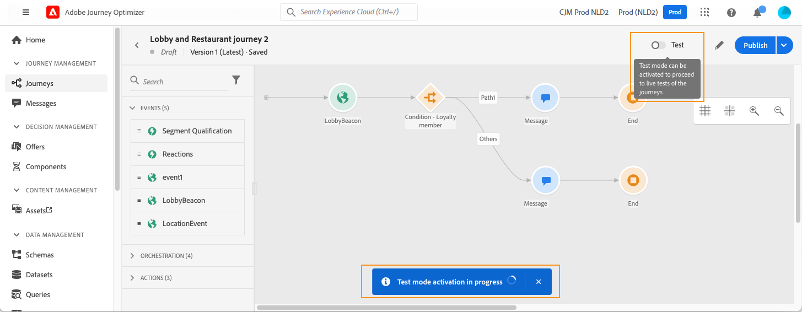
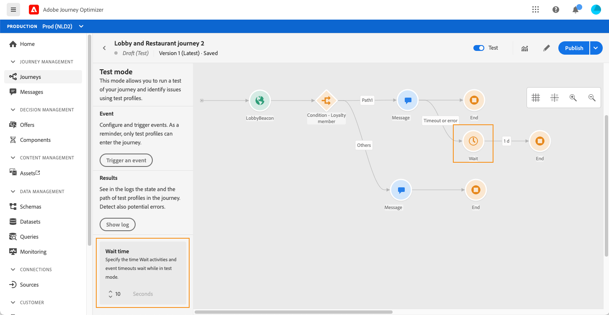
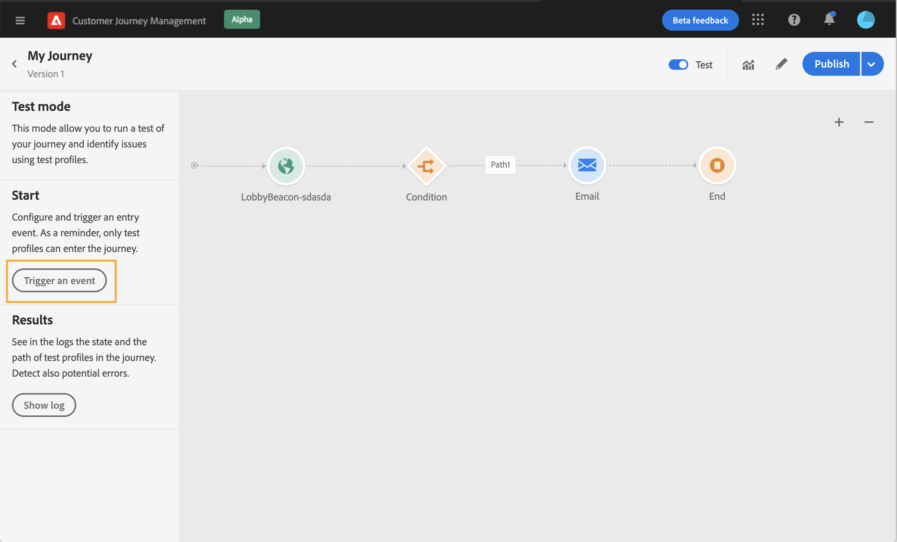
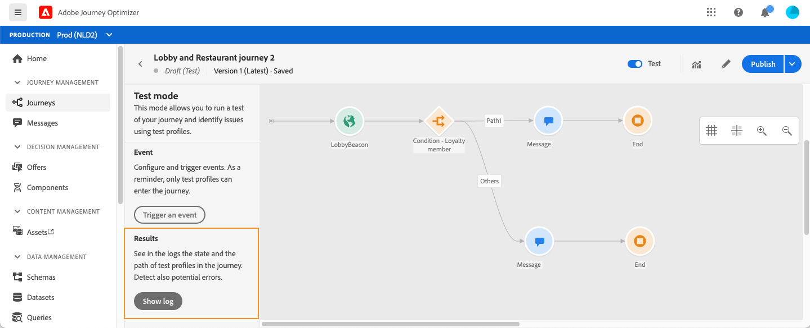
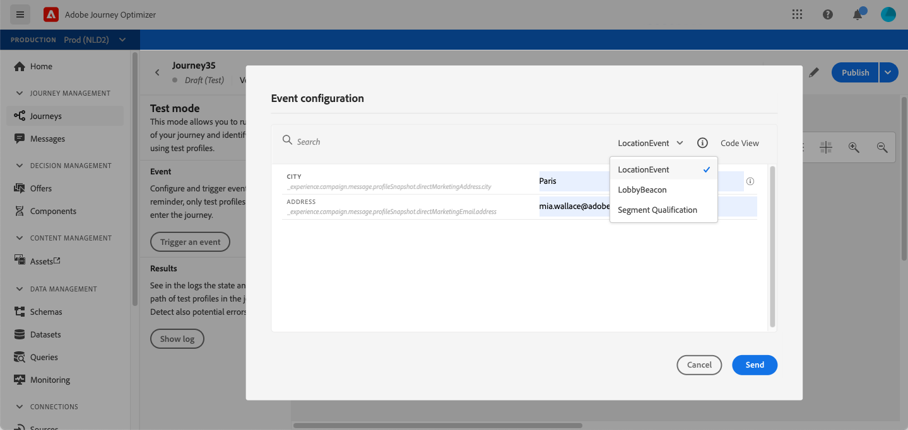
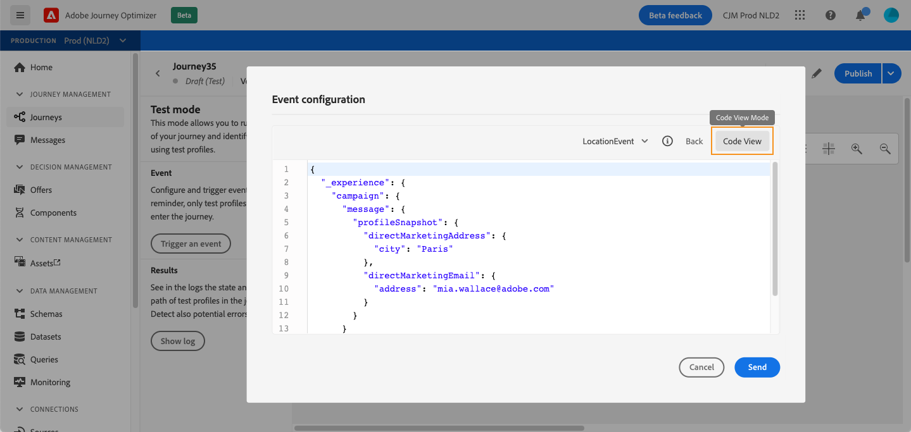
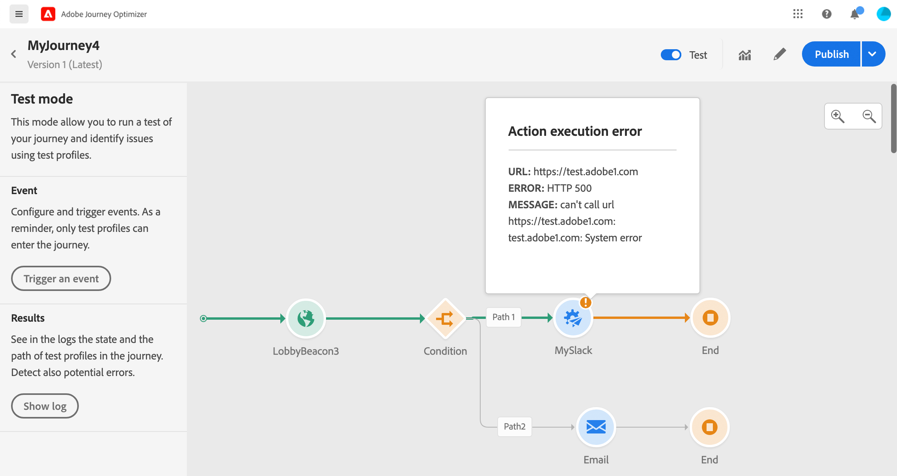
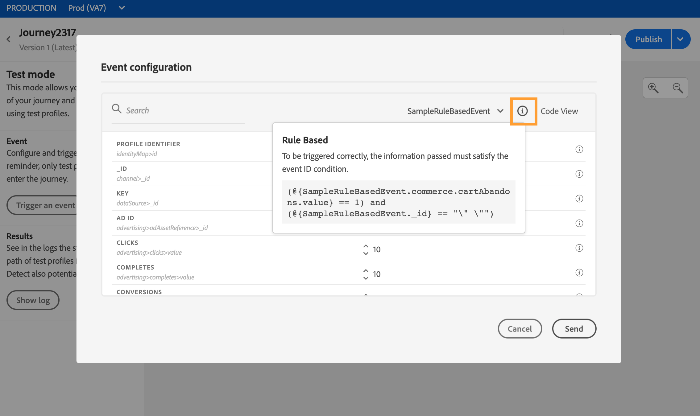

# 测试历程{#testing_the_journey}

在能够测试旅程之前，您必须解决所有错误（如果有）。 请参阅[此小节](../building-journeys/troubleshooting.md#section_h3q_kqk_fhb)。

您可以使用测试用户档案在发布之前测试您的旅程。 这使您能够分析个人在旅程中的流向，并在发布前进行疑难解答。

只有测试用户档案才能以测试模式进入旅程。 您可以创建新的测试用户档案，或将现有用户档案转换为测试用户档案。 请参阅此[部分](../building-journeys/creating-test-profiles.md)。

要使用测试模式，请执行以下步骤：

1. 在测试您的旅程之前，请验证该旅程是否有效且没有错误。 您将无法启动包含错误的旅程测试。 请参阅[此小节](../building-journeys/troubleshooting.md#section_h3q_kqk_fhb)。出现错误时，将显示警告符号。

1. 要激活测试模式，请单击位于右上角的&#x200B;**[!UICONTROL Test]**&#x200B;切换。

   

1. 使用左下角的&#x200B;**[!UICONTROL Wait time]**&#x200B;参数定义每次等待活动和事件超时在测试模式下将持续的时间。 默认时间为等待和事件超时的10秒。 这样可以确保快速获得测试结果。 此参数仅在您在旅程中放置了一个或多个等待活动时才显示。

   

   >[!NOTE]
   >
   >当在旅程中使用反应事件时，等待时间默认值和最小值为40秒。 请参阅[此小节](../building-journeys/reaction-events.md)。

1. 单击&#x200B;**[!UICONTROL Trigger an event]**&#x200B;配置事件并将其发送到旅程。

   

1. 配置所需的不同字段。 在&#x200B;**用户档案标识符**&#x200B;字段中，输入用于标识测试用户档案的字段值。 例如，它可以是电子邮件地址。 确保发送与测试事件相关的用户档案。 请参阅[激发事件](#firing_events)。

   

1. 收到事件后，单击&#x200B;**[!UICONTROL Show log]**&#x200B;按钮视图测试结果并验证。 请参阅[查看日志](#viewing_logs)。

   

1. 如果有任何错误，请取消激活测试模式，修改历程并再次进行测试。当测试结果确定时，您可以发布您的旅程。 请参阅[此页](../building-journeys/publishing-the-journey.md)。

## 重要说明{#important_notes}

* 提供了一个接口，用于向测试旅程中的事件发射事件，但也可以由第三方系统发送，例如Postman。
* 只允许在实时客户用户档案服务中标记为“测试用户档案”的个人进入测试旅程。 请参阅此[部分](../building-journeys/creating-test-profiles.md)。
* 测试模式仅在使用命名空间的草稿旅程中可用。 测试模式需要检查进入旅程的人员是否是测试用户档案，因此必须能够到达Adobe Experience Platform。
* 在测试会话期间，可以进入旅程的测试用户档案的最大数目为100。
* 禁用测试模式时，它将从过去或当前使用该模式的所有人员中清除旅程。 它还清除报告。
* 您可以根据需要多次启用/禁用测试模式。
* 在激活测试模式时，您无法修改旅程。 在测试模式下时，您可以直接发布旅程，无需先前停用测试模式。

## 激发事件{#firing_events}

通过&#x200B;**[!UICONTROL Trigger an event]**&#x200B;按钮，您可以配置一个事件，让人员进入旅程。

>[!NOTE]
>
>在测试模式下触发事件时，会生成一个真实事件，这意味着它还会触及侦听此事件的其他旅程。

作为先决条件，您必须知道哪些用户档案在Adobe Experience Platform中被标记为测试用户档案。 事实上，测试模式只允许旅程中的这些用户档案，而事件必须包含ID。 所需的ID取决于事件配置。 例如，它可以是ECID或电子邮件地址。 此键的值需要添加到&#x200B;**用户档案标识符**&#x200B;字段中。

如果您的旅程包含多个事件，请使用下拉列表选择事件。 然后，对于每个事件，配置传递的字段和执行事件发送。 该接口可帮助您在事件有效负荷中传递正确的信息，并确保信息类型正确。 测试模式将保存测试会话中使用的最后一个参数以供以后使用。

该界面允许您传递简单的事件参数。 如果要在事件中传递集合或其他高级对象，可以单击&#x200B;**[!UICONTROL Code View]**&#x200B;查看有效负荷的整个代码并修改它。 例如，您可以复制并粘贴由技术用户准备的事件信息。

技术用户也可以使用此界面来编写事件负载和触发事件，而无需使用第三方工具。

单击&#x200B;**[!UICONTROL Send]**&#x200B;按钮时，测试开始。 旅程中个人的进度由视觉流表示。 当个人在旅程中移动时，路径逐渐变绿。 如果发生错误，则在相应步骤上显示警告符号。 可将光标置于其上，以显示有关错误的更多信息并访问完整详细信息（如果有）。

在“事件”配置屏幕中选择其他测试用户档案并再次运行测试时，将清除可视流并显示新个人的路径。

在测试中打开旅程时，显示的路径与上次执行的测试相对应。

无论事件是通过界面触发还是通过外部触发（例如，使用Postman），可视流都有效。

## 基于规则的旅程{#test-rule-based}的测试模式

该测试模式也适用于使用基于规则的事件的旅程。 有关基于规则的事件的详细信息，请参阅[此页](../event/about-events.md)。

触发事件时，**事件配置**&#x200B;屏幕允许您定义要通过测试的事件参数。 单击右上角的工具提示图标，即可视图事件ID条件。 作为规则评估的一部分的每个字段旁边也会显示工具提示。

有关如何使用测试模式的详细信息，请参阅[此页](../building-journeys/testing-the-journey.md)。

## 业务事件{#test-business}的测试模式

使用业务事件时（请参阅[此部分](../event/about-events.md)），测试模式将允许您在旅程中触发单个测试用户档案入口，模拟事件并通过正确的用户档案ID。 您必须传递将在测试中进入旅程的测试事件参数和用户档案标识符。 您不能使用其他基于区段的旅程中存在的&#x200B;**[!UICONTROL Up to 100 profiles at once]**&#x200B;选项。 在测试模式下，基于业务事件的旅程不提供“代码视图”模式。

请注意，首次触发业务事件时，不能在同一测试会话中更改业务事件定义。 您只能让同一个人或不同个人输入传递相同或其他标识符的旅程。 如果要更改业务事件参数，必须停止并再次开始测试模式。

## 查看日志{#viewing_logs}

使用&#x200B;**[!UICONTROL Show log]**&#x200B;按钮可以视图测试结果。 此页面以JSON格式显示旅程的当前信息。 通过按钮可复制整个节点。 您需要手动刷新页面以更新旅程的测试结果。

>[!NOTE]
>
>在测试日志中，如果当调用第三方系统（数据源或操作）时出错，则显示错误代码和错误响应。

将显示旅程中当前的个人（技术上称为实例）数。 以下是为每个人显示的有用信息：

* _ID_:旅程中个人的内部ID。这可用于调试目的。
* _currentstep_:个人在旅程中所处的步骤。我们建议向您的活动添加标签，以便更轻松地识别它们。
* _currentstep_ >阶段：个人旅程的状态（正在运行、已完成、错误或超时）。有关详细信息，请参阅下文。
* _currentstep_ >  _extraInfo_:错误的描述和其他上下文信息。
* _currentstep_ >  _fetchErrors_:有关在此步骤中发生的获取数据错误的信息。
* _externalKeys_:在事件中定义的键公式的值。
* _exchededData_:旅程使用数据源时已检索的旅程数据。
* _transitionHistory_:列表个人遵循的步骤。对于事件，将显示有效负荷。
* _actionExecutionErrors_ :错误信息。

以下是个人旅程的不同状态：

* _正在运行_:该个人当前正在旅程中。
* _完成_:个人在旅程的尽头。
* _错误_:由于出错，个人在旅程中停止。
* _超时_:由于一步太费时间，个人在旅途中被停下来。

当使用测试模式触发事件时，将使用源的名称自动生成数据集。

当使用测试模式触发事件时，将使用源的名称自动生成数据集。

测试模式会自动创建一个体验事件并将其发送到Adobe Experience Platform。 此体验事件的源名称为“Journey Orchestration测试事件”。

如果是从多个旅程触发的多个事件

有一种情况是，从多个旅程发送的多个事件将具有不同的模式。 是否可以将模式映射到1个数据集？ 否则，我们将需要多个数据集。

如果体验事件中未包含目标数据集，则会自动创建和命名这些数据集。 这就是为什么我们今天看到“自动为旅行者创建数据集”。

源的命名驱动着自动创建。 如果我们有多个事件，则应将其连接并设置为“Journey Orchestration测试事件-模式名称”。 这将自动转为“Automatically generated dataset for Journey Orchestration Test事件- NAME OF 模式”。
