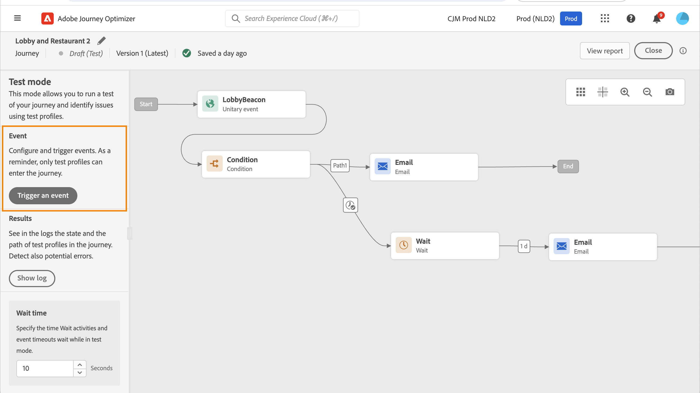

# 测试您的历程{#testing_the_journey}

>[!CONTEXTUALHELP]
>id="ajo_journey_test"
>title="测试您的历程"
>abstract="在发布历程之前，使用测试配置文件来测试历程。这使您可以分析个人如何在历程中流动，并在发布前进行故障排除。"

在发布历程之前，使用测试配置文件来测试历程。此模式可讓您執行歷程測試並使用測試設定檔識別問題。

只有测试配置文件才能进入处于测试模式的历程。您可以建立新的測試設定檔，或將現有的設定檔轉換為測試設定檔。 進一步瞭解中的測試設定檔 [本節](../segment/creating-test-profiles.md).

>[!NOTE]
>
>在測試您的歷程之前，您必須解決所有錯誤（如有）。 瞭解在中測試之前如何檢查錯誤 [本節](../building-journeys/troubleshooting.md#checking-for-errors-before-testing).

若要使用測試模式，請遵循下列步驟：

1. 若要啟動測試模式，請啟動 **[!UICONTROL 測試]** 切換，位於右上角。

   

1. 如果歷程至少有一個 **等待** 活動，設定 **[!UICONTROL 等待時間]** 用於定義每個等待活動和事件逾時在測試模式中持續時間的引數。 等待和事件逾時的預設時間為10秒。 這可確保您快速獲得測試結果。

   

   >[!NOTE]
   >
   >在歷程中使用具有逾時的回應事件時，等待時間預設值及最小值為40秒。 请参阅[此小节](../building-journeys/reaction-events.md)。

1. 使用 **[!UICONTROL 觸發事件]** 按鈕來設定事件並傳送至歷程。

   

1. 設定所需的不同欄位。 在 **設定檔識別碼** 欄位，輸入用於識別測試設定檔的欄位值。 例如，可以是電子郵件地址。 請務必傳送與測試設定檔相關的事件。 请参阅[此小节](#firing_events)。

   

1. 收到事件後，按一下 **[!UICONTROL 顯示記錄]** 按鈕以檢視測試結果並進行驗證。 请参阅[此小节](#viewing_logs)。

   

1. 如果有任何错误，请取消激活测试模式，修改历程并再次进行测试。完成測試後，您就可以發佈歷程。 请参阅[此页](../building-journeys/publishing-the-journey.md)。

## 重要说明 {#important_notes}

* 在測試模式中，您可以使用介面引發事件。
* 只有在Real-time Customer Profile Service中標示為「測試設定檔」的個人才能進入測試歷程。 请参阅此[章节](../segment/creating-test-profiles.md)。
* 測試模式僅適用於使用名稱空間的草稿歷程。 測試模式需要檢查進入歷程的人是否為測試設定檔，因此必須能夠存取Adobe Experience Platform。
* 在測試工作階段期間可進入歷程的測試設定檔最大數量為100。
* 停用測試模式時，它會從過去進入該模式或目前在該模式中的所有人員清空歷程。 這樣也會清除報表。
* 您可以視需要多次啟用/停用測試模式。
* 測試模式啟動時，您無法修改歷程。 在測試模式中，您可以直接發佈歷程，之前不需要停用測試模式。
* 達到分割時，一律選擇頂端分支。 如果您希望測試選擇不同的路徑，可以重新組織分割分支的位置。
* 為了最佳化效能及防止過時資源的使用，所有處於測試模式且一週內未觸發的歷程將切換回 **草稿** 狀態。

## 觸發您的事件 {#firing_events}

>[!CONTEXTUALHELP]
>id="ajo_journey_test_configuration"
>title="配置测试模式"
>abstract="如果您的历程包含多个事件，请使用下拉列表选择一个事件。然后，对于每个事件，配置传递的字段和事件发送的执行。"

使用 **[!UICONTROL 觸發事件]** 按鈕來設定將促使人員進入歷程的事件。

>[!NOTE]
>
>當您在測試模式中觸發事件時，會產生實際事件，這表示它也會點選聆聽此事件的其他歷程。

您必須先瞭解哪些設定檔在Adobe Experience Platform中被標籤為測試設定檔。 事實上，測試模式僅允許在歷程中這些設定檔，且事件必須包含ID。 預期的ID取決於事件設定。 例如，可以是ECID或電子郵件地址。 需要將此索引鍵的值新增至 **設定檔識別碼** 欄位。

如果您的历程包含多个事件，请使用下拉列表选择一个事件。然后，对于每个事件，配置传递的字段和事件发送的执行。介面可幫助您在事件裝載中傳遞正確的資訊，並確保資訊型別正確。 測試模式會儲存測試工作階段中使用的最後一個引數，以供稍後使用。

介面可讓您傳遞簡單事件引數。 如果您想在事件中傳遞集合或其他進階物件，可以按一下 **[!UICONTROL 程式碼檢視]** 檢視裝載的整個程式碼並加以修改。 例如，您可以複製並貼上技術使用者準備的事件資訊。

技術使用者也可以使用此介面來撰寫事件裝載和觸發事件，而不必使用協力廠商工具。

按一下 **[!UICONTROL 傳送]** 按鈕時，測試開始。 歷程中個人的進度以視覺流程表示。 當個人在歷程中移動時，路徑會逐漸變成綠色。 如果發生錯誤，會在對應的步驟上顯示警告符號。 您可以將游標置於其上以顯示有關錯誤的更多資訊並存取完整詳細資訊（可用時）。

當您在事件設定畫面中選取不同的測試設定檔，然後再次執行測試時，視覺流程會清除並顯示新個人的路徑。

在測試中開啟歷程時，顯示的路徑對應於上次執行的測試。

## 規則型歷程的測試模式 {#test-rule-based}

測試模式也可用於使用規則型事件的歷程。 如需規則型事件的詳細資訊，請參閱 [此頁面](../event/about-events.md).

觸發事件時， **事件設定** 畫面可讓您定義要在測試中傳遞的事件引數。 您可以按一下右上角的工具提示圖示來檢視事件ID條件。 規則評估的每個欄位旁也會提供工具提示。

## 商業事件的測試模式 {#test-business}

使用時 [業務事件](../event/about-events.md)，使用測試模式在歷程中觸發單一測試設定檔入口、模擬事件並傳遞正確的設定檔ID。 您必須傳遞事件引數，以及將進入測試中歷程之測試設定檔的識別碼。 您無法使用 **[!UICONTROL 一次最多100個設定檔]** 適用於其他以區段為基礎的歷程的選項。 在測試模式中，根據業務事件的歷程沒有「程式碼檢視」模式可用。

請注意，當您首次觸發業務事件時，無法在同一測試工作階段中變更業務事件定義。 您只能讓同一個人或不同人進入傳遞相同或其他識別碼的歷程。 若要變更業務事件引數，您必須停止並重新開始測試模式。

## 檢視記錄 {#viewing_logs}

>[!CONTEXTUALHELP]
>id="ajo_journey_test_logs"
>title="测试模式日志"
>abstract="“显示日志”按钮以 JSON 格式显示测试结果。这些结果显示历程中的人数及个人的状态。"

此 **[!UICONTROL 顯示記錄]** 按鈕可讓您檢視測試結果。 此頁面以JSON格式顯示歷程的最新資訊。 按鈕可讓您複製整個節點。 您需要手動重新整理頁面以更新歷程的測試結果。

>[!NOTE]
>
>在測試記錄中，如果在呼叫協力廠商系統（資料來源或動作）時發生錯誤，則會顯示錯誤代碼和錯誤回應。

目前顯示在歷程中的個人（技術上稱為例項）數量。 以下是為個別使用者顯示的實用資訊：

* _Id_：個人在歷程中的內部ID。 這可用於偵錯。
* _currentstep_：個人在歷程中的步驟。 建議您為活動新增標籤，以便更輕鬆識別。
* _currentstep_ >階段：個人歷程的狀態（執行中、已完成、錯誤或逾時）。 有关详细信息，请参阅下文。
* _currentstep_ > _額外資訊_：錯誤說明和其他內容相關資訊。
* _currentstep_ > _fetchErrors_：此步驟中發生擷取資料錯誤的相關資訊。
* _externalKey_：事件中定義之索引鍵公式的值。
* _擴充的資料_：如果歷程使用資料來源，則為歷程已擷取的資料。
* _transitionHistory_：個人遵循的步驟清單。 對於事件，會顯示裝載。
* _actionExecutionErrors_ ：有關所發生錯誤的資訊。

以下是個人歷程的不同狀態：

* _執行中_：個人目前處於歷程中。
* _已完成_：個人位於歷程結尾。
* _錯誤_：個人在歷程中因錯誤而停止。
* _已逾時_：個人已在歷程中停止，因為步驟耗費太多時間。

使用測試模式觸發事件時，會自動以來源名稱產生資料集。

測試模式會自動建立體驗事件並將其傳送至Adobe Experience Platform。 此體驗事件的來源名稱是「Journey Orchestration測試事件」。

