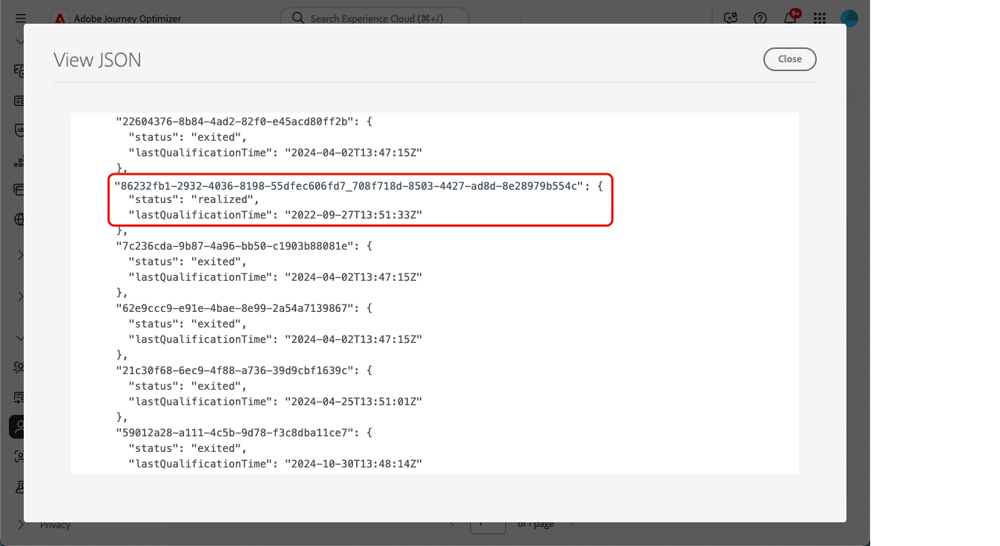

# 历程中的入站操作疑难解答 {#troubleshooting-inbound-actions}

入站操作（如应用程序内体验、Web体验和基于代码的体验）是[!DNL Journey Optimizer]的关键组件，因为它们可在用户历程期间为其提供个性化参与。 但是，可能会发生意外行为，例如缺少入站内容，或用户档案退出历程后继续投放。

本指南提供了一个分步流程，用于调试与历程中的集客操作相关的问题，以帮助您在联系支持人员之前独立识别和解决这些问题。

<!--This guide addresses the two most common scenarios with inbound actions in a journey. They are as follows:

* A profile enters the inbound step, but the user does not receive the expected inbound content.
* A user continues to receive inbound content even after the profile exits the journey.

## Benefits {#benefits}

- Faster issue resolution through self-help.
- Reduced dependency on support teams.
- Improved understanding of inbound action functionality.
- Enhanced customer experience and confidence in using AJO.-->

## 先决条件 {#prerequisites}

在开始故障诊断之前，请确保满足以下条件：

1. 设置&#x200B;**Assurance**&#x200B;会话。 请参阅[Adobe Experience Platform Assurance文档](https://experienceleague.adobe.com/zh-hans/docs/experience-platform/assurance/tutorials/using-assurance){target="_blank"}以了解详情。

1. 导航到包含入站操作的历程，以检索历程名称和版本ID。

   >[!NOTE]
   >
   >可在&#x200B;*journey/*&#x200B;之后的URL中找到历程版本ID(例如： *86232fb1-2932-4036-8198-55dfec606fd7*)。

   

1. 单击集客操作可查看其详细信息。 检索集客操作标签和ID。

   

1. 获取配置文件命名空间和ID以识别配置文件遇到问题。 根据您的配置，命名空间可以是ECID、电子邮件或客户ID，例如。 请参阅[Experience Platform文档](https://experienceleague.adobe.com/zh-hans/docs/experience-platform/profile/ui/user-guide#browse-identity){target="_blank"}以了解如何查找配置文件。

## 场景1：用户尚未收到入站内容 {#scenario-1}

在此方案中，用户档案已在历程中输入集客操作，但即使在30分钟后，相应的集客内容也不会在设置触发步骤的设备/客户端中显示。

### 预检查 {#pre-checks}

1. **为配置文件引入启用了历程入站数据集**

   入站操作在执行期间使用&#x200B;**历程入站**&#x200B;数据集进行配置文件更新。 确保为当前沙盒中的用户档案启用了数据集。 [了解有关数据集的更多信息](../data/get-started-datasets.md)

2. 在平台标识中定义了&#x200B;**&#39;joai&#39;标识**

   入站操作使用配置文件`segmentMembership`中的&#x200B;**&#39;joai&#39;**&#x200B;命名空间激活入站步骤的配置文件。 请确保已在沙盒的Platform身份中定义它。 了解有关[Experience Platform Identity服务](https://experienceleague.adobe.com/zh-hans/docs/experience-platform/identity/home){target="_blank"}的更多信息

### 调试步骤 {#debugging-steps}

下图显示了您可以遵循的调试步骤顺序：

{width="70%" align="center"}

### 步骤1：检查设备/客户端是否从Edge Network接收内容 {#step-1}

首先检查设备/客户端是否正在获取预期的内容。

>[!BEGINTABS]

>[!TAB 应用程序内渠道]

1. 转到[Assurance](https://experienceleague.adobe.com/zh-hans/docs/experience-platform/assurance/tutorials/using-assurance){target="_blank"}会话，然后从左侧面板中选择&#x200B;**[!UICONTROL 应用程序内消息传送]**&#x200B;部分。

1. 在&#x200B;**[!UICONTROL Messages on Device]**&#x200B;选项卡中，单击&#x200B;**[!UICONTROL Messages]**&#x200B;下拉列表，并检查是否有历程名称后跟“ — 应用程序内消息”的消息。 如果存在，则意味着设备/客户端上存在应用程序内消息，并且该问题可能与应用程序内触发器有关。

1. 如果未找到该消息，则设备/客户端不会收到应用程序内消息。 转到[下一步](#step-2)进行进一步的调试。

>[!TAB Web 渠道]

访问页面并检查“网络”选项卡，或在[Edge](https://experienceleague.adobe.com/zh-hans/docs/experience-platform/assurance/tutorials/using-assurance){target="_blank"}会话的&#x200B;**[!UICONTROL Edge Delivery]**&#x200B;部分中检查Assurance响应有效负载。

>[!TAB 基于代码的体验渠道]

使用[Adobe的API](https://developer.adobe.com/data-collection-apis/docs/api/)执行curl请求，并在[Edge](https://experienceleague.adobe.com/zh-hans/docs/experience-platform/assurance/tutorials/using-assurance){target="_blank"}会话的&#x200B;**[!UICONTROL Edge Delivery]**&#x200B;部分中检查Assurance响应有效负载。

>[!ENDTABS]

#### 步骤2：检查Edge Network是否返回了内容 {#step-2}

此步骤旨在确保Edge Network返回要在设备/客户端上渲染的预期入站内容。

当配置文件在历程中进入入站操作时，它会自动被限定到与入站历程操作对应的特殊受众区段（在&#x200B;**joai**&#x200B;命名空间中）。

当客户向Edge Network请求给定的用户档案和表面时，仅当用户档案当前是相应&#x200B;**joai**&#x200B;区段的成员时，该用户档案才符合接收针对该表面的入站旅程操作内容的资格。

要调试Edge Network行为，请执行以下步骤。

1. 在Assurance会话中打开&#x200B;**[!UICONTROL Edge Delivery]**&#x200B;视图。 此视图提供有关在Edge Network服务器上执行入站操作的信息。 在 [Experience Platform 文档](https://experienceleague.adobe.com/zh-hans/docs/experience-platform/assurance/view/edge-delivery){target="_blank"}中了解更多信息。

   <!---->

1. 验证与入站操作对应的Edge活动是否在&#x200B;**[!UICONTROL 符合条件的活动]**&#x200B;或&#x200B;**[!UICONTROL 不符合条件的活动]**&#x200B;部分中列出：

   * 如果在&#x200B;**符合条件的活动**&#x200B;部分中，用户档案符合入站历程操作的条件，则应返回内容。
   * 如果在&#x200B;**不合格活动**&#x200B;部分中，则该用户档案不符合入站历程操作的条件。 有关更多详细信息，请参阅排除原因。
   * 如果在&#x200B;**和**&#x200B;中都不存在，则表示将入站旅程操作发布到Edge Network时出现问题，或者请求的表面URI与入站操作的渠道配置设置不匹配。

   >[!NOTE]
   >
   >要在&#x200B;**Assurance**&#x200B;会话中查找Edge活动，请查找&#x200B;**[!UICONTROL audienceNamespace]**&#x200B;为&#x200B;**joai**，**[!UICONTROL audienceSegmentId]**&#x200B;为`<JourneyVersionID>_<JourneyAction ID>`的活动(例如： *86232fb1-2932-4036-8198-55dfec606fd7_708f718d-8503-4427-ad8d-8e28979b554c*)。

1. 如果您的活动在&#x200B;**[!UICONTROL 不合格活动]**&#x200B;分区中，并且排除原因为&#x200B;*“区段未激活”*，则意味着Edge Network投放服务器认为该配置文件不是相关&#x200B;**joai**&#x200B;受众区段的一部分。

   您可以通过打开配置文件部分的&#x200B;**segmentsMap**&#x200B;元素并查找&#x200B;**joai**&#x200B;区段ID是否存在，来双重检查&#x200B;**joai**&#x200B;区段是否在Edge Network投放服务器的配置文件视图中存在。

1. 如果Edge Network投放服务器未将该配置文件视为在相关&#x200B;**joai**&#x200B;区段中，请转到下一步。<!--use the Platform Profile viewer UI to check if the expected **joai** segment is in a realized state in the Edge profile. Learn more in the [Experience Platform Profile UI documentation](https://experienceleague.adobe.com/zh-hans/docs/experience-platform/profile/ui/user-guide){target="_blank"}-->

#### 步骤3：检查joai受众成员资格是否已传播到Edge Network {#step-3}

此步骤是验证当配置文件进入入站旅程操作并且该配置文件被限定到相应的&#x200B;**joai**&#x200B;区段时，Edge配置文件是否已正确更新。

当配置文件符合&#x200B;**joai**&#x200B;区段的资格条件时，首先会在中心更新配置文件，然后将区段成员资格投影到Edge配置文件以供Edge Network交付服务器使用。

>[!NOTE]
>
>从更新中心上的配置文件开始，将信息从中心传播到Edge的过程可能长达15-30分钟。

要检查Edge配置文件的`segmentMembership`属性中是否存在&#x200B;**joai**&#x200B;区段，请执行以下步骤。

1. 导航到[!DNL Journey Optimizer]左侧导航窗格中的&#x200B;**[!UICONTROL 客户]** > **[!UICONTROL 配置文件]**&#x200B;菜单，然后使用命名空间和ID浏览配置文件。 了解有关[实时客户个人资料](../audience/get-started-profiles.md)的更多信息

1. 选择&#x200B;**[!UICONTROL 属性]**&#x200B;选项卡，然后选择&#x200B;**[!UICONTROL Edge]**&#x200B;视图。
   <!--cannot see Hub/Edge wiews for the profile-->

1. 单击&#x200B;**[!UICONTROL 查看JSON]**&#x200B;以打开配置文件的JSON视图。

   

1. 转到&#x200B;**[!UICONTROL segmentMembership]**&#x200B;属性，并检查&#x200B;**joai**&#x200B;命名空间中是否存在区段ID `<JourneyVersionID>_<ActionID>`，以及在&#x200B;**[!UICONTROL realized]** <!--or existing?-->状态中是否存在。

   

   * 如果存在，则表示与入站旅程操作对应的&#x200B;**joai**&#x200B;区段已正确传播到Edge配置文件。

   * 如果Edge Network投放服务器的配置文件视图中未显示该配置文件，则投放服务器加载Edge配置文件的方式可能存在问题。

1. 如果&#x200B;**joai**&#x200B;区段ID不存在或它处于&#x200B;**[!UICONTROL 退出]**&#x200B;状态，则意味着它（尚）未传播到Edge。

   等待15到30分钟，以将`segmentMembership`值从中心传播到Edge。 如果仍然不存在，则转至下一步。

<!--The next step is to check whether the audience segment is present in the profile on the Hub.-->

#### 步骤4：检查中心上的配置文件中是否存在joai受众会员资格 {#step-4}

此步骤用于验证当中心配置文件进入入站历程操作并且该配置文件符合相应的&#x200B;**joai**&#x200B;区段的资格条件时，中心配置文件是否已正确更新。

>[!NOTE]
>
>将&#x200B;**joai**&#x200B;区段成员资格摄取到中心配置文件最多可能需要花费15-30分钟，从配置文件进入入站历程操作的那一刻开始。

要检查中心配置文件的`segmentMembership`属性中是否存在&#x200B;**joai**&#x200B;区段，请执行以下步骤。

1. 导航到[!DNL Journey Optimizer]左侧导航窗格中的&#x200B;**[!UICONTROL 客户]** > **[!UICONTROL 配置文件]**&#x200B;菜单，然后使用命名空间和ID浏览配置文件。 了解有关[实时客户个人资料](../audience/get-started-profiles.md)的更多信息

1. 选择&#x200B;**[!UICONTROL 属性]**&#x200B;选项卡并选择&#x200B;**[!UICONTROL 中心]**&#x200B;视图。<!--cannot see Hub/Edge wiews for the profile-->

1. 单击&#x200B;**[!UICONTROL 查看JSON]**&#x200B;以打开配置文件的JSON视图。

1. 转到&#x200B;**[!UICONTROL segmentMembership]**&#x200B;属性，并检查&#x200B;**joai**&#x200B;命名空间中是否存在区段ID `<JourneyVersionID>_<ActionID>`，以及在&#x200B;**[!UICONTROL realized]** <!--or existing?-->状态中是否存在。

   * 如果存在，则表示已在中心配置文件中正确摄取与入站历程操作相对应的&#x200B;**joai**&#x200B;区段。

   * 如果至少30分钟后在Edge配置文件中未找到它，则Edge投影系统可能存在问题。

1. 如果&#x200B;**joai**&#x200B;区段ID不存在或处于&#x200B;**[!UICONTROL 退出]**&#x200B;状态，则意味着该配置文件在进入相应的入站历程操作时（尚）未正确符合特殊&#x200B;**joai**&#x200B;受众区段的资格。

   等待15到30分钟，以将`segmentMembership`值摄取到中心上的配置文件中。 如果仍然不存在，则转至下一步。

#### 步骤5：如果客户端/设备仍未获得预期的内容 {#step-5}

如果您已完成上述所有步骤，但在等待30到60分钟让客户细分成员资格传播到Edge Network之后未看到预期行为，请联系Adobe客户关怀团队或您的Adobe代表。

在调试步骤中尽可能多地包含详细信息，例如：

* 看到意外行为的步骤；
* 历程版本ID；
* 历程操作ID；
* 完整的Assurance追踪；
* Edge配置文件的JSON视图；
* 中心配置文件的JSON视图；
* 以此类推。

## 场景2：用户仍在接收集客内容，即使在用户档案退出历程后也是如此 {#scenario-2}

此方案与[方案1](#scenario-1)相反。 当配置文件退出历程时，它不再符合与历程中的入站操作相对应的&#x200B;**joai**&#x200B;受众区段的条件。

执行与[方案1](#debugging-steps)相同的调试步骤，以检查中心配置文件、Edge配置文件和Edge Network交付服务器是否正确反映了相关&#x200B;**joai**&#x200B;区段的区段成员资格状态，以及客户端是否不再接收入站内容。

<!--
## Additional Notes {#additional-notes}

- **Propagation Time:** Segment membership updates can take up to 15-30 minutes to propagate from the Hub to the Edge Network.
- **Support:** If issues persist after following the steps, open a support ticket with details such as:
  - Journey Version ID and Journey Action ID.
  - Assurance trace.
  - JSON views of Edge and Hub profiles.
  - Debugging observations.

## Reference Section {#reference-section}

- [Assurance Setup Guide](https://experienceleague.adobe.com/zh-hans/docs/experience-platform/assurance/tutorials/using-assurance)
- [Adobe Experience Platform Documentation](https://experienceleague.adobe.com/docs/experience-platform/home.html)
- [Streaming Ingestion APIs Troubleshooting](https://experienceleague.adobe.com/docs/experience-platform/ingestion/streaming/troubleshooting.html?lang=zh-Hans)

## Warnings and Notes {#warnings-and-notes}

> **Warning:** Ensure the `joai` namespace is correctly configured in Platform Identities. Misconfiguration can lead to qualification issues for inbound actions.

> **Note:** Segment membership updates may take up to 30 minutes to propagate. Plan debugging sessions accordingly.

## Cross-References {#cross-references}

- [Testing the Journey](../building-journeys/testing-the-journey.md)
- [Using the Journey Designer](../building-journeys/using-the-journey-designer.md#paths)
- [Troubleshooting Custom Actions](../action/troubleshoot-custom-action.md)
-->