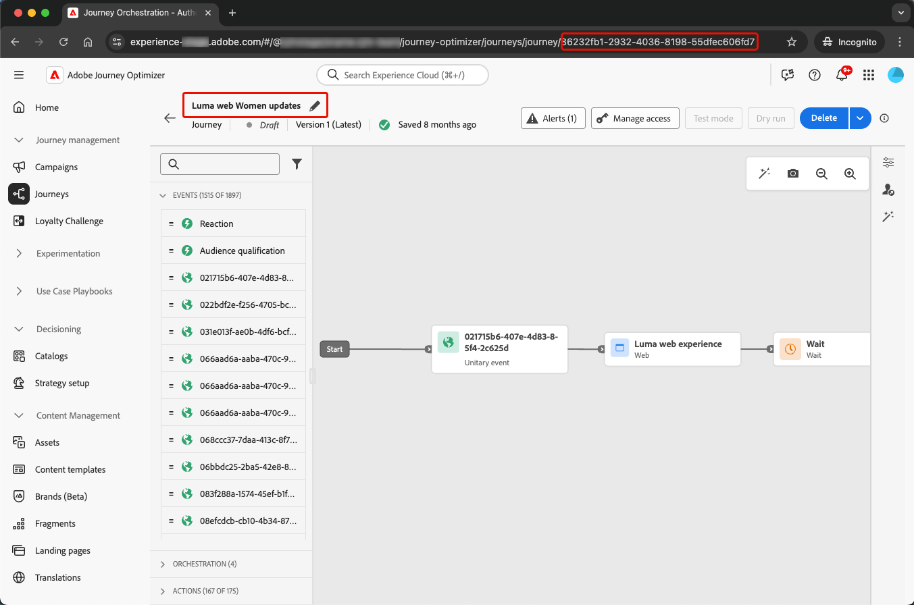
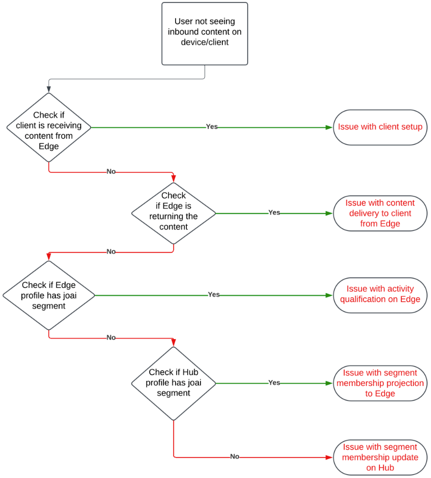
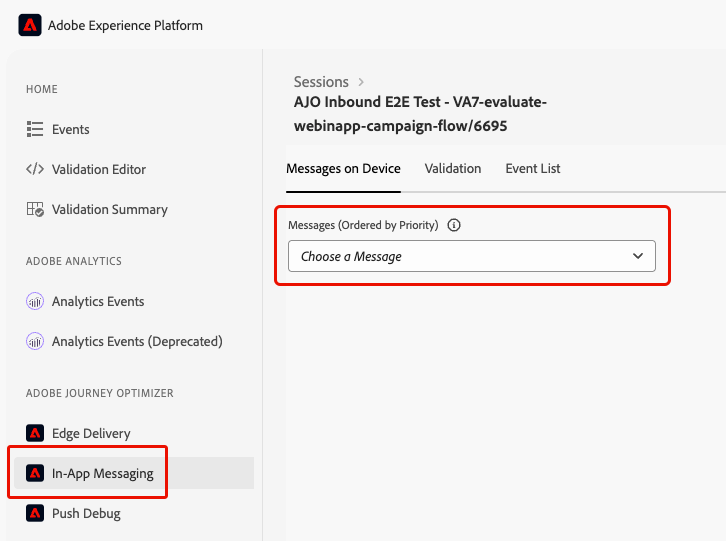
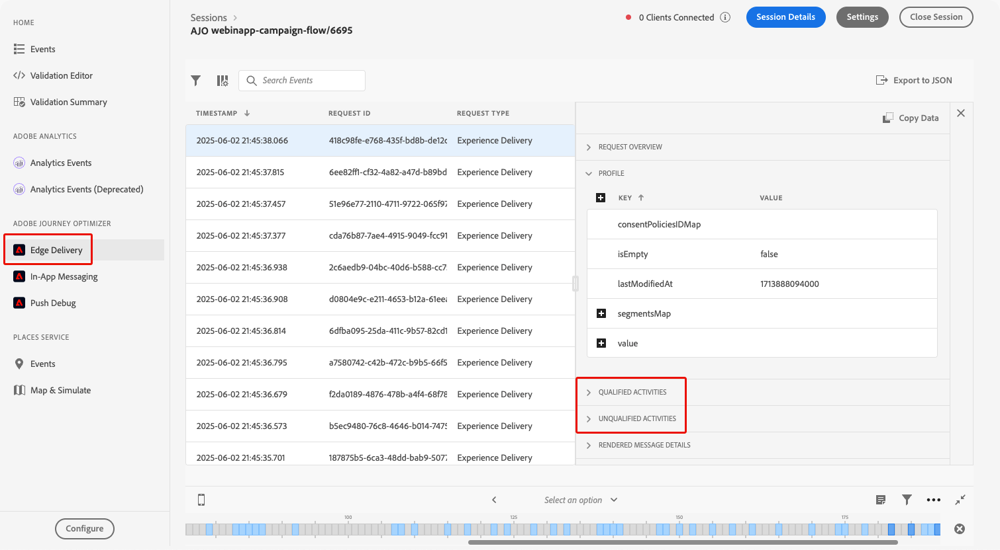
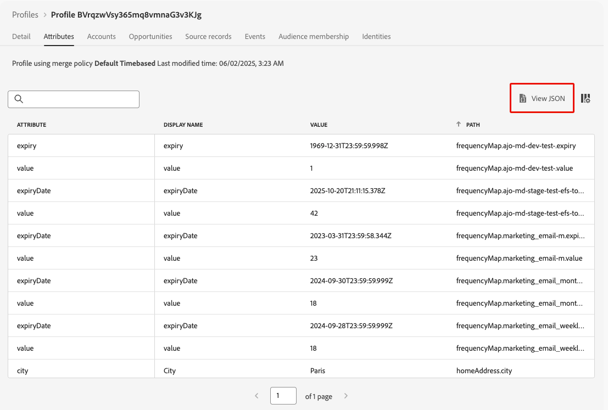

# 历程中的入站操作故障排除 {#troubleshooting-inbound-actions}

>[!BEGINSHADEBOX]

**在此页面上：**&#x200B;了解如何在联系支持人员之前，调试和解决历程中入站操作（例如应用程序内体验、Web体验和基于代码的体验）的常见问题。

>[!ENDSHADEBOX]

入站操作（如应用程序内体验、Web体验和基于代码的体验）是[!DNL Journey Optimizer]的关键组件，因为它们可在用户历程期间为其提供个性化参与。 但是，可能会发生意外行为，例如缺少入站内容，或用户档案退出历程后继续投放。

本指南提供了一个分步流程，用于调试与历程中的集客操作相关的问题，以帮助您在联系支持人员之前独立识别和解决这些问题。

<!--
This guide addresses the two most common scenarios with inbound actions in a journey. They are as follows:

* A profile enters the inbound step, but the user does not receive the expected inbound content.
* A user continues to receive inbound content even after the profile exits the journey.
-->

## 先决条件 {#prerequisites}

在开始故障诊断之前，请确保满足以下条件：

1. 设置&#x200B;**Assurance**&#x200B;会话。 请参阅[[!DNL Adobe Experience Platform] Assurance文档](https://experienceleague.adobe.com/zh-hans/docs/experience-platform/assurance/tutorials/using-assurance){target="_blank"}以了解详情。

1. 导航到包含入站操作的历程，以检索历程名称和版本ID。

   >[!NOTE]
   >
   >可以在“journey/”之后的URL中找到历程版本ID（例如： *86232fb1-2932-4036-8198-55dfec606fd7*）。

   

1. 单击集客操作可查看其详细信息。 检索集客操作标签和ID。

   

1. 获取配置文件命名空间和ID以识别配置文件遇到问题。 根据您的配置，命名空间可以是ECID、电子邮件或客户ID，例如。 请参阅[Experience Platform文档](https://experienceleague.adobe.com/zh-hans/docs/experience-platform/profile/ui/user-guide#browse-identity){target="_blank"}以了解如何查找配置文件。

## 场景1：用户尚未收到入站内容 {#scenario-1}

在此方案中，用户档案已在历程中输入集客操作，但即使在30分钟后，相应的集客内容也不会在设置触发步骤的设备/客户端中显示。

### 预检查 {#pre-checks}

1. **为配置文件引入启用了历程入站数据集**

   入站操作在执行期间使用&#x200B;**历程入站**&#x200B;数据集进行配置文件更新。 确保为当前沙盒中的用户档案启用了数据集。 [了解有关数据集的更多信息](../data/get-started-datasets.md)

2. 在平台标识中定义了&#x200B;**&#39;joai&#39;标识**

   入站操作使用配置文件`segmentMembership`中的&#x200B;**joai**&#x200B;命名空间激活入站步骤的配置文件。 请确保已在沙盒的Platform身份中定义它。 了解有关[Experience Platform Identity服务](https://experienceleague.adobe.com/zh-hans/docs/experience-platform/identity/home){target="_blank"}的更多信息

### 调试步骤 {#debugging-steps}

下图显示了您可以遵循的调试步骤顺序：

{width="70%" align="center"}

### 步骤1：检查设备/客户端是否正在从边缘网络接收内容 {#step-1}

首先检查设备/客户端是否正在获取预期的内容。

>[!BEGINTABS]

>[!TAB 应用程序内渠道]

1. 转到[Assurance](https://experienceleague.adobe.com/zh-hans/docs/experience-platform/assurance/tutorials/using-assurance){target="_blank"}会话，然后从左侧面板中选择&#x200B;**[!UICONTROL 应用程序内消息传送]**&#x200B;部分。

1. 在&#x200B;**[!UICONTROL 设备]**&#x200B;上的消息选项卡中，单击&#x200B;**[!UICONTROL 消息]**&#x200B;下拉列表。

   {width="80%"}

1. 查找历程名称后跟“ — 应用程序内消息”的消息。 如果存在，则意味着设备/客户端上存在应用程序内消息，并且该问题可能与应用程序内触发器有关。

1. 如果未找到该消息，则设备/客户端不会收到应用程序内消息。<!--Go to the [next step](#step-2) for further debugging.-->

>[!TAB Web 渠道]

访问页面并检查“网络”选项卡，或在[Edge](https://experienceleague.adobe.com/zh-hans/docs/experience-platform/assurance/tutorials/using-assurance){target="_blank"}会话的&#x200B;**[!UICONTROL Edge Delivery]**&#x200B;部分中检查Assurance响应有效负载。

>[!TAB 基于代码的体验渠道]

使用[Adobe的API](https://developer.adobe.com/data-collection-apis/docs/api)执行curl请求，并在[Edge](https://experienceleague.adobe.com/zh-hans/docs/experience-platform/assurance/tutorials/using-assurance){target="_blank"}会话的&#x200B;**[!UICONTROL Edge Delivery]**&#x200B;部分中检查Assurance响应有效负载。

>[!ENDTABS]

### 步骤2：检查边缘网络是否返回了内容 {#step-2}

此步骤旨在确保Edge Network返回要在设备/客户端上渲染的预期入站内容。

当配置文件在历程中进入入站操作时，它会自动被限定到与入站历程操作对应的特殊受众区段（在&#x200B;**joai**&#x200B;命名空间中）。

当客户向Edge Network请求给定用户档案和表面时，该用户档案符合接收针对该表面的入站旅程操作内容的条件 — 仅当用户档案当前是相应&#x200B;**joai**&#x200B;区段成员时。

要调试Edge Network行为，请执行以下步骤。

1. 在Assurance会话中打开&#x200B;**[!UICONTROL Edge Delivery]**&#x200B;视图。 此视图提供有关在Edge Network服务器上执行入站操作的信息。 在 [Experience Platform 文档](https://experienceleague.adobe.com/zh-hans/docs/experience-platform/assurance/view/edge-delivery){target="_blank"}中了解更多信息。

1. 验证与入站操作对应的Edge活动是否在&#x200B;**[!UICONTROL 符合条件的活动]**&#x200B;或&#x200B;**[!UICONTROL 不符合条件的活动]**&#x200B;部分中列出。

   的消息建议

   * 如果在&#x200B;**符合条件的活动**&#x200B;部分中，用户档案符合入站历程操作的条件，则应返回内容。
   * 如果在&#x200B;**不合格活动**&#x200B;部分中，则该用户档案不符合入站历程操作的条件。 有关更多详细信息，请参阅排除原因。
   * 如果在&#x200B;**和**&#x200B;中都不存在，则表示将入站旅程操作发布到Edge Network时出现问题，或者请求的表面URI与入站操作的渠道配置设置不匹配。

   >[!NOTE]
   >
   >要在&#x200B;**Assurance**&#x200B;会话中查找Edge活动，请查找&#x200B;**[!UICONTROL audienceNamespace]**&#x200B;为&#x200B;**joai**，**[!UICONTROL audienceSegmentId]**&#x200B;为&lt;*JourneyVersionID*>_&lt;*JourneyActionID*>的活动（例如： *86232fb1-2932-4036-8198-55dfec606fd7_708f718d-8503-4427-ad8d-8e28979b554c*）。

   {width="70%"}

1. 如果您的活动在&#x200B;**[!UICONTROL 不合格活动]**&#x200B;分区中，并且排除原因为&#x200B;*“区段未激活”*，则意味着Edge Network投放服务器认为该配置文件不是相关&#x200B;**joai**&#x200B;受众区段的一部分。

   您可以通过打开配置文件部分的&#x200B;**segmentsMap**&#x200B;元素并查找&#x200B;**joai**&#x200B;区段ID是否存在，来双重检查&#x200B;**joai**&#x200B;区段是否在Edge Network投放服务器的配置文件视图中存在。

1. 如果Edge Network投放服务器未将该配置文件视为在相关&#x200B;**joai**&#x200B;区段中，请转到下一步。<!--use the Platform Profile viewer UI to check if the expected **joai** segment is in a realized state in the Edge profile. Learn more in the [Experience Platform Profile UI documentation](https://experienceleague.adobe.com/zh-hans/docs/experience-platform/profile/ui/user-guide){target="_blank"}-->

### 步骤3：检查“joai”受众会员资格是否已传播到边缘网络 {#step-3}

此步骤是验证当配置文件进入入站旅程操作并且该配置文件被限定到相应的&#x200B;**joai**&#x200B;区段时，Edge配置文件是否已正确更新。

当配置文件符合&#x200B;**joai**&#x200B;区段的资格条件时，首先会在中心更新配置文件，然后将区段成员资格投影到Edge配置文件以供Edge Network交付服务器使用。

>[!NOTE]
>
>从更新中心上的配置文件开始，将信息从中心传播到Edge的过程可能长达15-30分钟。

要检查Edge配置文件的`segmentMembership`属性中是否存在&#x200B;**joai**&#x200B;区段，请执行以下步骤。

1. 导航到[!DNL Journey Optimizer]左侧导航窗格中的&#x200B;**[!UICONTROL 客户]** > **[!UICONTROL 配置文件]**&#x200B;菜单，然后使用命名空间和ID浏览配置文件。 了解有关[实时客户个人资料](../audience/get-started-profiles.md)的更多信息

1. 选择&#x200B;**[!UICONTROL 属性]**&#x200B;选项卡，然后选择&#x200B;**[!UICONTROL Edge]**&#x200B;视图。

1. 单击&#x200B;**[!UICONTROL 查看JSON]**&#x200B;以打开配置文件的JSON视图。

   {width="80%"}

1. 转到`segmentMembership`属性并检查区段ID &lt;*JourneyVersionID>*_&lt;*JourneyActionID*>是否在&#x200B;**joai**&#x200B;命名空间中存在，以及是否在&#x200B;**[!UICONTROL realized]** <!--or existing?-->状态中。

   {width="90%"}

   * 如果存在，则与入站旅程操作相对应的&#x200B;**joai**&#x200B;区段已正确传播到Edge配置文件。

   * 如果未在Edge Network投放服务器的配置文件视图中显示，则投放服务器加载Edge配置文件的方式可能存在问题。

1. 如果&#x200B;**joai**&#x200B;区段ID不存在或处于&#x200B;**[!UICONTROL 退出]**&#x200B;状态，则意味着该区段ID尚未（尚）传播到Edge。

   等待15到30分钟，以将`segmentMembership`值从中心传播到Edge。 如果仍然不存在，则转至下一步。

<!--The next step is to check whether the audience segment is present in the profile on the Hub.-->

### 步骤4：检查中心上的配置文件中是否存在“joai”受众会员资格 {#step-4}

此步骤用于验证当中心配置文件进入入站历程操作并且该配置文件符合相应的&#x200B;**joai**&#x200B;区段的资格条件时，中心配置文件是否已正确更新。

>[!NOTE]
>
>将&#x200B;**joai**&#x200B;区段成员资格摄取到中心配置文件最多可能需要花费15-30分钟，从配置文件进入入站历程操作的那一刻开始。

要检查中心配置文件的`segmentMembership`属性中是否存在&#x200B;**joai**&#x200B;区段，请执行以下步骤。

1. 导航到[!DNL Journey Optimizer]左侧导航窗格中的&#x200B;**[!UICONTROL 客户]** > **[!UICONTROL 配置文件]**&#x200B;菜单，然后使用命名空间和ID浏览配置文件。 了解有关[实时客户个人资料](../audience/get-started-profiles.md)的更多信息

1. 选择&#x200B;**[!UICONTROL 属性]**&#x200B;选项卡并选择&#x200B;**[!UICONTROL 中心]**&#x200B;视图。

1. 单击&#x200B;**[!UICONTROL 查看JSON]**&#x200B;以打开配置文件的JSON视图。

1. 转到&#x200B;**[!UICONTROL segmentMembership]**&#x200B;属性并检查区段ID &lt;*JourneyVersionID>*_&lt;*JourneyActionID*>是否在&#x200B;**joai**&#x200B;命名空间中存在，以及是否在&#x200B;**[!UICONTROL realized]** <!--or existing?-->状态中。

   * 如果存在，则已在中心配置文件中正确摄取对应于入站历程操作的&#x200B;**joai**&#x200B;区段。

   * 如果至少30分钟后在Edge配置文件中找不到，则Edge投影系统可能存在问题。

1. 如果&#x200B;**joai**&#x200B;区段ID不存在或处于&#x200B;**[!UICONTROL 退出]**&#x200B;状态，则意味着该配置文件在进入相应的入站历程操作时（尚）未正确符合特殊&#x200B;**joai**&#x200B;受众区段的资格。

   等待15到30分钟，以将`segmentMembership`值摄取到中心上的配置文件中。 如果仍然不存在，则转至下一步。

### 步骤5：如果客户端/设备仍未获得预期的内容 {#step-5}

如果您已完成上述所有步骤，但在等待30到60分钟让客户细分成员资格传播到Edge Network之后未看到预期行为，请联系Adobe客户关怀团队或您的Adobe代表。

在调试步骤中尽可能多地包含详细信息，例如：

* 看到意外行为的步骤；
* 历程版本ID；
* 历程操作ID；
* 完整的Assurance追踪；
* Edge配置文件的JSON视图；
* 中心配置文件的JSON视图；
* 以此类推。

## 场景2：用户仍在接收集客内容 {#scenario-2}

此方案与[方案1](#scenario-1)相反：用户档案已退出历程，但用户仍在接收入站内容。

但是，当配置文件退出历程时，它不再符合与历程中的入站操作相对应的&#x200B;**joai**&#x200B;受众区段的条件。

执行与[方案1](#debugging-steps)相同的调试步骤，以检查中心配置文件、Edge配置文件和Edge Network交付服务器是否正确反映了相关&#x200B;**joai**&#x200B;区段的区段成员资格状态，以及客户端是否不再接收入站内容。

<!--
## Reference Section {#reference-section}

- [Assurance Setup Guide](https://experienceleague.adobe.com/zh-hans/docs/experience-platform/assurance/tutorials/using-assurance)
- [[!DNL Adobe Experience Platform] Documentation](https://experienceleague.adobe.com/docs/experience-platform/home.html)
- [Streaming Ingestion APIs Troubleshooting](https://experienceleague.adobe.com/docs/experience-platform/ingestion/streaming/troubleshooting.html?lang=zh-Hans)
-->

+++ AI知识参考

本节包含结构化知识，用于支持与本主题相关的解释、检索和问答。

要全面了解相关信息，应将此信息与本页上的文档相结合。 这两个源都不是独立的；页面描述了功能，而本节提供了其他上下文来帮助消除术语、意图、适用性和约束条件的歧义。

* **TL；DR：**&#x200B;本页为Adobe Journey Optimizer历程中的两种入站操作方案提供了分步自助调试指南：进入入站步骤但不接收内容的配置文件，以及在退出历程后继续接收内容的配置文件。

**意图：**
* 在调试入站操作问题之前，先设置Assurance会话作为先决条件
* 验证设备或客户端是否正在使用Assurance从Edge Network接收入站内容
* 检查Edge Network符合条件和不符合条件的活动，以确定用户档案是否有资格执行入站旅程操作
* 确认受众区段成员资格已从Hub配置文件传播到Edge配置文件
* 诊断客户档案进入集客操作后，中心用户档案上历程区段摄取的延迟
* 在自助服务步骤不能解决问题时，使用正确的诊断信息上报给Adobe客户关怀团队

**术语表：**
* **入站操作**：向用户的设备或浏览器提供个性化内容的历程活动，包括应用程序内、Web和基于代码的体验渠道&#x200B;*（产品特定）*
* **joai命名空间**：配置文件`segmentMembership`中使用的特殊标识命名空间，用于激活入站历程操作步骤&#x200B;*（产品特定）*&#x200B;的配置文件
* **joai区段**：在对应于特定入站历程操作的joai命名空间中自动创建的受众区段；配置文件必须在此区段中处于已实现状态才能接收内容&#x200B;*（产品特定）*
* **历程的入站数据集**：AEP数据集，用于存储用户档案进入入站历程操作&#x200B;*（产品特定）*&#x200B;时所做的用户档案更新
* **中心配置文件**： Adobe Experience Platform中的中心配置文件存储区用作配置文件属性和区段成员资格的真实来源
* **Edge配置文件**： Edge Network投放服务器用于实时评估内容合格性的中心配置文件的预计副本
* **Assurance**：用于实时调试客户端SDK行为和Edge Network响应的Adobe Experience Platform工具

**护栏：**
* 必须先在当前沙盒中启用历程入站数据集，以便进行配置文件摄取，入站操作才能正常工作
* 必须在沙盒的Platform身份中定义作业命名空间
* 将Joai区段成员资格从Hub传播到Edge最多可能需要花费15到30分钟
* 在配置文件进入集客操作后，将joai区段成员资格摄取到中心配置文件可能最多需要15-30分钟
* 如果在30-60分钟后仍缺少内容，请使用历程版本ID、操作ID、Assurance跟踪以及Adobe和中心配置文件JSON视图上报给Edge客户关怀团队

**术语：**
* 规范名称：joai命名空间 — 缩写：joai — 变体：joai身份，joai区段命名空间
* 规范名称：入站操作 — 缩写：无 — 变体：入站渠道，入站内容
* 同义词：“Hub profile”=“central profile”(AEP)；“Edge profile”=“projected profile”（Edge Network使用）
* 请勿混淆： Edge Delivery视图中的“符合条件的活动”≠“不符合条件的活动” — 符合条件表示配置文件已收到内容；不符合条件表示未收到内容，并显示排除原因

**常见问题解答：**
* **问：本指南涵盖的两个主要入站操作失败方案是什么？**  — 场景1：用户档案进入集客步骤，但用户从未看到内容。 场景2：用户档案退出历程，但用户仍接收入站内容。
* **问：我使用什么工具来调试入站操作投放？** —Adobe Experience Platform Assurance。 首先设置Assurance会话，然后使用应用程序内消息传送和Edge Delivery视图来检查内容交付和Edge Network响应。
* **问：joai区段是什么以及它为什么重要？**  — 当用户档案进入集客操作时，系统会自动将其限定在受众区段中，该区段限定为该特定操作。 仅当用户档案在该历程区段中处于已实现状态时，Edge Network才会投放集客内容。
* **问：joai区段成员资格需要多久才能显示在Edge配置文件中？**  — 更新中心配置文件后，从Hub传播到Edge的时间最长为15-30分钟。
* **问：如果Edge配置文件上的joai区段ID处于已退出状态，我应该怎么做？**  — 用户档案已离开历程区段，这意味着其已退出入站历程操作。 如果出现意外情况，请通过集线器配置文件摄取回溯，然后检查配置文件是否正确进入入站操作步骤。
* **问：升级到Adobe客户关怀团队时，应提供哪些信息？**  — 历程版本ID、历程操作ID、发生意外行为的步骤、完整的Assurance跟踪以及Edge配置文件和Hub配置文件的JSON视图。

+++
