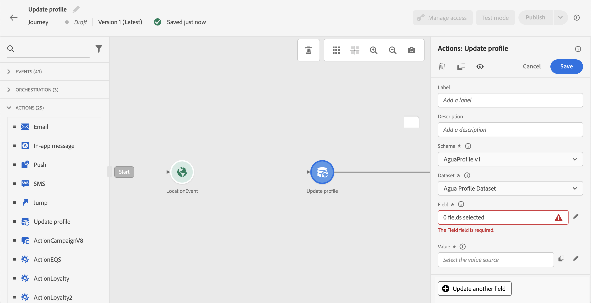

# 更新轮廓 {#update-profile}

>[!BEGINSHADEBOX]

**在此页面上：**&#x200B;了解如何使用“更新配置文件”操作活动，以随着客户在历程中的进展扩充或更正现有Adobe Experience Platform配置文件。

>[!ENDSHADEBOX]

>[!CONTEXTUALHELP]
>id="ajo_journey_update_profiles"
>title="更新轮廓活动"
>abstract="更新轮廓操作活动让您可以使用来自事件、数据源的信息或使用特定值，更新现有 [!DNL Adobe Experience Platform] 轮廓。"

使用&#x200B;**[!UICONTROL 更新配置文件]**&#x200B;操作活动，在客户完成历程时扩充或更正现有[!DNL Adobe Experience Platform]配置文件。 您可以设置源自历程事件、已配置数据源或静态值的字段值，以使用户档案数据保持准确和可操作，而无需离开历程画布。 在配置此活动之前，请查看适用的[护栏和限制](#guardrails)。

## 数据集选择 {#dataset-selection}

**[!UICONTROL 更新配置文件]**&#x200B;活动需要专用数据集来存储更新。 由于此活动仅更新[配置文件存储](https://experienceleague.adobe.com/docs/experience-platform/profile/home.html#profile-data-store){target="_blank"} （而不是Datalake），因此所有更新都应保存在专门为&#x200B;**[!UICONTROL 更新配置文件]**&#x200B;操作指定的[启用配置文件的数据集](https://experienceleague.adobe.com/en/docs/experience-platform/catalog/datasets/user-guide#enable-profile){target="_blank"}中。

>[!CAUTION]
>
>请勿使用也用于批量摄取或流式摄取的数据集。 其他引入运行将覆盖&#x200B;**[!UICONTROL 更新配置文件]**&#x200B;操作所做的更改，从而导致配置文件属性消失或恢复到其之前的值。 如果观察到此行为，请在Adobe Experience Platform中验证是否没有任何其他摄取正在写入同一数据集。 有关疑难解答步骤，请参阅[解决Adobe Journey Optimizer中的配置文件更新失败](https://experienceleague.adobe.com/zh-hans/docs/experience-cloud-kcs/kbarticles/ka-26352){target="_blank"}。

此外，**[!UICONTROL 更新配置文件]**&#x200B;活动配置不需要[标识命名空间](https://experienceleague.adobe.com/zh-hans/docs/experience-platform/identity/features/namespaces){target="_blank"}。 因此，请确保所选数据集使用启动历程的操作所使用的相同&#x200B;**[!UICONTROL 身份命名空间]**，因为它是这些更新将使用的命名空间。 所选数据集也可以使用身份映射。 选择具有正确标识命名空间或使用标识映射的数据集失败，将导致&#x200B;**[!UICONTROL 更新配置文件]**&#x200B;活动失败。

## 配置更新用户档案活动 {#use-profile-update}

请按照以下步骤在历程中配置&#x200B;**[!UICONTROL 更新配置文件]**&#x200B;活动。

1. 开始设计您的历程。 在[创建您的第一个历程](../building-journeys/journey-gs.md)中了解详情。

1. 在调色板的&#x200B;**[!UICONTROL 操作]**&#x200B;部分中，将&#x200B;**[!UICONTROL 更新配置文件]**&#x200B;活动拖放到画布中。

   在历程调色板中下的用户档案活动

1. 从列表中选择架构。

   >[!NOTE]
   >
   >只有已存在于所选XDM配置文件架构中的字段才可供选择。 如果您需要的字段未列出，请首先将其添加到Adobe Experience Platform中的架构。

1. 单击&#x200B;**[!UICONTROL 字段]**&#x200B;以选择要更新的字段。

   

1. 从列表中选择数据集。

   >[!NOTE]
   >
   >**[!UICONTROL 更新配置文件]**&#x200B;操作可实时更新配置文件数据，但不会更新数据集。 需要选择数据集，因为用户档案是与数据集相关的记录。

1. 单击&#x200B;**[!UICONTROL 值]**&#x200B;字段以定义要使用的值：

   * 使用简单表达式编辑器，您可以从数据源或传入事件中选择字段。

     配置文件属性更新的

   * 如果要定义特定值或利用高级函数，请选择[**[!UICONTROL 高级模式]**](expression/expressionadvanced.md)。

     用于复杂配置文件更新的高级模式表达式编辑器

1. 若要在同一操作中更新其他配置文件属性，请单击“更新其他字段”**&#x200B;**&#x200B;并重复字段和值的选择。 在一个&#x200B;**[!UICONTROL 更新配置文件]**&#x200B;操作中，您最多可以添加5个字段/值对。 查看[护栏和限制](#guardrails)。

**[!UICONTROL 更新配置文件]**&#x200B;活动现已配置完成。

## 测试用户档案更新 {#using-the-test-mode}

请注意，在[测试模式](testing-the-journey.md)中，配置文件更新会立即在测试配置文件上生效，并且不会模拟。

只有测试轮廓才能进入处于测试模式的历程。 您可以创建新的测试用户档案，也可以将现有用户档案转换为测试用户档案。 在[!DNL Adobe Experience Platform]中，可通过CSV文件导入或API调用更新配置文件属性。 更快速的替代方法是在历程本身中使用&#x200B;**[!UICONTROL 更新配置文件]**&#x200B;活动，将测试配置文件布尔字段设置为true。

有关如何将现有配置文件转换为测试配置文件的更多信息，请参阅此[部分](../audience/creating-test-profiles.md#create-test-profiles-csv)。

## 护栏和限制 {#guardrails}

* **[!UICONTROL 更新配置文件]**&#x200B;操作只能在具有[命名空间](../event/about-creating.md#select-the-namespace)的历程中使用。
* 该操作仅更新现有字段 — 它不会创建新的配置文件字段。
* 该操作仅支持简单字段类型（字符串、数字、布尔值）。 不支持定义为枚举、建议值、对象数组或复杂集合（例如产品列表）的XDM字段。
* 无法使用&#x200B;**[!UICONTROL 更新配置文件]**&#x200B;操作生成[体验事件](../event/about-events.md)，例如购买。
* 与任何其他操作一样，您可以在错误或超时[&#128279;](using-the-journey-designer.md#paths)的情况下定义替代路径。 两个操作不能并行放置。
* 不能保证用户档案更新在同一历程的下游立即可用。 避免在写入字段的&#x200B;**[!UICONTROL 更新配置文件]**&#x200B;操作之后放置直接读取字段的操作，因为更新的值可能尚未反映出来。
* **[!UICONTROL 更新配置文件]**&#x200B;活动仅更新[配置文件存储](https://experienceleague.adobe.com/docs/experience-platform/profile/home.html#profile-data-store){target="_blank"}，不更新数据湖。
* 在单个&#x200B;**[!UICONTROL 更新配置文件]**&#x200B;操作中最多可以更新五个字段/值对。 使用&#x200B;**[!UICONTROL 更新其他字段]**&#x200B;按钮添加更多对。
* 为了获得更好的性能，请将多个属性更新分组为单个&#x200B;**[!UICONTROL 更新配置文件]**&#x200B;操作，而不是为每个属性使用一个操作。

+++ AI知识参考

本节包含结构化知识，用于支持与本主题相关的解释、检索和问答。

要全面了解相关信息，应将此信息与本页上的文档相结合。 这两个源都不是独立的；页面描述了功能，而本节提供了其他上下文来帮助消除术语、意图、适用性和约束条件的歧义。

* **TL；DR：**&#x200B;本页介绍如何配置更新配置文件活动，以在客户历程过程中使用历程事件、数据源或静态值的数据扩充或更正现有Adobe Experience Platform配置文件。

**意图：**

* 配置更新用户档案活动，以在历程中修改现有用户档案属性
* 选择专用于更新配置文件操作的启用配置文件的数据集
* 将历程事件、数据源或静态值中的字段值映射到配置文件属性
* 在单个活动中更新多个用户档案属性（最多五个）
* 在历程测试模式下测试配置文件更新

**术语表：**

* **更新配置文件活动**：在配置文件通过历程&#x200B;*（产品特定）*&#x200B;时实时将新值写入Adobe Experience Platform配置文件中现有字段的操作活动
* **配置文件存储**：包含实时客户配置文件数据的Adobe Experience Platform存储，不同于数据湖&#x200B;*（产品特定）*
* **身份命名空间**：用于区分用于匹配正在更新的配置文件的身份上下文（如电子邮件、CRM ID）的标签&#x200B;*（产品特定）*
* **启用配置文件的数据集**：一个Adobe Experience Platform数据集，配置为将记录贡献给统一配置文件&#x200B;*（产品特定）*

**护栏：**

* 更新配置文件操作只能在定义了命名空间的历程中使用。
* 该操作仅更新现有XDM字段；它无法创建新配置文件字段。
* 仅支持简单字段类型（字符串、数字、布尔值）；不支持枚举、对象数组和复杂集合。
* 该操作无法生成体验事件，例如购买。
* 在单个“更新配置文件”操作中，最多可以更新五个字段/值对。
* 请勿与批处理或流式摄取流程共享专用数据集，因为其他摄取运行将覆盖更新配置文件更改。
* 配置文件更新可能无法在同一历程执行中的下游立即可用。
* 活动仅更新配置文件存储，而不更新数据湖。

**术语：**

* 规范名称：更新配置文件 — 缩写：无 — 变体：更新配置文件活动，更新配置文件活动
* 同义词： &quot;Profile Store&quot; = &quot;Real-Time Customer Profile store&quot;
* 请勿混淆：“配置文件存储”（由此活动更新）≠“数据湖”（此活动未更新）

**常见问题解答：**

* **问：更新用户档案活动能否创建新的用户档案字段？**  — 否，它只能更新选定XDM配置文件架构中已存在的字段。
* **问：为何应使用专用数据集执行更新配置文件操作？**  — 使用批处理或流式摄取共享数据集可能会导致其他摄取运行覆盖更新配置文件活动所做的更改。
* **问：同一历程中的下游活动是否可以立即看到配置文件更新？**  — 否，如果某个操作在更新用户档案活动写入字段后立即读取同一字段，则可能尚未反映更新的值。
* **问：在单个“更新配置文件”操作中可以更新多少字段？**  — 使用“更新其他字段”按钮可在单个活动中配置最多五个字段/值对。
* **问：配置文件更新是否适用于测试模式？**  — 是，在测试模式下，更新会在测试用户档案上立即生效，并且不会模拟。

+++
