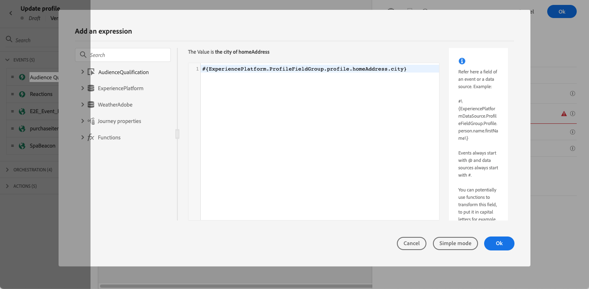

# 更新轮廓 {#update-profile}

>[!CONTEXTUALHELP]
>id="ajo_journey_update_profiles"
>title="更新轮廓活动"
>abstract="更新轮廓操作活动让您可以使用来自事件、数据源的信息或使用特定值，更新现有 Adobe Experience Platform 轮廓。"

使用&#x200B;**[!UICONTROL 更新配置文件]**&#x200B;操作活动，使用来自事件、数据源的信息或使用特定值更新现有Adobe Experience Platform配置文件。

## 重要概念 {#key-concepts}

* **更新配置文件**&#x200B;操作只能在具有命名空间的历程中使用。
* 该操作仅更新现有字段，不创建新配置文件字段。
* 无法使用&#x200B;**更新配置文件**&#x200B;操作生成体验事件，例如购买。
* 与任何其他操作一样，您可以定义在发生错误或超时时的替代路径，并且不能将两个操作并行放置。
* 发送到Adobe Experience Platform的更新请求是立即的/在一秒内。 通常需要几秒钟的时间，但有时需要更长时间，无法保证。 因此，例如，如果某个操作正在使用由之前放置的&#x200B;**更新用户档案**&#x200B;操作更新的“字段1”，则不应期望该操作中会更新“字段1”。
* **更新配置文件**&#x200B;活动不支持定义为枚举或建议值的XDM字段。
* **[!UICONTROL 更新配置文件]**&#x200B;活动仅更新[配置文件存储](https://experienceleague.adobe.com/docs/experience-platform/profile/home.html#profile-data-store){target="_blank"}，不更新数据湖。

## 数据集选择 {#dataset-selection}

**更新配置文件**&#x200B;活动需要专用数据集来存储更新。 由于此活动仅更新配置文件存储（而不是Datalake），因此所有更新都应保存在专门为&#x200B;**更新配置文件**&#x200B;操作指定的启用配置文件的数据集中。 使用用于批处理或流式摄取的数据集将导致新载入的数据覆盖&#x200B;**更新配置文件**&#x200B;操作所做的更改。

此外，**更新配置文件**&#x200B;活动配置不需要标识命名空间。 因此，请确保所选数据集使用启动历程的操作所使用的相同&#x200B;**身份命名空间**，因为它是这些更新将使用的命名空间。 所选数据集也可以使用身份映射。 如果未能选择具有正确命名空间或使用标识映射的数据集，将导致更新配置文件活动失败。

## 使用用户档案更新

1. 从事件开始设计您的旅程。 请参阅此[部分](../building-journeys/journey.md)。

1. 在调色板的&#x200B;**操作**&#x200B;部分中，将&#x200B;**更新配置文件**&#x200B;活动拖放到画布中。

   

1. 从列表中选择架构。

1. 单击&#x200B;**字段**&#x200B;以选择要更新的字段。 只能选择一个字段。

   

1. 从列表中选择数据集。

   >[!NOTE]
   >
   >**更新配置文件**&#x200B;操作可实时更新配置文件数据，但不会更新数据集。 需要选择数据集，因为用户档案是与数据集相关的记录。

1. 单击&#x200B;**值**&#x200B;字段以定义要使用的值：

   * 使用简单表达式编辑器，您可以从数据源或传入事件中选择字段。

     

   * 如果要定义特定值或利用高级函数，请选择&#x200B;**高级模式**。

     

**更新配置文件**&#x200B;现已配置完成。

## 使用测试模式 {#using-the-test-mode}

在测试模式下，将不会模拟用户档案更新。 将对测试用户档案执行更新。

只有测试配置文件才能进入处于测试模式的历程。 您可以创建新的测试配置文件，或将现有配置文件转换为测试配置文件。 在Adobe Experience Platform中，您可以通过csv文件导入或API调用更新用户档案属性。 更简单的方法是使用&#x200B;**更新配置文件**&#x200B;操作活动，并将测试配置文件布尔字段从false更改为true。

有关如何将现有配置文件转换为测试配置文件的详细信息，请参阅此[部分](../audience/creating-test-profiles.md#create-test-profiles-csv)。
