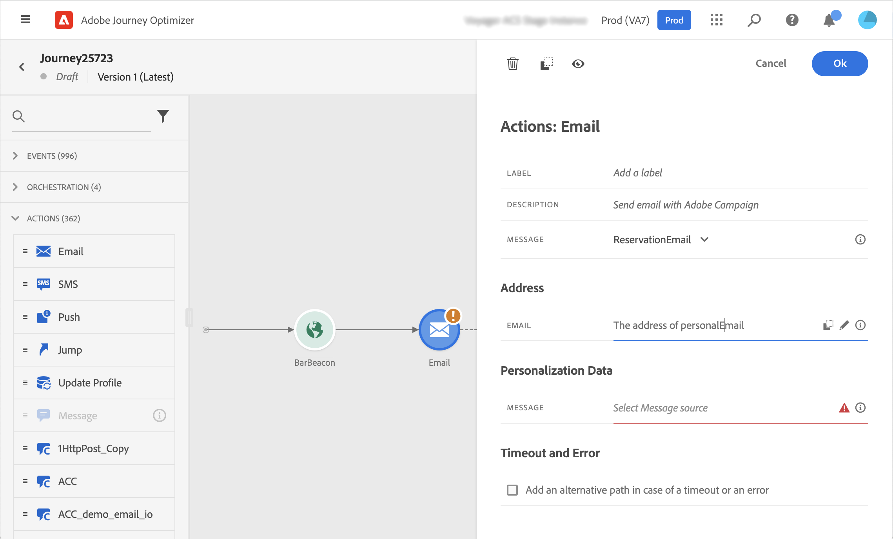
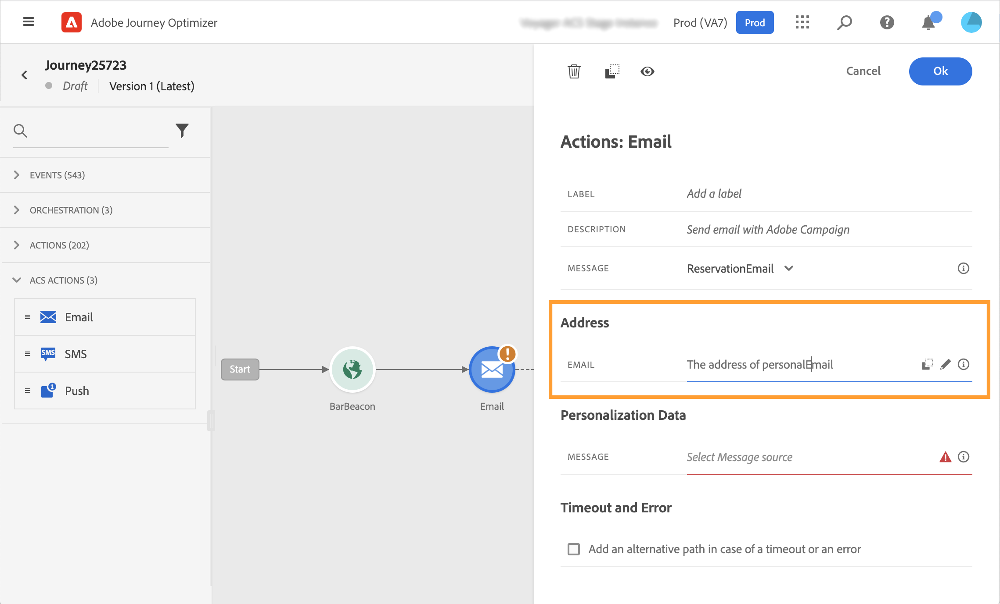

# Adobe Campaign Standard 操作 {#using_campaign_action}

如果您有Adobe Campaign Standard，则可以使用以下内置操作活动： **[!UICONTROL 电子邮件]**， **[!UICONTROL 推送]** 和 **[!UICONTROL 短信]**.

>[!NOTE]
>
>为此，您需要配置内置操作。 请参见[此页面](../action/acs-action.md)。

对于每个渠道，您都可以选择Adobe Campaign Standard事务型消息传递 **模板**. 对于内置的电子邮件、短信和推送渠道，我们依赖事务型消息传递来执行消息发送。 这意味着如果您要在历程中使用特定消息模板，则必须在Adobe Campaign Standard中发布该模板。 请参阅 [此页面](https://experienceleague.adobe.com/docs/campaign-standard/using/communication-channels/transactional-messaging/getting-started-with-transactional-msg.html?lang=zh-Hans) 以了解如何使用此功能。

>[!NOTE]
>
>必须发布Campaign Standard事务型消息及其相关事件，才能在Journey Optimizer中使用。 如果事件已发布但消息未发布，则它将不会显示在Journey Optimizer界面中。 如果消息已发布，但其关联事件未发布，则它将在Journey Optimizer界面中可见，但不可用。


您可以使用事件（也称为实时）或用户档案事务型消息模板。

>[!NOTE]
>
>当我们发送实时事务型消息(rtEvent)或借助自定义操作通过第三方系统路由消息时，需要进行特定设置以进行疲劳、阻止列表或退订管理。 例如，如果“unsubscribe”属性存储在Adobe Experience Platform或第三方系统中，则必须在消息发送之前添加条件以检查此条件。

选择模板后，消息有效负载中预期的所有字段都会显示在下的活动配置窗格中。 **[!UICONTROL 地址]** 和 **[!UICONTROL 个性化数据]**. 您需要从事件或数据源中将每个字段映射到要使用的字段。 您还可以使用高级表达式编辑器手动传递值、对检索到的信息执行数据操作（例如，将字符串转换为大写）或使用诸如“if， then， else”之类的函数。 请参阅[此页](expression/expressionadvanced.md)。



## 电子邮件和短信 {#section_asc_51g_nhb}

对象 **[!UICONTROL 电子邮件]** 和 **[!UICONTROL 短信]**，则参数相同。

>[!NOTE]
>
>对于电子邮件，如果您使用用户档案事务型模板，退订机制将由Campaign Standard内置处理。 您只需添加 **[!UICONTROL 退订链接]** 模板中的内容块([了解详情](https://experienceleague.adobe.com/docs/campaign-standard/using/communication-channels/transactional-messaging/getting-started-with-transactional-msg.html?lang=zh-Hans))。 如果您使用基于事件的模板(rtEvent)，则需要在消息中添加一个链接，在URL参数中传递人员的电子邮件，并指向退订登陆页面。 您需要创建此登陆页面，并确保将人员取消订阅的决策传输到Adobe。

首先，您需要选择事务型消息传递模板。

有两种类别可用： **[!UICONTROL 地址]** 和 **[!UICONTROL 个性化数据]**.

您可以轻松地定义在何处检索 **[!UICONTROL 地址]** 或 **[!UICONTROL 个性化数据]** 使用界面。 您可以浏览事件和可用数据源的字段。 您还可以将高级表达式编辑器用于更高级的用例，例如使用要求传递参数或执行操作的数据源。 请参阅[此页](expression/expressionadvanced.md)。

**[!UICONTROL 地址]**

>[!NOTE]
>
>仅当您选择“事件”事务型消息时，此类别才可见。 对于“profile”消息， **[!UICONTROL 地址]** 字段由系统自动从Adobe Campaign Standard中检索。

这些是系统需要知道将消息发送到何处的字段。 对于电子邮件模板，它是电子邮件地址。 如果是短信，就是手机号码。



**[!UICONTROL 个性化数据]**

>[!NOTE]
>
>无法在个性化数据中传递集合。 如果事务型电子邮件或短信需要收藏集，则无法正常工作。 另请注意，个性化数据具有预期格式（例如：字符串、小数等）。 必须注意遵守这些预期的格式。

这些是Adobe Campaign Standard消息预期的字段。 这些字段可用于个性化消息、应用条件格式或选择特定的消息变体。


## 推送 {#section_im3_hvf_nhb}

在使用推送活动之前，需要在Campaign Standard的同时配置您的移动应用程序，以发送推送通知。 使用此 [文章](https://helpx.adobe.com/cn/campaign/kb/integrate-mobile-sdk.html) 为移动设备采取必要的实施步骤。

首先，您需要从下拉列表中选择一个移动设备应用程序和一条事务型消息。


有两种类别可用： **[!UICONTROL Target]** 和 **[!UICONTROL 个性化数据]**.

**[!UICONTROL Target]**

>[!NOTE]
>
>仅当您选择事件消息时，此类别才可见。 对于用户档案消息， **[!UICONTROL Target]** 字段由系统使用Adobe Campaign Standard执行的协调自动检索。

在本节中，您需要定义 **[!UICONTROL 推送平台]**. 下拉列表允许您选择 **[!UICONTROL Apple Push Notification Server]** (iOS)或 **[!UICONTROL Firebase云消息]** (Android)。 或者，您可以从事件或数据源中选择特定字段，或定义高级表达式。

您还需要定义 **[!UICONTROL 注册令牌]**. 该表达式取决于如何在事件有效负载或其他事件中定义令牌 [!DNL Journey Optimizer] 信息。 如果令牌是在集合中定义的，则它可以是简单字段，也可以是更复杂的表达式，例如：

```
@{Event_push._experience.campaign.message.profileSnapshot.pushNotificationTokens.first().token}
```

**[!UICONTROL 个性化数据]**

>[!NOTE]
>
>无法在个性化数据中传递集合。 如果事务推送需要收藏集，则无法正常工作。 另请注意，个性化数据具有预期格式（例如：字符串、小数等）。 必须注意遵守这些预期的格式。

这些是Adobe Campaign Standard消息中使用的事务型模板所需的字段。 这些字段可用于个性化您的消息、应用条件格式或选择特定的消息变体。
