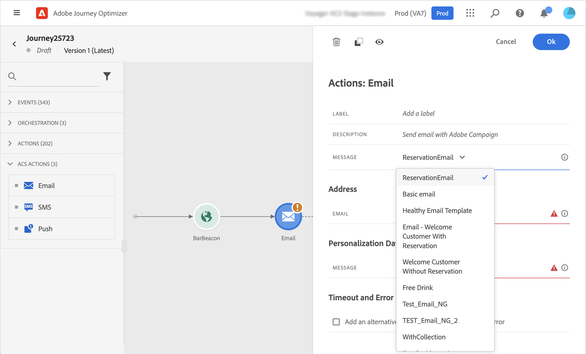
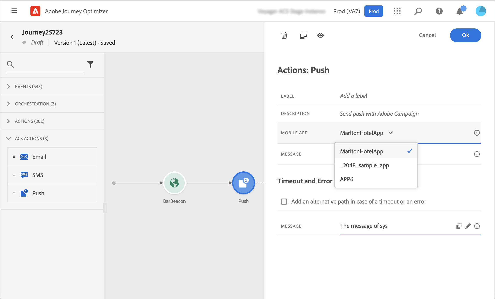

# [!DNL Adobe Campaign] 标准操作 {#using_campaign_action}

>[!BEGINSHADEBOX]

**在此页面上：**&#x200B;了解如何通过依赖Adobe Campaign Standard事务性消息传递模板，在历程中使用内置的Campaign Standard电子邮件、推送和短信操作活动。

>[!ENDSHADEBOX]

>[!CONTEXTUALHELP]
>id="ajo_journey_action_custom_acs"
>title="自定义操作"
>abstract="如果您使用 [!DNL Adobe Campaign]，则可以使用集成功能。 该集成允许您使用 [!DNL Adobe Campaign] 的事务性消息功能发送电子邮件、推送通知和短信。"

如果您有[!DNL Adobe Campaign] Standard，则以下内置操作活动可用： **[!UICONTROL 电子邮件]**、**[!UICONTROL 推送]**&#x200B;和&#x200B;**[!UICONTROL 短信]**。

>[!NOTE]
>
>为此，您需要配置内置操作。 请参见[此页面](../action/acs-action.md)。

对于每个渠道，您选择一个[!DNL Adobe Campaign]标准事务型消息传递&#x200B;**模板**。 对于内置的电子邮件、短信和推送渠道，我们依赖事务型消息传递来执行消息发送。 这意味着如果您要在历程中使用特定消息模板，则必须在[!DNL Adobe Campaign] Standard中发布该模板。 请参阅[此页面](https://experienceleague.adobe.com/docs/campaign-standard/using/communication-channels/transactional-messaging/getting-started-with-transactional-msg.html?lang=zh-Hans)以了解如何使用此功能。

>[!NOTE]
>
>必须发布Campaign Standard事务型消息及其关联的事件，才能在Journey Optimizer中使用。 如果事件已发布但消息未发布，则不会在Journey Optimizer界面中看到该消息。 如果消息已发布，但其关联事件未发布，则它将在Journey Optimizer界面中可见，但不可用。

历程中的[!DNL Adobe Campaign]标准操作配置

您可以使用事件（也称为实时）或用户档案事务型消息模板。

>[!NOTE]
>
>当我们发送实时事务型消息(rtEvent)或借助自定义操作通过第三方系统路由消息时，需要进行特定设置才能进行疲劳、阻止列表或退订管理。 例如，如果“unsubscribe”属性存储在[!DNL Adobe Experience Platform]中或第三方系统中，则必须在发送消息之前添加条件以检查此条件。

当您选择模板时，消息有效负载中需要的所有字段都会显示在活动配置窗格的&#x200B;**[!UICONTROL 地址]**&#x200B;和&#x200B;**[!UICONTROL Personalization数据]**&#x200B;下。 您需要将每个字段映射到要使用的字段（从事件或从数据源）。 您还可以使用高级表达式编辑器手动传递值，对检索到的信息执行数据操作（例如，将字符串转换为大写），或使用函数，如“if， then， else”。 请参阅[此页](expression/expressionadvanced.md)。


## 电子邮件和短信 {#section_asc_51g_nhb}

对于&#x200B;**[!UICONTROL 电子邮件]**&#x200B;和&#x200B;**[!UICONTROL 短信]**，参数相同。

>[!NOTE]
>
>将用户档案的事务型模板用于电子邮件时，[!DNL Adobe Campaign] Standard会自动处理取消订阅机制。
>在[事务性电子邮件模板](https://experienceleague.adobe.com/docs/campaign-standard/using/communication-channels/transactional-messaging/getting-started-with-transactional-msg.html?lang=zh-Hans)中包括&#x200B;**[!UICONTROL 退订链接]**&#x200B;内容块。
>如果您使用基于事件的模板(rtEvent)，请在消息中纳入一个链接，该链接会将收件人的电子邮件作为URL参数传递，并将他们定向到退订登陆页面。
>创建登陆页面，并确保将收件人的取消订阅决策传输到Adobe。

首先，您需要选择事务型消息传递模板。

有两种类别可用：**[!UICONTROL 地址]**&#x200B;和&#x200B;**[!UICONTROL Personalization数据]**。

您可以使用界面轻松定义在何处检索&#x200B;**[!UICONTROL 地址]**&#x200B;或&#x200B;**[!UICONTROL Personalization数据]**。 您可以浏览事件和可用数据源的字段。 您还可以将高级表达式编辑器用于更高级的用例，例如使用需要传递参数或执行操作的数据源。 请参阅[此页](expression/expressionadvanced.md)。

**[!UICONTROL 地址]**

>[!NOTE]
>
>仅当您选择“事件”事务型消息时，此类别才可见。 对于“用户档案”消息，系统会自动从[!DNL Adobe Campaign] Standard中检索&#x200B;**[!UICONTROL 地址]**&#x200B;字段。

这些是系统需要知道将消息发送到何处的字段。 对于电子邮件模板，这是电子邮件地址。 如果是短信，就是手机号码。

用于Campaign Standard集成的

**[!UICONTROL Personalization数据]**

>[!NOTE]
>
>您无法在个性化数据中传递集合。 如果事务型电子邮件或短信需要收藏集，则无法正常使用。 另请注意，个性化数据具有预期格式（例如：字符串、小数等）。 必须注意遵守这些预期格式。

这些是[!DNL Adobe Campaign]标准消息所需的字段。 这些字段可用于个性化消息、应用条件格式或选择特定的消息变体。

Journey Optimizer和Campaign Standard之间的

## 推送 {#section_im3_hvf_nhb}

在使用推送活动之前，需要配置您的移动设备应用程序以及Campaign Standard以发送推送通知。 使用此[文章](https://helpx.adobe.com/cn/campaign/kb/integrate-mobile-sdk.html)为移动设备执行必要的实施步骤。

首先，您需要从下拉列表中选择移动设备应用程序和事务型消息。

用于Campaign Standard参数映射的

有两个类别可用：**[!UICONTROL Target]**&#x200B;和&#x200B;**[!UICONTROL Personalization数据]**。

**[!UICONTROL Target]**

>[!NOTE]
>
>仅当您选择事件消息时，此类别才可见。 对于配置文件消息，**[!UICONTROL Target]**&#x200B;字段由系统使用[!DNL Adobe Campaign] Standard执行的协调自动检索。

在此部分中，您需要定义&#x200B;**[!UICONTROL 推送平台]**。 下拉列表允许您选择&#x200B;**[!UICONTROL Apple Push Notification Server]** (iOS)或&#x200B;**[!UICONTROL Firebase Cloud Messaging]** (Android)。 或者，您可以从事件或数据源中选择特定字段，或定义高级表达式。

您还需要定义&#x200B;**[!UICONTROL 注册令牌]**。 表达式取决于如何在事件有效负载或其他[!DNL Journey Optimizer]信息中定义令牌。 如果在集合中定义了令牌，则它可以是简单字段，也可以是更复杂的表达式：

```
@event{Event_push._experience.campaign.message.profileSnapshot.pushNotificationTokens.first().token}
```

**[!UICONTROL Personalization数据]**

>[!NOTE]
>
>您无法在个性化数据中传递集合。 如果事务推送需要收藏集，则无法运行。 另请注意，个性化数据具有预期格式（例如：字符串、小数等）。 必须注意遵守这些预期格式。

这些是[!DNL Adobe Campaign]标准消息中使用的事务型模板所需的字段。 这些字段可用于个性化您的消息、应用条件格式或选择特定的消息变体。

+++ AI知识参考

本节包含结构化知识，用于支持与本主题相关的解释、检索和问答。

要全面了解相关信息，应将此信息与本页上的文档相结合。 这两个源都不是独立的；页面描述了功能，而本节提供了其他上下文来帮助消除术语、意图、适用性和约束条件的歧义。

* **TL；DR：**&#x200B;本页介绍如何在Journey Optimizer历程中通过Campaign事务性消息传递模板使用内置的Adobe Campaign Standard电子邮件、短信和推送操作活动。

**意图：**

* 使用Adobe Campaign Standard集成在历程中配置电子邮件、短信或推送操作活动
* 选择Campaign Standard事务性消息传递模板并将其映射到历程字段
* 将历程事件或数据源中的地址和Personalization数据字段映射到消息有效负载
* 处理基于事件和基于用户档案的事务性电子邮件模板的退订
* 为Campaign Standard推送操作配置推送通知目标平台和注册令牌

**术语表：**

* **事务性消息传递**： Adobe Campaign Standard基于事件&#x200B;*（产品特定）*&#x200B;发送触发的实时消息（电子邮件、短信、推送）的功能
* **rtEvent**： Adobe Campaign Standard中的实时事件事务型消息模板，用于基于事件的消息传递&#x200B;*（产品特定）*
* **用户档案事务型模板**： Campaign Standard事务型消息模板，使用用户档案数据进行收件人解析和退订处理&#x200B;*（产品特定）*
* **注册令牌**：将推送通知定位到特定移动应用安装&#x200B;*（产品特定）所需的设备级标识符*

**护栏：**

* 在使用之前必须配置内置操作；请参阅操作配置页面。
* 必须发布Campaign Standard事务型消息及其相关事件，模板才能在Journey Optimizer中使用。
* 无法在Personalization数据字段中传递收藏集。
* 对于基于事件的(rtEvent)模板，必须在发送之前使用条件手动处理退订管理。
* 对于基于用户档案的推送消息，会自动检索Target字段；Target类别仅对事件消息可见。
* 必须先使用Campaign Standard配置移动设备应用程序，然后才能使用推送活动。

**术语：**

* 规范名称：Adobe Campaign Standard — 缩写：ACS — 变体：Campaign Standard
* 同义词： &quot;event transactional message&quot; = &quot;rtEvent&quot;；&quot;real-time transactional message&quot; = &quot;rtEvent&quot;
* 请勿混淆：“用户档案事务型模板”（自动处理退订）≠“事件事务型模板”（必须手动处理退订）

**常见问题解答：**

* **问：通过Adobe Campaign Standard集成可以使用哪些渠道？**  — 电子邮件、短信和推送通知渠道作为内置操作活动提供。
* **问：在Journey Optimizer中使用事务型消息之前，是否需要在Campaign Standard中发布该消息？**  — 是，事务型消息及其关联事件都必须发布；未发布的消息将无法使用，即使该消息在界面中可见也是如此。
* **问：如何处理基于配置文件的电子邮件模板的取消订阅？**  — 使用用户档案事务型模板时，退订由Adobe Campaign Standard自动处理；在模板中包含退订链接内容块。
* **问：能否将收藏集作为个性化数据传递？**  — 否，无法在Personalization数据中传递集合；事务型消息不能期望集合。
* **问：我应将基于事件的电子邮件的收件人地址映射到何处？**  — 活动配置窗格中的地址类别仅对事件事务型消息可见；对于用户档案消息，地址会自动检索。

+++
