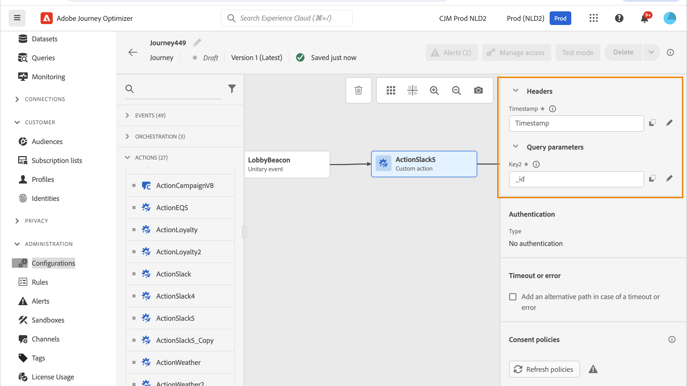

# 使用自定义操作 {#use-custom-actions}

>[!CONTEXTUALHELP]
>id="ajo_journey_action_custom"
>title="自定义操作"
>abstract="通过自定义操作，您可以配置第三方系统的连接以发送消息或 API 调用。可以使用任何提供商的任何服务配置操作，这些服务可以通过具有 JSON 格式有效负载的 REST API 调用。"

通过自定义操作，您可以配置第三方系统的连接以发送消息或 API 调用。可以使用任何提供商的任何服务配置操作，这些服务可以通过具有 JSON 格式有效负载的 REST API 调用。

## 同意和数据管理 {#privacy}

在Journey Optimizer中，您可以将数据管理和同意策略应用于您的自定义操作，以阻止将特定字段导出到第三方系统，或排除未同意接收电子邮件、推送或短信通信的客户。 有关更多信息，请参阅以下页面：

* [数据管理](../action/action-privacy.md).
* [同意](../action/consent.md).

## URL 配置

的配置窗格 **自定义操作** 活动显示为自定义操作配置的URL配置参数和身份验证参数。 您不能在历程中设置URL的静态部分，但是在自定义操作的全局配置中。 [了解详情](../action/about-custom-action-configuration.md)。

### 动态路径

如果URL包含动态路径，请在 **[!UICONTROL 路径]** 字段。

要连接字段和纯文本字符串，请在高级表达式编辑器中使用字符串函数或加号(+)。 用单引号(&#39;)或双引号(&quot;)引住纯文本字符串。 [了解详情](expression/expressionadvanced.md)。

下表显示了配置示例：

| 字段 | 值 |
| --- | --- |
| URL | `https://xxx.yyy.com:8080/somethingstatic/` |
| 路径 | `The id of marketingCampaign + '/messages'` |

拼接URL具有以下形式：

`https://xxx.yyy.com:8080/somethingstatic/`\&lt;campaign id=&quot;&quot;>`/messages`

### 标头

的 **[!UICONTROL URL配置]** 部分显示动态标题字段，但不显示常量标题字段。 动态标头字段是HTTP标头字段，其值配置为变量。 [了解详情](../action/about-custom-action-configuration.md)。

如果需要，请指定动态标题字段的值：

1. 在历程中选择自定义操作。
1. 在配置窗格中，单击 **[!UICONTROL URL配置]** 中。

   

1. 选择字段并单击 **[!UICONTROL 确定]**.

## 操作参数

在 **[!UICONTROL 操作参数]** 部分，您将看到消息参数定义为 _&quot;变量&quot;_. 对于这些参数，您可以定义获取此信息的位置(例如：事件、数据源)、手动传递值或使用高级表达式编辑器进行高级用例。 高级用例可以是数据处理和其他函数用法。 请参阅 [页面](expression/expressionadvanced.md).

**相关主题**

[配置操作](../action/about-custom-action-configuration.md)
