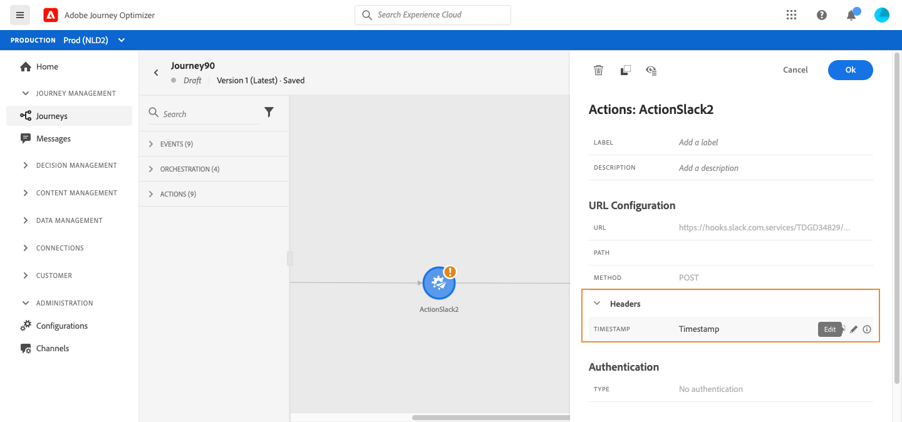

# 使用自定义操作 {#use-custom-actions}

活动配置窗格显示为自定义操作配置的URL配置参数和身份验证参数。 [了解详情](../action/about-custom-action-configuration.md)。

>[!NOTE]
>
>无法在自定义操作参数中传递简单集合。 不支持更复杂的集合字段（对象数组）。  另请注意，这些参数具有预期的格式(例如：字符串、小数等)。 您必须谨慎遵循这些预期格式。

## URL 配置

### 动态路径

如果URL包含动态路径，请在 **[!UICONTROL Path]** 字段。

>[!NOTE]
>
>您不能在历程中设置URL的静态部分，但是在自定义操作的全局配置中。 [了解详情](../action/about-custom-action-configuration.md)。

要连接字段和纯文本字符串，请在高级表达式编辑器中使用字符串函数或加号(+)。 用单引号(&#39;)或双引号(&quot;)引住纯文本字符串。 [了解详情](expression/expressionadvanced.md)。

下表显示了配置示例：

| 字段 | 值 |
| --- | --- |
| URL | `https://xxx.yyy.com:8080/somethingstatic/` |
| 路径 | `The id of marketingCampaign + '/messages'` |

拼接URL具有以下形式：

`https://xxx.yyy.com:8080/somethingstatic/`\&lt;campaign id=&quot;&quot;>`/messages`

### 标头

的 **[!UICONTROL URL Configuration]** 部分显示动态标题字段，但不显示常量标题字段。 动态标头字段是HTTP标头字段，其值配置为变量。 [了解详情](../action/about-custom-action-configuration.md)。

如果需要，请指定动态标题字段的值：

1. 在历程中选择自定义操作。
1. 在配置窗格中，单击 **[!UICONTROL URL Configuration]** 中。

   

1. 选择字段并单击 **[!UICONTROL OK]**.

## 操作参数

在 **[!UICONTROL Action parameters]** 部分，您将看到消息参数定义为 _&quot;变量&quot;_. 对于这些参数，您可以定义获取此信息的位置(例如：事件、数据源)、手动传递值或使用高级表达式编辑器进行高级用例。 高级用例可以是数据处理和其他函数用法。 请参阅 [AdobeJourney Orchestration文档](expression/expressionadvanced.md).

**相关主题**

[配置操作](../action/about-custom-action-configuration.md)
