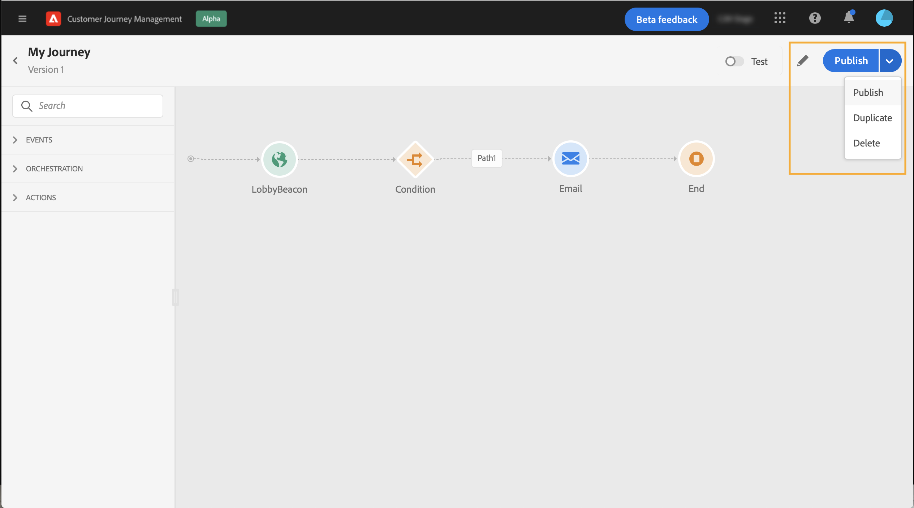
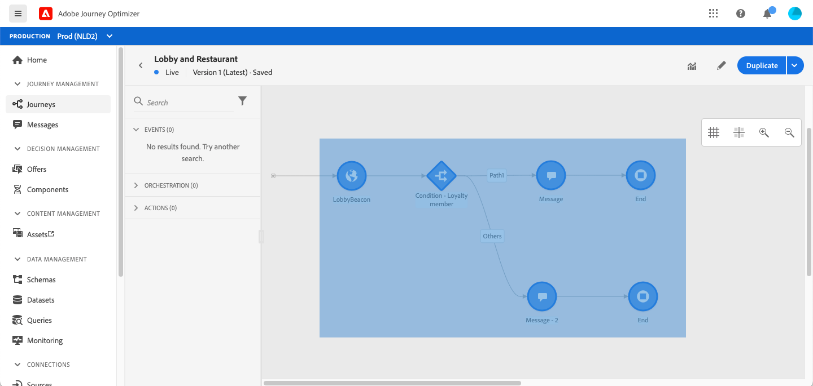

# 设计您的历程

历程界面允许您轻松地将活动从面板拖放到画布中。 您还可以在下一步中双击某个活动，将其添加到画布中。 每个活动都具有特定的角色和在流程中的位置。 活动已排序。 活动完成后，该流程将继续并处理下一个活动，等等。

## 历程设计入门

的 **调色板** 位于屏幕的左侧。 所有可用活动都按以下几类进行分类： **[!UICONTROL Events]**, **[!UICONTROL Orchestration]** 和 **[!UICONTROL Actions]**. 您可以通过单击不同类别的名称来展开/折叠其名称。 要在历程中使用活动，请将其从面板拖放到画布中。

启动新历程时，无法作为第一步放入画布中的元素会被隐藏。 这涉及所有操作、条件活动、等待和反应。

的 **[!UICONTROL Filter items]** 图标，可显示以下过滤器：

* **仅显示可用项目**:隐藏或显示面板中不可用的元素，例如使用不同于历程中使用的命名空间的事件。 默认情况下，不可用项目处于隐藏状态。如果选择显示它们，它们将显示为灰显。

* **仅显示最近的项目**:此过滤器除了现成事件和操作之外，还允许您仅显示最近使用的五个事件和操作。 这特定于每个用户。 默认情况下，将显示所有项目。

您还可以使用 **[!UICONTROL Search]** 字段。 仅过滤事件和操作。

的 **画布** 是历程设计器中的中心区域。 您可以在此区域中拖放并配置活动。 单击画布中的活动以对其进行配置。 此操作将打开右侧的活动配置窗格。

的 **活动配置窗格** 单击面板中的活动时显示。 填写必填字段。 单击 **[!UICONTROL Delete]** 图标以删除活动。 单击 **[!UICONTROL Cancel]** 取消修改或 **[!UICONTROL Ok]** 确认。 要删除活动，您还可以选择一个活动（或多个活动）并按Backspace键。 按Esc键将关闭活动配置窗格。

默认情况下，只读字段处于隐藏状态。 要显示只读字段，请单击 **显示只读字段** 图标。 此设置适用于所有历程中的所有活动。

根据历程的状态，您可以使用右上角提供的按钮对历程执行不同的操作： **[!UICONTROL Publish]**, **[!UICONTROL Duplicate]**, **[!UICONTROL Delete]**, **[!UICONTROL Journey properties]**, **[!UICONTROL Test]**. 未选择活动时，将显示这些按钮。 某些按钮将根据上下文显示。 测试模式激活后，将显示测试模式日志按钮。

## 开始您的历程

在设计历程时，您想要问的第一个问题是用户档案如何进入历程。 有两种可能：

**从事件开始**:当历程设置为侦听事件时，个人会进入历程 **统一** 实时。 历程中包含的消息会发送到当前流入历程的人员。 [进一步了解事件](../event/about-events.md)

**从读取区段开始**:您可以设置历程来监听Adobe Experience Platform区段。 在这种情况下，属于指定区段的所有个人都将进入历程。 历程中包含的消息会发送给属于该区段的个人。 [了解有关读取区段的更多信息](read-segment.md).

## 定义后续步骤

在第一个事件或读取区段后，您可以组合不同的活动以构建多步跨渠道方案。 从面板中选择所需的步骤。

**事件**

当您通过事件开始历程时，将在收到事件时触发历程。 然后，人员将逐个遵循历程中定义的后续步骤。

您可以添加 **多个事件** 在历程中，只要它们使用相同的命名空间。 事件是预先配置的。 [进一步了解事件](about-journey-activities.md#event-activities)

您还可以添加 **反应** 事件，以对与消息相关的跟踪数据做出响应。 例如，如果用户打开前一条消息或在其中单击该消息，则允许您发送另一条消息。 在中了解详情 [部分](reaction-events.md).

的 **区段鉴别** 事件活动允许您让个人根据Adobe Experience Platform区段入口和出口进入旅程或在旅程中前进。 您可以让所有新的银牌客户进入历程并发送个性化消息。 在中了解详情 [部分](segment-qualification-events.md).

**编排**

在编排活动中，您将找到 **读取区段** 活动，用于设置历程以监听Adobe Experience Platform区段。 [了解有关读取区段活动的更多信息](read-segment.md).

其他活动允许您向历程添加条件以定义多个路径、设置在执行下一活动之前的等待时间，或结束历程。 在中了解详情 [部分](about-journey-activities.md#orchestration-activities).

**操作**

您将在此处找到 **消息** 活动，用于包含 [!DNL Journey Optimizer]. [进一步了解消息活动](journeys-message.md)

您还将找到已配置为通过第三方系统发送消息的自定义操作。 在中了解详情 [部分](about-journey-activities.md#action-activities).

## 在画布中使用路径 {#paths}

多个活动(**[!UICONTROL Condition]**, **[!UICONTROL Action]** 活动)，以便您在发生错误或超时时定义回退操作。 在活动配置窗格中，选中框： **[!UICONTROL Add an alternative path in case of a timeout or an error]**. 活动后会添加另一个路径。 超时持续时间在历程的属性中定义(请参阅 [本页](../building-journeys/journey-gs.md#change-properties) 管理员用户的。 例如，如果电子邮件发送时间过长或出错，您可以决定发送短信。

各种活动（事件、操作、等待）允许您在其后添加多个路径。 要实现此目的，请将光标放在活动上并单击“+”符号。 只能并行设置事件和等待活动。 如果同时设置多个事件，则所选路径将是第一个发生事件的路径之一。

在监听事件时，我们建议您不要无限期地等待该事件。 它不是强制性的，只是一种最佳做法。 如果只想在特定时间内侦听一个或多个事件，则将并行放置一个或多个事件和等待活动。 请参阅[此小节](../building-journeys/general-events.md#events-specific-time)。

要删除路径，请将光标放在该路径上，然后单击 **[!UICONTROL Delete path]** 图标。

在画布中，当两个活动断开连接时，会显示一条警告消息。 将光标放在警告图标上以显示错误消息。 要修复此问题，只需移动已断开连接的活动并将其连接到上一个活动即可。

## 复制和粘贴活动 {#copy-paste}

您可以复制一个历程的一个或多个活动，并将它们粘贴到同一历程中或其他历程中。 如果要重复使用在上一个历程中已配置的大量活动，这样可节省时间。

**重要说明**

* 您可以在不同的选项卡和浏览器之间复制/粘贴。 您只能复制/粘贴同一实例中的活动。
* 如果目标历程的事件使用其他命名空间，则无法复制/粘贴事件。
* 粘贴的活动可能会引用目标历程中不存在的数据，例如，如果您在不同的沙箱中复制/粘贴。 始终检查错误并进行所需的调整。
* 请注意，您无法撤消某个操作。 要删除粘贴的活动，您需要选择并删除它们。 因此，在复制活动之前，请确保只选择所需的活动。
* 您可以从任何历程中复制活动，甚至可以复制只读的活动。
* 您可以选择任何活动，甚至可以选择未链接的活动。 链接的活动在粘贴后将保持链接状态。

以下是复制/粘贴活动的步骤：

1. 打开旅程。
1. 单击时移动鼠标以选择要复制的活动。 在按 **Ctrl/Command** 键。 使用 **Ctrl/Command + A** 选择所有活动。
   
1. 按 **Ctrl/Command + C**.
如果您只想复制一个活动，则可以单击该活动并使用 **复制** 图标。
   
1. 在任何历程中，按 **Ctrl/Command + V** 粘贴活动，而不将其链接到现有节点。 粘贴的活动会按相同的顺序放置。 粘贴活动后，将保持选中状态，以便轻松移动活动。 您还可以将光标放在空的占位符上并点击 **Ctrl/Command + V**. 粘贴的活动将链接到节点。
   
