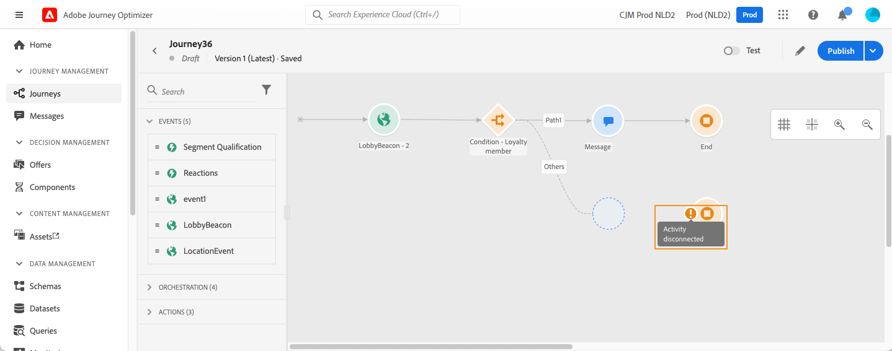
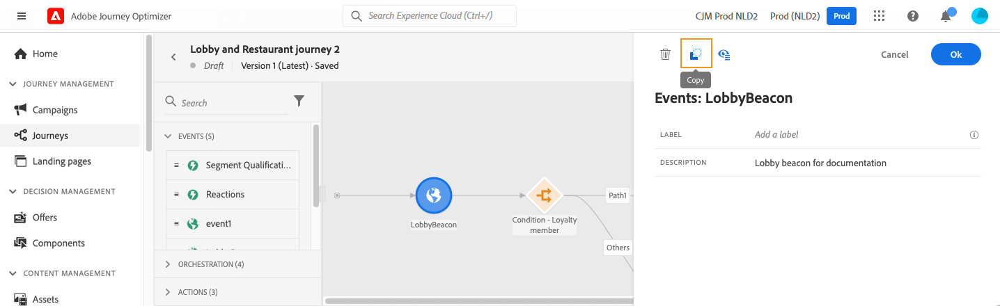

# 设计您的历程 {#design-your-journey}

>[!CONTEXTUALHELP]
>id="ajo_journey_canvas"
>title="设计您的历程"
>abstract="历程界面让您可以轻松地将活动从调色板拖放到画布中。您还可以双击一个活动，以便在可以进行后续步骤时将其添加到画布中。"

Adobe Journey Optimizer包括全渠道编排画布，允许营销人员协调营销外联与一对一客户参与。 利用用户界面，可轻松地将活动从面板拖放到画布中以构建旅程。 请注意，您还可以在下一个可用步骤中双击某个活动以将其添加到画布中。

事件、编排和操作活动在此过程中具有特定的角色和位置。 活动按顺序排列：当活动完成后，流程会继续运行并处理下一个活动，依此类推。

## 历程设计入门 {#gs-journey-design}

此 **调色板** 位于屏幕的左侧。 所有可用的活动都分为几个类别： [事件](#jo-event)， [编排](#jo-orch) 和 [操作](#jo-actions). 您可以通过单击不同类别的名称来展开/折叠这些类别。 要在历程中使用活动，请将其从面板拖放到画布中。

开始新历程时，无法在第一步操作中放入画布的元素会被隐藏。 这涉及所有操作、条件活动、等待和反应。

此 **[!UICONTROL 筛选项目]** 图标可显示以下过滤器：

* **仅显示可用项目**：隐藏或显示面板中不可用的元素，例如使用不同于您的历程中使用的命名空间的事件。 默认情况下，不可用项目处于隐藏状态。如果您选择显示它们，它们将显示为灰色。

* **仅显示最近的项目**：除了现成事件和操作外，此过滤器还允许您仅显示最近使用的五个事件和操作。 这具体取决于每个用户。默认情况下，将显示所有项目。

您还可以使用 **[!UICONTROL 搜索]** 字段。 仅筛选事件和操作。

此 **画布** 是旅程设计器中的中心区域。 您可以在此区域中删除并配置活动。 单击画布中的活动以进行配置。 这将打开右侧的活动配置窗格。

此 **工具栏**，位于画布的右上角，允许您显示/隐藏网格、放大/缩小并下载画布的屏幕快照。 请参阅此[部分](../building-journeys/journey-gs.md#timeout_and_error)。

<!--and show/hide timeout and error paths-->

{width="70%" align="left"}

此 **活动配置窗格** 单击面板中的活动时显示。 填写必填字段。 单击 **[!UICONTROL 删除]** 图标以删除活动。 单击 **[!UICONTROL 取消]** 取消修改或 **[!UICONTROL 确定]** 以确认。 要删除活动，您还可以选择一个（或多个）活动并按Backspace键。 按Esc键将关闭活动配置窗格。

默认情况下，只读字段处于隐藏状态。 要显示只读字段，请单击 **显示只读字段** 图标（位于活动配置窗格的左上方）。 此设置适用于所有历程中的所有活动。

根据历程的状态，您可以使用右上角的按钮对历程执行不同的操作： **[!UICONTROL Publish]**， **[!UICONTROL 复制]**， **[!UICONTROL 删除]**， **[!UICONTROL 历程属性]**， **[!UICONTROL 测试]**. 未选择任何活动时，将显示这些按钮。 某些按钮将根据上下文显示。 激活测试模式时，将显示测试模式日志按钮。

## 开始您的历程 {#start-your-journey}

设计历程时，您想问的第一个问题是用户档案将如何进入历程。 有两种可能性：

1. **从事件开始**：当历程设置为侦听事件时，个人进入历程 **统一地** 实时。 历程中包含的消息将发送给当前流入历程的人员。 [了解有关事件的更多信息](../event/about-events.md)

1. **从读取受众开始**：您可以将历程设置为侦听Adobe Experience Platform受众。 在这种情况下，属于指定受众的所有个人都会进入历程。 历程中包含的消息将发送给属于受众的个人。 详细了解 [读取受众](read-audience.md).

## 定义后续步骤{#define-next-steps}

在第一个事件或读取受众后，您可以组合不同的活动以构建多步骤跨渠道方案。 从面板中选择所需的步骤。

### 活动{#jo-event}

事件是触发个性化历程的原因，例如在线购买。 一旦有人进入了一个旅程，他们就会作为一个个体穿过，没有两个人以相同的速度或沿着相同的路径穿过。

通过事件开始历程时，会在收到事件时触发历程。 然后，历程中的每个人分别遵循历程中定义的后续步骤。

您可以添加 **多个事件** 在历程中，只要他们使用相同的命名空间。 事件是预先配置的。 [了解有关历程事件的更多信息](about-journey-activities.md#event-activities)

您还可以添加 **反应** 消息后的事件，用于对与消息相关的跟踪数据做出反应。 例如，如果某人打开了前一条消息或单击了前一条消息，则允许您发送另一条消息。 [了解有关反应事件的更多信息](reaction-events.md).

使用 **受众资格** 事件活动，用于根据Adobe Experience Platform受众进入和退出，使个人进入旅程或在旅程中前进。 您可以让所有银牌新客户进入历程并发送个性化消息。 在本节中了解详情 [部分](audience-qualification-events.md).

### 编排{#jo-orch}

编排活动是不同的条件，可帮助确定历程的下一步骤。

在编排活动中，使用 **读取受众** 活动来设置您的历程以监听Adobe Experience Platform受众。 [进一步了解读取受众活动](read-audience.md).

其他活动允许您向历程添加条件以定义多个路径，在执行下一个活动之前设置等待时间，或结束历程。 [了解有关编排活动的更多信息](about-journey-activities.md#orchestration-activities).

### 操作{#jo-actions}

操作是指您希望因某种触发器（如发送消息）而发生的操作。 这是客户体验的历程。 这可以是电子邮件、短信或推送消息，也可以是第三方操作，例如Slack消息。

渠道操作活动允许您包含在中设计的消息 [!DNL Journey Optimizer]. [了解有关渠道操作活动的更多信息](journeys-message.md)

在操作活动中，使用自定义操作通过第三方系统发送消息。 [详细了解自定义操作](about-journey-activities.md#action-activities)。

## 添加替代路径{#paths}

您可以为以下历程活动定义在错误或超时情况下的回退操作： **[!UICONTROL 条件]** 和 **[!UICONTROL 操作]**.

要为活动添加回退操作，请选择 **[!UICONTROL 在超时或错误的情况下添加替代路径]** 框：在活动后添加其他路径。 超时持续时间由管理员用户在中定义 [历程属性](../building-journeys/journey-gs.md#change-properties). 例如，如果电子邮件发送时间过长或出错，您可以决定发送推送通知。

利用各种活动（事件、操作、等待），可在活动之后添加多个路径。 要实现此目的，请将光标放在活动上并单击“+”符号。 只能并行设置事件和等待活动。 如果并行设置多个事件，则选择的路径将是第一个发生的事件之一。

在侦听事件时，我们建议您不要无限期地等待该事件。 这不是强制性的，只是最佳做法。 如果只想在特定时间内监听一个或多个事件，则可以并行放置一个或多个事件和等待活动。 请参阅[此小节](../building-journeys/general-events.md#events-specific-time)。

要删除路径，请将光标放在路径上并单击 **[!UICONTROL 删除路径]** 图标。

在画布中，当两个活动断开连接时，会显示警告。 将光标放在警告图标上以显示错误消息。 要解决此问题，只需移动断开连接的活动，并将其连接到上一个活动。

## 复制并粘贴活动 {#copy-paste}

您可以复制历程的一个或多个活动，并将其粘贴到同一历程或其他历程中。 如果您希望重用之前历程中已配置的多个活动，这可以节省时间。

**重要说明**

* 您可以跨不同的选项卡和浏览器复制/粘贴。 您只能复制/粘贴同一实例中的活动。
* 如果目标历程的事件使用不同的命名空间，则无法复制/粘贴事件。
* 粘贴的活动可能引用目标历程中不存在的数据，例如，如果您在不同沙盒之间复制/粘贴。 始终检查错误并进行必要的调整。
* 请注意，无法撤消操作。 要删除粘贴的活动，您需要选择并删除它们。 因此，在复制活动之前，请确保仅选择所需的活动。
* 您可以从任何历程中复制活动，即使这些活动处于只读状态也是如此。
* 您可以选择任何活动，甚至未链接的活动。 链接的活动在粘贴后将保持链接状态。

以下是复制/粘贴活动的步骤：

1. 打开历程。
1. 单击时移动鼠标，选择要复制的活动。 您还可以在按下 **Ctrl/Command** 键。 使用 **Ctrl/Command + A** （如果要选择所有活动）。
   
1. 按 **Ctrl/Command + C**.
如果您只想复制一个活动，则可以单击该活动并使用 **复制** 图标。
   
1. 在任何历程中，按 **Ctrl/Command + V** 以粘贴活动而不将其链接到现有节点。 粘贴的活动将按相同的顺序放置。 粘贴活动后，活动将保持选中状态，以便您轻松移动它们。 您还可以将光标放在空的占位符上并点击 **Ctrl/Command + V**. 粘贴的活动将链接到节点。
   
