# 设计您的历程 {#design-your-journey}

>[!BEGINSHADEBOX]

**在此页面上：**&#x200B;了解如何使用历程设计器画布和调色板将事件、编排和操作活动拖放到构建历程的序列流中。

>[!ENDSHADEBOX]

[!DNL Adobe Journey Optimizer]包括全渠道编排画布，允许营销人员协调营销外联与一对一客户参与。 利用用户界面，可轻松地将活动从面板拖放到画布中以构建历程。 请注意，您还可以在下一个可用步骤中双击某个活动以将其添加到画布中。

事件、编排和操作活动在此过程中具有特定的角色和位置。 活动按顺序排列：当活动结束时，流会继续运行并处理下一个活动，依此类推。

## 历程设计入门 {#gs-journey-design}

**调色板**&#x200B;位于屏幕的左侧。 所有可用活动都分为几个类别： [事件](#jo-event)、[编排](#jo-orch)和[操作](#jo-actions)。 您可以通过单击不同类别的名称来展开/折叠这些类别。 要在历程中使用活动，请将其从面板拖放到画布中。

开始新历程时，无法在第一步操作中放入画布中的元素会被隐藏。 这涉及所有操作、条件活动、等待和反应。

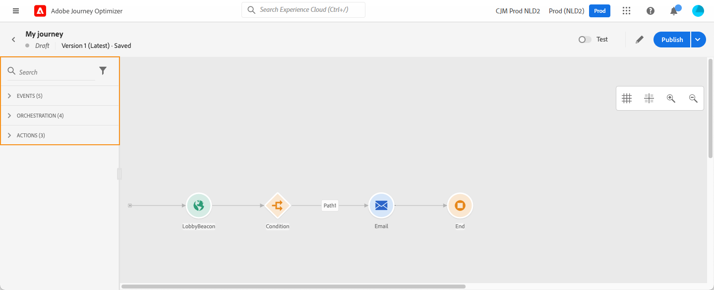

通过左上角的&#x200B;**[!UICONTROL 筛选项]**&#x200B;图标，可显示以下筛选条件：

* **仅显示可用项**：在面板中隐藏或显示不可用的元素，例如使用不同于您的历程中使用的命名空间的事件。 默认情况下，不可用项目处于隐藏状态。 如果选择显示它们，它们将显示为灰色。

* **仅显示最近使用的项目**：此筛选器除开箱即用的事件和操作外，还允许您仅显示最近使用的五个事件和操作。 这具体取决于每个用户。 默认情况下，将显示所有项目。

您还可以使用&#x200B;**[!UICONTROL 搜索]**&#x200B;字段。 仅过滤事件和操作。

**画布**&#x200B;是历程设计器中的中心区域。 您可以在此区域中删除并配置活动。 单击画布中的活动以进行配置。 这将打开右侧的活动配置窗格。

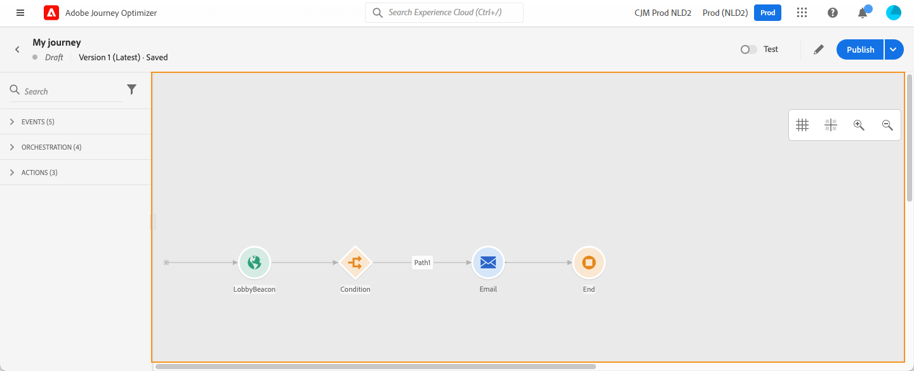

位于画布右上角的&#x200B;**工具栏**&#x200B;允许您显示/隐藏网格、放大/缩小并下载画布的屏幕快照。 请参阅此[部分](../building-journeys/journey-properties.md#timeout_and_error)。

<!--and show/hide timeout and error paths-->

{width="70%"}

>[!NOTE]
>
>如果您使用新的画布体验，请参阅[改用工具栏图标](#use-the-toolbar-icons)。

单击面板中的某个活动时，将显示&#x200B;**活动配置窗格**。 填写必填字段。 单击&#x200B;**[!UICONTROL 删除]**&#x200B;图标以删除该活动。 单击&#x200B;**[!UICONTROL 取消]**&#x200B;以取消修改，或单击&#x200B;**[!UICONTROL 确定]**&#x200B;以确认。 要删除活动，您还可以选择一个（或多个）活动并按Backspace键。 按Esc键将关闭活动配置窗格。

默认情况下，只读字段处于隐藏状态。 要显示只读字段，请单击活动配置窗格左上角的&#x200B;**显示只读字段**&#x200B;图标。 此设置适用于所有历程中的所有活动。

具有“显示只读字段”选项的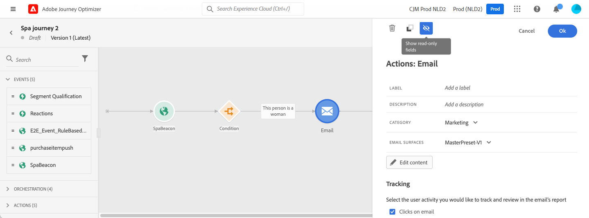

根据历程的状态，您可以使用右上角提供的按钮对历程执行不同的操作： **[!UICONTROL 发布]**、**[!UICONTROL 复制]**、**[!UICONTROL 删除]**、**[!UICONTROL 测试模式]**、**[!UICONTROL 管理访问]**、**[!UICONTROL 警报]**。 如果未选择任何活动，则会显示这些按钮。 某些按钮将会根据上下文显示。 激活测试模式时，将显示测试模式日志按钮。

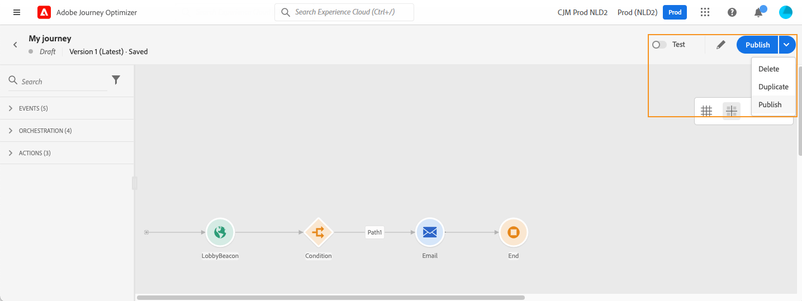

## 新的历程画布体验 {#canvas-capabilities}

**新用户界面**&#x200B;可用于历程画布，该界面构建用于扩展最复杂的用例：

* **性能** — 高效地处理包含多个步骤和分支的大型历程。
* **自动布局** — 自动组织活动以提高可读性。
* **引导式创作** — 提供结构化创作体验，帮助您轻松高效地构建历程。

新创建的历程使用新的画布体验。 对于在此更改之前创建的历程，您可以通过单击历程画布中的&#x200B;**[!UICONTROL 新建体验]**&#x200B;按钮来切换到新体验。 要还原到旧体验，请单击&#x200B;**[!UICONTROL 旧体验]**&#x200B;按钮。

观看此[操作方法视频](#video)，全面了解新画布体验。

### 将活动添加到历程

要将活动添加到画布，请单击两个活动之间的加号(+)图标，然后从列表中选择一个活动以将其添加到旅程。

列表会自动进行筛选，以仅显示可添加到历程中的特定位置的活动，而不是面板中可用的每个活动。 如果要查看每个活动，而不管其位于何处，请单击&#x200B;**[!UICONTROL 筛选项]**&#x200B;图标，并清除&#x200B;**[!UICONTROL 仅显示可用项]**&#x200B;选项。

### 使用工具栏图标

通过画布右上角的工具栏，您可以快速访问基本功能。 使用这些工具可自定义画布视图和管理复杂的历程布局。

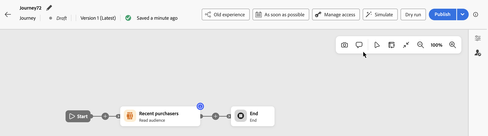

| 工具栏图标 | 描述 |
|--- |--- |
| 下载画布图像 | 将当前画布视图捕获为图像并将其保存在计算机上。 |
| 分享反馈 | 打开反馈表单，告诉我们您是否在新画布上丢失了某些内容，或者您是否想要改善这些内容。 |
| 多选 | 切换到选择模式以选择多个活动。 |
| 旋转 | 更改画布布局的方向。 |
| 适应屏幕 | 自动调整缩放级别以适合您整个历程的视图。 |
| 缩小 | 降低缩放级别。 |
| 放大 | 提高缩放级别。 |

### 为批量操作选择多个活动

您可以一次选择多个活动并对其运行批量操作。

要选择多个活动，请使用以下方法之一：

* **Shift + drag** — 按住&#x200B;**Shift**&#x200B;并在要选择的活动上拖动鼠标。
* **Ctrl/Cmd +单击** — 选择第一个活动，然后按住&#x200B;**Ctrl**（或Mac上的&#x200B;**Command**）并单击其他活动以单独选择它们。
* **工具栏** — 单击工具栏中的&#x200B;**多选**&#x200B;图标，然后单击要选择的每个活动。

选择后，您可以执行以下批量操作：

* **复制** — 复制所有选定活动以在同一历程中使用，或将其粘贴到另一个历程中。
* **删除** — 一次删除所有选定的活动。
* **另存为历程片段** — 将选定的活动转换为可重用的历程片段，以供在其他历程中使用。

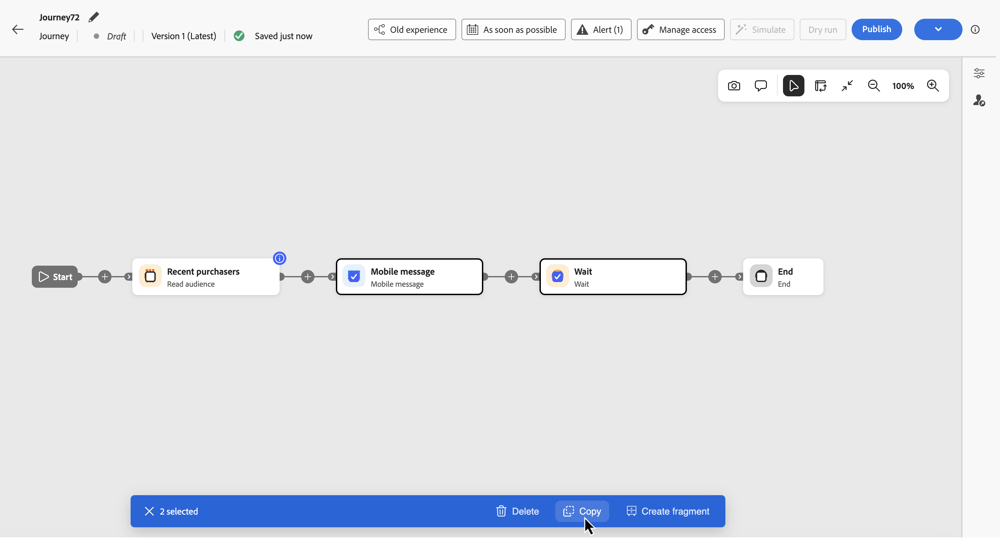

### 复制并粘贴活动

要重用活动或整个历程序列，请执行以下操作：

1. 选择要复制的活动。
1. 选择&#x200B;**复制**&#x200B;或按&#x200B;**Ctrl+C**（或Mac上的Command+C）进行复制。

   

1. 导航到沙盒中的目标历程，可以是同一历程，也可以是其他历程。
1. 单击加号&#x200B;**(+)**&#x200B;图标，然后从下拉列表中选择&#x200B;**[!UICONTROL 粘贴]**。

   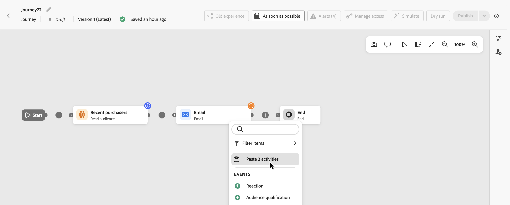

您可以按照活动被复制的相同顺序粘贴活动，这些活动将保持其配置。 有关复制/粘贴约束和最佳实践的更多详细信息，请参阅[复制并粘贴活动](#copy-paste)。

要复制单个活动，请选择该活动，然后单击右侧活动配置窗格中的&#x200B;**[!UICONTROL 复制]**&#x200B;图标，或按&#x200B;**Ctrl+C**（或Mac上的Command+C）进行复制。

要粘贴它，请单击加号&#x200B;**(+)**&#x200B;图标，然后从下拉列表中选择&#x200B;**[!UICONTROL 粘贴]**。

### 连接和分离分支

您可以分离分支以将其与旅程的其余部分断开连接而不将其删除，然后稍后加入以在不同点重新连接它。

要分离分支，请使用以下方法之一：

* 直接单击进入要分离活动的边缘，然后选择&#x200B;**[!UICONTROL 分离边缘]**。

  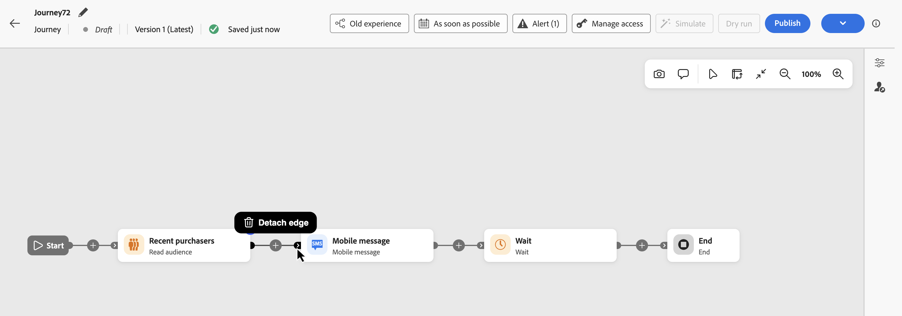

* 单击该边缘上的加号&#x200B;**(+)**&#x200B;图标，然后选择&#x200B;**[!UICONTROL 分离边缘]**。

  

两种方法都会将边缘重新连接到新的&#x200B;**[!UICONTROL End]**&#x200B;活动，将链限制在分离点上方。 不会删除分离的活动及其下游的任何内容。 该分支会成为画布上它自己的断开连接分支，您可以稍后重复使用。

>[!NOTE]
>
>**[!UICONTROL 仅当分离有意义时才会出现“分离边缘”]**。 例如，对于目标为多个分支共享的&#x200B;**[!UICONTROL End]**&#x200B;活动的边缘，此选项不可用。

要加入分支，请在要继续连接的边缘上单击加号&#x200B;**(+)**&#x200B;图标，然后在下拉菜单中打开&#x200B;**[!UICONTROL 加入]**&#x200B;部分。 从那里：

* 从&#x200B;**[!UICONTROL 已断开连接]**&#x200B;列表（尚未在历程中的任何位置连接的分支）或&#x200B;**[!UICONTROL 分支]**&#x200B;列表（已在历程中的其他位置使用的分支）中选择一个分支。 如果您有大量的活动，请使用搜索字段。
* 选择&#x200B;**[!UICONTROL 从画布中选择]**&#x200B;以突出显示画布上所有符合条件的活动，然后单击要连接到的活动。

## 操作方法视频 {#video}

了解如何使用新的历程画布体验。

>[!VIDEO](https://video.tv.adobe.com/v/3496193)

## 开始您的历程 {#start-your-journey}

设计历程时，您想问的第一个问题是用户档案将如何进入历程。

有两种可能性：

1. **从事件开始**：当历程设置为侦听事件时，个人将实时统一进入历程&#x200B;****。 您的历程中包含的消息将发送给当前流入历程的人员。 [了解有关事件的更多信息](../event/about-events.md)
1. **从读取受众开始**：您可以将历程设置为侦听[!DNL Adobe Experience Platform]受众。 在这种情况下，属于指定受众的所有个人都会进入历程。 您的历程中包含的消息将发送给属于受众的个人。 了解有关[阅读受众](read-audience.md)的更多信息。 有关如何在Journey Optimizer中生成和定位受众的详细信息，请参阅[此部分](../audience/about-audiences.md)。

## 定义后续步骤{#define-next-steps}

在第一个事件或读取受众后，您可以组合不同的活动以构建多步骤跨渠道方案。 从面板中选择所需的步骤。

### 活动{#jo-event}

事件是触发个性化历程的原因，例如在线购买。 当某人进入一个旅程时，他们就会作为一个人移动，而没有任何两个人以相同的速度或沿着相同的路径移动。

通过事件开始历程时，会在收到事件时触发历程。 然后，历程中的每个人分别遵循历程中定义的后续步骤。

您可以在历程中添加&#x200B;**多个事件**，只要它们使用相同的命名空间即可。 事件是预先配置的。 [了解有关历程事件的更多信息](about-journey-activities.md#event-activities)

您还可以在消息后添加&#x200B;**反应**&#x200B;事件，以响应与消息相关的跟踪数据。 例如，如果某人打开了前一条消息或单击了前一条消息，则允许您发送另一条消息。 [了解有关反应事件的更多信息](reaction-events.md)。

使用&#x200B;**受众资格**&#x200B;事件活动，使个人根据[!DNL Adobe Experience Platform]受众进入和退出进入历程或在此历程中前进。 您可以让所有新的白银客户进入历程并发送个性化消息。 在此[部分](audience-qualification-events.md)中了解详情。

### 编排{#jo-orch}

编排活动是不同的条件，可帮助确定历程的下一步骤。

在编排活动中，使用&#x200B;**读取受众**&#x200B;活动设置您的历程以监听[!DNL Adobe Experience Platform]受众。 [了解有关读取受众活动的更多信息](read-audience.md)。

使用&#x200B;**历程片段**&#x200B;将可重用的预建旅程节点集直接插入画布。 片段通过避免从头开始重建相同的逻辑（例如资格检查、渠道路由或欢迎序列）来帮助团队保持一致并更快地移动。 [了解有关历程片段的更多信息](journey-fragments.md)。

其他活动允许您向历程添加条件以定义多个路径，在执行下一个活动之前设置等待时间，或结束历程。 [了解有关编排活动的更多信息](about-journey-activities.md#orchestration-activities)。

### 操作{#jo-actions}

操作是指您希望由于某种类型的触发而发生的操作，例如发送消息。 这是客户体验的历程。 这可以是电子邮件、短信或推送消息，也可以是第三方操作，如Slack消息。

渠道操作活动允许您包含在[!DNL Journey Optimizer]中设计的消息。 [了解有关渠道操作活动的更多信息](journey-action.md)

在操作活动中，使用自定义操作通过第三方系统发送消息。 [了解有关自定义操作的更多信息](about-journey-activities.md#action-activities)。

## 添加替代路径 {#paths}

您可以为以下历程活动定义在出错或超时时的回退操作： **[!UICONTROL 条件]**&#x200B;和&#x200B;**[!UICONTROL 操作]**。

要为活动添加回退操作，请在活动属性中选择&#x200B;**[!UICONTROL 在超时或错误的情况下添加替代路径]**&#x200B;框：在活动之后添加其他路径。 超时持续时间由管理员用户在[历程属性](../building-journeys/journey-properties.md)中定义。 例如，如果电子邮件发送时间过长或出错，您可以决定发送推送通知。

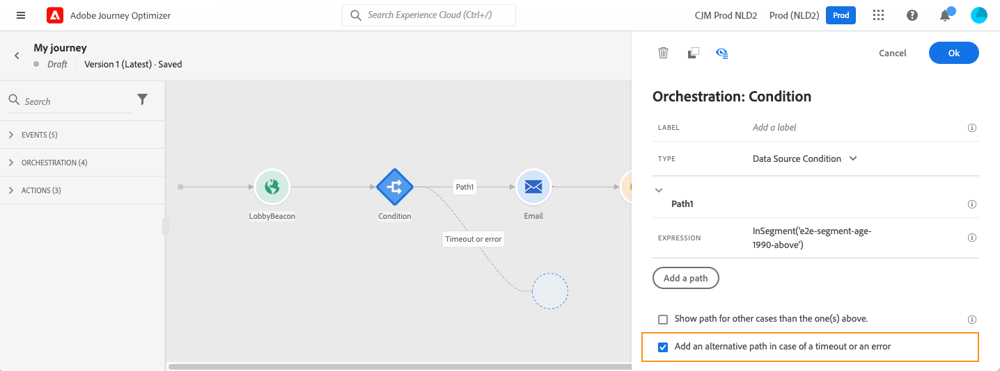

利用各种活动（事件、操作、等待），可在活动之后添加多个路径。 为此，请将光标放在活动上并单击“+”符号。 只有事件和等待活动可以并行设置。 如果并行设置多个事件，则选择的路径将是第一个发生的事件之一。

在侦听事件时，我们建议您不要无限期地等待该事件。 这不是强制性的，只是最佳做法。 如果只想在特定时间内侦听一个或多个事件，则可以并行放置一个或多个事件和等待活动。 请参阅[此小节](../building-journeys/general-events.md#events-specific-time)。

要删除路径，请将光标放在路径上并单击&#x200B;**[!UICONTROL 删除路径]**&#x200B;图标。

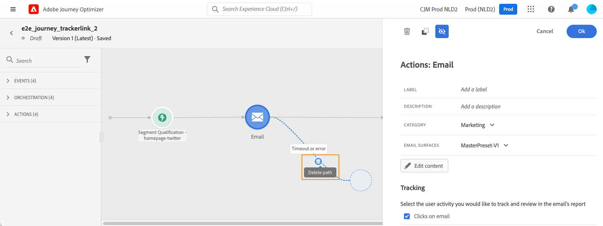

在画布中，当两个活动断开连接时，会显示警告。 将光标放在警告图标上以显示错误消息。 要解决此问题，只需移动断开连接的活动，并将其连接到上一个活动即可。

>[!NOTE]
>
>如果您使用新的画布体验，请改为参阅[加入和分离分支](#join-and-detach-branches)。

## 复制并粘贴活动 {#copy-paste}

您可以复制历程的一个或多个活动，并将其粘贴到同一历程或其他历程中。 如果您希望重用之前历程中已配置的多个活动，这可以节省时间。

**重要备注**

* 您可以在不同选项卡和浏览器之间复制/粘贴。 您只能复制/粘贴同一实例中的活动。
* 如果目标历程具有使用其他命名空间的事件，则无法复制/粘贴事件。
* 粘贴的活动可能引用目标历程中不存在的数据，例如，如果您在不同沙盒之间复制/粘贴。 始终检查错误并进行所需的调整。
* 请注意，无法撤消操作。 要删除粘贴的活动，您需要选择并删除它们。 因此，在复制活动之前，请确保仅选择所需的活动。
* 您可以从任何历程中复制活动，甚至可以复制处于只读状态的活动。
* 您可以选择任何活动，甚至是未链接的活动。 链接的活动在粘贴后将保持链接。

以下是复制/粘贴活动的步骤：

>[!NOTE]
>
>如果您使用新的画布体验，请改为参阅[复制并粘贴活动](#copy-and-paste-activities)。

1. 打开历程。
1. 单击时移动鼠标，选择要复制的活动。 在按&#x200B;**Ctrl/Command**&#x200B;键时，您还可以单击每个活动。 如果要选择所有活动，请使用&#x200B;**Ctrl/Command + A**。
   
1. 按&#x200B;**Ctrl/Command + C**。
如果只想复制一个活动，可以单击该活动并使用活动配置窗格左上角的**复制**图标。
   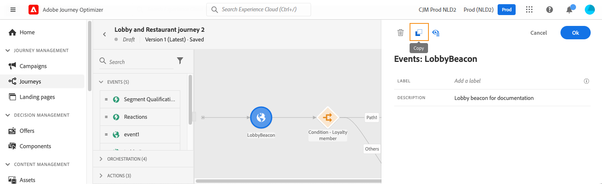
1. 在任何历程中，按&#x200B;**Ctrl/Command + V**&#x200B;粘贴活动而不将其链接到现有节点。 粘贴的活动将按相同顺序放置。 粘贴后，活动将保持选中状态，以便您轻松移动活动。 您还可以将光标放在空的占位符上并点击&#x200B;**Ctrl/Command + V**。粘贴的活动将链接到节点。
   

{{$include /help/_includes/do-not-localize/building-journeys/ai-augmented-using-the-journey-designer.md}}
