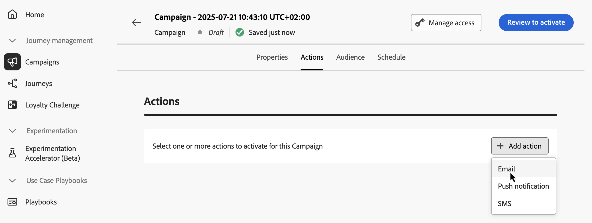

# 配置API触发的活动操作 {#api-action}

使用&#x200B;**[!UICONTROL 操作]**&#x200B;选项卡为您的消息选择渠道配置并配置其他设置，如跟踪、内容试验或多语言内容。

1. **选择频道**。

   导航到&#x200B;**[!UICONTROL 操作]**&#x200B;选项卡，单击&#x200B;**[!UICONTROL 添加操作]**&#x200B;按钮并选择通信渠道。

   

   >[!NOTE]
   >
   >有关支持的渠道的更多信息，请参阅本节中的表：[历程和营销活动中的渠道](../channels/gs-channels.md#channels)。 可用渠道因您的许可模式和附加组件而异。
   >
   >高吞吐量API触发的营销活动当前仅支持电子邮件渠道。

1. **选择渠道配置**

   配置由[系统管理员](../start/path/administrator.md)定义。 它包含用于发送消息的所有技术参数，如标头参数、子域、移动应用程序等。[了解如何设置渠道配置](../configuration/channel-surfaces.md)

   

1. **利用优化**

   使用&#x200B;**[!UICONTROL 消息优化]**&#x200B;部分运行内容实验、利用定位规则，或使用实验和定位的高级组合。 本节详细介绍了这些不同的选项以及要遵循的步骤：[促销活动中的优化](../content-management/gs-message-optimization.md)。
<!--
1. **Create a content experiment**

    Use the **[!UICONTROL Content experiment]** section to define multiple delivery treatments in order to measure which one performs best for your target audience. Click the **[!UICONTROL Create experiment]** button then follow the steps detailed in this section: [Create a content experiment](../content-management/content-experiment.md).
-->

1. **添加多语言内容**

   使用&#x200B;**[!UICONTROL 语言]**&#x200B;部分，在营销活动中创建多种语言内容。 要进行此操作，请单击&#x200B;**[!UICONTROL 添加语言]**&#x200B;按钮，然后选择所需的&#x200B;**[!UICONTROL 语言设置]**。 有关如何设置和使用多语言功能的详细信息，请参阅此部分：[多语言内容快速入门](../content-management/multilingual-gs.md)

根据所选通信渠道，可以使用其他设置。 展开以下部分以获取更多信息。

+++**应用上限规则**（电子邮件、推送、短信）

在&#x200B;**[!UICONTROL 业务规则]**&#x200B;下拉列表中，选择一个规则集以将上限规则应用于营销活动。 利用渠道规则集，可设置按通信类型划分的频率封顶，以防止消息类似的客户超载。 [了解如何使用规则集](../conflict-prioritization/rule-sets.md)

+++

+++**跟踪参与情况**（电子邮件、短信）。

使用&#x200B;**[!UICONTROL 操作跟踪]**&#x200B;部分，跟踪收件人对电子邮件或短信投放的反应。 执行营销活动后，即可从营销活动报告获取跟踪结果。 [了解关于营销活动报告的更多信息](../reports/campaign-global-report-cja.md)

+++

+++**启用快速传递模式** （推送）。

快速投放模式是一个 [!DNL Journey Optimizer] 附加组件，允许通过营销活动以非常快的速度发送大量推送消息。 如果消息投放延迟对业务有重大影响，并且您想要在手机上发送紧急推送警报（例如，向已安装新闻频道应用程序的用户发送突发新闻），可使用快速投放。 了解如何在此页面](../push/create-push.md#rapid-delivery)上为推送通知[启用快速传递模式。

有关使用快速投放模式时的性能的详细信息，请参阅 [Adobe Journey Optimizer 产品说明](https://helpx.adobe.com/cn/legal/product-descriptions/adobe-journey-optimizer.html){target="_blank"}。

+++

## 后续步骤 {#next}

准备好营销活动配置和内容后，即可设计其内容。 [了解详情](api-triggered-campaign-content.md)
