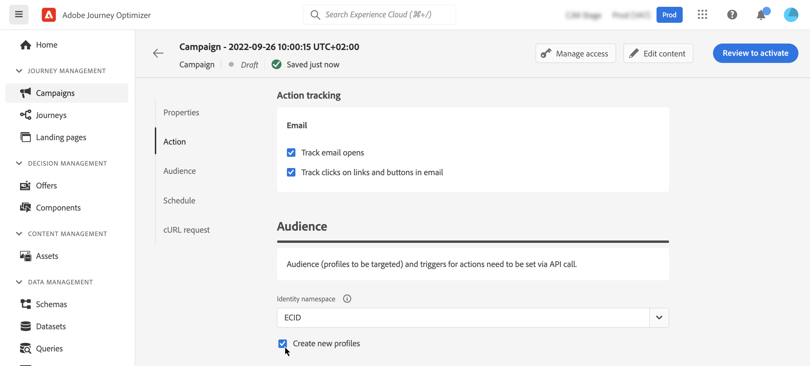

# 定义API触发的营销活动受众 {#api-audience}

>[!BEGINSHADEBOX]

**在此页面上：**&#x200B;定义受众、身份类型、自动配置文件创建和Webhook，以便您的API触发的活动能够联系到正确的个人并返回实时投放状态。

>[!ENDSHADEBOX]

使用&#x200B;**[!UICONTROL 受众]**&#x200B;选项卡定义营销活动受众。

## 选择受众

**对于营销API触发的营销活动**，单击&#x200B;**[!UICONTROL 选择受众]**&#x200B;按钮以显示可用Adobe Experience Platform受众列表。 [了解有关受众的详细信息](../audience/about-audiences.md)。

>[!IMPORTANT]
>
>来自[受众合成](../audience/get-started-audience-orchestration.md)的受众和属性当前不可用于Healthcare Shield或Privacy and Security Shield。

**对于事务性API触发的营销活动**，需要在API调用中定义目标用户档案。 单个API调用最多支持20个唯一收件人。 每个收件人必须具有唯一的用户ID，不允许存在重复的用户ID。 请参阅[交互式消息执行API文档](https://developer.adobe.com/journey-optimizer-apis/references/messaging#operation/postIMUnitaryMessageExecution){target="_blank"}以了解详情

## 选择身份标识类型

在&#x200B;**[!UICONTROL 标识类型]**&#x200B;字段中，选择要用于标识选定受众中个人的密钥类型。 您可以使用现有的身份类型，也可以使用Adobe Experience Platform Identity服务创建新身份类型。 [此页面](https://experienceleague.adobe.com/en/docs/experience-platform/identity/features/namespaces#standard){target="_blank"}上列出了标准身份命名空间。

每个营销活动只允许一个标识类型。 如果属于区段的个人在不同的身份中没有选定的身份类型，则无法将该群体作为目标。 在[Adobe Experience Platform文档](https://experienceleague.adobe.com/docs/experience-platform/identity/home.html?lang=zh-Hans){target="_blank"}中了解有关身份类型和命名空间的更多信息。

## 在活动执行时激活用户档案创建

在某些情况下，您可能需要将事务型消息发送到系统中不存在的用户档案。 例如，如果未知用户尝试在您的网站上重置密码。 当数据库中不存在某个用户档案时，可使用Journey Optimizer在执行活动时自动创建该用户档案，以允许将消息发送到此用户档案。

要在营销活动执行时激活配置文件创建，请启用&#x200B;**[!UICONTROL 创建新配置文件]**&#x200B;选项。 如果禁用此选项，则任何发送都将拒绝未知配置文件，并且API调用将失败。

>[!IMPORTANT]
>
>此选项用于在大容量事务性发送用例中创建&#x200B;**小容量配置文件**，其中大量的配置文件已存在于平台中。
>
>在&#x200B;**AJO交互式消息传递配置文件数据集**&#x200B;数据集中，为每个出站渠道（电子邮件、短信和推送）分别在三个默认命名空间（电子邮件、电话和ECID）中创建未知配置文件。 但是，如果您使用自定义命名空间，则会使用相同的自定义命名空间创建身份。
>
>在执行时无法为[高吞吐量营销活动](../campaigns/api-triggered-high-throughput.md)创建配置文件，因为此模式不依赖于Adobe配置文件。 系统将不检查配置文件是否存在。

## 启用 Webhook {#webhook}

对于事务性API触发的营销活动，可启用Webhook以接收有关消息执行状态的实时反馈。 为此，请切换&#x200B;**[!UICONTROL 启用webhook]**&#x200B;选项以将投放状态事件发送到配置的webhook。

Webhook配置在&#x200B;**[!UICONTROL 管理]** / **[!UICONTROL 渠道]** / **[!UICONTROL 反馈Webhook]**&#x200B;菜单中集中管理。 从该位置，管理员可以创建和编辑webhook端点。 [了解如何创建反馈Webhook](../configuration/feedback-webhooks.md)

## 后续步骤 {#next}

准备好营销活动配置和内容后，即可计划其执行。 [了解详情](api-triggered-campaign-schedule.md)
