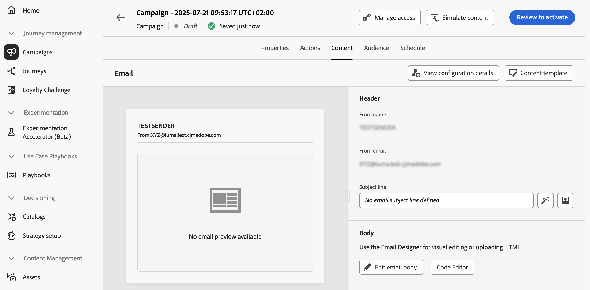

# 编辑API触发的营销活动内容 {#api-content}

要配置消息内容，请导航到&#x200B;**[!UICONTROL 内容]**&#x200B;选项卡或单击&#x200B;**[!UICONTROL 编辑内容]**&#x200B;按钮。

## 设计内容 {#design}

内容创建过程取决于您选择的渠道。 在以下页面中了解创建消息内容的详细步骤：

<table style="table-layout:fixed"><tr style="border: 0;">
<td>

<a href="../email/create-email.md"><strong>电子邮件</strong></a>
</td>
<td>

<a href="../sms/create-sms.md"><strong>短信</strong></a>
</td>
<td>

<a href="../push/create-push.md"><strong>推送通知</strong></a>
</td>
</tr></table>

## 使用上下文数据个性化内容 {#contextual}

您可以将其他数据传递到API有效负荷，以利用这些数据将消息个性化。

让我们举一个例子，客户希望重置密码，而您希望向他们发送一个在第三方工具中生成的密码重置URL。 借助API触发的营销活动，您可以将此生成的URL传递到API有效负荷中，并将其用于营销活动以将其添加到消息中。

为此，您需要将它们传递到API有效负荷，并使用个性化编辑器将它们添加到消息中。 使用`{{context.<contextualAttribute>}}`语法，其中`<contextualAttribute>`应与包含要传递的数据的API有效负载中的变量名称匹配。

请注意，目前没有上下文属性可用于左边栏菜单。 属性必须直接在个性化表达式中键入，[!DNL Journey Optimizer]不执行任何检查。

**必须读取**

* 传递到请求的上下文属性不能超过200kb，并且始终被视为字符串类型。
* `context.system`语法限制为仅供Adobe内部使用，不应用于传递上下文属性。
* 与启用配置文件的事件不同，在REST API中传递的上下文数据用于一次性通信，而不是针对配置文件进行存储。 创建的配置文件最多包含命名空间详细信息（如果发现缺少该配置文件）。
* 在内容中使用大量或繁重的上下文数据可能会影响性能。

## 测试和检查您的内容

定义内容后，使用&#x200B;**[!UICONTROL 模拟内容]**&#x200B;按钮，使用从CSV/JSON文件上传或手动添加的测试配置文件或示例输入数据预览和测试内容。 [了解如何预览和测试内容](../content-management/preview-test.md)。 要浏览回促销活动创建屏幕，请单击向左箭头。

## 后续步骤 {#next}

准备好营销活动配置和内容后，即可定义营销活动受众。 [了解详情](api-triggered-campaign-audience.md)
