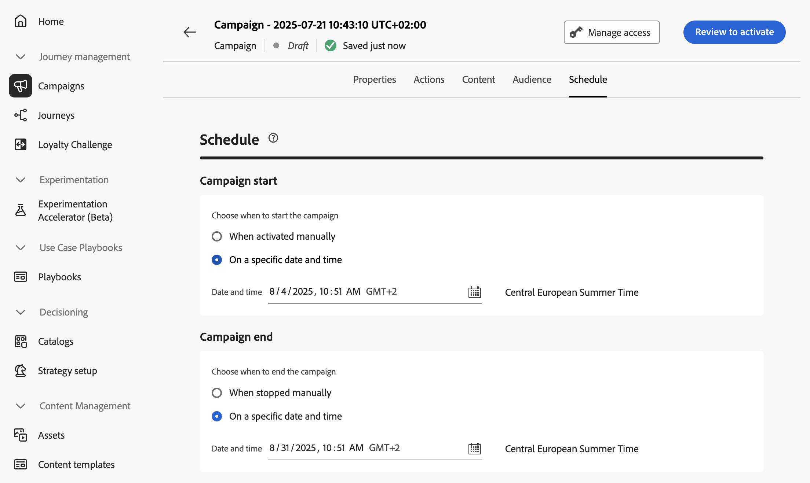

# 计划API触发的营销活动 {#api-schedule}

使用&#x200B;**[!UICONTROL 计划]**&#x200B;选项卡定义营销活动计划。

默认情况下，API触发的营销活动在触发后立即开始，在发送消息后立即结束。 如果不想在营销活动触发后立即执行，则可以使用&#x200B;**[!UICONTROL 营销活动开始]**&#x200B;选项指定发送消息的日期和时间。

利用&#x200B;**[!UICONTROL 营销活动结束]**&#x200B;选项，可指定何时应停止执行营销活动。 在指定的日期之外，将不会执行营销活动。

>[!NOTE]
>
>在[!DNL Adobe Journey Optimizer]中计划营销活动时，请确保您的开始日期/时间与所需的首次投放一致。

## 后续步骤 {#next}

准备好营销活动配置和内容后，即可对其进行查看和激活。 [了解详情](review-activate-campaign.md)
