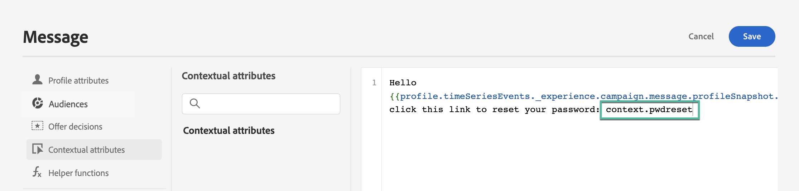

# 使用API触发营销活动 {#trigger-campaigns}

## 关于API触发的营销活动 {#about}

使用 [!DNL Journey Optimizer]，您可以创建营销活动，然后使用根据用户触发器从外部系统调用它们 [交互式消息执行REST API](https://developer.adobe.com/journey-optimizer-apis/references/messaging/#tag/execution). 这允许您满足各种操作和事务性消息传递需求，如密码重置、OTP令牌等。

为此，您首先需要在Journey Optimizer中创建由API触发的营销活动，然后通过API调用启动其执行。

API触发的营销活动的可用渠道有电子邮件、短信和推送消息。

>[!NOTE]
>
>交互式消息执行API目前处于测试阶段，可能会频繁更新，恕不另行通知。

## 创建API触发的营销活动 {#create}

创建API触发的营销活动的过程与计划的营销活动相同，但受众选择除外，受众选择在API有效负载中执行。 有关如何创建营销活动的详细信息，请参阅 [此部分](create-campaign.md).

要创建API触发的营销活动，请执行以下步骤：

1. 使用 **[!UICONTROL API-triggered]** 类型。

1. 选择要用于发送消息的渠道和消息界面，然后单击 **[!UICONTROL Create]**.

   

1. 为营销活动指定标题和描述，然后配置要发送的消息。

   

   >[!NOTE]
   >
   >您可以将其他数据传递到API有效负载中，以便将其用于个性化您的消息。 [了解详情](#contextual)

1. 指定用于识别区段中个人的命名空间。

1. 配置营销活动的开始和结束日期。

   如果为营销活动配置特定的开始和/或结束日期，则不会在这些日期之外执行该日期，而且如果营销活动由API触发，则API调用将失败。

1. 在 **[!UICONTROL cURL request]** 检索 **[!UICONTROL Campaign ID]** 以在API有效负载中使用。

   

1. 单击 **[!UICONTROL Review to activate]** 要检查营销活动配置是否正确，请将其激活。

## 在API触发的营销活动中使用上下文属性 {#contextual}

借助API触发的营销活动，您可以在API有效负载中传递其他数据，并在营销活动中使用这些数据来个性化您的消息。

让我们举一个示例，其中客户希望重置其密码，而您希望向他们发送在第三方工具中生成的密码重置URL。 通过API触发的营销活动，您可以将此生成的URL传递到API有效负载中，并利用它进入营销活动，将其添加到消息中。

>[!NOTE]
>
>与启用用户档案的事件不同，在REST API中传递的上下文数据用于一次性通信，而不是存储在用户档案中。 如果发现缺少配置文件，则最大会创建包含命名空间详细信息的配置文件。

要在营销活动中使用这些数据，您需要将它们传递到API有效负载中，然后使用表达式编辑器将它们添加到消息中。 为此，请使用 `{{context.<contextualAttribute>}}` 语法，其中 `<contextualAttribute>` 应与API有效负载中包含要传递的数据的变量名称匹配。

的 `{{context.<contextualAttribute>}}` 语法仅映射到字符串数据类型。

>[!IMPORTANT]
>
>的 `context.system` 语法仅限于Adobe内部用法，不应用于传递上下文属性。
请注意，目前没有上下文属性可用于左边栏菜单。 必须在个性化表达式中直接键入属性，且不会执行任何检查 [!DNL Journey Optimizer].

## 执行营销活动 {#execute}

要执行API触发的营销活动，您首先需要检索其ID，并将其传递到API有效负载中。 为此，请打开营销活动，然后复制并粘贴 **[!UICONTROL cURL request]** 中。

然后，您可以将此ID用于API有效负载中以触发营销活动。 请参阅 [交互式消息执行API文档](https://developer.adobe.com/journey-optimizer-apis/references/messaging/#tag/execution) 以了解更多信息。

>[!NOTE]
>
>如果您在创建营销活动时配置了特定的开始和/或结束日期，则不会在这些日期之外执行该日期，API调用将失败。

## 其他资源

* [营销活动入门](get-started-with-campaigns.md)
* [创建营销活动](create-campaign.md)
* [修改或停止营销活动](modify-stop-campaign.md)
* [营销活动实时报告](campaign-live-report.md)
* [营销活动全局报告](campaign-global-report.md)
