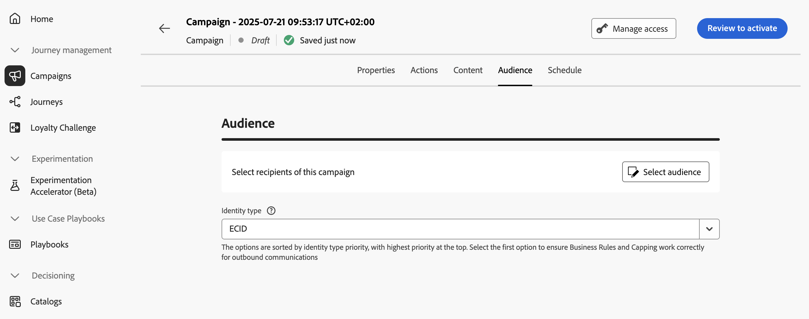

# 定义操作活动受众 {#action-campaign-audience}

使用&#x200B;**[!UICONTROL 受众]**&#x200B;选项卡定义营销活动受众。

1. **选择受众**

   对于营销活动，单击&#x200B;**[!UICONTROL 选择受众]**&#x200B;按钮以显示可用Adobe Experience Platform受众列表。 [了解有关受众的详细信息](../audience/about-audiences.md)。

   >[!IMPORTANT]
   >
   >来自[受众合成](../audience/get-started-audience-orchestration.md)的受众和属性当前不可用于Healthcare Shield或Privacy and Security Shield。

1. **选择身份类型**

   在&#x200B;**[!UICONTROL 标识类型]**&#x200B;字段中，选择要用于标识选定受众中个人的密钥类型。 您可以使用现有的身份类型，也可以使用Adobe Experience Platform Identity服务创建新身份类型。 [此页面](https://experienceleague.adobe.com/zh-hans/docs/experience-platform/identity/features/namespaces#standard){target="_blank"}上列出了标准身份命名空间。

   每个营销活动只允许一个标识类型。 如果属于区段的个人在不同的身份中没有选定的身份类型，则无法将该群体作为目标。 在[Adobe Experience Platform文档](https://experienceleague.adobe.com/docs/experience-platform/identity/home.html?lang=zh-Hans){target="_blank"}中了解有关身份类型和命名空间的更多信息。

## 后续步骤 {#next}

一旦操作活动的受众准备就绪，您就可以计划该活动。 [了解详情](campaign-schedule.md)
