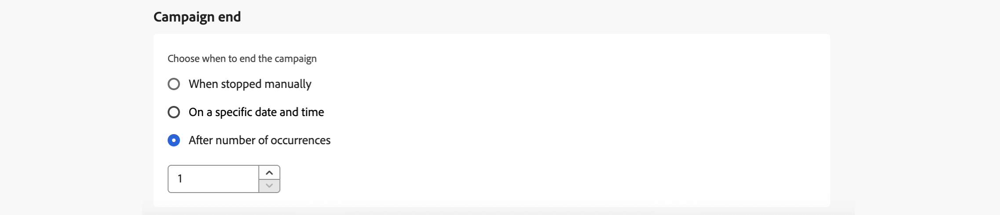

# 计划行动营销活动 {#action-campaign-schedule}

使用&#x200B;**[!UICONTROL 计划]**&#x200B;选项卡定义营销活动计划。

## 设置营销活动开始日期

默认情况下，手动激活营销活动后，营销活动便会开始，而发送一次消息后，营销活动便会结束。 如果不想在营销活动激活后立即执行营销活动，则可以在&#x200B;**[!UICONTROL 营销活动开始]**&#x200B;部分中指定发送消息的日期和时间。

在 [!DNL Adobe Journey Optimizer] 中计划营销活动时，请确保开始日期/时间与所需的首次投放时间一致。对于定期营销活动，如果计划的首次时间已过，则营销活动将根据定期规则滚动到下一个可用时间段。

## 按收件人的当地时间发送 {#profile-timezone}

>[!CONTEXTUALHELP]
>id="ajo_campaigns_schedule_profile_timezone"
>title="使用用户档案时区"
>abstract="根据每个收件人的用户档案时区发送消息。 所有收件人都将在本地同一时间收到消息，无论其地理位置如何。 系统使用Adobe Experience Platform用户档案中的“时区”字段，活动创建者的时区作为后备。"

在计划特定日期和时间的营销活动时，您可以选择根据每个收件人的用户档案时区发送消息。 这可确保所有收件人无论其地理位置如何，都能在同一本地时间收到消息。

例如，如果您计划使用用户档案时区在早上9点发送活动，则纽约州(ET)的收件人将在东部时间早上9点收到该信息，而洛杉矶州(PT)的收件人将在太平洋时间早上9点收到该信息。

>[!AVAILABILITY]
>
>使用配置文件时区进行计划仅适用于以下出站渠道：电子邮件、推送、短信、WhatsApp和LINE。

要启用用户档案时区计划，请执行以下操作：

1. 在&#x200B;**[!UICONTROL 营销活动开始]**&#x200B;部分，指定发送消息的日期和时间。

1. 启用&#x200B;**[!UICONTROL 使用配置文件时区]**&#x200B;选项。

   

**工作方式：**

系统使用每个收件人Adobe Experience Platform配置文件中的`profile.timeZone`字段来确定其本地时区。 如果用户档案没有时区值，则系统将使用创建营销活动时所在的时区作为回退。

在所有时区之间投放消息时，营销活动仍处于&#x200B;**实时**&#x200B;状态。 处理完所有时区后，营销活动状态将更改为&#x200B;**已完成**。

**支持的时区标识符：**

`profile.timeZone`格式可以是IANA命名或定义为UTC偏移。 IANA命名是首选格式，因为它会自动针对夏令时规则进行调整。

对于IANA命名，标识符区分大小写，并且必须与官方的IANA命名匹配。 由于夏令时规则和历史更新，偏移可能会随着时间的推移而发生变化。 有关标识符的官方列表，请参阅[IANA时区数据库](https://www.iana.org/time-zones){_blank}。

## 设置执行频率

对于&#x200B;**电子邮件**、**短信**&#x200B;和&#x200B;**推送通知**&#x200B;操作，您可以定义发送营销活动消息的频率。 为此，请在营销活动创建屏幕中使用&#x200B;**[!UICONTROL 操作触发器]**&#x200B;选项来指定是否应每天、每周或每月执行营销活动。

>[!NOTE]
>
>对于&#x200B;**电子邮件**&#x200B;操作，您可以创建特定的IP预热计划激活活动。 营销活动计划将由与之关联的IP预热计划驱动，这意味着不再在营销活动本身中定义计划。 [了解如何创建IP预热营销活动](../configuration/ip-warmup-campaign.md)。

## 设置结束日期

**[!UICONTROL 营销活动结束]**&#x200B;部分允许您指定何时应停止执行营销活动。 在指定的日期之外，将不会执行营销活动。

## 设置速率控制

[!DNL Journey Optimizer]允许您为出站操作（电子邮件、短信、推送通知）启用速率控制。

此功能对于防止下游系统（如登陆页面或客户关怀平台）上的过载特别有用。 例如，您可以将速率限制设置为每秒165条消息，以确保平稳投放而不会淹没下游系统。

要设置速率控制，请在&#x200B;**[!UICONTROL 投放设置]**&#x200B;部分中启用&#x200B;**[!UICONTROL 节流投放]**&#x200B;选项，并指定所需的&#x200B;**[!UICONTROL 每秒投放速率]**。

* 支持的最低投放率：每秒1个。
* 支持的最大投放率：启用“限制投放”选项时，每秒投放2000次。

>[!IMPORTANT]
>
>设置投放率时，活动受众可以执行的最长时间范围为12小时。 如果投放率设置为不允许在12小时时间范围内发送消息的所有受众的值，则剩余的用户档案将从营销活动中排除。 您可以在营销活动报告中查看这些排除的用户档案的计数。

## 按波次发送

要在一段时间内批量投放营销活动消息，而不是一次投放所有营销活动消息，您可以使用波动发送。 这有助于平衡负载、支持可投放性，并避免压倒性的下游系统（例如，呼叫中心或登陆页面）。 您可以定义波次数、波次大小（按百分比或绝对数）以及每个波次的计划。

[了解如何使用批次](send-using-waves.md)发送。

## 后续步骤 {#next}

活动计划就绪后，您可以查看和激活该活动。 [了解详情](review-activate-campaign.md)
