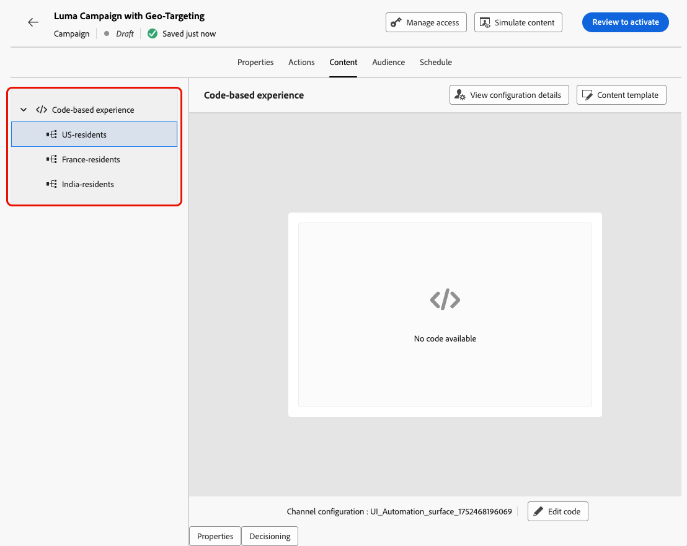

# 优化活动和历程 {#message-optimization}

优化功能可为您提供多种工具，让您能够为受众提供个性化和优化的内容，<!--based on marketer-defined advanced decision configurations. This ensures that the right message reaches the right audience at the right time in order to maximize the effectiveness of your campaigns. (Removed for now as Decisioning is not yet supported)-->确保最大程度的参与和成功以创建高度<!--customized and -->有效的历程和营销活动。

通过优化，您可以：

* 利用[定位](#targeting)规则
* 运行[内容实验](#experimentation)
* 在单个营销活动中同时使用实验和定位的[高级组合](#combination)

一旦历程或营销策划上线，将按照定义的标准并根据匹配标准评估用户档案，用户档案将随历程/营销策划中的相应体验或内容一起交付。

实验与定位的区别大致如下：

* 试验包括基于流量分配交付内容时的随机拆分&#x200B;。
* 定位使用确定性技术根据用户个人资料、受众成员资格或基于上下文的规则交付内容。

{width="110%" zoomable="yes"}

➡️ [在此视频中了解有关促销活动优化的详细信息](#video)

## 利用定位 {#targeting}

定位根据用户配置文件属性或上下文属性为特定受众区段提供个性化内容。

与试验（随机分配消息内容）不同，定位是确定性的，可以将内容交付给合适的受众。

通过定位，可以根据以下内容定义特定规则：

* **用户配置文件属性**，如位置(如 地理定位)、年龄或偏好设置。 例如，美国用户看到“金门”促销活动，而法国用户看到“埃菲尔铁塔”促销活动。

* **上下文数据**，如设备类型(如 device-targeting)、时间或会话详细信息。 例如，桌面用户接收桌面优化内容，而移动设备用户接收移动设备优化内容。

* **受众**，可用于包含或排除具有特定受众成员资格的用户档案。

要设置定位，请执行以下步骤。

1. 创建[历程](../building-journeys/journey-gs.md#jo-build)或[营销活动](../campaigns/create-campaign.md)。

   >[!NOTE]
   >
   >如果您在历程中，请添加&#x200B;**[!UICONTROL 操作]**&#x200B;活动，选择一个渠道活动，然后选择&#x200B;**[!UICONTROL 配置操作]**。 [了解详情](../building-journeys/journey-action.md#add-action)

1. 从&#x200B;**[!UICONTROL 操作]**&#x200B;选项卡中，至少选择一个操作。

1. 在&#x200B;**[!UICONTROL 优化]**&#x200B;部分中，选择&#x200B;**[!UICONTROL 创建定位规则]**。

   {width=85%}

1. 使用规则生成器定义您的标准。 例如，为美国居民制定规则，为法国居民制定规则，为印度居民制定规则。

   {width=85%}

1. 根据需要选择&#x200B;**[!UICONTROL 启用后备内容]**。 后备内容允许受众在没有符合定位规则时接收默认内容。

   >[!NOTE]
   >
   >如果不选择此选项，则任何不符合上述定位规则条件的受众都将不会收到内容。

1. 保存定位规则设置。

1. 返回&#x200B;**[!UICONTROL 操作]**&#x200B;选项卡，选择&#x200B;**[!UICONTROL 编辑内容]**。

1. 为定向规则设置所定义的每个组设计适当的内容。

   {width=85%}

   在此示例中，为美国居民设计一个特定内容，为法国居民设计一个不同的内容，并为印度居民设计另一个内容。

1. [激活](review-activate-campaign.md)您的历程或营销活动。

历程/营销活动开始后，将发送为每个目标量身定制的内容，以便美国居民接收特定消息，法国居民接收不同消息，依此类推。

<!--Default content:

* If no targeting rules match, default content can be delivered.

* If default content is not enabled, passthrough behavior ensures lower-priority campaigns are evaluated.-->

## 使用试验 {#experimentation}

通过试验可测试多个内容版本，以确定哪些版本基于预定义的成功量度表现最佳。

要设置试验，请执行以下步骤。

假设您想在营销活动中测试以下促销消息：

* **待遇A**：“下次购买享受20%的优惠”
* **待遇B**：“超过$50美元的订单免运费”
* **待遇C**：“获取10美元的礼品卡”

要设置实验并确定哪些消息可带来最多的购买，请执行以下步骤。

1. 创建[历程](../building-journeys/journey-gs.md#jo-build)或[营销活动](../campaigns/create-campaign.md)。

   >[!NOTE]
   >
   >如果您在历程中，请添加&#x200B;**[!UICONTROL 操作]**&#x200B;活动，选择一个渠道活动，然后选择&#x200B;**[!UICONTROL 配置操作]**。 [了解详情](../building-journeys/journey-action.md#add-action)

1. 从&#x200B;**[!UICONTROL 操作]**&#x200B;选项卡中，选择两个入站操作，例如[基于代码的体验](../code-based/get-started-code-based.md)和[应用程序内体验](../../rp_landing_pages/in-app-landing-page.md)。

1. 在&#x200B;**[!UICONTROL 优化]**&#x200B;部分中，选择&#x200B;**[!UICONTROL 创建试验]**。

   {width=85%}

1. 根据需要设计和配置内容试验。 [了解如何操作](../content-management/content-experiment.md)

   {width=85%}

   定义试验后，该试验将应用于在该营销活动中或通过历程&#x200B;**[!UICONTROL 操作]**&#x200B;活动插入的所有操作，这意味着相同的客户可以在所有表面看到相同的选件。

   >[!NOTE]
   >
   >您可以选择其他操作：试验适用于添加到活动或历程操作的所有操作。

1. [激活](review-activate-campaign.md)您的历程或营销活动。

历程/营销活动上线后，将随机为用户分配不同的内容变体。 [!DNL Journey Optimizer]跟踪哪些变体可推动更多购买，并提供可操作的见解。

使用[历程](../reports/journey-global-report-cja.md)和[营销活动](../reports/campaign-global-report-cja-experimentation.md)报告关注营销活动成功与否。<!--Link to Experimentation journey reportis missing-->

## 将定位与试验相结合 {#combination}

Journey Optimizer还允许您在单个历程或营销策划中组合使用定位和实验，以创建更复杂的策略。

事实上，您可以使用定位创建多个变体，并为每个变体使用试验进一步优化每个内容。 这可确保试验特定于每个定位规则，且不会跨越变体。

例如，您可以针对美国客户测试“促销活动50%折扣”与“礼品卡50美元”，针对欧洲客户运行其他测试，例如“超过50欧元的订单免运费”与“下次购买时折扣20%”。

要在历程或营销活动中同时使用定位和实验功能，请执行以下步骤。

1. 创建可在其中定义多个定位规则的历程或营销策划。 [了解如何操作](#targeting)

   {width=85%}

1. 为第一个定位规则创建试验。

1. 根据需要设计和配置内容试验。 [了解如何操作](../content-management/content-experiment.md)

   {width=85%}

   定义试验后，该试验仅适用于第一个定位规则。

1. 返回&#x200B;**[!UICONTROL 操作]**&#x200B;选项卡，选择&#x200B;**[!UICONTROL 编辑内容]**。

1. 对于由第一个定位规则定义的组，您可以为试验的每个变体定义特定内容。

   如果您向历程或营销策划添加了多个集客操作，则相同的定位和试验组合适用于每个操作。 但是，您需要为每个操作的每个变体定义特定的内容。

   {width=85%}

1. 对其他定位规则执行类似操作，并为每个变体设计相应的内容。

1. 保存更改并[激活](review-activate-campaign.md)您的历程或营销活动。

历程/营销活动上线后，会随机将每个目标组中的用户分配给为其所属的组定义的不同内容变体。

<!--
## Reporting on Message optimization

E.g. explaining how a marketer can look at the report to determine which treatment (e.g. which message content) is performing the best for the targeting audience
-->

## 操作说明视频{#video}

了解如何在操作或 API 触发的营销活动中利用消息优化。您将了解如何定位子受众、按位置创建消息变体、启用备用内容以及在单个营销活动中运行多个实验。本教程还介绍如何管理多渠道营销活动，同时保持消息的一致性。

>[!VIDEO](https://video.tv.adobe.com/v/3470368?quality=12)