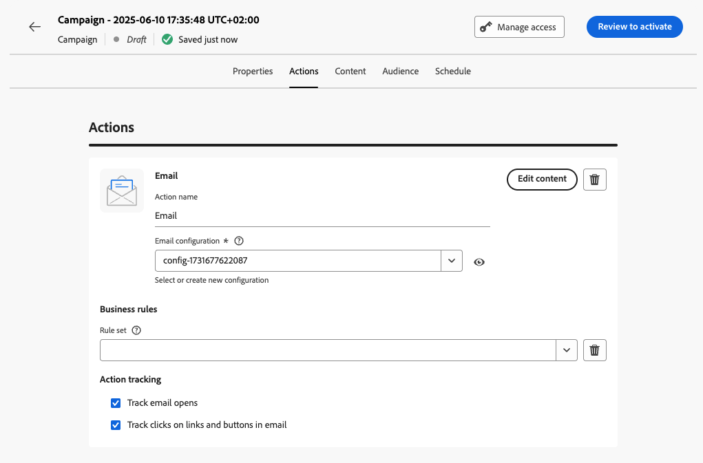

# 创建营销活动 {#create-campaign}

>[!NOTE]
>
>在创建新营销活动之前，请确保您有表面渠道（即消息预设）和Adobe Experience Platform区段可供使用。 请通过以下章节了解更多信息：
>
>* [创建渠道平面](../configuration/channel-surfaces.md)
>* [区段入门](../segment/about-segments.md)

## 创建您的第1个营销活动 {#create}

1. 访问 **[!UICONTROL 促销活动]** 菜单，然后单击 **[!UICONTROL 创建营销活动]**.

   >[!NOTE]
   >
   >您还可以复制现有的实时营销活动以创建新营销活动。 [了解详情](modify-stop-campaign.md#duplicate)

   

1. 在 **[!UICONTROL 属性]** 部分，指定您希望何时执行营销活动：

   * **[!UICONTROL 已计划]**:立即执行营销活动或在指定日期执行营销活动。 计划的营销活动旨在发送 **营销** 键入消息。
   * **[!UICONTROL API触发]**:使用API调用执行营销活动。 API触发的营销活动旨在发送 **事务性** 消息，即在个人执行操作后发出的消息：密码重置、卡放弃等。 [了解如何使用API触发营销活动](api-triggered-campaigns.md)

1. 在 **[!UICONTROL 操作]** 部分，选择用于发送消息的渠道和渠道表面，然后单击 **[!UICONTROL 创建]**.

   平面是由[系统管理员](../start/path/administrator.md)定义的配置。它包含用于发送消息的所有技术参数，如标头参数、子域、移动应用程序等。[了解详情](../configuration/channel-surfaces.md)。

   

   >[!NOTE]
   >
   >下拉列表中只列出与营销活动类型兼容的渠道表面。

1. 指定营销活动的标题和描述。

   <!--To test the content of your message, toggle the **[!UICONTROL Content experiment]** option on. This allows you to test multiple variables of a delivery on populations samples, in order to define which treatment has the biggest impact on the targeted population.[Learn more about content experiment](../campaigns/content-experiment.md).-->

1. 在 **[!UICONTROL 操作]** 部分，配置要与营销活动一起发送的消息：

   1. 单击 **[!UICONTROL 编辑内容]** 按钮，然后配置和设计消息内容。 [了解有关消息的更多信息](../messages/get-started-content.md).

      在以下页面中了解创建消息内容的详细步骤：

      * [创建电子邮件](../messages/create-email.md)
      * [创建推送通知](../messages/create-push.md)
      * [创建短信消息](../messages/create-sms.md)
   1. 定义内容后，使用 **[!UICONTROL 模拟内容]** 按钮来预览和测试使用测试用户档案的内容。 [了解详情](../design/preview.md)。

   1. 单击箭头可返回至营销活动创建屏幕。

      

   1. 在 **[!UICONTROL 操作跟踪]** 部分，指定是否要跟踪收件人对投放的反应：您可以跟踪点击和/或打开次数。

      一旦执行了营销活动，即可从营销活动报表访问跟踪结果。 [进一步了解营销活动报告](../reports/campaign-global-report.md)

1. 定义要定位的受众。 为此，请单击 **[!UICONTROL 选择受众]** 按钮以显示可用的Adobe Experience Platform区段列表。 [了解有关区段的更多信息](../segment/about-segments.md)

   >[!NOTE]
   >
   >对于API触发的营销活动，需要通过API调用来设置受众。 [了解详情](api-triggered-campaigns.md)

   在 **[!UICONTROL 身份命名空间]** 字段中，选择要用于识别选定区段中个人的命名空间。 [了解有关命名空间的更多信息](../event/about-creating.md#select-the-namespace)

   

   >[!NOTE]
   >
   >属于某个客户群的不同身份中没有选定身份（命名空间）的个人将不会被营销活动定位。

   <!--If you are are creating an API-triggered campaign, the **[!UICONTROL cURL request]** section allows you to retrieve the **[!UICONTROL Campaign ID]** to use in the API call. [Learn more](api-triggered-campaigns.md)-->

1. 要在特定日期或定期频率执行营销活动，请配置 **[!UICONTROL 计划]** 中。 [了解如何计划营销活动](#schedule)

1. 要为营销活动分配自定义或核心数据使用标签，请单击 **[!UICONTROL 管理访问权限]** 按钮。 [了解有关对象级别访问控制(OLA)的更多信息](../administration/object-based-access.md)

营销活动准备就绪后，您可以查看并发布它。 [了解详情](#review-activate)

## 计划营销活动 {#schedule}

默认情况下，营销活动在手动激活后即开始，并在消息发送一次后结束。

您可以定义营销活动消息的发送频率。 为此，请使用 **[!UICONTROL 操作触发器]** 营销活动创建屏幕中的选项，以指定应每日、每周还是每月执行营销活动。

如果您不想在营销活动激活后立即执行营销活动，则可以使用指定发送消息的日期和时间 **[!UICONTROL 营销活动开始]** 选项。 的  **[!UICONTROL 营销活动结束]** 选项，可指定应何时停止执行定期营销活动。

## 快速投放模式 {#rapid-delivery}

>[!CONTEXTUALHELP]
>id="ajo_campaigns_rapid_delivery"
>title="快速投放模式"
>abstract="“快速交付”模式是Journey Optimizer的一个加载项，可让您向3000万个用户档案以下的受众快速支付非个性化消息。"

快速交付模式（以前称为历程中的突发模式）是 [!DNL Journey Optimizer] 附加组件，允许通过营销活动以大量量发送非常快速的推送消息。

当消息投放的延迟对业务至关重要时，如果您想在手机上发送紧急推送警报（例如，向已安装您的新闻渠道应用程序的用户发送突发新闻），可使用快速投放。

有关使用快速投放模式时性能的更多信息，请参阅 [Adobe Journey Optimizer产品说明](https://helpx.adobe.com/cn/legal/product-descriptions/adobe-journey-optimizer.html).

### 先决条件 {#prerequisites}

快速投放消息具有以下要求：

* 快速交付适用于 **[!UICONTROL 已计划]** 仅限促销活动，且不适用于API触发的促销活动、
* 推送消息中不允许进行个性化，
* 目标受众必须包含少于3000个用户档案，
* 您最多可以使用快速投放模式同时执行5个营销活动。

### 激活快速投放模式

1. 创建推送通知营销活动并打开 **[!UICONTROL 快速交付]** 选项。

1. 配置消息内容并选择要定位的受众。 [了解如何创建营销活动](#create)

   >[!IMPORTANT]
   >
   >确保消息内容不包含任何个性化，并且受众包含的用户档案少于3000万。

1. 与往常一样，查看并激活您的营销活动。 请注意，在测试模式下，消息不会通过快速投放模式发送。 [了解如何查看和激活营销活动](review-activate-campaign.md)
