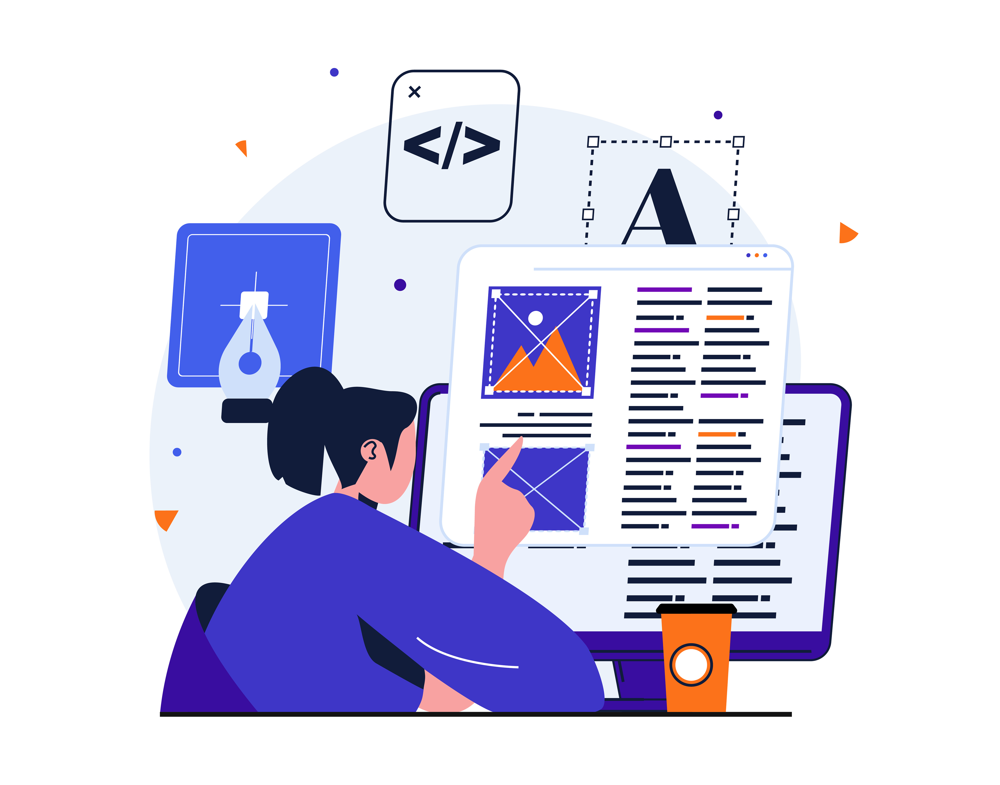

# 创建营销活动 {#create-campaign}

要创建新营销活动，请浏览至左边栏上的&#x200B;**[!UICONTROL 营销活动]**&#x200B;菜单，然后单击&#x200B;**[!UICONTROL 创建营销活动]**。 您还可以复制现有的实时营销活动以创建新营销活动。 [了解如何操作](modify-stop-campaign.md#duplicate)。

开始之前，请在[此页面](get-started-with-campaigns.md#before-starting-campaign-prerequisites)中阅读促销活动先决条件。

## 选择营销活动类型 {#campaigntype}

>[!CONTEXTUALHELP]
>id="ajo_campaigns_campaign_type"
>title="营销活动类型"
>abstract="立即执行或在指定日期执行&#x200B;**计划的营销活动**，其旨在发送市场营销类型的消息。使用 API 调用执行 **API 触发的**&#x200B;活动。它们旨在发送营销性消息（需要用户同意的推广消息）或交易型消息（非商业消息，在特定上下文中，也可以发送到未订阅的轮廓）。"

创建新营销活动时，必须首先选择营销活动的类型。 提供了三种类型的营销活动：

1. **[!UICONTROL 已计划 — 营销]** — 这些营销活动将立即执行或在指定日期执行。 计划的营销活动旨在发送&#x200B;**营销**&#x200B;消息或创建入站操作。 它们从用户界面配置和执行。

1. **[!UICONTROL API触发 — 营销]** — 这些营销活动使用API调用执行。 选择此类型的营销活动，向目标受众发送个性化营销通信。  [了解如何使用API触发营销活动](api-triggered-campaigns.md)

1. **[!UICONTROL API触发 — 事务型]** — 与API触发的营销活动相同，这些营销活动是使用API调用执行的。 API触发的事务型营销活动旨在发送&#x200B;**事务型**&#x200B;消息，即，在个人执行操作（密码重置请求、购物车购买等）之后发送的消息。  [了解如何使用API触发营销活动](api-triggered-campaigns.md)

   

## 定义营销活动属性 {#create}

创建营销策划后，必须定义其属性。 按照下面的步骤进行操作：

1. 在&#x200B;**[!UICONTROL 属性]**&#x200B;部分中，输入营销策划的名称和描述。

   <!--To test the content of your message, toggle the **[!UICONTROL Content experiment]** option on. This allows you to test multiple variables of a delivery on populations samples, in order to define which treatment has the biggest impact on the targeted population.[Learn more about content experiment](../content-management/content-experiment.md).-->

1. （可选）使用&#x200B;**标记**&#x200B;字段将Adobe Experience Platform统一标记分配给您的营销活动。 这样，您就可以轻松地对营销活动进行分类，并改进营销活动列表中的搜索。[了解如何使用标记](../start/search-filter-categorize.md#tags)。

1. （可选）您可以根据访问标签限制对此营销活动的访问。 要添加访问限制，请浏览至此页顶部的&#x200B;**[!UICONTROL 管理访问]**&#x200B;按钮。 确保仅选择您具有权限的标签。 [了解有关对象级访问控制的更多信息](../administration/object-based-access.md)。

## 定义活动受众 {#audience}

现在，您可以选择营销策划的受众。 受众是指一组具有相似行为和/或特征的人员。

>[!IMPORTANT]
>
>* 来自[受众合成](../audience/get-started-audience-orchestration.md)的受众和属性当前不可用于Healthcare Shield或Privacy and Security Shield。
>
>* 对于API触发的营销活动，必须通过API调用设置受众。

要定义计划营销活动所定向的群体，请执行以下步骤：

1. 在&#x200B;**受众**&#x200B;部分中，单击&#x200B;**[!UICONTROL 选择受众]**&#x200B;按钮以显示可用Adobe Experience Platform受众列表。 在[本节](../audience/about-audiences.md)中了解有关受众的更多信息。

1. 在&#x200B;**[!UICONTROL 标识类型]**&#x200B;字段中，选择要用于标识选定受众中个人的密钥类型。 您可以使用现有的身份类型，也可以使用Adobe Experience Platform Identity服务创建新身份类型。 [此页面](https://experienceleague.adobe.com/en/docs/experience-platform/identity/features/namespaces#standard){target="_blank"}中列出了标准身份命名空间。

   每个营销活动只允许一个标识类型。 如果属于区段的个人在不同的身份中没有选定的身份类型，则无法将该群体作为目标。

   

   在[Adobe Experience Platform文档](https://experienceleague.adobe.com/docs/experience-platform/identity/home.html?lang=zh-Hans){target="_blank"}中了解有关身份类型和命名空间的更多信息。

   <!--If you are are creating an API-triggered campaign, the **[!UICONTROL cURL request]** section allows you to retrieve the **[!UICONTROL Campaign ID]** to use in the API call. [Learn more](api-triggered-campaigns.md)-->

## 选择渠道 {#channel}

您现在可以选择渠道及其配置。 按照下面的步骤进行操作：

1. 在&#x200B;**[!UICONTROL 操作]**&#x200B;部分中，选择通信渠道。

   可用渠道的列表取决于您的许可模式和附加产品。 对于API触发的营销活动，只有电子邮件、短信和推送通知渠道可用。

1. 选择渠道配置。

   配置由[系统管理员](../start/path/administrator.md)定义。 它包含用于发送消息的所有技术参数，如标头参数、子域、移动应用程序等。[了解详情](../configuration/channel-surfaces.md)。

   下拉列表中只列出与营销活动类型兼容的渠道配置。

   

   >[!NOTE]
   >
   >如果您正在创建推送通知营销活动，则可以启用&#x200B;**[!UICONTROL 快速传递模式]**，这是Journey Optimizer的一个加载项，允许以非常快的速度大量发送推送消息。 [了解详情](../push/create-push.md#rapid-delivery)

## 编辑内容 {#content}

您现在可以从&#x200B;**[!UICONTROL 编辑内容]**&#x200B;按钮定义消息的内容。 内容创建过程取决于您选择的渠道。

在以下页面中了解创建消息内容的详细步骤：

<table style="table-layout:fixed"><tr style="border: 0;">
<td>

<a href="../email/create-email.md"><strong>电子邮件</strong></a>
</td>
<td>

<a href="../sms/create-sms.md"><strong>短信</strong></a>
</td>
<td>

<a href="../push/create-push.md"><strong>推送通知</strong></a>
</td>
<td>

<a href="../direct-mail/create-direct-mail.md"><strong>直邮</strong></a>
</td>
</tr></table>

<table style="table-layout:fixed"><tr style="border: 0;">
<td>

<a href="../in-app/create-in-app.md"><strong>应用程序内</strong></a>
</td>
<td>

<a href="../web/create-web.md"><strong>Web</strong></a>
</td>
<td>

<a href="../code-based/create-code-based.md"><strong>基于代码的体验</strong></a>
</td>
<td>

<a href="../content-card/create-content-card.md"><strong>内容卡</strong></a>
</td>
</tr></table>

定义内容后，使用&#x200B;**[!UICONTROL 模拟内容]**&#x200B;按钮预览和测试包含测试用户档案的内容。 [了解详情](../content-management/preview-test.md)。要浏览回促销活动创建屏幕，请单击向左箭头。

除了消息内容本身之外，您还可以配置以下设置：

1. （可选）在&#x200B;**[!UICONTROL 内容试验]**&#x200B;部分中，可以使用&#x200B;**[!UICONTROL 创建试验]**&#x200B;按钮来测试哪些内容效果更好。 [此部分](../content-management/content-experiment.md)中详细介绍了内容试验功能。

1. 在&#x200B;**[!UICONTROL 操作跟踪]**&#x200B;部分中，指定是否要跟踪收件人对投放的反应：您可以跟踪点击次数和/或打开次数。

   执行营销活动后，即可从营销活动报表访问跟踪结果。 [了解有关营销活动报告的更多信息](../reports/campaign-global-report-cja.md)

## 安排营销活动 {#schedule}

>[!CONTEXTUALHELP]
>id="ajo_campaigns_schedule"
>title="营销活动计划"
>abstract="默认情况下，营销活动在手动激活时开始，并在发送一次消息后立即结束。 您可以灵活地为要发送的消息设置特定的日期和时间。 此外，还可为定期营销活动或 API 触发的营销活动指定结束日期。在操作触发器中，您还可以配置消息发送频率以满足您的偏好。"

>[!CONTEXTUALHELP]
>id="ajo_campaigns_schedule_start"
>title="营销活动开始"
>abstract="指定应发送消息的日期和时间。"

>[!CONTEXTUALHELP]
>id="ajo_campaigns_schedule_end"
>title="营销活动结束"
>abstract="指定应停止执行周期性营销活动的时间。"

>[!CONTEXTUALHELP]
>id="ajo_campaigns_schedule_triggers"
>title="营销活动操作触发器"
>abstract="定义营销活动消息的发送频率。"

默认情况下，计划的营销活动在手动激活后开始，在发送一次消息后结束。

如果不想在营销活动激活后立即执行营销活动，则可以使用&#x200B;**[!UICONTROL 营销活动开始]**&#x200B;选项指定发送消息的日期和时间。 利用&#x200B;**[!UICONTROL 营销活动结束]**&#x200B;选项，可指定何时应停止执行营销活动。

对于电子邮件、短信和推送通知营销活动，您可以定义营销活动消息的发送频率。 为此，请在营销活动创建屏幕中使用&#x200B;**[!UICONTROL 操作触发器]**&#x200B;选项来指定是否应每天、每周或每月执行营销活动。

## 其他设置 {#settings}

某些设置特定于为营销活动选择的通信渠道，或用于特定用例。 详情见下文。

* 对于电子邮件，您可以创建特定的IP预热计划激活活动。 有关详细信息，请参阅[此部分](../configuration/ip-warmup-campaign.md)。
* 对于Web、应用程序内和基于代码的渠道，您可以为营销活动分配优先级得分。 有关详细信息，请参阅[此部分](../conflict-prioritization/priority-scores.md)。
* 对于内容卡营销活动，您可以启用其他投放规则以选择触发消息的事件和标准。 有关详细信息，请参阅[此部分](../content-card/create-content-card.md)。
* 对于应用程序内消息，您可以使用&#x200B;**[!UICONTROL 编辑触发器]**&#x200B;按钮选择触发消息的事件和条件。 有关详细信息，请参阅[此部分](../in-app/create-in-app.md)。

## 后续步骤 {#next}

准备好营销活动配置和内容后，即可对其进行查看和激活。 [了解详情](review-activate-campaign.md)
