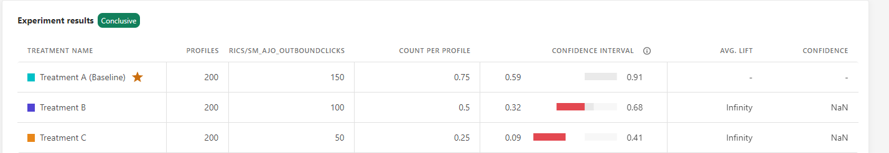

# 了解统计计算 {#experiment-calculations}

>[!AVAILABILITY]
>
>的 **内容实验** 功能当前仅适用于一组组织（有限可用性）。 有关更多信息，请与您的 Adobe 代表联系。

本文介绍了在Adobe Journey Optimizer中运行实验时使用的统计计算。

实验使用高级统计方法来计算 **置信序列** 和 **置信度**，以便您可以根据需要长时间运行实验，并持续监控结果。

本文介绍了实验的工作原理，并直观地介绍了Adobe的 **任何时间有效置信序列**.

对于专家用户，技术详细信息和参考详见 [本页](../campaigns/assets/confidence_sequence_technical_details.pdf).

## 统计测试和控制错误 {#statistical-testing}

如上表所示，许多统计推断方法被设计为控制两种类型的错误：

* **误报（I类错误）**:是对零假设的错误拒绝，但实际上是正确的。 在在线实验的背景下，这意味着我们错误地认为每次治疗的结果量度是不同的，尽管它是相同的。
    在进行实验之前，我们通常会选择一个阈值 `\alpha`. 实验开始后， `p-value` 是计算的，我们拒绝 `null if p < \alpha`. 常用的阈值是 `\alpha = 0.05`，这意味着从长远看，我们预计每100个实验中就有5个是误报。

* **漏报（II类错误）**:意味着我们无法拒绝空假设，尽管它是假的。 对于实验，这意味着我们不会拒绝零假设，实际上它是不同的。 为了控制这种类型的错误，我们通常需要在实验中拥有足够的用户来保证某种电源，定义为 `1 - \beta`（即1减去II类错误的概率）。

大多数统计推断技术都要求您根据要确定的效果大小以及错误容差(`\alpha` 和 `\beta`)。 但是，Adobe Journey Optimizer的方法旨在允许您持续查看任何样本量的结果。

## Adobe的统计方法：任何时间有效置信序列

A **置信度序列** 是 **置信区间**&#x200B;例如，如果您重复实验100次，并计算每个进入实验的新用户的平均量度及其关联的95%置信度序列的估计值。 95%置信度序列将包含您在运行的100个实验中的95个实验中的量度真实值。 每次实验只能计算一次95%的置信区间，以保证95%的覆盖率；而不是每个新用户。 因此，置信序列允许您持续监控实验，而不会增加误报率。

单个实验的置信序列与置信区间之间的差异在以下动画中显示：

**置信序列** 将实验的重点转移到估计而不是假设检验上，即集中于对处理之间手段差异的准确估计，而不是是否拒绝基于统计意义阈值的零假设。

然而，以类似于 `p-values`或 **置信度**&#x200B;和 **置信区间**，则 **置信序列** 任何时间都有效 `p-values`，或任何时候有效的置信度。 由于熟悉置信度等数量，Adobe可同时提供 **置信序列** 以及任何时候对其报表的置信度。

论 **置信序列** 来自随机变量序列的研究，称为鞅。 下面为专家读者提供了一些主要成果，但从业者的收获很明确：

>[!NOTE]
>
>置信度序列可以解释为置信区间的安全顺序类似物。您可以随时查看并解释实验中的数据，并安全地停止或继续实验。 对应的任何时间有效置信度，或 `p-value`，也可安全解读。

请务必注意，由于置信序列是“任意时间有效”，因此它们将比在同一样本量下使用的固定水平线方法更加保守。 置信序列的范围通常比置信区间计算更宽，而任何时间有效置信度都将比固定水平置信度计算更小。 这种保守主义的好处是，你可以随时安全地解读结果。

## 宣布实验为结论

每次您查看实验报告时，Adobe都会分析在实验中累计到此时刻的数据，并将声明一个实验为“结论性”，当任何有效置信度超过至少一种治疗的95%阈值时。

此时，表现最佳的处理（基于转化率或用户档案标准化量度值）将在报表屏幕顶部突出显示，并在表格报表中以星形表示。 在此确定中，只考虑置信度大于95%的治疗和基线。

当有两种以上治疗时，使用Bonferroni校正链接对多个比较问题进行校正，并控制家庭误差率。 在此情景中，还可能存在多种置信度大于95%且置信区间重叠的处理方法。 在这种情况下，Adobe Journey Optimizer将声明转化率最高（或配置文件标准化量度值）的量度值为最佳执行者。
