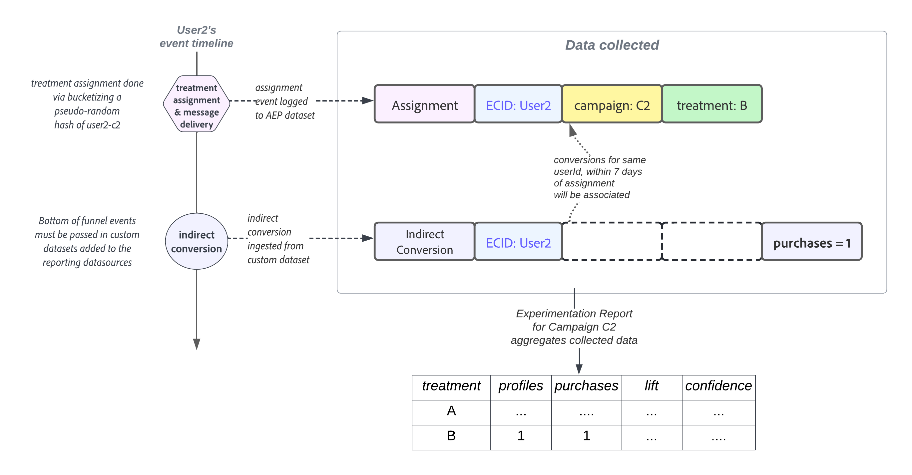

# 内容实验入门 {#get-started-experiment}

>[!AVAILABILITY]
>
>内容实验功能当前仅适用于一组组织（有限可用性）。 有关更多信息，请与您的 Adobe 代表联系。

## 什么是内容实验？

通过内容实验，可以优化营销活动中操作的内容。

实验是一组随机试验，在在线测试的背景下，这意味着一些随机选择的用户会接触到一个消息的给定变体，而另一组随机选择的用户则会接触到另一个治疗。 发送消息后，您可以测量您感兴趣的结果量度，例如电子邮件打开数或点击数。

## 为什么运行实验？

通过实验，您可以隔离导致量度改进的更改。 如上图所示：一些随机选择的用户会接触到每个治疗组，这意味着这些组平均将共享相同的特征。 因此，结果的任何差异都可以解释为由于所接受治疗的差异所致，即，您能够在所做的更改与您感兴趣的结果之间建立因果关系。

这使您能够在优化业务目标时做出数据驱动的决策。

对于Adobe Journey Optimizer中的内容实验，您可以测试以下创意：

* **主题行**:主题行的语调或个性化程度的变化会产生什么影响？
* **消息内容**:更改电子邮件的可视布局会导致对电子邮件的更多点击吗？

## 内容实验的工作原理是什么？ {#content-experiment-work}

### 随机分配

在Adobe Journey Optimizer中进行内容实验时，会使用访客身份的伪随机哈希对目标受众中的用户进行随机分配，以便执行您定义的一种处理方法。 哈希机制可确保在访客多次进入营销活动的情况下，他们将确定地接受相同的处理。

详细地说，MumurHash3 32位算法用于将用户标识字符串散列为10,000个存储段中的一个。 在将50%的流量分配给每个治疗的内容实验中，在存储桶1-5,000中的用户将收到第一个治疗，而存储桶5,001-10,000中的用户将收到第二个治疗。 由于使用了伪随机哈希处理，因此您观察到的访客拆分可能并不完全为50-50;但是，此拆分在统计上将等同于您的目标拆分百分比。

请注意，在通过内容实验配置每个营销活动时，您必须选择标识命名空间，从中为随机化算法选择用户ID。 这与 [执行地址](../configuration/primary-email-addresses.md).

### 数据收集和分析

在分配时（即，在出站渠道中发送消息时，或用户在入站渠道中进入营销活动时），“分配记录”将记录到相应的系统数据集。 这将记录用户被分配到的处理方式，以及实验和营销活动标识符。

目标量度可分为两个主要类：

* 直接量度，即用户对打开电子邮件或单击链接等处理方式做出直接反应。
* 间接或“漏斗底部”量度，在用户接触到处理后发生。

对于Adobe Journey Optimizer跟踪消息的直接目标量度，最终用户的响应事件会自动使用促销活动和处理标识符进行标记，从而允许将响应量度与处理直接关联。 [了解有关跟踪的更多信息](../design/message-tracking.md).

对于间接或“漏斗底部”目标（如购买），最终用户的响应事件不会使用促销活动和处理标识符进行标记，即，在接触处理后发生购买事件，该购买与先前的处理分配没有直接关联。 对于这些量度，在以下情况下，Adobe会将处理与漏斗转化事件的底部相关联：

* 在分配和转化事件时，用户身份相同。
* 转换在处理分配后的七天内进行。

然后，Adobe Journey Optimizer会使用高级“随时有效”统计方法来解释此原始报表数据，从而允许您解释实验报表。 有关详细信息，请参见[此页面](../campaigns/experiment-calculations.md)。

## 运行实验的提示

运行实验时，务必遵循某些最佳实践。 以下是运行这些实验的一些提示：

+++隔离您尝试测试的变量

制定要测试的一些假设，并将此假设限制为尽可能少的更改，以确定对投放产生影响的因素。

例如，一个好的假设是，电子邮件主题行中的个性化是否有助于提高打开率。 但是，如果在消息内容或图像中添加更改，则可能会导致结论混乱。
+++

+++确保您使用的量度正确

确定要定位的量度，以及您所做的更改是否会对此量度产生直接影响。

例如，更改消息正文的内容不太可能影响电子邮件打开率。
+++

+++按照正确的受众规模或足够长的时间运行测试

如果运行测试的时间较长，则能够检测到不同治疗方式之间目标量度差异较小。 但是，如果目标量度的基线值较小，则需要较大的样本量。
实验中必须包含的用户数取决于您希望检测的效果大小、目标量度的方差或分布，以及您对误报和误报的容忍度。 在经典实验中，您可以使用 [样本量计算器](https://experienceleague.adobe.com/tools/calculator/testcalculator.html){_blank}来确定必须运行测试的时长。
+++

+++了解统计不确定性

如果您正在运行的实验中有1000个用户看到过一种治疗，并且转化率设置为5%。 如果包含所有用户，那么这是否是实际的转化率？ 真正的转化率是多少？
统计方法为我们提供了一种方法来证明这种不确定性。 运行在线实验时要了解的最重要的概念之一是，观察到的转化率与一系列基本的真实转化率一致，这意味着您必须等到这些估计值足够精确时再尝试得出结论。 置信区间和置信度有助于我们量化这种不确定性。
+++

+++形成新的假设，并持续测试

要获得真正的业务洞察，您应该只坚持一个实验。 相反，通过提出新的假设，在不同的区段上运行具有不同更改的新测试，并通过检查对不同量度的影响来跟踪实验。
+++

## 解释实验结果 {#interpret-results}

本节介绍实验报告以及如何了解所呈现的各种统计量。

以下是解释内容实验结果的一些准则。

请注意，对结果的完整描述应考虑所有可用证据（即样本量、转化率、置信区间等），而不仅仅是结论性或无结论性声明。 即使结果尚不确定，仍然有令人信服的证据表明一种疗法与另一种疗法不同。

要了解统计计算，请参阅 [页面](../campaigns/experiment-calculations.md).

### 1.比较标准化量度 {#normalized-metrics}

在比较两种疗法的效果时，您应始终比较标准化的量度，以考虑每种疗法所暴露的用户档案数的任何差异。

例如，如果将实验目标设置为 **[!UICONTROL 唯一打开数]**，并且向10,000个记录了200个唯一打开的用户档案显示了给定的治疗，这表示 **[!UICONTROL 转化率]** 2%。 对于非唯一量度（例如打开量度），标准化量度显示为 **[!UICONTROL 每个配置文件的计数]**，而对于价格总计等连续量度，则标准化量度将显示为 **[!UICONTROL 每个用户档案的总数]**.

### 2.关注置信区间 {#confidence-intervals}

在用户档案的样本上进行实验时，观察到的给定处理的转化率代表真实基础转化率的估计值。

例如，如果治疗A具有 **[!UICONTROL 转化率]** 3%，而B治疗观察到 **[!UICONTROL 转化率]** Treation B比Treation B表现更好吗？ 要回答这个问题，我们必须首先量化这些观察到的转化率中的不确定性。

置信区间有助于量化估计转化率中的不确定性量，但较宽的置信区间意味着更多的不确定性。 随着实验中添加更多用户档案，这些间隔将变得更小，代表更精确的估计。 置信区间表示与观察数据兼容的转化率范围。

如果两种疗法的置信区间几乎不重叠，则意味着两种疗法的转化率不同。 但是，如果两种疗法的置信区间之间存在大量重叠，则两种疗法的转化率更可能相同。

Adobe使用95%的“任意时间有效置信区间”或“置信序列”，这意味着在实验期间可以随时安全查看结果。

### 3.了解提升度 {#understand-lift}

“实验”报表摘要显示了 **[!UICONTROL 基线提升度]**，这是指给定治疗相对于基线转化率提高百分比的度量。 精确定义，它是指给定处理与基线之间的性能差异除以基线的性能，以百分比表示。

### 3.了解置信度 {#understand-confidence}

虽然您应该主要关注 **[!UICONTROL 置信区间]** 对于每个处理的性能，Adobe还显示置信度，置信度是一个概率度量，用来度量有多少证据表明给定的处理与基线处理相同。 置信度越高，表明基线处理和非基线处理具有相同性能的假设的证据就越少。 更准确地说，所显示的置信度是一种概率（以百分比表示），即如果实际上实际的基础转化率没有差异，我们观察到给定处理与基准之间的转化率差异较小。 对于p值，显示的置信度为1 - p值。

Adobe使用与上述置信序列一致的“任意时间有效”置信度和“任意时间有效”p值。

### 四、统计意义

运行实验时，如果假设给定的治疗和基线具有相同的真实基础转化率/性能，则观察到的结果极不可能，则结果会被视为具有统计意义。

当置信度高于95%时，Adobe声明实验为结论性实验。

## 运行实验后要做什么

运行实验后，可以执行以下几个后续操作：

* **部署成功的创意**

   有了明确的结果，您可以部署这个成功的想法，方法是向所有客户推送最佳效果治疗，或者创建新的营销活动，其中复制最佳效果治疗的结构。
    请注意，在动态环境中，一次性运行良好的功能，在以后可能无法正常运行。

* **运行跟踪测试**

   有时，你的实验结果可能没有结果，要么是因为实验中没有足够的轮廓来检测治疗上的任何差异，要么是因为你定义的治疗没有足够的不同。

   如果您所测试的假设仍然相关，则对较大或不同的受众进行后续测试，或者修改您的治疗方法，以使差异更明显，可能是最佳的后续行动。

* **进行更深入的深入分析**

   对于一个受众有效的治疗，有时可能不是对另一个受众的最佳治疗。 对不同客户群的治疗效果进行更深入的分析，有助于为新的测试创造思路。

   同样，使用不同量度研究每种治疗的性能也可能会更全面地了解您的实验。

   >[!CAUTION]
   >
   >更多分析意味着，检测虚假效果或误报的可能性更高。
