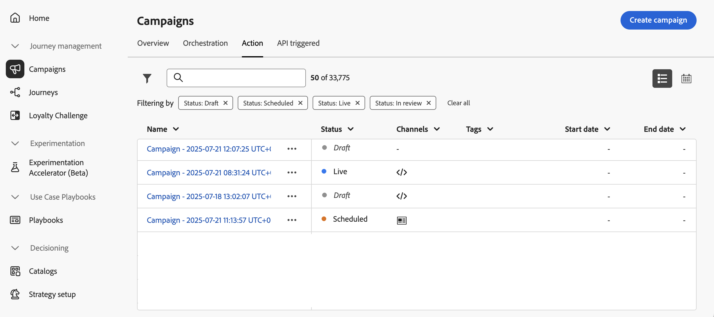

# 营销活动入门 {#get-started-campaigns}

>[!CONTEXTUALHELP]
>id="campaigns_list"
>title="营销活动"
>abstract="通过促销活动，您可以跨多个渠道向特定区段交付一次性内容。 在创建新营销活动之前，请确保您有消息预设和Adobe Experience Platform区段可供使用。"

## 关于营销活动 {#about}

营销活动允许您使用多个渠道向特定区段交付一次性内容。

与设计按顺序执行操作的历程不同，营销活动可以同时执行操作（立即执行，也可以按指定的计划执行）。 例如，您可以使用它们来提供促销优惠、参与促销活动、公告、法律声明或策略更新。

了解如何使用营销活动：
* [创建营销策划](create-campaign.md)
* [修改或停止营销活动](modify-stop-campaign.md)
* [Campaign实时报告](campaign-live-report.md)
* [Campaign全局报告](campaign-global-report.md)

## 访问活动 {#access}

营销活动可从 **[!UICONTROL Campaigns]** 菜单。

默认情况下，列表会显示 **[!UICONTROL Draft]**, **[!UICONTROL Scheduled]**&#x200B;和 **[!UICONTROL Live]** 状态。 要显示已停止、已完成和已存档的营销活动，您需要清除过滤器。

## 营销活动状态 {#statuses}

营销活动可以有多种状态：

* **[!UICONTROL Draft]**:营销活动正在编辑，尚未激活。
* **[!UICONTROL Activating]**:营销活动正在激活。
* **[!UICONTROL Live]**:营销活动已激活。
* **[!UICONTROL Scheduled]**:营销活动已配置为在特定开始日期激活。
* **[!UICONTROL Stopped]**:营销活动已手动停止。 您无法再激活或重复使用它(请参阅 [停止营销活动](modify-stop-campaign.md#stop))
* **[!UICONTROL Completed]**:营销活动已完成。
* **[!UICONTROL Archived]**:营销活动已存档。

>[!NOTE]
>
>位于 **[!UICONTROL Live]** 或 **[!UICONTROL Scheduled]** 状态表示营销活动的新版本已创建且尚未激活(请参阅 [修改营销活动](modify-stop-campaign.md#modify))。
