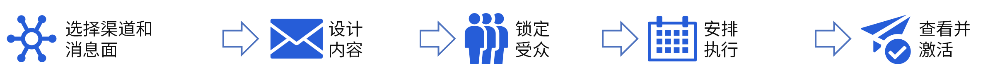

# 营销活动入门 {#get-started-campaigns}

>[!CONTEXTUALHELP]
>id="ajo_homepage_card3"
>title="创建营销活动"
>abstract="借助 **Adobe Journey Optimizer**，可使用各种渠道向特定受众投放一次性内容。使用历程时，操作将按顺序执行。借助营销活动，可同时执行诸多操作：立即执行或根据指定计划执行。"

>[!CONTEXTUALHELP]
>id="campaigns_list"
>title="营销活动"
>abstract="创建营销活动，以跨各种渠道向特定受众投放一次性内容。在创建营销活动之前，请确保您已准备好渠道配置（即消息预设）和 Adobe Experience Platform 受众以供使用。"

使用 Journey Optimizer 营销活动通过各种渠道向特定受众投放一次性内容。使用历程时，操作将按顺序执行。借助营销活动，可同时执行诸多操作：立即执行或根据指定计划执行。

您可以创建两种类型的营销活动：

* **计划营销活动**&#x200B;允许针对营销用例（如促销产品建议、参与性营销活动、公告、法律声明或策略更新）进行简单的临时批量通信。
* **API 触发的营销活动**&#x200B;允许在正确的时间将营销通信传达给受众，或者允许将事务性/运营消息发送给个人（如密码重置），其中需求可能涉及个性化，将不仅使用轮廓属性，还涉及触发器中的实时上下文数据（即 REST API 有效负载）。

创建营销活动的主要步骤如下：

➡️ [在视频中发现此功能](#video)

## 开始前 {#campaign-prerequisites}

在 Journey Optimizer 中开始创建您的第一个营销活动之前，请查看以下先决条件：

1. **您需要适当的权限**。有权访问营销活动相关&#x200B;**[!UICONTROL 产品轮廓]**&#x200B;的用户（例如营销活动管理员、营销活动审批者、营销活动经理和/或营销活动查看者）才能使用营销活动。如果您无法访问营销活动，则必须扩展您的权限。

   +++了解如何分配营销活动相关角色

   1. 要将角色分配给 [!DNL Permissions] 产品中的用户，请导航至&#x200B;**[!UICONTROL 角色]**&#x200B;选项卡，然后选择一个内置的营销活动&#x200B;**[!UICONTROL 角色]**：营销活动管理员、营销活动审批者、营销活动经理或营销活动查看者。

   1. 在&#x200B;**[!UICONTROL 用户]**&#x200B;选项卡中，单击&#x200B;**[!UICONTROL 添加用户]**。

   1. 输入您的用户名或电子邮件地址，或从列表中选择用户并单击&#x200B;**[!UICONTROL 保存]**。

      如果之前没有创建用户，请参阅[有关添加用户的文档](https://experienceleague.adobe.com/zh-hans/docs/experience-platform/access-control/ui/users)。

   随后，您的用户将收到一封重定向到您的实例的电子邮件。

+++

1. **您需要有受众**。在创建营销活动之前，需要设置受众。要了解有关受众的更多信息，请参阅[此页面](../audience/about-audiences.md)。
1. **您需要一个渠道配置**。要选择渠道，必须创建并提供相应的渠道配置（即预设）。要了解有关渠道配置的更多信息，请参阅[此页面](../configuration/channel-surfaces.md)。

## 操作方法视频 {#video}

了解如何创建您的第一个营销活动。

>[!VIDEO](https://video.tv.adobe.com/v/346680?quality=12)
