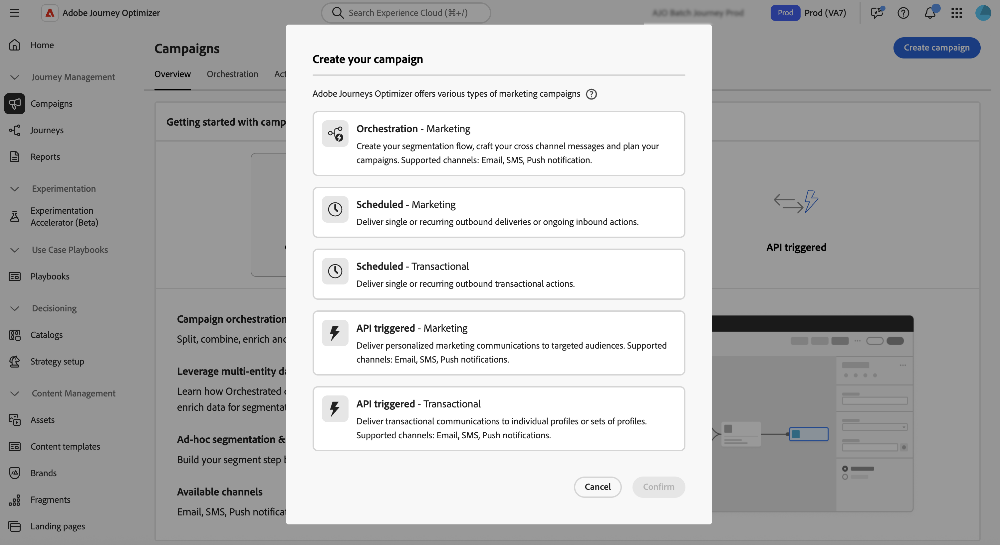

# 营销活动快速入门 {#get-started-campaigns}

>[!CONTEXTUALHELP]
>id="ajo_campaigns_schedule"
>title="营销活动计划"
>abstract="默认情况下，营销活动在手动激活时开始，并在发送消息一次后立即结束。您可以灵活地设置特定日期和时间以发送消息。此外，还可以为定期操作营销活动指定结束日期。在操作触发器中，您还可以配置消息发送频率以满足您的偏好。"

>[!CONTEXTUALHELP]
>id="ajo_campaigns_schedule_start"
>title="营销活动开始"
>abstract="指定应发送消息的日期和时间。"

>[!CONTEXTUALHELP]
>id="ajo_campaigns_schedule_end"
>title="营销活动结束"
>abstract="指定应停止执行周期性营销活动的时间。"

>[!CONTEXTUALHELP]
>id="ajo_campaigns_schedule_triggers"
>title="营销活动操作触发器"
>abstract="定义营销活动消息的发送频率。"

>[!CONTEXTUALHELP]
>id="ajo_campaigns_throttling"
>title="速率控制"
>abstract="通过指定所需的速率限制为您的营销活动设置速率控制。此功能对于防止下游系统（如登陆页面或客户服务平台）过载尤为实用。"

>[!CONTEXTUALHELP]
>id="ajo_homepage_card3"
>title="创建营销活动"
>abstract="借助 **Adobe Journey Optimizer**，可使用各种渠道向特定受众投放一次性内容。使用历程时，操作将按顺序执行。借助营销活动，可同时执行诸多操作：立即执行或根据指定计划执行。"

>[!CONTEXTUALHELP]
>id="campaigns_list"
>title="营销活动"
>abstract="创建营销活动，以跨各种渠道向特定受众投放一次性内容。在创建营销活动之前，请确保您已准备好渠道配置和 Adobe Experience Platform 受众以供使用。"

>[!CONTEXTUALHELP]
>id="ajo_campaigns_campaign_type"
>title="营销活动类型"
>abstract="选择营销活动的类型。可用渠道根据所选类型而不同。 **计划的营销活动**（操作营销活动）– 非常适合简单的一次性批量通信，您可以计划在某个特定的时间执行。 **API 触发的营销活动** – 通过 API 调用激活该功能，能够直接从外部系统自动发送基于事件的消息。 **编排的营销活动** – 提供一个可视化的拖放式画布，用于设计和自动化复杂、多步骤的营销工作流，包括从受众细分到跨渠道的个性化消息投放。"

>[!CONTEXTUALHELP]
>id="ajo_campaigns_create_orchestration"
>title="营销活动"
>abstract="创建您的分段流程，设计跨渠道消息并规划营销活动。支持的渠道：电子邮件、短信、推送通知。"

>[!CONTEXTUALHELP]
>id="ajo_campaigns_create_scheduled_marketing"
>title="营销活动"
>abstract="提供单次或重复的出站投放或持续的入站操作。"

>[!CONTEXTUALHELP]
>id="ajo_campaigns_create_scheduled_transactional"
>title="营销活动"
>abstract="提供单次或重复的出站事务性操作。"

>[!CONTEXTUALHELP]
>id="ajo_campaigns_create_api_marketing"
>title="营销活动"
>abstract="向目标受众投放个性化营销通信。支持的渠道：电子邮件、短信、推送通知。"

>[!CONTEXTUALHELP]
>id="ajo_campaigns_create_api_transactional"
>title="营销活动"
>abstract="向单个轮廓或轮廓集投放事务性通信。支持的渠道：电子邮件、短信、推送通知。"

Adobe Journey Optimizer允许您跨多个渠道向特定受众提供有针对性的一次性内容。 利用营销活动，您可以同时执行协调的营销操作，在正确的时间通过正确的消息联系受众。

本指南提供了清晰的路线图，以帮助您了解促销活动的基础知识，为您的用例选择正确的促销活动类型，并自信地设计能够产生强大客户体验的促销活动。

## 什么是营销活动？

**营销活动**&#x200B;是协调的营销操作，可跨一个或多个渠道向特定受众提供内容。 与按顺序执行操作的历程不同，活动会同时执行操作 — 立即执行或按定义的计划执行。

使用[!DNL Journey Optimizer]可以：

* 向目标受众区段投放&#x200B;**一次性或循环内容**
* 跨电子邮件、推送、短信、应用程序内、Web等执行&#x200B;**协调的多渠道通信**
* 通过API调用触发&#x200B;**自动响应**，以实现事件驱动的实时消息传递
* 使用可视化编排工具设计&#x200B;**复杂的营销工作流**

➡️ **准备开始生成？** [在几分钟内创建您的第一个营销活动](create-campaign.md)。

## 选择您的营销活动类型 {#campaign-types}

**在开始构建**&#x200B;之前，请务必了解哪种类型的营销活动适合您的用例。 Adobe Journey Optimizer支持三种营销活动类型，每种类型针对不同的方案和激活机制而设计：

>[!BEGINTABS]

>[!TAB 操作营销活动（已计划）]

**何时使用：**&#x200B;简单、计划的批处理通信

**操作营销活动**（也称为计划营销活动）非常适合于在特定时间运行的直接的、一次性或循环的批量通信。

**两个类别：**

* **营销** — 促销优惠、参与促销活动、公告、法律声明或政策更新。 需要收件人选择加入。
* **事务性** — 中断、紧急情况、取消。 不需要选择加入。

**非常适合：**&#x200B;客户细分的每月新闻稿、时效性强的促销公告、季节性营销活动、产品发布通讯和服务中断通知。

➡️ [了解操作营销活动](create-campaign.md)

>[!TAB API 触发的营销活动]

**何时使用：**&#x200B;与外部系统实时的、事件驱动的消息传递

**API触发的营销活动**&#x200B;通过API调用激活，从而直接从外部系统启用自动消息传递。 这些营销活动支持使用来自API有效负载的配置文件属性和实时上下文数据进行个性化。

**两个类别：**

* **营销** — 针对目标受众的个性化营销通信
* **事务性** — 单个操作（密码重置、购物车购买等）后的消息

**非常适合：**&#x200B;密码重置确认、购物车放弃恢复、订单确认和送货更新、帐户活动通知以及实时个性化推荐。

➡️ [了解API触发的营销活动](api-triggered-campaigns.md)

>[!TAB 编排的营销活动]

**何时使用：**&#x200B;复杂的多步骤营销工作流

**编排的营销活动**&#x200B;提供了可视、拖放式画布来设计和自动化复杂的营销工作流。 从受众分段到跨渠道的个性化消息投放，一切都在一个为速度和控制而构建的直观环境中进行。

**非常适合：**&#x200B;多步骤客户参与计划、复杂的分段和定位策略、跨渠道活动编排、品牌启动的大规模营销以及具有多个决策点的高级工作流自动化。

➡️ [了解编排的营销活动](../orchestrated/gs-orchestrated-campaigns.md)

>[!ENDTABS]

>[!NOTE]
>
>不确定选择哪种类型？ 从计划批处理通信的&#x200B;**操作营销活动**&#x200B;或实时消息传递的&#x200B;**API触发的营销活动**&#x200B;开始 — 这些涵盖最常见的使用案例。

## 您的营销活动创建工作流 {#workflow}

构建成功的营销活动遵循清晰、可重复的流程。 以下是您的分步工作流：

**1。 计划**→**2。 →** 3配置&#x200B;**。 设计**→**4。 审核**→**5。 激活**→**6。 监视器**

### 1.规划您的营销活动 {#plan}

在开始之前，请明确您的目标：

* **目标是什么？** （例如，促进转化、提高参与度、通知客户）
* **受众是谁？**(例如，生成或从Adobe Experience Platform中选择)
* **适合哪个营销活动类型？** （请参阅上面的[营销活动类型](#campaign-types)）
* **您将使用哪些渠道？** （电子邮件、推送、短信、应用程序内、Web等）→[查看按营销活动类型支持的渠道](../channels/gs-channels.md#channels)
* **何时应该执行？** （立即、计划或API触发）

### 2.配置营销活动属性 {#configure}

建立营销策划的基础：

1. **命名并描述**&#x200B;您的促销活动以便识别
2. **选择营销活动类型**（操作、API触发或编排）
3. **选择您的受众**
4. 如果使用冲突管理，**设置优先级**
5. **配置计划**（对于操作营销活动）或API详细信息（对于API触发）

**特定类型的指南：** [操作营销活动属性](campaign-properties.md) | [API触发的营销活动属性](api-triggered-campaign-properties.md) | [协调的活动设置](../orchestrated/create-orchestrated-campaign.md)

### 3.设计内容 {#design}

为受众创建引人注目的消息：

* 使用&#x200B;**电子邮件Designer**&#x200B;获取丰富的电子邮件体验
* 使用图像和深层链接配置&#x200B;**推送通知**
* 设计&#x200B;**短信/彩信消息**，使其个性化
* 创建&#x200B;**应用程序内**&#x200B;和&#x200B;**Web**&#x200B;体验
* 使用配置文件属性和上下文数据添加&#x200B;**个性化**

**特定类型的指南：** [操作促销活动内容](campaign-content.md) | [API触发的营销活动内容](api-triggered-campaign-content.md) | [编排的营销活动内容](../orchestrated/create-orchestrated-campaign.md)

### 4.审查和测试 {#review}

始终在激活之前查看您的营销活动：

* 使用测试用户档案&#x200B;**预览内容**
* **检查定位**&#x200B;以确保合适的受众
* **验证计划**&#x200B;和激活设置
* 如果使用审批工作流，则&#x200B;**请求审批**
* 使用种子列表&#x200B;**测试可投放性**

**特定类型的指南：** [审阅操作营销活动](review-activate-campaign.md) | [审阅API触发的营销活动](review-activate-api-triggered-campaign.md) | [审核编排的营销活动](../orchestrated/create-orchestrated-campaign.md)

### 5.激活您的营销活动 {#activate}

审查完成后，激活您的营销活动：

* **手动激活** — 立即或按计划时间激活
* **API激活** — 对于API触发的营销活动，使用激活端点
* **审批流程** — 如果需要，请等待利益相关者审批
* 注意：无法编辑活动的营销活动（您必须复制才能进行更改）

**特定类型的指南：** [激活操作营销活动](review-activate-campaign.md) | [激活API触发的营销活动](review-activate-api-triggered-campaign.md) | [激活编排的营销活动](../orchestrated/create-orchestrated-campaign.md)

### 6.监测和分析 {#monitor}

跟踪促销活动的执行情况：

* 查看营销活动报告和分析
* 监测投放率和参与量度
* 跟踪错误和退回
* 分析转化率和ROI
* 使用见解进行优化

**特定类型的指南：** [操作促销活动报告](../reports/campaign-global-report-cja.md) | [API触发的营销活动监控](api-triggered-campaigns.md#monitor) | [编排的营销活动分析](../orchestrated/create-orchestrated-campaign.md)

➡️ **准备开始？**&#x200B;选择您的营销活动类型：
* [创建操作营销活动→](create-campaign.md)
* [创建API触发的营销活动→](api-triggered-campaigns.md)
* [创建编排的营销活动→](../orchestrated/gs-orchestrated-campaigns.md)

## 先决条件 {#prerequisites}

在使用营销活动之前，请确保已具备以下条件：

### 必需的设置

* **受众** — 受众在创建营销活动之前必须在Adobe Experience Platform中可用。 [开始使用受众→](../audience/about-audiences.md)

* **渠道配置** — 必须创建渠道配置（预设），并且这些配置可用于您要使用的渠道。 [设置渠道配置→](../configuration/channel-surfaces.md)

* **权限** — 您需要基于促销活动类型的适当权限。 如果您无法访问Campaign功能，请联系您的管理员。 [了解内置角色→](../administration/ootb-product-profiles.md)

| 营销活动类型 | 权限 |
|----------------------------|----------------------------------------------------------------------------|
| **操作营销活动** | 营销活动管理员 营销活动审批者 营销活动经理 营销活动查看者 |
| **API 触发的营销活动** | 营销活动管理员 营销活动审批者 营销活动经理 营销活动查看者 |
| **编排的营销活动** | 编排的营销活动的管理员 编排的营销活动的审批者 编排的营销活动的经理 编排的营销活动的查看者 |

+++分配营销活动权限

1. 导航到&#x200B;**[!UICONTROL 产品中的]**&#x200B;角色[!DNL Permissions]选项卡，然后选择其中一个与营销活动相关的&#x200B;**[!UICONTROL 角色]**。

1. 在&#x200B;**[!UICONTROL 用户]**&#x200B;选项卡中，单击&#x200B;**[!UICONTROL 添加用户]**。

1. 输入您的用户名或电子邮件地址，或从列表中选择用户并单击&#x200B;**[!UICONTROL 保存]**。

   如果之前没有创建用户，请参阅[有关添加用户的文档](https://experienceleague.adobe.com/zh-hans/docs/experience-platform/access-control/ui/users){target="_blank"}。

随后，您的用户将收到一封重定向到您的实例的电子邮件。

+++

## Campaign功能 {#capabilities}

随着您对营销活动越来越熟悉，请探索这些强大的功能：

:::: landing-cards-container

:::

**计划和计时**

为特定日期/时间安排活动、设置定期投放并优化发送时间以获得最大影响。 （操作和API触发的营销活动）

[了解计划](campaign-schedule.md)
:::

:::

**速率控制**

限制消息吞吐量，以防止登陆页面或客户关怀平台等下游系统过载。 （操作和API触发的营销活动）

[控制速率限制](create-campaign.md)
:::

:::

**受众定位**

精准定位特定的Adobe Experience Platform受众，并动态管理受众资格。

[选择活动受众](campaign-audience.md)
:::

:::

**审批工作流**

在营销活动开始之前实施审查和批准流程，确保质量和法规遵从性。 （操作和API触发的营销活动）

[查看和激活](review-activate-campaign.md)
:::

:::

**安静时间**

通过避免在指定的时间窗口内发送消息来尊重客户偏好。 （操作和API触发的营销活动）

[配置免打扰时间](quiet-hours.md)
:::

:::

**优化**

使用定位规则和内容实验提供个性化内容并最大化参与度。

[优化营销活动](campaigns-message-optimization.md)
:::

::::

## 营销活动类型入门 {#get-started-types}

现在您已了解[!DNL Journey Optimizer]中的促销活动，请选择您的促销活动类型以开始：

<table style="table-layout:fixed"><tr style="border: 0; text-align: center;">
<td> <a href="create-campaign.md">操作营销活动</a></td>
<td> <a href="api-triggered-campaigns.md">API 触发的营销活动</a></td>
<td><a href="../orchestrated/gs-orchestrated-campaigns.md">精心策划的营销活动</a></td>
</tr></table>
