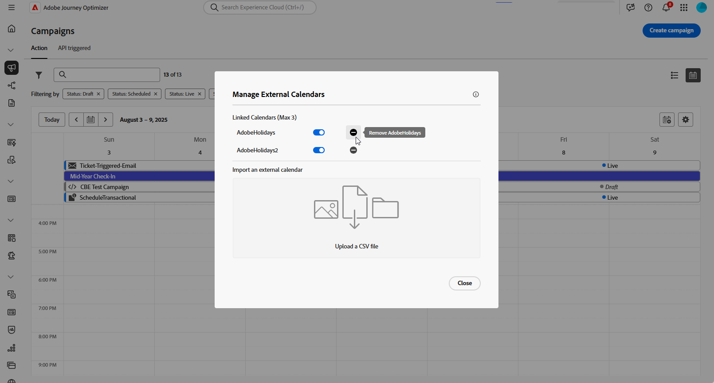
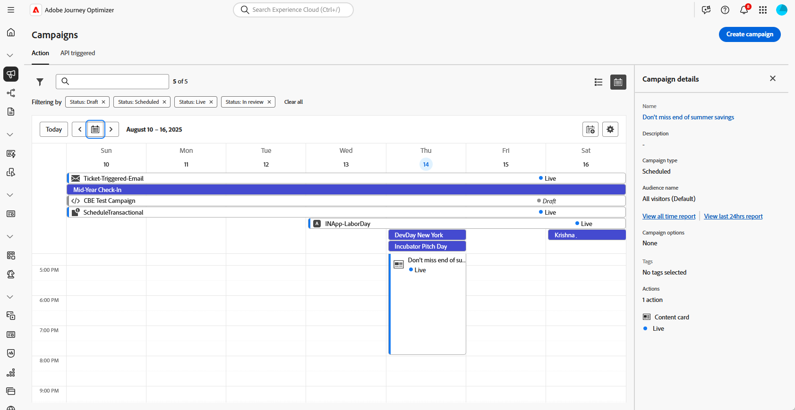

# 访问和管理营销活动 {#manage-campaigns}

在开始营销活动之前，请检查此部分[中列出的以下先决条件](get-started-with-campaigns.md#permissions)。 在满足以下先决条件后，您就可以开始创建营销活动：

* **访问营销活动**。 您可以从[营销活动列表](#access)或[营销活动日历](#calendar)访问营销活动。

* **创建营销活动**。 创建步骤取决于您创建的[营销活动类型](get-started-with-campaigns.md#get-started-with-campaigns)。 了解如何创建[操作营销活动](../campaigns/create-campaign.md)、[API触发的营销活动](../campaigns/api-triggered-campaigns.md)或[编排的营销活动](../orchestrated/create-orchestrated-campaign.md)。

* **定义营销活动属性**。 了解如何为[操作营销活动](../campaigns/campaign-properties.md)、[API触发的营销活动](../campaigns/api-triggered-campaign-properties.md)或[编排的营销活动](../orchestrated/create-orchestrated-campaign.md)设置属性。

* **定义营销活动渠道和内容**。 了解如何定义[操作营销活动](../campaigns/campaign-content.md)、[API触发的营销活动](../campaigns/api-triggered-campaign-content.md)或[编排的营销活动](../orchestrated/orchestrate-activities.md)的内容。

* **计划您的营销活动** — 您可以在营销活动日历[中查看计划的营销活动](#calendar)。

然后，开始测试，并在执行活动之前对其进行改进和优化。 活动开始后，即可监控并访问报告。

在此部分[中查看所有营销活动状态和警报](#statuses)。

## 访问营销活动 {#access}

>[!CONTEXTUALHELP]
>id="ajo_campaigns_view"
>title="营销活动列表和日程表视图"
>abstract="除了营销活动列表之外，[!DNL Journey Optimizer] 还提供营销活动的日程表视图，清晰展示营销活动的日程安排。您可以随时使用这些按钮在列表和日程表视图之间切换。"

>[!CONTEXTUALHELP]
>id="ajo_targeting_workflow_list"
>title="精心编排的营销活动库存"
>abstract="在此屏幕中可访问精心编排的营销活动的完整列表，查看其当前状态、上次/下次执行日期，并新建一个精心编排的营销活动。"

>[!CONTEXTUALHELP]
>id="ajo_orchestration_campaign_action"
>title="操作"
>abstract="本节列出了精心编排的营销活动中使用的所有操作。"

可从&#x200B;**[!UICONTROL 营销活动]**&#x200B;菜单访问营销活动。

>[!BEGINTABS]

>[!TAB 操作营销活动]

选择&#x200B;**[!UICONTROL 操作]**&#x200B;选项卡以访问操作营销活动列表。

默认情况下，列表会显示具有&#x200B;**[!UICONTROL 草稿]**、**[!UICONTROL 计划]**&#x200B;和&#x200B;**[!UICONTROL 实时]**&#x200B;状态的所有营销活动。 要显示已停止、已完成和已存档的营销活动，您需要清除过滤器。

>[!TAB API 触发的营销活动]

选择&#x200B;**[!UICONTROL API触发]**&#x200B;选项卡以访问API触发的营销活动列表。

默认情况下，列表会显示具有&#x200B;**[!UICONTROL 草稿]**、**[!UICONTROL 计划]**&#x200B;和&#x200B;**[!UICONTROL 实时]**&#x200B;状态的所有营销活动。 要显示已停止、已完成和已存档的营销活动，您需要清除过滤器。

>[!TAB 精心策划的营销活动]

选择&#x200B;**[!UICONTROL 编排]**&#x200B;选项卡以访问编排的营销活动列表。

{zoomable="yes"}{zoomable="yes"}

列表中的每个编排营销活动都会显示相关信息，例如营销活动的当前[状态](#status)、关联的渠道和标记，或上次修改营销活动的时间。 您可以通过单击来自定义显示的列。

>[!ENDTABS]

此外，还可使用搜索栏和过滤器，以便在列表中轻松搜索。例如，您可以筛选营销活动，以仅显示与给定渠道或标记关联的营销活动，或显示在特定日期范围内创建的营销活动。

可通过使用营销活动清单中的  按钮执行下文详述的各项操作。

* **[!UICONTROL 查看所有时间报表]** / **[!UICONTROL 查看最近24小时报表]** — 访问报表以衡量和可视化营销活动的影响和效果。
* **[!UICONTROL 编辑标记]** - 编辑与营销活动关联的标记。
* **[!UICONTROL 复制]** — 在某些情况下，您可能需要复制营销活动，例如执行已停止的编排营销活动。
* **[!UICONTROL 删除]** - 删除营销活动。此操作仅适用于&#x200B;**[!UICONTROL 草稿]**&#x200B;营销活动。
* **[!UICONTROL 存档]** - 对营销活动进行存档。按照滚动的重新安排，所有存档的营销活动将在上次修改日期的 30 天后删除。此操作适用于除&#x200B;**[!UICONTROL 草稿]**&#x200B;营销活动之外的所有营销活动。

对于操作和API触发的营销活动，可以使用以下其他操作：

* **[!UICONTROL 添加到包]** — 将营销活动添加到包以将其导出到另一个沙盒。 [将对象导出到另一个沙盒](../configuration/copy-objects-to-sandbox.md)
* **[!UICONTROL 打开草稿版本]** — 如果已创建营销活动的新版本且尚未激活，则可以使用此操作访问其草稿版本。

## 营销活动生命周期 {#statuses}

在Adobe Journey Optimizer中，每个促销活动都会经过一个生命周期，生命周期由其在界面中的状态反映出来。 可用状态因促销活动类型而异 — 操作、API触发或编排。 使用下面的选项卡浏览生命周期和每种营销活动类型特定的状态。

>[!BEGINTABS]

>[!TAB 操作营销活动]

* **[!UICONTROL 草稿]**：正在编辑营销活动，尚未激活它。
* **[!UICONTROL 已计划]**：营销活动配置为在特定开始日期激活。
* **[!UICONTROL 实时]**：营销活动已激活。
* **[!UICONTROL 审核中]**：已提交营销活动以供审批，以便发布。 [了解如何使用审批](../test-approve/gs-approval.md)
* **[!UICONTROL 已停止]**：营销活动已手动停止。 您无法再激活或重用它。 [了解如何停止营销活动](manage-campaigns.md#stop)
* **[!UICONTROL 已完成]**：营销活动已完成。 此状态在活动激活3天后自动分配，如果活动定期执行，则在活动结束日期分配。
* **[!UICONTROL 失败]**：营销活动执行失败。 检查日志以识别问题。
* **[!UICONTROL 已存档]**：营销活动已存档。 [了解如何存档营销活动](manage-campaigns.md#archive)

>[!NOTE]
>
>**[!UICONTROL 实时]**&#x200B;或&#x200B;**[!UICONTROL 已计划]**&#x200B;状态旁边的“打开草稿版本”图标表示已创建操作或API触发的营销活动的新版本且尚未激活。

>[!TAB API 触发的营销活动]

* **[!UICONTROL 草稿]**：正在编辑营销活动，尚未激活它。
* **[!UICONTROL 已计划]**：营销活动配置为在特定开始日期激活。
* **[!UICONTROL 实时]**：营销活动已激活。
* **[!UICONTROL 审核中]**：已提交营销活动以供审批，以便发布。 [了解如何使用审批](../test-approve/gs-approval.md)
* **[!UICONTROL 已停止]**：营销活动已手动停止。 您无法再激活或重用它。 [了解如何停止营销活动](manage-campaigns.md#stop)
* **[!UICONTROL 已完成]**：营销活动已完成。 此状态在活动激活3天后自动分配，如果活动定期执行，则在活动结束日期分配。
* **[!UICONTROL 失败]**：营销活动执行失败。 检查日志以识别问题。
* **[!UICONTROL 已存档]**：营销活动已存档。 [了解如何存档营销活动](manage-campaigns.md#archive)

>[!NOTE]
>
>**[!UICONTROL 实时]**&#x200B;或&#x200B;**[!UICONTROL 已计划]**&#x200B;状态旁边的“打开草稿版本”图标表示已创建操作或API触发的营销活动的新版本且尚未激活。

>[!TAB 精心策划的营销活动]

* **[!UICONTROL 草稿]**：已创建编排的营销活动。 它尚未发布。
* **[!UICONTROL 发布]**：正在发布编排的营销活动。
* **[!UICONTROL 实时]**：已发布并正在执行编排的营销活动。
* **[!UICONTROL 已计划]**：已计划执行编排的营销活动。
* **[!UICONTROL 已完成]**：协调的活动执行已完成。 当营销活动完成消息发送且无错误后，系统将在 3 天内自动将其状态标记为已完成。
* **[!UICONTROL 已关闭]**：当定期营销活动已关闭时，系统将显示此状态。营销活动会继续执行直至其所有活动均已完成，但不再允许新的轮廓进入营销活动。
* **[!UICONTROL 已存档]**：已存档编排的营销活动。 按照滚动的重新安排，所有存档的营销活动将在上次修改日期的 30 天后删除。如需继续使用，您可以复制已存档的营销活动。
* **[!UICONTROL 已停止]**：已停止执行编排的营销活动。 要再次启动营销活动，您需要复制它。

>[!ENDTABS]

当您的某个营销策划中发生错误时，该营销策划的状态旁边会显示一个警告图标。 单击该图标以显示有关警报的信息。 这些警报可能会在各种情况下发生，例如营销活动消息未发布或所选配置不正确时。

## 营销活动日历 {#calendar}

除了营销活动列表之外，[!DNL Journey Optimizer]还提供营销活动的日历视图，以直观的方式清晰地展示其计划。

营销活动的表示方式：

* 默认情况下，日历网格会显示选定周的所有实时营销活动和计划营销活动。 其他筛选器选项可以显示已完成、已停止和已完成的激活或特定类型或渠道的激活。
* 不显示草稿营销活动。
* 跨越多天的营销活动显示在日历网格的顶部。
* 如果未指定开始时间，则使用最接近的手动激活时间将其放置在日历中。
* 营销活动显示为1小时时间跨度，但这并不反映实际的发送或完成时间。

要在营销活动日历中导航，请执行以下操作：

1. 单击图标可访问您的营销活动日历。

1. 使用箭头按钮或日历上方的日期选择器可在周之间移动。

   日历显示本周安排的所有营销活动。

   

1. 单击图标可切换跨天或跨周项目的显示。

   

1. 单击图标以管理和添加最多三个外部日历。

   

1. 拖放包含事件名称、开始日期和结束日期的CSV文件。

   上传的事件将为您组织中的所有用户显示，并显示在历程日历和营销活动日历中。

   +++CSV格式应如下所示：

   | Column1 | Column2 | Column3 |
   |-|-|-|
   | 事件名称 | 开始日期（mm/dd/yy格式） | 结束日期（mm/dd/yy格式） |

   +++

1. 如果需要，可以隐藏、取消隐藏或删除添加的外部日历。

   

1. 有关营销活动的更多详细信息，请单击其可视块以打开相关详细信息。 此时将打开一个信息窗格，其中包含有关营销活动的各种信息，例如其类型、对报告的访问权限或已分配的标记。

   

## 修改和停止重复的操作营销活动 {#modify}

### 修改操作营销活动

要修改和创建循环操作活动的新版本，请执行以下步骤：

1. 打开操作营销活动，然后单击&#x200B;**[!UICONTROL 修改营销活动]**&#x200B;按钮。

1. 将创建营销活动的新版本。 您可以通过单击&#x200B;**[!UICONTROL 打开实时版本]**&#x200B;来检查实时版本。

   

   在营销活动列表中，带有正在起草版本的激活营销活动在&#x200B;**[!UICONTROL 状态]**&#x200B;列中显示为带有特定图标。 单击此图标以打开营销策划的草稿版本。

   

1. 更改准备就绪后，您可以激活营销活动的新版本（请参阅[查看和激活营销活动](create-campaign.md#review-activate)）。

   >[!IMPORTANT]
   >
   >激活草稿将替换营销活动的实时版本。

### 停止操作营销活动 {#stop}

要停止定期营销活动，请将其打开，然后单击&#x200B;**[!UICONTROL 停止营销活动]**&#x200B;按钮。

>[!IMPORTANT]
>
>停止营销活动不会停止正在进行的发送，但它将停止计划的发送，如果发送已经在进行，则会停止下一次发生次数。

## 存档营销活动 {#archive}

随着时间的推移，促销活动列表不断增加，最终使浏览已完成和已停止的促销活动变得更加困难。

为防止出现这种情况，您可以存档不再需要的、已完成和已停止的营销活动。 为此，请单击省略号按钮，然后选择&#x200B;**[!UICONTROL 存档]**。

然后，可以使用列表中的专用过滤器检索已存档的营销活动。
