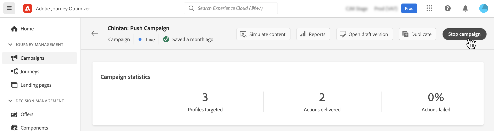

# 管理活动 {#modify-stop-campaign}

激活营销活动后，您可以随时修改或停止该营销活动。 这些操作仅适用于定期执行的营销活动。

此外，您还可以复制实时营销活动（执行一次或定期执行）以创建新营销活动，并存档已完成或已停止的营销活动。

## 访问活动 {#access}

营销活动可从 **[!UICONTROL 促销活动]** 菜单。

默认情况下，列表会显示 **[!UICONTROL 草稿]**, **[!UICONTROL 已计划]**&#x200B;和 **[!UICONTROL 实时]** 状态。

要显示已停止、已完成和已存档的营销活动，您需要清除过滤器。

## 营销活动状态 {#statuses}

营销活动可以有多种状态：

* **[!UICONTROL 草稿]**:营销活动正在编辑，尚未激活。
* **[!UICONTROL 激活]**:营销活动正在激活。
* **[!UICONTROL 实时]**:营销活动已激活。
* **[!UICONTROL 已计划]**:营销活动配置为在特定开始日期激活。
* **[!UICONTROL 已停止]**:营销活动已手动停止。 您无法再激活或重复使用它。 [了解如何停止营销活动](modify-stop-campaign.md#stop)
* **[!UICONTROL 已完成]**:营销活动已完成。 此状态在营销活动激活3天后自动分配，如果营销活动定期执行，则在营销活动结束日期自动分配。
* **[!UICONTROL 已存档]**:营销活动已存档。 [了解如何存档营销活动](modify-stop-campaign.md#archive)

>[!NOTE]
>
>位于 **[!UICONTROL 实时]** 或 **[!UICONTROL 已计划]** 状态表示营销活动的新版本已创建且尚未激活。 [了解详情](modify-stop-campaign.md#modify)。

## 修改定期营销活动 {#modify}

要修改和创建定期营销活动的新版本，请执行以下步骤：

1. 打开营销活动，然后单击 **[!UICONTROL 修改营销活动]** 按钮。

1. 将创建营销活动的新版本。 您可以通过单击 **[!UICONTROL 打开实时版本]**.

   

   在营销活动列表中，正在进行草稿版本的激活的营销活动会在 **[!UICONTROL 状态]** 列。 单击此图标可打开营销活动的草稿版本。

   

1. 更改准备就绪后，您可以激活营销活动的新版本(请参阅 [查看和激活营销活动](create-campaign.md#review-activate))。

   >[!IMPORTANT]
   >
   >激活草稿将替换营销活动的实时版本。

## 停止定期促销活动 {#stop}

要停止定期促销活动，请将其打开，然后单击 **[!UICONTROL 停止营销活动]** 按钮。

>[!IMPORTANT]
>
>停止营销活动不会停止正在进行的发送，但会在发送已在进行时停止计划的发送或下一次发送。

<!-- inbound campaign (inapp): can stop and resume -->

## 复制营销活动 {#duplicate}

您可以复制实时营销活动以创建新营销活动。 要执行此操作，请打开营销活动，然后单击 **[!UICONTROL 复制]**.

## 存档营销活动 {#archive}

随着时间的推移，营销活动列表会不断增长，最终会使浏览已完成和已停止的营销活动变得更加困难。

为防止出现这种情况，您可以存档不再需要的已完成和已停止的营销活动。 要执行此操作，请单击椭圆按钮，然后选择 **[!UICONTROL 存档]**.

然后，可以使用列表中的专用过滤器来检索已存档的营销活动。 [了解如何访问营销活动](get-started-with-campaigns.md#access)
