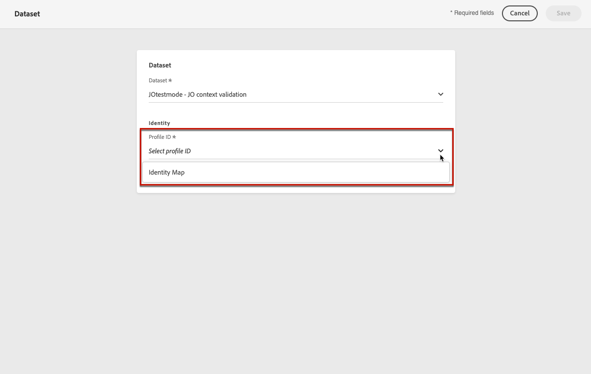

# 配置报表以进行实验 {#reporting-configuration}

>[!CONTEXTUALHELP]
>id="ajo_admin_reporting_config"
>title="设置报表数据集"
>abstract="利用报表配置，可检索将在营销活动报表的“目标”选项卡中使用的其他量度。 该操作必须由技术用户执行。"

>[!CONTEXTUALHELP]
>id="ajo_admin_reporting_dataset"
>title="选择数据集"
>abstract="您只能选择一个事件类型数据集，该数据集必须至少包含一个受支持的字段组：应用程序详细信息、商务详细信息、Web详细信息。"

<!--The reporting data source configuration allows you to define a connection to a system in order to retrieve additional information that will be used in your reports.-->

报表数据源配置允许您检索将在 **[!UICONTROL Objectives]** 选项卡。 [了解详情](content-experiment.md#objectives-global)

>[!NOTE]
>
>报告配置必须由技术用户执行。 <!--Rights?-->

对于此配置，您需要添加一个或多个数据集，其中包含要用于报表的其他元素。 为此，请按照 [下面](#add-datasets).

<!--
➡️ [Discover this feature in video](#video)
-->

## 先决条件

必须先创建该数据集，然后才能将数据集添加到报表配置中。 在 [Adobe Experience Platform 文档](https://experienceleague.adobe.com/docs/experience-platform/catalog/datasets/user-guide.html?lang=zh_Hans#create){target=&quot;_blank&quot;}中了解更多信息。

* 您只能添加事件类型数据集。

* 这些数据集必须至少包含以下任一数据集 [字段组](https://experienceleague.adobe.com/docs/experience-platform/xdm/tutorials/create-schema-ui.html?lang=zh_Hans#field-group){target=&quot;_blank&quot;}: **应用程序详细信息**, **商务详细信息**, **Web详细信息**.

   >[!NOTE]
   >
   >当前仅支持这些字段组。

   例如，如果您想要了解电子邮件促销活动对商务数据（如购买或订购）的影响，则需要使用 **商务详细信息** 字段组。

   同样，如果要报告移动设备交互情况，您需要使用 **应用程序详细信息** 字段组。

   将列出与每个字段组对应的量度 [此处](#objective-list).

* 您可以将这些字段组添加到一个或多个架构中，这些架构将用于一个或多个数据集。

>[!NOTE]
>
>在 [XDM 系统概述文档](https://experienceleague.adobe.com/docs/experience-platform/xdm/home.html?lang=zh_Hans){target=&quot;_blank&quot;}中了解关于 XDM 架构和字段组的更多信息。

## 对应于每个字段组的目标 {#objective-list}

下表显示了要添加到 **[!UICONTROL Objectives]** 选项卡。

| 字段组 | 目标 |
|--- |--- |
| 商务详细信息 | 总价 付款金额 （独特）结账 （唯一）产品列表添加 （唯一）产品列表打开 （唯一）删除产品列表 （唯一）产品列表视图 （独特）产品查看 （独特）购买 （唯一）为延迟保存 产品总价 产品数量 |
| 应用程序详细信息 | （唯一）应用程序启动次数 首次应用程序启动次数 （唯一）应用程序安装 （独特）应用程序升级 |
| Web详细信息 | （独特）页面查看次数 |

## 添加数据集 {#add-datasets}

1. 从 **[!UICONTROL ADMINISTRATION]** 菜单中，选择 **[!UICONTROL Configurations]**。在 **[!UICONTROL Reporting]** 部分中，单击 **[!UICONTROL Manage]**。

   

   此时会显示已添加的数据集列表。

1. 在 **[!UICONTROL Dataset]** 选项卡中，单击 **[!UICONTROL Add dataset]**。

   

   >[!NOTE]
   >
   >如果选择 **[!UICONTROL System dataset]** 选项卡，将仅显示由系统创建的数据集。您将无法添加其他数据集。

1. 从 **[!UICONTROL Dataset]** 下拉列表中，选择要用于报表的数据集。

   >[!CAUTION]
   >
   >您只能选择事件类型数据集，该数据集必须至少包含一个受支持的 [字段组](https://experienceleague.adobe.com/docs/experience-platform/xdm/tutorials/create-schema-ui.html#field-group){target=&quot;_blank&quot;}: **应用程序详细信息**, **商务详细信息**, **Web详细信息**. 如果选择的数据集与这些条件不匹配，您将无法保存所做的更改。

   

   在 [Adobe Experience Platform 文档](https://experienceleague.adobe.com/docs/experience-platform/catalog/datasets/overview.html?lang=zh_Hans){target=&quot;_blank&quot;}中了解关于数据集的更多信息。

1. 从 **[!UICONTROL Profile ID]** 下拉列表中，选择用于标识报表中每个配置文件的数据集字段属性。

   

   >[!NOTE]
   >
   >只显示可用于报表的 ID。

1. 默认启用 **[!UICONTROL Use Primary ID namespace]** 选项。如果选择的 **[!UICONTROL Profile ID]** 是 **[!UICONTROL Identity Map]**，则可以禁用此选项，然后从显示的下拉列表中选择其他命名空间。

   

   在 [Adobe Experience Platform 文档](https://experienceleague.adobe.com/docs/experience-platform/identity/namespaces.html?lang=zh-Hans){target=&quot;_blank&quot;}中了解关于命名空间的更多信息。

1. 保存您所做的更改，以将选定的数据集添加到报表配置列表。

   >[!CAUTION]
   >
   >如果您选择了非事件类型的数据集，则将无法继续。

现在，在生成营销活动报表时，您可以看到与您添加的数据集中使用的字段组对应的量度。 转到 **[!UICONTROL Objectives]** 选项卡，然后选择所选的量度以优化报表。 [了解详情](content-experiment.md#objectives-global)

>[!NOTE]
>
>如果添加多个数据集，则所有数据集中的所有数据都将可用于报表。

<!--
## How-to video {#video}

Understand how to configure Experience Platform reporting data sources.

>[!VIDEO]()
-->
