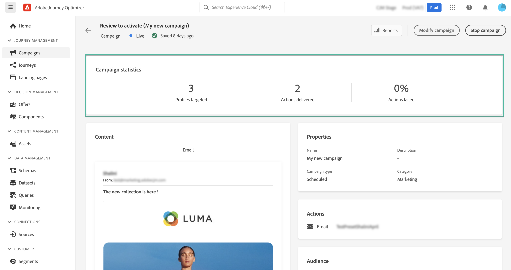

# 查看并激活操作营销活动 {#action-campaign-review}

配置操作活动后，您需要先查看其参数和内容，然后才能激活它。 为此，请执行以下步骤：

>[!IMPORTANT]
>
> 如果您的营销活动受批准政策的约束，则需要请求批准才能发送营销活动。 [了解详情](../test-approve/gs-approval.md)

1. 在营销活动配置屏幕中，单击&#x200B;**[!UICONTROL 查看以激活]**&#x200B;以显示营销活动摘要。

   

1. 系统会显示营销活动配置摘要，以便您检查是否有任何参数不正确或缺失，并在必要时修改营销活动。

   如果出现错误，则无法激活营销活动。 请先解决错误，然后再继续。

   

1. 检查营销活动是否正确配置，然后单击&#x200B;**[!UICONTROL 激活]**。

1. 营销活动已激活。 其状态为&#x200B;**[!UICONTROL 实时]**，或者&#x200B;**[!UICONTROL 已计划]**（如果您输入了开始日期）。 在营销活动中配置的消息将立即发送或在指定日期发送。

   **[!UICONTROL 已完成]**&#x200B;状态将在营销活动3天后自动分配给营销活动，如果营销活动定期执行，则会在营销活动的结束日期分配。 [了解有关营销活动状态的更多信息](manage-campaigns.md#statuses)。

   如果未指定结束日期，则营销活动会保持&#x200B;**[!UICONTROL 实时]**&#x200B;状态。 要更改此项，您需要手动停止营销活动。 [了解如何停止营销活动](manage-campaigns.md)

1. 激活营销策划后，您可以随时通过打开它来检查其信息。 利用该摘要，可获取有关定向的用户档案以及已投放和失败操作数的统计信息。

   通过单击&#x200B;**[!UICONTROL 报告]**&#x200B;按钮，您还可以在专用报告中获取其他统计信息。 [了解详情](../reports/campaign-global-report-cja.md)

   
