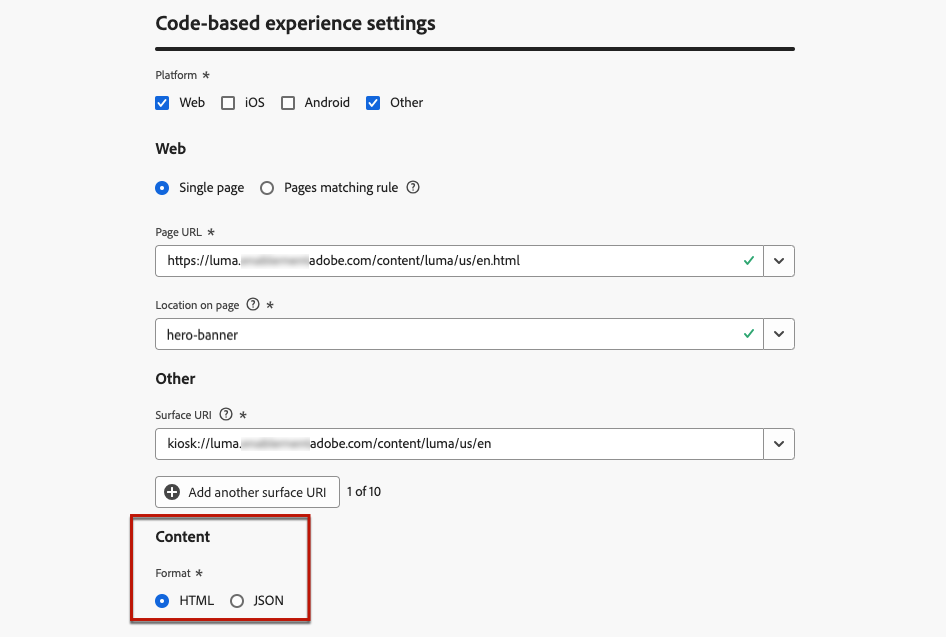

# 配置基于代码的体验 {#code-based-configuration}

>[!CONTEXTUALHELP]
>id="ajo_code_based_surface"
>title="定义基于代码的体验配置"
>abstract="基于代码的配置定义了应用程序内部的路径和位置，由应用程序实施中的 URI 唯一标识，而内容则会在该路径和位置传送和使用。"

在[构建体验](create-code-based.md)之前，您需要创建基于代码的体验配置，在其中定义内容在应用程序中的交付和使用位置。

基于代码的体验配置必须引用表面，它基本上是您要呈现更改的位置。 根据所选平台，您需要输入位置/路径或完整表面URI。 [了解详情](#surface-definition)

## 创建一个基于代码的体验配置 {#create-code-based-configuration}

>[!CONTEXTUALHELP]
>id="ajo_admin_location"
>title="指明页面或应用程序里的具体位置"
>abstract="此字段指定了您希望用户访问的页面或应用程序内的确切目标。它可以是网页内的特定部分，也可以是应用程序导航结构深处的页面。"

>[!CONTEXTUALHELP]
>id="ajo_admin_default_mobile_url"
>title="定义内容创建和预览的 URL"
>abstract="该字段可确保该规则生成或匹配的页面具有指定的 URL，这对于有效地创建和预览内容至关重要。"

要创建基于代码的体验渠道配置，请执行以下步骤：

1. 访问&#x200B;**[!UICONTROL 渠道]** > **[!UICONTROL 常规设置]** > **[!UICONTROL 渠道配置]**&#x200B;菜单，然后单击&#x200B;**[!UICONTROL 创建渠道配置]**。

   

1. 输入配置的名称和说明（可选）。

   >[!NOTE]
   >
   > 名称必须以字母(A-Z)开头。 它只能包含字母数字字符。 您还可以使用下划线`_`、点`.`和连字符`-`字符。

1. 要为配置分配自定义或核心数据使用标签，您可以选择&#x200B;**[!UICONTROL 管理访问权限]**。 [了解有关对象级访问控制(OLAC)的更多信息](../administration/object-based-access.md)

1. 选择&#x200B;**[!UICONTROL 营销操作]**&#x200B;以使用此配置将同意策略关联到消息。 所有与营销活动相关的同意政策均可利用，以尊重客户的偏好。 [了解详情](../action/consent.md#surface-marketing-actions)

1. 选择&#x200B;**基于代码的体验**&#x200B;渠道。

   

1. 选择要应用代码库体验的平台：

   * [Web](#web)
   * [iOS和/或Android](#mobile)
   * [其他](#other)

   >[!NOTE]
   >
   >您可以选择多个平台。 当选择多个平台时，内容将交付到所有选定的页面或应用程序。

1. 为此特定位置选择应用程序所需的格式。 在营销活动和历程中创作基于代码的体验时，将使用此功能。

   

1. 单击&#x200B;**[!UICONTROL 提交]**&#x200B;以保存更改。

当在营销活动和历程中[创建基于代码的体验](create-code-based.md)时，您现在可以选择此配置。

>[!NOTE]
>
>您的应用程序实施团队负责发出显式API或SDK调用，以获取选定基于代码的体验配置中定义的界面的内容。 在[本节](code-based-implementation-samples.md)中了解关于不同客户实施的更多信息。

### Web 平台 {#web}

>[!CONTEXTUALHELP]
>id="ajo_admin_default_web_url"
>title="定义内容创作和预览的 URL"
>abstract="该字段可确保该规则生成或匹配的页面具有指定的 URL，这对于有效地创建和预览内容至关重要。"

要为Web平台定义基于代码的体验配置设置，请执行以下步骤。

1. 选择以下选项之一：

   * **[!UICONTROL 单页]** — 如果要将更改仅应用于单个页面，请输入&#x200B;**[!UICONTROL 页面URL]**。

     

   * **[!UICONTROL 页面匹配规则]** — 若要定位多个匹配同一规则的URL，请构建一个或多个规则。 [了解详情](../web/web-configuration.md#web-page-matching-rule)

     <!--This could be used to apply changes universally across a website, such as updating a hero banner across all pages or adding a top image to display on every product page.-->

     例如，如果您要编辑显示在Luma网站的所有女性产品页面上的元素，请选择&#x200B;**[!UICONTROL 域]** > **[!UICONTROL 开头为]** > `luma`和&#x200B;**[!UICONTROL 页面]** > **[!UICONTROL 包含]** > `women`。

     

1. 以下内容适用于预览URL：

   * 如果输入了单页URL，则该URL将用于预览 — 无需输入其他URL。
   * 如果选择了与规则](../web/web-configuration.md#web-page-matching-rule)匹配的[页面，则必须输入用于预览浏览器体验的&#x200B;**[!UICONTROL 默认创作和预览URL]**。 [了解详情](test-code-based.md#preview-on-device)

     

1. **[!UICONTROL 页面]**&#x200B;上的位置字段指定了您希望用户访问的页面内的确切目标。 它可以是网站导航结构中的某个页面上的特定部分，例如“hero-banner”或“product-rail”。

   >[!CAUTION]
   >
   >在此字段中输入的字符串或路径必须与在应用程序或页面实施中声明的字符串或路径匹配。 这可确保将内容交付到指定应用程序或页面内的所需位置。 [了解详情](code-based-surface.md#uri-composition)

   

### 移动设备平台（iOS 和 Android） {#mobile}

>[!CONTEXTUALHELP]
>id="ajo_admin_app_id"
>title="提供您的应用程序 ID"
>abstract="输入应用程序 ID，以便在应用程序的运行环境中进行准确识别和配置，确保无缝集成和功能。"

>[!CONTEXTUALHELP]
>id="ajo_admin_mobile_url_preview"
>title="输入预览内容的 URL"
>abstract="此字段对于在您的应用程序中直接在设备上启用内容的模拟和预览至关重要。"

要为移动平台定义基于代码的体验配置设置，请执行以下步骤。

1. 输入您的&#x200B;**[!UICONTROL 应用程序ID]**。 这允许在应用程序的操作环境中进行准确的识别和配置，并确保无缝集成和功能。

1. 提供应用程序&#x200B;]**中的**[!UICONTROL &#x200B;位置或路径。 此字段指定您希望用户访问的应用程序内的确切目标。 它可以是应用程序导航结构深处的特定部分或页面，例如“hero-banner”或“product-rail”。

   

1. 填写&#x200B;**[!UICONTROL 预览URL]**&#x200B;字段以启用设备上预览。 此URL通知预览服务在设备上触发预览时要使用的特定URL。 [了解详情](test-code-based.md#preview-on-device)

   预览URL是由应用程序开发人员在您的应用程序中配置的深层链接。 这可确保在应用程序中（而不是在移动Web浏览器中）打开任何与深层链接方案匹配的URL。 请联系您的应用程序开发人员，以获取为您的应用程序配置的深层链接方案。

+++  以下资源可帮助您为应用程序实施配置深层链接

   * 对于Android：

      * [创建与应用程序上下文的深层链接](https://developer.android.com/training/app-links/deep-linking)

   * 对于iOS：

      * [为您的应用程序定义自定义 URL 方案](https://developer.apple.com/documentation/xcode/defining-a-custom-url-scheme-for-your-app)

      * [在您的应用程序中支持通用链接](https://developer.apple.com/documentation/xcode/supporting-universal-links-in-your-app)

+++

   >[!NOTE]
   >
   >如果您在预览体验时遇到问题，请参阅[本文档](https://experienceleague.adobe.com/en/docs/experience-platform/assurance/troubleshooting#app-does-not-open-link)。

### 其他平台 {#other}

要为其他平台（如视频控制台、电视连接设备、智能电视、网亭、ATM、语音助手、物联网设备等）定义基于代码的体验配置设置，请执行以下步骤。

1. 如果您的实现不适用于Web、iOS或Android，或者需要定位特定的URI，请选择&#x200B;**[!UICONTROL Other]**&#x200B;作为平台。

1. 输入&#x200B;**[!UICONTROL 表面URI]**。 表面URI是一个唯一标识符，对应于您要交付体验的实体。 [了解详情](code-based-surface.md#surface-uri)

   

   >[!CAUTION]
   >
   >确保输入的表面URI与您自己的实施中使用的表面URI相匹配。 否则，将无法交付更改。 [了解详情](code-based-surface.md#uri-composition)

1. **[!UICONTROL 如果需要，添加其他表面URI]**。 您最多可以添加10个URI。

   >[!NOTE]
   >
   >添加多个URI时，内容将传递到列出的所有组件。
