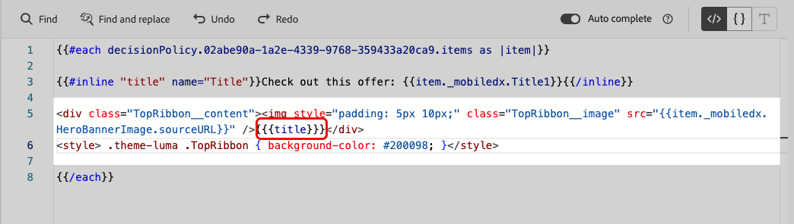
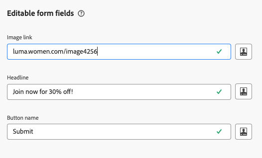

# 在基于代码的体验中使用可编辑的表单字段 {#code-based-form-fields}

为了更加灵活地控制基于代码的体验，[!DNL Journey Optimizer]允许您的开发团队创建包含特定预定义可编辑字段的JSON或HTML内容模板。

在创建基于代码的体验时，非技术性营销人员随后可以直接在界面中编辑这些字段，而无需甚至打开个性化编辑器，或触摸其历程或营销活动中的任何其他代码元素。

此功能为营销用户提供简化的体验，同时允许开发人员更好地控制代码内容，从而减少出错的空间。

## 了解表单字段语法 {#form-field-syntax}

要使HTML或JSON代码有效负载的某些部分可编辑，必须在表达式编辑器中使用特定语法。 这涉及声明一个具有默认值的&#x200B;**变量**，用户在将内容模板应用于其基于代码的体验后，可以覆盖该默认值。

例如，假设您要创建一个内容模板以将其应用于基于代码的体验，并允许用户自定义在不同位置使用的特定颜色，如框架或按钮的背景颜色。

创建内容模板时，您需要声明一个具有&#x200B;**唯一ID**&#x200B;的变量，例如“*color*”，并在内容中要应用此颜色的所需位置调用它。

将内容模板应用于其内容时，用户将能够自定义在任何引用变量的位置使用的颜色。

## 向 HTML 或 JSON 内容模板中添加可编辑字段 {#add-editable-fields}

>[!CONTEXTUALHELP]
>id="ajo_cbe_preview_form_fields"
>title="检查表单字段的渲染"
>abstract="在 JSON 或 HTML 内容模板中，您可以定义特定的可编辑字段，使非技术用户也能轻松编辑基于代码的内容体验，而无需修改代码。使用专用语法创建这些字段，并通过此按钮预览效果。"

若要使您的某些JSON或HTML代码可编辑，请先创建基于代码的体验[内容模板](../content-management/content-templates.md)，您可以在其中定义特定表单字段。

>[!NOTE]
>
>此步骤通常由开发人员角色执行。

➡️ [在此视频中了解如何将可编辑字段添加到基于代码的体验模板](#video)

1. 创建内容模板并选择&#x200B;**[!UICONTROL 基于代码的体验]**&#x200B;渠道。 [了解如何创建模板](../content-management/create-content-templates.md)

1. 选择创作模式：HTML或JSON。

   >[!CAUTION]
   >
   >更改创作模式将导致当前所有代码丢失。 基于此模板的基于代码的体验需要使用相同的创作模式。

1. 打开[个性化编辑器](../personalization/personalization-build-expressions.md)以编辑您的代码内容。

1. 要定义可编辑的表单字段<!--To declare the variable you want users to edit-->，请导航到左侧导航窗格中的&#x200B;**[!UICONTROL 帮助程序功能]**&#x200B;菜单，并添加&#x200B;**内联**&#x200B;属性。 用于声明和调用变量的语法会自动添加到内容中。

   {width="85%"}

1. 将`"name"`替换为唯一ID以标识可编辑字段。 例如，输入“imgURL”。

   >[!NOTE]
   >
   >字段ID必须是唯一的，并且不能包含空格。 此ID应在您的内容中要显示变量值的任意位置使用。

1. 通过添加下表中详述的参数来调整语法以符合您的需求：

   | 操作 | 参数 | 示例 |
   | ------- | ------- | ------- |
   | 使用&#x200B;**默认值**&#x200B;声明可编辑字段。 将模板添加到内容时，如果您不对其进行自定义，则使用此默认值。 | 在内联标记之间添加默认值。 | `{{#inline "editableFieldID"}}default_value{{/inline}}` |
   | 为可编辑字段定义&#x200B;**标签**。 编辑模板的字段时，此标签将显示在代码编辑器中。 | `name="title"` | `{{#inline "editableFieldID" name="title"}}default_value{{/inline}}` |

   <!--
    | Action | Parameter| Example |
    | ------- | ------- | ------- |
    |Declare an editable field containing an **image source** that needs to be published.|`assetType="image"`|`{{#inline "editableFieldID" assetType="image"}}default_value{{/inline}}`|
    |Declare an editable field containing an **URL** that needs to be tracked.br/>Note that out-of-the-box "Mirror page URL" and "Unsubscribe link" predefined blocks cannot become editable fields.>|`assetType="url"`|`{{#inline "editableFieldID" assetType="url"}}default_value{{/inline}}`|
    -->

1. 单击&#x200B;**[!UICONTROL 预览表单字段]**&#x200B;查看可编辑表单字段在应用此模板的基于代码的体验中的显示方式。

   {width="85%"}

1. 在代码中要显示可编辑字段值的每个位置使用`{{{name}}}`语法。 将`name`替换为之前定义的字段的唯一ID。

   {width="85%"}

1. 以类似方式继续添加其他可编辑字段，每个字段都使用`{{#inline}}`和`{{/inline}}`标记进行封装。

1. 根据需要编辑其余代码，包括与定义的可编辑字段对应的ID。 [了解如何操作](create-code-based.md#edit-code)

   

1. 保存模板。

### 在可编辑字段表单中使用决策策略 {#decision-policy-in-form-fields}

创建基于代码的体验内容模板时，您可以使用决策策略来利用可编辑表单字段中的选件。

1. 创建基于代码的体验模板，如上面[所述](#add-editable-fields)。

1. 使用版本屏幕右边栏中的&#x200B;**[!UICONTROL Show Decisioning]**&#x200B;图标，或者使用左侧菜单&#x200B;**[!UICONTROL 决策策略]**&#x200B;部分的表达式编辑器单击&#x200B;**[!UICONTROL 添加决策策略]**。

   在[本节](../experience-decisioning/create-decision.md#add-decision)中了解如何创建决策策略。

1. 单击&#x200B;**[!UICONTROL 插入策略]**&#x200B;按钮。 将添加与决策策略对应的代码。

   

1. 在`{{#each}}`标记之后，使用上面&#x200B;**描述的** inline[语法，插入与要添加的可编辑表单字段对应的代码](#add-editable-fields)。 将`"name"`替换为唯一ID以标识可编辑的字段。 在此示例中，使用“title”。

   {width="90%"}

1. 单击&#x200B;**[!UICONTROL 预览表单字段]**&#x200B;查看可编辑表单字段在应用此模板的基于代码的体验中的显示方式。

   {width="70%"}

1. 将其余代码插入到`{{/each}}`标记上方。 在代码中要显示可编辑字段值的每个位置使用`{{{name}}}`语法。 在此示例中，将`name`替换为“title”。

   {width="85%"}

1. 保存模板。

### 代码示例 {#code-examples}

以下是JSON和HTML模板的一些示例，其中一些模板包括决策策略。

**JSON模板：**

```
{{#inline "title" name="Title"}}Best gear for winter is here for you!{{/inline}} 
{{#inline "description" name="Description"}}Add description{{/inline}} 
{{#inline "imgURL" name="Image Link"}}Add link{{/inline}} 
{{#inline "number_of_items" name="Number of items"}}23{{/inline}}

{
  "title": "{{{title}}}",
  "description": "{{{description}}}",
  "imageUrl": "{{{imgURL}}}",
  "number_of_items": {{{number_of_items}}}, 
  "code": "DEFAULT"
}
```

>[!NOTE]
>
>引用JSON有效负载中的内联字段时：
>
>* 字符串类型的字段必须用双引号引住。
>* 整数或布尔值不能用双引号括起来。 （请参阅上述示例中的`number_of_items`字段。）

具有决策的&#x200B;**JSON模板：**

```
{ 
"offer": [ 
{{#each decisionPolicy.fff709b7-7fef-4e4e-83d7-594fbcf196c1.items as |item|}} 
{{#inline "title" name="Title"}}{{item._mobiledx.Title1}}{{/inline}} {{#inline "description" name="Description"}}{{item._mobiledx.Title2}}{{/inline}} {{#inline "imgURL" name="Image Link"}}https://luma.enablementadobe.com/content/luma/us/en/experience/warming-up/_jcr_content/root/hero_image.coreimg.jpeg{{/inline}} 

{ 
"title": "{{{title}}}", 
"description": "{{{description}}}", 
"imageUrl": "{{{imgURL}}}", 
"link": "https://lumaenablement.adobe.com/web/luma/home", "code": "DEFAULT" 
}, 
{{/each}}
] 
}
```

>[!NOTE]
>
>您要使用决策项目的内联字段需要放在决策策略块中 — 介于`{{#each}}`和`{{/each}}`标记之间。

**HTML模板：**

```
{{#inline "title" name="Title"}}Please enter title here{{/inline}} 
{{#inline "imgSrc" name="Image link"}}{{/inline}} 

<div class="TopRibbon__content">{{{title}}}</div> 
<style> .theme-luma .TopRibbon { background-color: #200098; }</style>
```

带有决策的&#x200B;**HTML模板：**

```
{{#each decisionPolicy.f112884a-5654-43ad-9d6d-dbd32ae23ee6.items as |item|}} 
{{#inline "title" name="Title"}}Title is: {{item._mobiledx.Title1}}{{/inline}} 

<div class="TopRibbon__content">{{{title}}}</div> 
<style> .theme-luma .TopRibbon { background-color: #200098; }</style> 

{{/each}}
```

## 在基于代码的体验中编辑表单字段 {#edit-form-fields}

>[!CONTEXTUALHELP]
>id="ajo_code_based_form_fields"
>title="什么是表单字段？"
>abstract="此基于代码的体验包含表单字段，您可以在个性化编辑器中轻松编辑这些字段，而无需修改代码。"

现在创建了包含预定义的可编辑表单字段的内容模板，您可以使用此内容模板构建基于代码的体验。

无需打开个性化编辑器，即可从基于代码的体验历程或营销活动中轻松编辑表单字段。

>[!NOTE]
>
>此步骤通常由营销人员角色执行。

1. 从历程活动或营销活动版屏幕中，选择包含可编辑表单字段的内容模板。 [了解如何使用内容模板](../content-management/use-content-templates.md)

   {width="60%"}

   >[!CAUTION]
   >
   >根据预先选择的渠道配置，可供选择的模板将范围限定为HTML或JSON。 仅显示兼容的模板。

1. 右侧窗格中提供了在选定内容模板中预定义的字段。<!--The code preview is displayed with the rest of the code.-->

   

1. 从&#x200B;**[!UICONTROL 可编辑表单字段]**&#x200B;部分，您可以：

   * 直接在可编辑字段中编辑每个值，而无需打开代码编辑器。

   {width="60%"}

   * 单击个性化图标以使用[代码编辑器](../personalization/personalization-build-expressions.md)编辑每个字段。

   {width="70%"}

   >[!NOTE]
   >
   >在这两种情况下，您一次只能编辑一个字段，并且无法编辑其余基于代码的体验内容。

1. 如果向内容模板添加了[决策策略](#decision-policy-in-form-fields)，则该策略将包含[优惠目录架构](../experience-decisioning/catalogs.md)中可用的所有属性。 您可以内联或使用表达式编辑器编辑决策项。

1. 要编辑其余代码，请单击&#x200B;**[!UICONTROL 编辑代码]**&#x200B;按钮并更新完整的基于代码的体验内容，包括可编辑的表单字段。 [了解详情](create-code-based.md#edit-code)

## 操作方法视频 {#video}

了解如何将可编辑字段添加到基于代码的体验渠道内容模板。

>[!VIDEO](https://video.tv.adobe.com/v/3463990/?learn=on&#x26;enablevpops)
