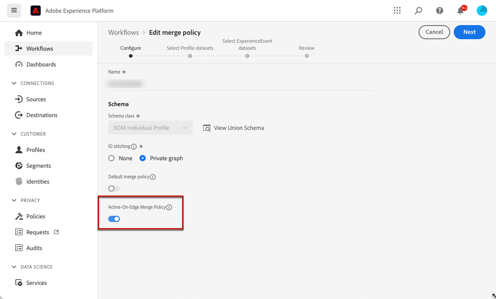

# 基于代码的体验先决条件 {#code-based-prerequisites}

>[!BEGINSHADEBOX]

**在此页面上：**&#x200B;查看向您的应用和网页提供基于代码的体验所需的实施、交付和报表先决条件。

>[!ENDSHADEBOX]

要在[!DNL Journey Optimizer]中使用基于代码的体验操作并交付应用程序可以使用的代码内容有效负载，请遵循以下先决条件：

* 要向应用程序添加修改，您必须具有特定的实施。 [了解详情](#implementation-prerequisites)

* 为了正确交付基于代码的体验，请确保在[此处](#delivery-prerequisites)详细定义Adobe Experience Platform设置。

* 要使数据显示在基于代码的体验报表中，请确保遵循以下[报告先决条件](#reporting-prerequisites)。

* 创建基于[代码的体验渠道配置](code-based-configuration.md)时，请确保输入的字符串/路径或表面URI与您自己的实施中声明的字符串/路径或表面URI匹配。 这可确保将内容交付到指定应用程序或页面内的所需位置。 否则，将无法交付更改。 [了解详情](code-based-surface.md)

>[!CAUTION]
>
>将假名配置文件（未经身份验证的访客）与基于代码的体验进行定位时，请考虑为自动删除配置文件设置生存时间(TTL)，以管理可参与配置文件计数和相关成本。 [了解详情](../start/guardrails.md#profile-management-inbound)

## 实施先决条件 {#implementation-prerequisites}

基于代码的体验支持任何类型的客户实施，如以下选项中所示。 可以为属性使用客户端、服务器端或混合实施方法：

* 仅客户端 — 若要向网页或移动应用程序添加修改，您需要在网站上实施[Adobe Experience Platform Web SDK](https://experienceleague.adobe.com/docs/platform-learn/implement-web-sdk/overview.html?lang=zh-Hans){target="_blank"}，或在移动应用程序上实施[Adobe Experience Platform Mobile SDK](https://developer.adobe.com/client-sdks/edge/adobe-journey-optimizer/code-based/tutorial){target="_blank"}。

* 混合模式 — 您可以使用[AEP Edge Network服务器API](https://experienceleague.adobe.com/docs/experience-platform/edge-network-server-api/data-collection/interactive-data-collection.html?lang=zh-Hans){target="_blank"}来请求在服务器端进行个性化；响应将提供给Adobe Experience Platform Web SDK以渲染客户端所做的修改。 请参阅Adobe Experience Platform [Edge Network Server API文档](https://experienceleague.adobe.com/docs/experience-platform/edge-network-server-api/overview.html?lang=zh-Hans){target="_blank"}以了解详情。 您可以在[这篇博客文章](https://blog.developer.adobe.com/hybrid-personalization-in-the-adobe-experience-platform-web-sdk-6a1bb674bf41){target="_blank"}中找到有关混合模式的详细信息并查看一些实施示例。

* 服务器端 — 您可以使用[AEP Edge Network服务器API](https://experienceleague.adobe.com/docs/experience-platform/edge-network-server-api/data-collection/interactive-data-collection.html?lang=zh-Hans){target="_blank"}来请求在服务器端进行个性化。 您的开发团队必须处理响应并在应用程序实施中在客户端渲染修改。

您可以在[此部分](code-based-implementation-samples.md)中找到上述每个实现方法的示例。

## 投放先决条件 {#delivery-prerequisites}

要正确交付基于代码的体验，必须定义以下设置：

* 在[Adobe Experience Platform数据收集](https://experienceleague.adobe.com/docs/experience-platform/edge/datastreams/overview.html?lang=zh-Hans){target="_blank"}中，确保您定义了数据流，例如在&#x200B;**[!UICONTROL Adobe Experience Platform]**&#x200B;服务下启用了&#x200B;**[!UICONTROL Adobe Journey Optimizer]**&#x200B;选项。

  这可确保Adobe Experience Platform Edge正确处理Journey Optimizer入站事件。 [了解详情](https://experienceleague.adobe.com/docs/experience-platform/edge/datastreams/configure.html?lang=zh-Hans){target="_blank"}

  

* 在[Adobe Experience Platform](https://experienceleague.adobe.com/docs/experience-platform/profile/home.html?lang=zh-Hans){target="_blank"}中，确保您有一个启用了&#x200B;**[!UICONTROL Edge上活动合并策略]**&#x200B;选项的合并策略。 为此，请在&#x200B;**[!UICONTROL 客户]** > **[!UICONTROL 配置文件]** > **[!UICONTROL 合并策略]** Experience Platform菜单下选择一个策略。 [了解详情](https://experienceleague.adobe.com/docs/experience-platform/profile/merge-policies/ui-guide.html?lang=zh-Hans#configure){target="_blank"}

  [!DNL Journey Optimizer]入站渠道使用此合并策略在边缘上正确激活和发布入站营销活动。 [了解详情](https://experienceleague.adobe.com/docs/experience-platform/profile/merge-policies/ui-guide.html?lang=zh-Hans){target="_blank"}

  

* 要对Journey Optimizer Web体验的交付进行故障诊断，您可以使用&#x200B;**Edge Delivery**&#x200B;中的&#x200B;**Adobe Experience Platform Assurance**&#x200B;视图。 利用此插件，您可以详细检查请求调用，验证预期的边缘调用是否按预期发生，并检查配置文件数据，包括身份映射、区段成员资格和同意设置。 此外，您还可以查看请求符合条件的活动，并识别未符合条件的活动。

  使用&#x200B;**Edge Delivery**&#x200B;插件可帮助您获得所需的见解，以便有效了解入站实施并排除其故障。

  [了解有关Edge Delivery视图的更多信息](https://experienceleague.adobe.com/zh-hans/docs/experience-platform/assurance/view/edge-delivery){target="_blank"}

## 报告先决条件 {#reporting-prerequisites}

要为基于代码的渠道启用报告，您需要确保在应用程序实施[数据流](https://experienceleague.adobe.com/docs/experience-platform/datastreams/overview.html?lang=zh-Hans){target="_blank"}中使用的[数据集](../data/get-started-datasets.md)也包含在报告配置中。

换言之，在配置报表时，如果添加的数据集不在应用程序数据流中，则应用程序数据将不会显示在报表中。

在[本节](../reports/reporting-configuration.md#add-datasets)中了解如何添加用于报告的数据集。

>[!NOTE]
>
>该数据集由[!DNL Journey Optimizer]报表系统以只读方式使用，不影响数据收集或数据摄取。

