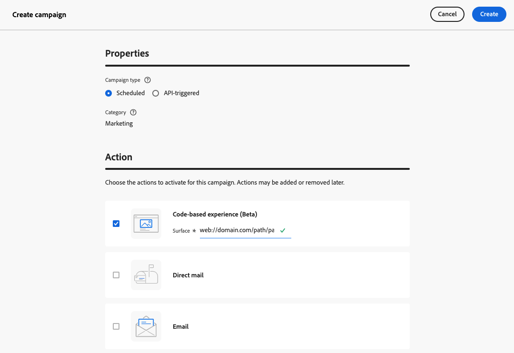

# 创建基于代码的体验 {#create-code-based}

在[!DNL Journey Optimizer]中，您可以在历程或营销策划中创建基于代码的体验。

要详细了解有关基于代码的体验的特定护栏和建议，请参阅[此页面](code-based-prerequisites.md)。

## 通过历程或营销活动添加基于代码的体验 {#create-code-based-experience}

要通过历程或营销活动开始构建基于代码的体验，请执行以下步骤。

>[!BEGINTABS]

>[!TAB 向历程添加基于代码的体验]

要向历程添加基于&#x200B;**代码的体验**&#x200B;活动，请执行以下步骤：

1. [创建历程](../building-journeys/journey-gs.md)。

1. 通过[事件](../building-journeys/general-events.md)或[读取受众](../building-journeys/read-audience.md)活动开始您的历程。

1. 从调色板的&#x200B;**[!UICONTROL 操作]**&#x200B;部分拖放基于&#x200B;**[!UICONTROL 代码的体验]**&#x200B;活动。

   

   >[!NOTE]
   >
   >由于&#x200B;**基于代码的体验**&#x200B;是入站消息活动，因此它附带3天&#x200B;**等待**&#x200B;活动。 [了解详情](../building-journeys/wait-activity.md#auto-wait-node)

1. 为您的消息输入&#x200B;**[!UICONTROL 标签]**&#x200B;和&#x200B;**[!UICONTROL 描述]**。

1. 选择或创建要使用的[基于代码的体验配置](code-based-configuration.md)。

   

1. 选择&#x200B;**[!UICONTROL 编辑内容]**&#x200B;按钮，然后根据需要使用个性化编辑器编辑您的内容。 [了解详情](#edit-code)

   您还可以使用现有内容模板作为代码内容的基础。 请注意，根据预先选择的渠道配置，可供选择的模板将范围限定为HTML或JSON。 [了解如何使用内容模板](../content-management/use-content-templates.md)

1. 如有必要，请通过拖放其他操作或事件来完成旅程流程。 [了解详情](../building-journeys/about-journey-activities.md)

1. 一旦您的代码库体验准备就绪，即可完成配置并发布历程以激活它。 [了解详情](../building-journeys/publishing-the-journey.md)

有关如何配置历程的详细信息，请参阅[此页面](../building-journeys/journey-gs.md)。

>[!TAB 创建基于代码的体验活动]

要通过营销活动开始构建&#x200B;**基于代码的体验**，请执行以下步骤。

1. 创建营销策划。 [了解详情](../campaigns/create-campaign.md)

1. 选择要执行的营销活动类型

   * **[!UICONTROL 已计划 — 营销]**：立即或在指定日期执行营销活动。 计划的营销活动旨在发送&#x200B;**营销**&#x200B;消息。 它们从用户界面配置和执行。

   * **[!UICONTROL API触发 — 营销/事务性]**：使用API调用执行营销活动。 API触发的营销活动旨在发送&#x200B;**营销**&#x200B;或&#x200B;**事务性**&#x200B;消息，即，在个人执行的操作（密码重置、购物车购买等）之后发送的消息。 [了解如何使用API触发营销活动](../campaigns/api-triggered-campaigns.md)

1. 完成步骤以创建营销活动，如营销活动属性、[受众](../audience/about-audiences.md)和[计划](../campaigns/create-campaign.md#schedule)。 有关如何配置营销活动的详细信息，请参阅[此页面](../campaigns/get-started-with-campaigns.md)。

1. 选择&#x200B;**[!UICONTROL 基于代码的体验]**&#x200B;操作。

1. 选择或创建基于代码的体验配置。 [了解详情](code-based-configuration.md)

   

1. 使用个性化编辑器，根据需要编辑您的内容。 [了解详情](#edit-code)

   您还可以使用现有内容模板作为代码内容的基础。 请注意，根据预先选择的渠道配置，可供选择的模板将范围限定为HTML或JSON。 [了解如何使用内容模板](../content-management/use-content-templates.md)

   <!---->

有关如何配置营销活动的详细信息，请参阅[此页面](../campaigns/get-started-with-campaigns.md)。

>[!ENDTABS]

## 编辑代码内容 {#edit-code}

>[!CONTEXTUALHELP]
>id="ajo_code_based_experience"
>title="使用个性化编辑器"
>abstract="插入和编辑要作为此基于代码的体验操作的一部分提供的代码。"
>additional-url="https://experienceleague.adobe.com/docs/journey-optimizer/using/content-management/personalization/expression-editor/personalization-build-expressions.html#" text="开始使用个性化编辑器"

1. 从历程活动或营销活动版本屏幕中，选择&#x200B;**[!UICONTROL 编辑代码]**。

   

1. [个性化编辑器](../personalization/personalization-build-expressions.md)打开。 它是一个非可视化体验创建界面，允许您创作代码。

1. 您可以将创作模式从HTML切换到JSON，反之亦然。

   

   >[!CAUTION]
   >
   >更改创作模式将导致当前代码全部丢失，因此，请确保在开始创作之前切换模式。

1. 根据需要输入代码。 您可以利用[!DNL Journey Optimizer]个性化编辑器及其所有个性化和创作功能。 [了解详情](../personalization/personalization-build-expressions.md)

1. 您可以根据需要添加HTML或JSON表达式片段。 [了解如何操作](../personalization/use-expression-fragments.md)

   您还可以将部分代码内容另存为片段。 [了解如何操作](../content-management/fragments.md#save-as-expression-fragment)

1. 通过基于代码的体验，您可以使用Experience Decisioning功能。 从左栏中选择&#x200B;**[!UICONTROL 决策策略]**&#x200B;图标，然后单击&#x200B;**[!UICONTROL 添加决策策略]**。 [了解详情](../experience-decisioning/create-decision.md)

   

   >[!NOTE]
   >
   >目前，体验决策功能仅面向一部分组织提供（限量发布版）。要获得访问权限，请与 Adobe 代表联系。

1. 单击&#x200B;**[!UICONTROL 保存并关闭]**&#x200B;以确认更改。

现在，一旦您的开发人员进行API或SDK调用以获取渠道配置中定义的表面的内容，更改就会应用于您的网页或应用程序。

## 测试基于代码的体验 {#test-code-based-experience}

>[!CONTEXTUALHELP]
>id="ajo_code_based_preview"
>title="预览基于代码的体验"
>abstract="模拟基于代码的体验将看起来是什么样。"

要显示已修改的基于代码的体验的预览，请执行以下步骤。

>[!CAUTION]
>
>您必须具有可用的测试用户档案，以模拟将向他们投放哪些优惠。 了解如何[创建测试配置文件](../audience/creating-test-profiles.md)。

1. 在历程或营销策划中，从个性化编辑器或编辑内容屏幕中选择&#x200B;**[!UICONTROL 模拟内容]**。

   

1. 单击&#x200B;**[!UICONTROL 管理测试配置文件]**&#x200B;以选择一个或多个测试配置文件。

1. 此时将显示已修改的基于代码的体验预览。

有关如何选择测试用户档案和预览内容的详细信息，请参阅[此部分](../content-management/preview.md)。

### 在设备上预览 {#preview-on-device}

>[!CONTEXTUALHELP]
>id="ajo_code_based_preview_device"
>title="在真实设备上预览基于代码的体验"
>abstract="在您的浏览器或移动设备上预览您的个性化体验，看看它们在真实设备上的显示效果。"

>[!CONTEXTUALHELP]
>id="ajo_code_based_preview_device_web"
>title="在设备上预览基于代码的 Web 体验"
>abstract="扫描二维码或复制链接即可在设备上预览。"

>[!CONTEXTUALHELP]
>id="ajo_code_based_preview_device_mobile"
>title="在移动设备上预览基于代码的体验"
>abstract="扫描二维码或复制链接即可在设备上预览。连接后，在设备上输入密码。每次更新预览链接时，您可能需要重新启动应用程序才能看到更改。"

>[!CONTEXTUALHELP]
>id="ajo_code_based_preview_device_refresh"
>title="刷新预览链接以反映当前视图"
>abstract="设备上的预览将显示您创建或刷新预览链接时的内容。如果您修改了内容或选择了不同的测试轮廓或处理，请刷新预览以使其反映当前视图。"

为网页或移动应用程序构建基于代码的体验时，您可以直接在浏览器或移动设备上预览个性化体验，以了解这些体验在实际设备上的外观。

>[!WARNING]
>
>使用[决策策略](../experience-decisioning/create-decision.md)或[个性化](../personalization/personalization-build-expressions.md)上下文属性时，设备上预览不可用。

1. 在&#x200B;**[!UICONTROL 模拟]**&#x200B;屏幕中，单击&#x200B;**[!UICONTROL 打开预览选项]**&#x200B;按钮。 预览选项取决于[基于代码的配置](code-based-configuration.md#create-code-based-configuration)中选择的平台。

1. 如果您在基于代码的配置中使用[Web平台](code-based-configuration.md#web)，则会使用为当前渠道配置输入的URL预填充&#x200B;**[!UICONTROL 设备预览URL]**&#x200B;只读字段。

   

   您可以：

   * 选择&#x200B;**[!UICONTROL 复制链接]**&#x200B;按钮并将链接粘贴到浏览器选项卡中。 您还可以与团队和利益相关者共享链接，利益相关者可以在更改生效之前在任何浏览器中预览新体验。

   * 单击&#x200B;**[!UICONTROL 在新标签页中打开]**&#x200B;以在当前浏览器中打开链接。

   * 使用移动设备扫描二维码以在移动设备浏览器中打开预览链接。

1. 如果您在基于代码的配置中使用[Mobile Platforms](code-based-configuration.md#mobile) (iOS / Android)，则&#x200B;**[!UICONTROL Deeplink]**&#x200B;只读字段会使用在所选平台的渠道配置中输入的&#x200B;**[!UICONTROL 预览URL]**&#x200B;值预填充。

   在&#x200B;**[!UICONTROL iOS]**&#x200B;和&#x200B;**[!DNL Android]**&#x200B;选项卡之间切换以预览您所选平台的体验。

   

   您可以：

   * 选择&#x200B;**[!UICONTROL 复制链接]**&#x200B;按钮并与您的团队和利益相关者共享该链接，这些利益相关者可以在更改生效之前在任何移动设备浏览器中预览新体验。

   * 使用移动设备扫描二维码以直接在移动设备应用程序中打开预览链接。 您必须在设备上输入PIN才能建立[Assurance](https://experienceleague.adobe.com/en/docs/experience-platform/assurance/tutorials/implement-assurance){target="_blank"}会话。

     >[!NOTE]
     >
     >**Adobe Experience Platform Assurance**&#x200B;是Adobe Experience Cloud的一个产品，可帮助您检查、校对、模拟和验证在移动应用程序中收集数据或提供体验的方式。 [了解详情](https://experienceleague.adobe.com/zh-hans/docs/experience-platform/assurance/home){target="_blank"}

1. 为选定的测试配置文件生成预览链接，如果您在历程或营销活动中使用[内容试验](../content-management/content-experiment.md)，则为选定的处理生成预览链接。

   <!--If you have modified the content or selected a different treatment or test profile, scroll down to the bottom of the **[!UICONTROL Preview on device]** pop-up and click **[!UICONTROL Refresh preview link]** to reflect the current state.

   -->

   <!--When creating a content experiment, you need to select a given treatment and click the **[!UICONTROL Simulate content]** button to obtain the link corresponding to that treatment, then select another treatment, click the **[!UICONTROL Simulate content]** button to obtain a new preview link, and so on.-->

   更新内容或选择其他测试用户档案或治疗时，预览链接会自动刷新。 您可以将链接复制到不同的浏览器选项卡中，并比较体验。

## 让基于代码的体验上线 {#code-based-experience-live}

>[!IMPORTANT]
>
> 如果您的营销活动受批准政策的约束，则需要请求批准才能激活基于代码的体验。 [了解详情](../test-approve/gs-approval.md)

定义基于代码的体验并根据需要使用[基于代码的编辑器](#edit-code)编辑内容后，您可以激活历程或营销活动以使更改对受众可见。

您还可以在基于代码的体验内容上线之前对其进行预览。 [了解详情](#test-code-based-experience)

>[!NOTE]
>
>如果您激活基于代码的历程/营销活动，影响的页面与另一个已上线的历程或营销活动相同，则所有更改将应用于您的内容。
>
>如果多个基于代码的历程或营销活动更新了内容的相同元素，则优先级最高的历程/营销活动优先。

一旦您的基于代码的历程或营销活动上线，您的应用程序实施团队将负责发出显式API或SDK调用，以获取选定[基于代码的体验配置](code-based-configuration.md)中定义的表面的内容。 在[本节](code-based-implementation-samples.md)中了解关于不同客户实施的更多信息。

### Publish基于代码的历程 {#publish-code-based-journey}

要在历程中实时提供基于代码的体验，请执行以下步骤。

1. 验证您的历程是否有效并且没有错误。 [了解详情](../building-journeys/troubleshooting.md#checking-for-errors-before-testing)

1. 在历程中，选择位于右上角的下拉菜单中的&#x200B;**[!UICONTROL Publish]**&#x200B;选项。

   

   >[!NOTE]
   >
   >在[本节](../building-journeys/publishing-the-journey.md)中了解有关发布历程的更多信息。

您的基于代码的历程处于&#x200B;**[!UICONTROL 实时]**&#x200B;状态，现在对所选受众可见。 历程的每个收件人都可以看到您的修改。

>[!NOTE]
>
>单击&#x200B;**[!UICONTROL Publish]**&#x200B;后，最多可能需要15分钟才能使更改生效。

### 激活基于代码的营销活动 {#activate-code-based-campaign}

1. 从基于代码的营销活动中，选择&#x200B;**[!UICONTROL 审阅以激活]**。

   

1. 检查并编辑内容、属性、配置、受众和计划（如果需要）。

1. 选择&#x200B;**[!UICONTROL 激活]**。

   

   >[!NOTE]
   >
   >在[此部分](../campaigns/review-activate-campaign.md)中了解关于激活营销活动的更多信息。

您的基于代码的营销活动处于&#x200B;**[!UICONTROL 实时]**&#x200B;状态，现在对所选受众可见。 营销活动的每个收件人都可以看到您向内容添加的修改。

>[!NOTE]
>
>单击&#x200B;**[!UICONTROL 激活]**&#x200B;后，最多可能需要15分钟才能使更改生效。
>
>如果您为基于代码的营销活动定义了计划，则在到达开始日期和时间之前，该计划的状态为&#x200B;**[!UICONTROL 已计划]**。

## 停止基于代码的历程或营销活动 {#stop-code-based-experience}

当基于代码的体验处于实时状态时，您可以停止它以防止受众看到您的修改。 请按照以下步骤操作。

1. 从相应的列表中选择实时历程或营销策划。

1. 根据您的具体情况执行相关操作：

   * 从营销活动顶部菜单中，选择&#x200B;**[!UICONTROL 停止营销活动]**。

     

   * 从历程顶部菜单中，单击&#x200B;**[!UICONTROL 更多]**&#x200B;按钮，然后选择&#x200B;**[!UICONTROL 停止]**。

     

1. 您添加的修改将不再对您定义的受众可见。

>[!NOTE]
>
>停止基于代码的历程或营销活动后，您将无法再次编辑或激活它。 您只能复制它并激活复制的历程/营销策划。

<!--Reporting TBC

## Check the code-based experience reports {#check-code-based-reports}

Once your code-based experience is live, you can check the **[!UICONTROL Code-based]** tab of the  [Journey report](../reports/journey-global-report-cja.md#web-cja) and [Campaign report](../reports/campaign-global-report-cja.md#web) to compare elements such as the number of experiences delivered to your audience, and the number of engagements with your content.-->

<!--## Code-based reports

You can access code-based journey or campaign reports from the summary screen.

Global reports display events that occurred at least two hours ago and cover events over a selected time period. In comparison, Live reports focus on events that took place within the past 24 hours, with a minimum time interval of two minutes from the event occurrence.

### Code-based live report {#live-report-code-based}

From your campaign **[!UICONTROL Live report]**, the **[!UICONTROL Code-based experience]** tab details the main information relative to your apps or web pages. [Learn more on live report](../reports/campaign-live-report.md)

+++Learn more on the different metrics and widgets available for the Code-based experience report.

The **[!UICONTROL Code-based experience performance]** KPIs detail the main information relative to your visitors' engagement with your code-based experiences, such as:

* **[!UICONTROL Impressions]**: total number of experiences delivered to all users.

* **[!UICONTROL Interactions]**:  total number of engagements with your app/page. This includes any actions taken by the users, such as clicks or any other interactions.

The **[!UICONTROL Code-based experience summary]** graph shows the evolution of your experiences (impressions, unique impressions and interactions) for the last 24 hours.

TBC: The **[!UICONTROL Interactions by element]** table details the main information relative to your visitors' engagement with the various elements on your app/pages.
+++

### Code-based global report {#global-report-code-based}

Code-based campaign global report can be accessed directly from your journey or campaign with the **[!UICONTROL View report]** button. [Learn more on global report](../reports/campaign-global-report-cja.md)

From your Campaign **[!UICONTROL Global report]**, the **[!UICONTROL Code-based experience]** tab details the main information relative to your apps or web pages.

Add image TBC

+++Learn more on the different metrics and widgets available for the Code-based experience report.

The **[!UICONTROL Code-based experience performance]** KPIs detail the main information relative to your visitors' engagement with your experiences, such as:

* **[!UICONTROL Unique impressions]**: number of unique users to whom the experience was delivered.

* **[!UICONTROL Impressions]**: total number of experiences delivered to all users.

* **[!UICONTROL Interactions]**: percentage of engagements with your app/page. This includes any actions taken by the users, such as clicks or any other interactions.

The **[!UICONTROL Code-based experience summary]** graph shows the evolution of your experiences (unique impressions, impressions and interactions) for the concerned period.

TBC: The **[!UICONTROL Interactions by element]** table details the main information relative to your visitors' engagement with the various elements on your apps/pages.
+++

TBC video if existing

## How-to video{#video}

The video below shows how to create a code-based campaign, configure its properties, review, and publish it.

>[!VIDEO]()

-->
