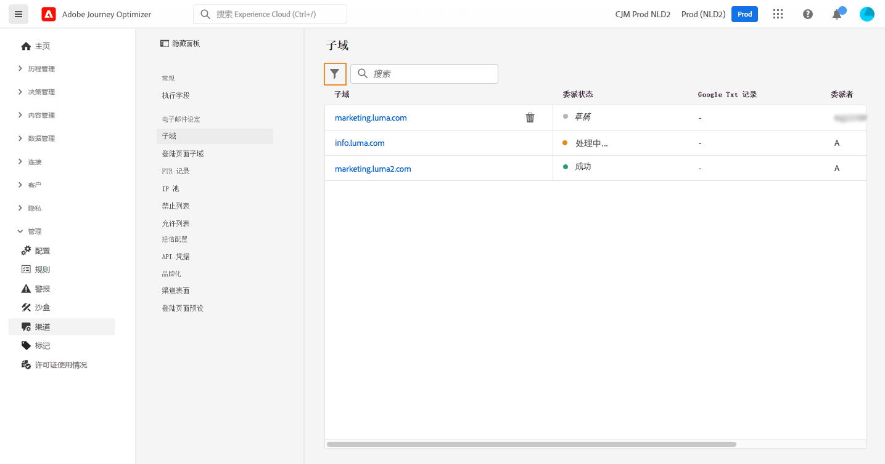

# 访问委派的子域 {#access-delegated-subdomains}

所有委派的子域都显示在 **[!UICONTROL 管理]** > **[!UICONTROL 渠道]** > **[!UICONTROL 子域]** 菜单。 过滤器可帮助您优化列表（委派日期、用户或状态）。

的 **[!UICONTROL 状态]** 列提供有关子域委派过程的信息：

* **[!UICONTROL 草稿]**:子域委派已另存为草稿。 单击子域名以恢复委派过程，
* **[!UICONTROL 处理]**:子域在使用之前会先执行多项配置检查，
* **[!UICONTROL 成功]**:子域已成功完成检查，并可用于投放消息。
* **[!UICONTROL 失败]**:提交子域委派后，一个或多个检查失败。

要访问有关子域的详细信息，请从列表中将其打开。 您可以：

* 检索在委派过程中配置的子域名（只读），以及生成的URL（资源、镜像页面、跟踪URL），

* 将Google站点验证TXT记录添加到子域，以确保对其进行验证(请参阅 [将Google TXT记录添加到子域](google-txt.md))。

