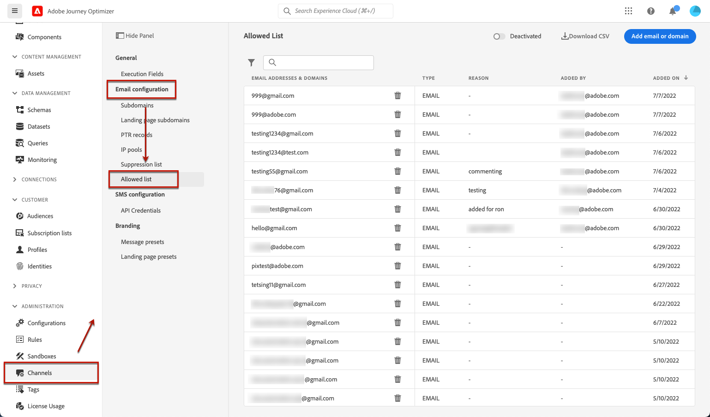

# 允许列表 {#allow-list}

可以在 [沙盒](../administration/sandboxes.md) 级别。

利用此允许列表，可指定单独的电子邮件地址或域，这些地址或域将是唯一有权接收您从特定沙盒发送的电子邮件的收件人或域。

>[!NOTE]
>
>此功能适用于生产沙箱和非生产沙箱。

例如，在可能发生错误的非生产实例上，允许列表可确保您没有向真实客户地址发送不需要的消息的风险，从而为测试提供安全的环境。

此外，当允许列表处于活动状态但为空时，不会发出任何邮件。 因此，如果您遇到一些主要问题，可以使用此功能阻止所有来自 [!DNL Journey Optimizer] 直到你解决问题。 了解 [允许列表逻辑](#logic).

>[!CAUTION]
>
>此功能仅适用于电子邮件渠道。

## 访问允许列表 {#access-allowed-list}

要访问允许的电子邮件地址和域的详细列表，请转到 **[!UICONTROL Administration]** > **[!UICONTROL Channels]** > **[!UICONTROL Email configuration]**，然后选择 **[!UICONTROL Allowed list]**.



>[!CAUTION]
>
>查看、导出和管理允许列表的权限限制为 [历程管理员](../administration/ootb-product-profiles.md#journey-administrator). 了解有关管理的更多信息 [!DNL Journey Optimizer] 用户在 [此部分](../administration/permissions-overview.md).

要将允许列表导出为CSV文件，请选择 **[!UICONTROL Download CSV]** 按钮。

使用 **[!UICONTROL Delete]** 按钮以永久删除条目。

您可以搜索电子邮件地址或域，并在 **[!UICONTROL Address type]**. 选择后，您可以清除列表顶部显示的过滤器。


## 激活允许列表 {#enable-allow-list}

要激活允许列表，请执行以下步骤。

1. 访问 **[!UICONTROL Channels]** > **[!UICONTROL Email configuration]** > **[!UICONTROL Allow list]** 菜单。

1. 单击 **[!UICONTROL Deactivated]**。

   

1. 选择 **[!UICONTROL Activate allowed list]**。允许列表现在处于活动状态。

   

   >[!NOTE]
   >
   >激活允许列表后，该活动会有5分钟的延迟，以便在您的历程和营销活动中生效。

允许列表逻辑在功能处于活动状态时应用。 有关详细信息，请参阅[此部分](#logic)。

>[!NOTE]
>
>激活后，执行允许列表时，以及通过测试消息时，都会使用“测试”功能 [校样](../design/preview.md#send-proofs) 和使用 [测试模式](../building-journeys/testing-the-journey.md).

## 停用允许列表 {#deactivate-allow-list}

要停用允许列表，请执行以下步骤。

1. 访问 **[!UICONTROL Channels]** > **[!UICONTROL Email configuration]** > **[!UICONTROL Allow list]** 菜单。

1. 单击 **[!UICONTROL Active]**。

   

1. 选择 **[!UICONTROL Deactivate allowed list]**。允许列表不再处于活动状态。

   

   >[!NOTE]
   >
   >停用允许列表后，会有5分钟的延迟，以便在您的历程和营销活动中生效。

停用该功能后，允许列表逻辑不适用。 有关详细信息，请参阅[此部分](#logic)。

## 将实体添加到允许列表 {#add-entities}

要向特定沙盒的允许列表添加新的电子邮件地址或域，您可以 [手动填充列表](#manually-populate-list)，或使用 [API调用](#api-call-allowed-list).

>[!NOTE]
>
>允许列表最多可包含1,000个条目。

### 手动填充允许列表 {#manually-populate-list}

>[!CONTEXTUALHELP]
>id="ajo_admin_allowed_list_add"
>title="向允许列表添加地址或域"
>abstract="您可以通过逐一选择新电子邮件地址或域名，手动将其添加到允许列表。"

您可以手动填充 [!DNL Journey Optimizer] 允许列表。

>[!NOTE]
>
>一次只能添加一个电子邮件地址或域。

为此，请执行以下步骤。

1. 选择 **[!UICONTROL Add email or domain]** 按钮。

   

1. 选择地址类型： **[!UICONTROL Email address]** 或 **[!UICONTROL Domain address]**.

1. 输入要向其发送电子邮件的电子邮件地址或域。

   >[!NOTE]
   >
   >请确保输入有效的电子邮件地址(如abc@company.com)或域名（如abc.company.com）。

1. 根据需要指定原因。

   

   >[!NOTE]
   >
   >在 **[!UICONTROL Reason]** 字段。 完整列表可在 [本页](https://en.wikipedia.org/wiki/Wikipedia:ASCII#ASCII_printable_characters)例如，{target=&quot;_blank&quot;}。

1. 单击 **[!UICONTROL Submit]**。

### 使用API调用添加实体 {#api-call-allowed-list}

要填充允许列表，您还可以使用 `ALLOWED` 值 `listType` 属性。 例如：


您可以执行 **添加**, **删除** 和 **获取** 操作。

进一步了解如何在 [Adobe Experience Platform API](https://experienceleague.adobe.com/docs/experience-platform/landing/platform-apis/api-guide.html){target=&quot;_blank&quot;}引用文档。

## 允许列表逻辑 {#logic}

允许列表为 [活动](#enable-allow-list)，则以下逻辑适用：

* 如果允许列表为 **空**，则不会发送任何电子邮件。

* 如果实体为 **允许列表**，而不是在抑制列表中，则会将电子邮件发送给相应的收件人。 但是，如果实体 [抑制列表](../reports/suppression-list.md)，相应的收件人将不会收到电子邮件，原因是 **[!UICONTROL Suppressed]**.

* 如果实体为 **不在允许列表上** （且不在禁止列表中），相应的收件人将不会收到电子邮件，原因是 **[!UICONTROL Not allowed]**.

>[!NOTE]
>
>具有 **[!UICONTROL Not allowed]** 在消息发送过程中，状态将被排除。 因此，当 **历程报表** 会将这些用户档案显示为已在历程([读取区段](../building-journeys/read-segment.md) 和 [消息活动](../building-journeys/journeys-message.md))、 **电子邮件报表** 将不会在 **[!UICONTROL Sent]** 量度，因为在发送电子邮件之前，这些量度会被过滤掉。
>
>了解 [实时报表](../reports/live-report.md) 和 [全局报告](../reports/global-report.md).

允许列表为 [停用](#deactivate-allow-list)，则您从当前沙盒发送的所有电子邮件都会发送给所有收件人（前提是这些收件人不在禁止列表中），包括真实的客户地址。

## 排除项报告 {#reporting}

当允许列表处于活动状态时，您可以检索因未在允许列表中而从发送中排除的电子邮件地址或域。 为此，您可以使用 [Adobe Experience Platform查询服务](https://experienceleague.adobe.com/docs/experience-platform/query/api/getting-started.html){target=&quot;_blank&quot;}进行下面的API调用。

要获取 **电子邮件数量** 收件人不在允许列表上而未发送的收件人，请使用以下查询：

```sql
SELECT count(distinct _id) from cjm_message_feedback_event_dataset WHERE
_experience.customerJourneyManagement.messageExecution.messageExecutionID = '<MESSAGE_EXECUTION_ID>' AND
_experience.customerJourneyManagement.messageDeliveryfeedback.feedbackStatus = 'exclude' AND
_experience.customerJourneyManagement.messageDeliveryfeedback.messageExclusion.reason = 'EmailNotAllowed'
```

要获取 **电子邮件地址列表** 收件人不在允许列表上而未发送的收件人，请使用以下查询：

```sql
SELECT distinct(_experience.customerJourneyManagement.emailChannelContext.address) from cjm_message_feedback_event_dataset WHERE
_experience.customerJourneyManagement.messageExecution.messageExecutionID IS NOT NULL AND
_experience.customerJourneyManagement.messageDeliveryfeedback.feedbackStatus = 'exclude' AND
_experience.customerJourneyManagement.messageDeliveryfeedback.messageExclusion.reason = 'EmailNotAllowed'
```
