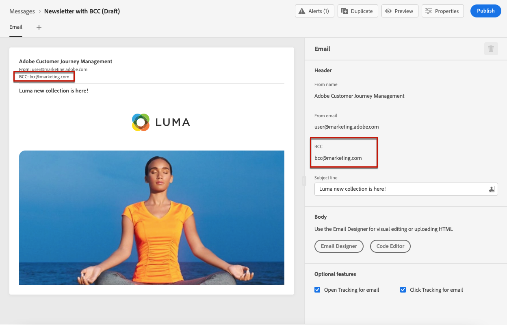

# 存档支持 {#archiving-support}

## 如何存档消息 {#about-archiving}

HIPAA等法规要求 [!DNL Journey Optimizer] 应提供一种将发送给个人的消息存档的方法。 事实上，如果您的客户提出索赔，他们应能够获取已发送消息的副本以进行验证。

* 对于电子邮件渠道， [!DNL Journey Optimizer] 提供内置的密件抄送电子邮件功能。 [了解详情](#bcc-email)

* 此外，对于所有渠道，您可以使用中的“模板”字段 **实体数据集**，其中包含非个性化消息模板的详细信息。 使用此字段导出数据集以保存元数据，例如：消息发送者、发送对象和时间。 请注意，不会导出个性化数据，而只会考虑模板（消息的格式和结构）。 [了解详情](../data/datasets-query-examples.md#entity-dataset)

>[!NOTE]
>
>[!DNL Journey Optimizer] 自身不支持SMS存档要求。 要获得专门的存档支持，请与您的SMS供应商（ Synch 、 Infobip或Twilio ）合作。

## 如何使用密件抄送发送电子邮件 {#bcc-email}

>[!CONTEXTUALHELP]
>id="ajo_admin_preset_bcc"
>title="定义密件抄送电子邮件地址"
>abstract="您可以通过将电子邮件发送到密件抄送收件箱，保留所发送电子邮件的副本。输入您选择的电子邮件地址，这样发送的每封电子邮件都会被密送至此密件抄送地址。请注意，密件抄送地址域必须不同于委派给 Adobe 的任何子域。此功能属于可选功能。"

您可以发送由发送的电子邮件密件抄送(BCC) [!DNL Journey Optimizer] 到专用的密件抄送地址。 此可选功能允许您保留发送给用户的电子邮件通信副本，以便进行合规性和/或存档。 密件抄送地址对邮件的其他收件人不可见。

### 启用密件抄送电子邮件 {#enable-bcc}

要启用 **[!UICONTROL 密送电子邮件]** 选项，请在的专用字段中输入您选择的电子邮件地址 [渠道表面](channel-surfaces.md) （即消息预设）。 除了在委派给Adobe的子域上定义的电子邮件地址之外，您可以按正确的格式指定任何外部地址。 例如，如果您委托 *marketing.luma.com* 要Adobe的子域，任意地址，如 *abc@marketing.luma.com* 是禁止的。

>[!CAUTION]
>
>您只能定义一个密件抄送电子邮件地址。 确保密件抄送地址有足够的接收容量来存储使用当前渠道表面发送的所有电子邮件。
>
>中列出了更多推荐 [本节](#bcc-recommendations-limitations).

>[!NOTE]
>
>如果您已购买Healthcare Shield附加产品，则必须确保密件抄送地址的ISP支持TLS 1.2协议。


完成配置后，基于此表面的所有电子邮件都将密件复制到您输入的密件抄送电子邮件地址。 从那里，可以使用外部系统处理和存档消息。

>[!CAUTION]
>
>密件抄送功能使用量根据您获得许可的邮件数计算。 因此，只能在用于要存档的关键通信的表面中启用它。 检查您的合同中是否有许可卷。

密件抄送电子邮件地址设置会立即在表面级别保存和处理。 使用此表面创建新邮件时，会自动显示密件抄送电子邮件地址。



但是，会提取BCC地址以按照所述逻辑发送通信 [此处](../email/email-settings.md).

### Recommendations和限制 {#bcc-recommendations-limitations}

* 为确保您的隐私合规性，密件抄送电子邮件必须由能够安全存储个人身份信息(PII)的归档系统处理。

* 由于邮件可能包含敏感或私有数据(如个人身份信息(PII))，请确保密件抄送地址正确无误，并保护对邮件的访问。

* 您用于密件抄送的收件箱应正确管理空间和投放。 如果收件箱返回退件，则可能无法接收某些电子邮件，因此将无法存档。

* 消息可在目标收件人之前传送到密件抄送电子邮件地址。 密件抄送消息也可以发送，即使原始消息可能具有 [已退回](../reports/suppression-list.md#delivery-failures).

  <!--OR: Only successfully sent emails are taken in account. [Bounces](../reports/suppression-list.md#delivery-failures) are not. TO CHECK -->

* 请勿打开或单击发送到BCC地址的电子邮件，因为发送分析的总打开数和点击数中会考虑该电子邮件，这可能会导致计算错误 [报表](../reports/global-report.md).

* 请勿在密件抄送收件箱中将邮件标记为垃圾邮件，因为它会影响发送到此地址的所有其他电子邮件。

>[!CAUTION]
>
>请勿单击发送到密件抄送地址的电子邮件中的取消订阅链接，因为您将立即取消订阅相应的收件人。

### GDPR合规性 {#gdpr-compliance}

GDPR等法规规定，数据主体应能够随时修改其同意书。 由于您通过Journey Optimizer发送的密件抄送电子邮件包含安全的个人身份信息(PII)，因此您必须编辑 **[!UICONTROL CJM电子邮件密件抄送反馈事件架构]** 能够遵守GDPR和类似法规管理这些PII。

为此，请执行以下步骤。

1. 转到 **[!UICONTROL 数据管理]** > **[!UICONTROL 架构]** > **[!UICONTROL 浏览]** 并选择 **[!UICONTROL CJM电子邮件密件抄送反馈事件架构]**.

   

1. 单击以展开 **[!UICONTROL 体验(_E)]**， **[!UICONTROL customerjourneyManagement]** 则 **[!UICONTROL secondaryRecipientDetail]**.

1. 选择 **[!UICONTROL originalRecipientAddress]**.

1. 在 **[!UICONTROL 字段属性]** 在右侧，向下滚动到 **[!UICONTROL 标识]** 复选框。

1. 选择它，同时选择 **[!UICONTROL 主要身份]**.

1. 从下拉列表中选择一个命名空间。

   

1. 单击&#x200B;**[!UICONTROL 应用]**。

>[!NOTE]
>
>在中了解有关管理隐私和适用法规的更多信息 [Experience Platform文档](https://experienceleague.adobe.com/docs/experience-platform/privacy/home.html?lang=zh-Hans){target="_blank"}.

### 密件抄送报表数据 {#bcc-reporting}

历程和消息报表中没有此类密件抄送报告。 但是，信息存储在名为的系统数据集上 **[!UICONTROL AJO BCC反馈事件数据集]**. 您可以对此数据集运行查询，以查找用于调试的有用信息，例如。

您可以通过用户界面访问此数据集。 选择 **[!UICONTROL 数据管理]** > **[!UICONTROL 数据集]** > **[!UICONTROL 浏览]** 并启用 **[!UICONTROL 显示系统数据集]** 从过滤器切换以显示系统生成的数据集。 详细了解如何在中访问数据集 [本节](../data/get-started-datasets.md#access-datasets).


要针对此数据集运行查询，您可以使用提供的查询编辑器。 [Adobe Experience Platform查询服务](https://experienceleague.adobe.com/docs/experience-platform/query/api/getting-started.html){target="_blank"}. 要访问它，请选择 **[!UICONTROL 数据管理]** > **[!UICONTROL 查询]** 并单击 **[!UICONTROL 创建查询]**. [了解详情](../data/get-started-queries.md)


根据您要查找的信息，可以运行以下查询。

1. 对于下面的所有其他查询，您将需要历程操作ID。 运行此查询以获取过去2天内与特定历程版本ID关联的所有操作ID：

   ```
   SELECT
   DISTINCT
   CAST(TIMESTAMP AS DATE) AS EventTime,
   _experience.journeyOrchestration.stepEvents.journeyVersionID,
   _experience.journeyOrchestration.stepEvents.actionName, 
   _experience.journeyOrchestration.stepEvents.actionID 
   FROM journey_step_events 
   WHERE 
   _experience.journeyOrchestration.stepEvents.journeyVersionID = '<journey version id>' AND 
   _experience.journeyOrchestration.stepEvents.actionID is not NULL AND 
   TIMESTAMP > NOW() - INTERVAL '2' DAY 
   ORDER BY EventTime DESC;
   ```

   >[!NOTE]
   >
   >要获取 `<journey version id>`参数，选择相应的 [历程版本](../building-journeys/journey.md#journey-versions) 从 **[!UICONTROL 历程管理]** > **[!UICONTROL 历程]** 菜单。 历程版本ID显示在Web浏览器中显示的URL的末尾。
   >
   >

1. 运行此查询以获取针对特定用户在最近2天内定向的特定消息生成的所有消息反馈事件（尤其是反馈状态）：

   ```
   SELECT  
   _experience.customerJourneyManagement.messageExecution.journeyVersionID AS JourneyVersionID, 
   _experience.customerJourneyManagement.messageExecution.journeyActionID AS JourneyActionID, 
   timestamp AS EventTime, 
   _experience.customerJourneyManagement.emailChannelContext.address AS RecipientAddress, 
   _experience.customerjourneymanagement.messagedeliveryfeedback.feedbackStatus AS FeedbackStatus,
   CASE _experience.customerjourneymanagement.messagedeliveryfeedback.feedbackStatus
       WHEN 'sent' THEN 'Sent'
       WHEN 'delay' THEN 'Retry'
       WHEN 'out_of_band' THEN 'Bounce' 
       WHEN 'bounce' THEN 'Bounce'
   END AS FeedbackStatusCategory
   FROM cjm_message_feedback_event_dataset 
   WHERE  
       timestamp > now() - INTERVAL '2' day  AND
       _experience.customerJourneyManagement.messageExecution.journeyVersionID = '<journey version id>' AND 
       _experience.customerJourneyManagement.messageExecution.journeyActionID = '<journey action id>' AND  
       _experience.customerJourneyManagement.emailChannelContext.address = '<recipient email address>'
       ORDER BY EventTime DESC;
   ```

   >[!NOTE]
   >
   >要获取 `<journey action id>` 参数，使用历程版本id运行上述第一个查询。 此 `<recipient email address>` 参数是目标或实际收件人的电子邮件地址。

1. 运行此查询以获取针对过去2天内特定用户的特定消息生成的所有密件抄送消息反馈事件：

   ```
   SELECT   
   _experience.customerJourneyManagement.messageExecution.journeyVersionID AS JourneyVersionID, 
   _experience.customerJourneyManagement.messageExecution.journeyActionID AS JourneyActionID, 
   _experience.customerJourneyManagement.emailChannelContext.address AS BccEmailAddress,
   timestamp AS EventTime, 
   _experience.customerJourneyManagement.secondaryRecipientDetail.originalRecipientAddress AS RecipientAddress, 
   _experience.customerjourneymanagement.messagedeliveryfeedback.feedbackStatus AS FeedbackStatus,
   CASE _experience.customerjourneymanagement.messagedeliveryfeedback.feedbackStatus
               WHEN 'sent' THEN 'Sent'
               WHEN 'delay' THEN 'Retry'
               WHEN 'out_of_band' THEN 'Bounce' 
               WHEN 'bounce' THEN 'Bounce'
           END AS FeedbackStatusCategory 
   FROM ajo_bcc_feedback_event_dataset  
   WHERE  
   timestamp > now() - INTERVAL '2' day  AND
   _experience.customerJourneyManagement.messageExecution.journeyVersionID = '<journey version id>' AND 
   _experience.customerJourneyManagement.messageExecution.journeyActionID = '<journeyaction id>' AND 
   _experience.customerJourneyManagement.secondaryRecipientDetail.originalRecipientAddress = '<recipient email address>'
   ORDER BY EventTime DESC;
   ```

1. 运行此查询以提取所有未收到消息，但过去30天内存在密件抄送条目的收件人地址：

   ```
    SELECT
        DISTINCT 
    bcc._experience.customerJourneyManagement.secondaryRecipientDetail.originalRecipientAddress AS RecipientAddressesNotRecievedMessage
    FROM ajo_bcc_feedback_event_dataset bcc
    LEFT JOIN cjm_message_feedback_event_dataset mfe
    ON 
   bcc._experience.customerJourneyManagement.messageExecution.journeyVersionID =
            mfe._experience.customerJourneyManagement.messageExecution.journeyVersionID AND    bcc._experience.customerJourneyManagement.messageExecution.journeyActionID = mfe._experience.customerJourneyManagement.messageExecution.journeyActionID AND 
   bcc._experience.customerJourneyManagement.secondaryRecipientDetail.originalRecipientAddress = mfe._experience.customerJourneyManagement.emailChannelContext.address AND
   mfe._experience.customerJourneyManagement.messageExecution.journeyVersionID = '<journey version id>' AND 
   mfe._experience.customerJourneyManagement.messageExecution.journeyActionID = '<journey action id>' AND
   mfe.timestamp > now() - INTERVAL '30' DAY AND
   mfe._experience.customerjourneymanagement.messagedeliveryfeedback.feedbackstatus IN ('bounce', 'out_of_band') 
    WHERE bcc.timestamp > now() - INTERVAL '30' DAY;
   ```
