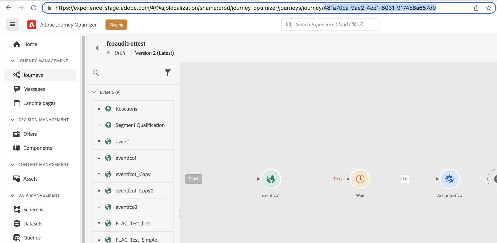

# 密送电子邮件 {#bcc-email}

>[!CONTEXTUALHELP]
>id="ajo_admin_preset_bcc"
>title="定义密送电子邮件地址"
>abstract="您可以通过将已发送的电子邮件发送到密件抄送收件箱来保留其副本。 输入您选择的电子邮件地址，以便发送的每封电子邮件都会被盲目复制到此密件抄送地址。 请注意，密送地址域不应与委派给Adobe的任何子域相同。 此功能属于可选功能。"

您可以发送由 [!DNL Journey Optimizer] 发送到密件抄送收件箱。 此可选功能允许您保留您发送给用户的电子邮件通信副本，以便符合规范和/或进行存档。 投放收件人将看不到该内容。

## 启用密送电子邮件 {#enable-bcc}

启用 **[!UICONTROL BCC email]** 选项，请在 [通道表面](message-presets.md) （即消息预设）。 您可以以正确的格式指定任何外部地址，但在委派给Adobe的子域上定义的电子邮件地址除外。 例如，如果您将 *marketing.luma.com* 子域到Adobe，任何地址，如 *abc@marketing.luma.com* 禁止。

>[!NOTE]
>
>您只能定义一个密件抄送电子邮件地址。 确保密件抄送地址具有足够的接收容量，以存储使用当前渠道表面发送的所有电子邮件。
>
>中列出了更多推荐 [此部分](#bcc-recommendations-limitations).


使用此表面的所有电子邮件都将被盲目复制到您输入的密件抄送电子邮件地址。 在此处，可以使用外部系统处理和存档它们。

>[!CAUTION]
>
>您的密件抄送功能使用情况将根据您获得许可的消息数量进行计数。 因此，只能在您希望存档的关键通信所使用的表面上启用它。 检查您的合同中是否有许可的卷。

“密件抄送”电子邮件地址设置将立即保存并处理在表面级别。 当您 [创建新消息](../messages/get-started-content.md#create-new-message) 使用此表面，会自动显示密送电子邮件地址。


但是，密送地址会按照以下逻辑接收以发送通信：

* 对于批处理和拆分历程，它不适用于在进行密送设置之前已启动的批处理或拆分执行。 更改将在下次重复或新执行时被提取。

* 对于事务型消息，将立即接收更改，以便进行下次通信（最多延迟一分钟）。

>[!NOTE]
>
>您无需重新发布历程，即可选取密件抄送设置。

## Recommendations和限制 {#bcc-recommendations-limitations}

* 为确保您的隐私合规性，密件抄送电子邮件必须由能够安全存储个人身份信息(PII)的归档系统进行处理。

* 由于消息可以包含敏感或私有数据，如个人身份信息(PII)，因此请确保密件抄送地址正确，并确保消息的访问安全。

* 对于空间和投放，应正确管理用于密件抄送的收件箱。 如果收件箱返回退回，则可能未收到某些电子邮件，因此将无法存档。

* 在目标收件人之前，可将邮件发送至密件抄送电子邮件地址。 即使原始消息可能已发送，也会发送密送消息 [已退回](../reports/suppression-list.md#delivery-failures).

   <!--OR: Only successfully sent emails are taken in account. [Bounces](../reports/suppression-list.md#delivery-failures) are not. TO CHECK -->

* 请勿打开或点进发送到密件抄送地址的电子邮件，因为在总打开数和发送分析的点击量中，会考虑这些事件，这可能会导致 [报告](../reports/global-report.md).

* 请勿在密件抄送收件箱中将邮件标记为垃圾邮件，因为这会影响发送到此地址的所有其他电子邮件。


>[!CAUTION]
>
>请勿在发送给密件抄送地址的电子邮件中单击取消订阅链接，因为您将立即取消订阅相应的收件人。

## GDPR合规 {#gdpr-compliance}

GDPR等法规规定，数据主体应能够随时修改其同意。 由于您随Journey Optimizer发送的密件抄送电子邮件包含安全的个人身份信息(PII)，因此您必须编辑 **[!UICONTROL CJM Email BCC Feedback Event Schema]** 以便能够按照GDPR及类似法规管理这些PII。

为此，请执行以下步骤：

1. 转到 **[!UICONTROL Data management]** > **[!UICONTROL Schemas]** > **[!UICONTROL Browse]** 选择 **[!UICONTROL CJM Email BCC Feedback Event Schema]**.

   

1. 单击可展开 **[!UICONTROL _experience]**, **[!UICONTROL customerJourneyManagment]** then **[!UICONTROL secondaryRecipientDetail]**.

1. 选择 **[!UICONTROL originalRecipientAddress]**。

1. 在 **[!UICONTROL Field properties]** 在右侧，向下滚动到 **[!UICONTROL Identity]** 复选框。

1. 选择它，然后选择 **[!UICONTROL Primary identity]**.

1. 从下拉列表中选择一个命名空间。

   

1. 单击 **[!UICONTROL Apply]**。

>[!NOTE]
>
>在 [Experience Platform 文档](https://experienceleague.adobe.com/docs/experience-platform/privacy/home.html?lang=zh-Hans){target=&quot;_blank&quot;}中进一步了解管理隐私和适用的法规。

## 密送报表数据 {#bcc-reporting}

历程和消息报表中不提供密送的此类报告。 但是，信息存储在名为 **[!UICONTROL AJO BCC Feedback Event Dataset]**. 您可以对此数据集运行查询，以查找用于调试的有用信息，例如。

您可以通过用户界面访问此数据集。 选择 **[!UICONTROL Data management]** > **[!UICONTROL Datasets]** > **[!UICONTROL Browse]** 并启用 **[!UICONTROL Show system datasets]** 从筛选器中切换以显示系统生成的数据集。 了解有关如何访问 [此部分](../start/get-started-datasets.md#access-datasets).


要对此数据集运行查询，您可以使用 [Adobe Experience Platform查询服务](https://experienceleague.adobe.com/docs/experience-platform/query/api/getting-started.html){target=&quot;_blank&quot;}。 要访问它，请选择 **[!UICONTROL Data management]** > **[!UICONTROL Queries]** 单击 **[!UICONTROL Create query]**. [了解详情](../start/get-started-queries.md)


根据要查找的信息，您可以运行以下查询。

1. 对于以下所有其他查询，您将需要历程操作ID。 运行此查询以获取在过去2天内与特定历程版本ID关联的所有操作ID:

       &quot;
       选择
       DISTINCT
       将时间戳转换为日期，
       _experience.journeyOrchestration.stepEvents.journeyVersionID，
       _experience.journeyOrchestration.stepEvents.actionName，
       _experience.journeyOrchestration.stepEvents.actionID
       FROM journey_step_events
       其中
       _experience.journeyOrchestration.stepEvents.journeyVersionID = &#39;&lt;journey version=&quot;&quot; id=&quot;&quot;>“和
       _experience.journeyOrchestration.stepEvents.actionID不为NULL且
       时间戳> NOW() — 时间间隔“2”天
       按事件时间DESC排序；
       &quot;
   
   >[!NOTE]
   >
   >要获取 `<journey version id>`参数，选择相应的 [历程版本](../building-journeys/journey-versions.md) 从 **[!UICONTROL Journey management]** > **[!UICONTROL Journeys]** 菜单。 历程版本ID显示在Web浏览器中显示的URL的末尾。
   >
   >

1. 运行此查询以获取在过去2天内为特定用户定向的特定消息生成的所有消息反馈事件（特别是反馈状态）：

       &quot;
       选择
       _experience.customerJourneyManagement.messageExecution.journeyVersionID作为JourneyVersionID，
       _experience.customerJourneyManagement.messageExecution.journeyActionID作为JourneyActionID，
       时间戳AS EventTime，
       _experience.customerJourneyManagement.emailChannelContext.address AS RecipientAddress，
       _experience.customerjourneymanagement.messagedeliveryfeedback.feedbackStatus AS FeedbackStatus，
       CASE _experience.customerjourneymanagement.messagedeliveryfeedback.feedbackStatus
       “已发送”时，然后“已发送”
       当为“delay”时，然后为“Retry”
       WHEN &#39;out_of_band&#39; THEN &#39;Bounce&#39;
       “跳出”后“跳出”
       END AS FeedbackStatusCategory
       从cjm_message_feedback_event_dataset
       其中
       timestamp > now() — 时间间隔“2”天和
       _experience.customerJourneyManagement.messageExecution.journeyVersionID = &#39;&lt;journey version=&quot;&quot; id=&quot;&quot;>“和
       _experience.customerJourneyManagement.messageExecution.journeyActionID = &#39;&lt;journey action=&quot;&quot; id=&quot;&quot;>“和
       _experience.customerJourneyManagement.emailChannelContext.address = &#39;&lt;recipient email=&quot;&quot; address=&quot;&quot;>&#39;
       按事件时间DESC排序；
       &quot;
   
   >[!NOTE]
   >
   >要获取 `<journey action id>` 参数，使用历程版本id运行上述第一个查询。 的 `<recipient email address>` 参数是目标或实际收件人的电子邮件地址。

1. 运行此查询以获取在过去2天内为特定用户定向的特定消息生成的所有密送消息反馈事件：

   ```
   SELECT   
   _experience.customerJourneyManagement.messageExecution.journeyVersionID AS JourneyVersionID, 
   _experience.customerJourneyManagement.messageExecution.journeyActionID AS JourneyActionID, 
   _experience.customerJourneyManagement.emailChannelContext.address AS BccEmailAddress,
   timestamp AS EventTime, 
   _experience.customerJourneyManagement.secondaryRecipientDetail.originalRecipientAddress AS RecipientAddress, 
   _experience.customerjourneymanagement.messagedeliveryfeedback.feedbackStatus AS FeedbackStatus,
   CASE _experience.customerjourneymanagement.messagedeliveryfeedback.feedbackStatus
               WHEN 'sent' THEN 'Sent'
               WHEN 'delay' THEN 'Retry'
               WHEN 'out_of_band' THEN 'Bounce' 
               WHEN 'bounce' THEN 'Bounce'
           END AS FeedbackStatusCategory 
   FROM ajo_bcc_feedback_event_dataset  
   WHERE  
   timestamp > now() - INTERVAL '2' day  AND
   _experience.customerJourneyManagement.messageExecution.journeyVersionID = '<journey version id>' AND 
   _experience.customerJourneyManagement.messageExecution.journeyActionID = '<journeyaction id>' AND 
   _experience.customerJourneyManagement.secondaryRecipientDetail.originalRecipientAddress = '<recipient email address>'
   ORDER BY EventTime DESC;
   ```

1. 运行此查询以获取所有未收到消息的收件人地址，而其密件抄送条目在最近30天内存在：

   ```
   SELECT
       DISTINCT 
   bcc._experience.customerJourneyManagement.secondaryRecipientDetail.originalRecipientAddress AS RecipientAddressesNotRecievedMessage
   FROM ajo_bcc_feedback_event_dataset bcc
   LEFT JOIN cjm_message_feedback_event_dataset mfe
   ON 
   bcc._experience.customerJourneyManagement.messageExecution.journeyVersionID =
           mfe._experience.customerJourneyManagement.messageExecution.journeyVersionID AND    bcc._experience.customerJourneyManagement.messageExecution.journeyActionID = mfe._experience.customerJourneyManagement.messageExecution.journeyActionID AND 
   bcc._experience.customerJourneyManagement.secondaryRecipientDetail.originalRecipientAddress = mfe._experience.customerJourneyManagement.emailChannelContext.address AND
   mfe._experience.customerJourneyManagement.messageExecution.journeyVersionID = '<journey version id>' AND 
   mfe._experience.customerJourneyManagement.messageExecution.journeyActionID = '<journey action id>' AND
   mfe.timestamp > now() - INTERVAL '30' DAY AND
   mfe._experience.customerjourneymanagement.messagedeliveryfeedback.feedbackstatus IN ('bounce', 'out_of_band') 
   WHERE bcc.timestamp > now() - INTERVAL '30' DAY;
   ```
