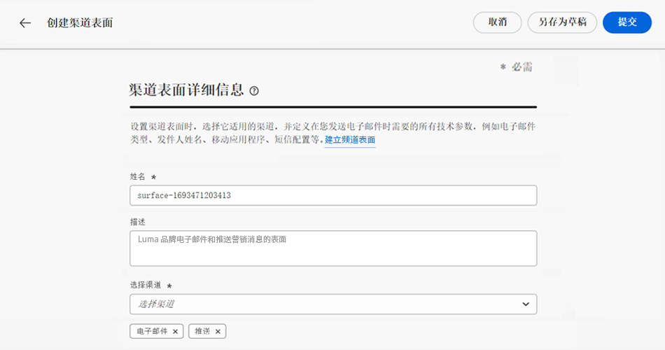
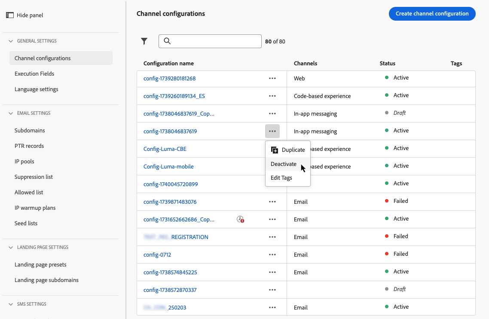

# 设置渠道平面 {#set-up-channel-surfaces}

使用 [!DNL Journey Optimizer]，您可以设置渠道曲面（即消息预设），以定义消息所需的所有技术参数：电子邮件类型、发件人电子邮件和名称、移动设备应用程序等。

>[!CAUTION]
>
> * 要创建、编辑和删除通道曲面，您必须具有 [管理渠道表面](../administration/high-low-permissions.md#manage-channel-surface) 权限。
>
> * 您必须执行 [电子邮件配置](#configure-email-settings), [推送配置](../configuration/push-configuration.md) 和 [短信配置](../configuration/sms-configuration.md) 创建通道曲面之前的步骤。

配置渠道表面后，您将能够在从历程创建消息时选择渠道表面。

<!--
➡️ [Learn how to create and use email surfaces in this video](#video-presets)
-->

## 创建通道曲面 {#create-channel-surface}

>[!CONTEXTUALHELP]
>id="ajo_admin_message_presets"
>title="通道表面设置"
>abstract="在设置渠道表面时，选择它应用的渠道，并定义消息所需的所有技术参数，如消息类型、子域、发件人名称、移动应用程序等。"

要创建通道曲面，请执行以下步骤：

1. 访问 **[!UICONTROL Channels]** > **[!UICONTROL Branding]** > **[!UICONTROL Channel surfaces]** 菜单，然后单击 **[!UICONTROL Create channel surface]**.

   

1. 输入曲面的名称和描述（可选），然后选择要配置的渠道。

   

   >[!NOTE]
   >
   > 名称必须以字母(A-Z)开头。 它只能包含字母数字字符。 还可以使用下划线 `_`，点`.` 和连字符 `-` 字符。

1. 如果您选择了 **[!UICONTROL Email]** 渠道，按照 [此部分](email-settings.md).

   

1. 对于 **[!UICONTROL Push Notification]** 渠道，请至少选择一个平台 —   **iOS** 和/或 **Android**  — 和用于每个平台的移动应用程序。

   

   >[!NOTE]
   >
   >有关如何配置环境以发送推送通知的更多信息，请参阅 [此部分](push-gs.md).

1. 对于 **[!UICONTROL SMS]** 渠道，定义设置，详情请参阅 [此部分](sms-configuration.md#message-preset-sms).

   

   >[!NOTE]
   >
   >有关如何配置环境以发送短信消息的更多信息，请参阅 [此部分](sms-configuration.md).

1. 配置所有参数后，单击 **[!UICONTROL Submit]** 确认。 您还可以将通道曲面另存为草稿，并稍后恢复其配置。

   

   >[!NOTE]
   >
   >当选定的IP池位于 [版本](ip-pools.md#edit-ip-pool) (**[!UICONTROL Processing]** 状态)，且从未与选定的子域关联。 [了解详情](#subdomains-and-ip-pools)
   >
   >将曲面另存为草稿，然后等待IP池具有 **[!UICONTROL Success]** 恢复曲面创建的状态。

1. 创建通道曲面后，该曲面会显示在列表中，其中 **[!UICONTROL Processing]** 状态。

   在此步骤中，将执行多项检查，以验证是否已正确配置。 处理时间在附近 **48h-72h**，并且 **7-10个工作日**.

   这些检查包括由Adobe团队执行的配置和技术测试：

   * SPF验证
   * DKIM验证
   * MX记录验证
   * 检查IP列入阻止列表
   * 主机检查
   * IP池验证
   * A/PTR记录， t/m/res子域验证

   >[!NOTE]
   >
   >如果检查失败，请在 [此部分](#monitor-channel-surfaces).

1. 检查成功后，通道曲面将 **[!UICONTROL Active]** 状态。 它已准备好用于投放消息。

   

## 监视通道表面 {#monitor-channel-surfaces}

所有通道曲面都显示在 **[!UICONTROL Channels]** > **[!UICONTROL Channel surfaces]** 菜单。 过滤器可帮助您浏览列表（渠道、用户、状态）。

创建后，通道曲面可以具有以下状态：

* **[!UICONTROL Draft]**:通道曲面已另存为草稿，但尚未提交。 打开它以恢复配置。
* **[!UICONTROL Processing]**:已提交通道表面，并正在执行多个验证步骤。
* **[!UICONTROL Active]**:通道表面已验证，可选择它来创建消息。
* **[!UICONTROL Failed]**:在通道表面验证期间，一个或多个检查失败。
* **[!UICONTROL Deactivated]**:通道表面被停用。 它不能用于创建新消息。

在通道曲面创建失败时，每种可能失败原因的详细信息如下所述。

如果出现其中一个错误，请联系 [Adobe客户关怀](https://helpx.adobe.com/cn/enterprise/admin-guide.html/enterprise/using/support-for-experience-cloud.ug.html){target=&quot;_blank&quot;}以获取帮助。

* **SPF验证失败**:SPF（发件人策略框架）是一种电子邮件身份验证协议，它允许指定能够从给定子域发送电子邮件的授权IP。 SPF验证失败意味着SPF记录中的IP地址与用于向邮箱提供程序发送电子邮件的IP地址不匹配。

* **DKIM验证失败**:DKIM（域名识别邮件）允许收件人服务器验证收到的消息是否由相关域的正版发件人发送，且原始消息的内容在发送过程中没有发生更改。 DKIM验证失败意味着接收邮件服务器无法验证邮件内容的真实性及其与发送域的关联。

* **MX记录验证失败**:MX（邮件交换）记录验证失败意味着负责代表给定子域接受入站电子邮件的邮件服务器未正确配置。

* **投放能力配置失败**:可投放性配置失败，原因如下：
   * 列入阻止列表已分配IP的管理
   * 无效 `helo` name
   * 从IP发送的电子邮件，而不是在相应表面的IP池中指定的IP
   * 无法向Gmail和Yahoo等主要ISP的收件箱发送电子邮件

## 编辑通道曲面 {#edit-channel-surface}

要编辑通道曲面，请执行以下步骤。

>[!NOTE]
>
>您无法编辑 **[!UICONTROL Push notification settings]**. 如果仅为推送通知渠道配置了渠道表面，则无法编辑。

1. 在列表中，单击通道曲面名称以将其打开。

   

1. 根据需要编辑其属性。

   >[!NOTE]
   >
   >如果通道曲面具有 **[!UICONTROL Active]** 状态， **[!UICONTROL Name]**, **[!UICONTROL Select channel]** 和 **[!UICONTROL Subdomain]** 字段灰显，无法编辑。

1. 单击 **[!UICONTROL Submit]** 确认更改。

   >[!NOTE]
   >
   >您还可以将通道曲面另存为草稿，稍后继续更新。

提交更改后，通道曲面将经过与原位置类似的验证周期，当 [创建通道曲面](#create-channel-surface). 版本处理时间可能长达 **3小时**.

>[!NOTE]
>
>如果您仅编辑 **[!UICONTROL Description]**, **[!UICONTROL Email type]** 和/或 **[!UICONTROL Email retry parameters]** 字段中，更新是即时的。

### 更新详细信息 {#update-details}

对于具有 **[!UICONTROL Active]** 状态，则可以检查更新的详细信息。 为实现此操作，请执行以下步骤：

单击 **[!UICONTROL Recent update]** 图标。

<!--You can also access the update details from an active channel surface while update is in progress.-->

在 **[!UICONTROL Recent update]** 屏幕中，您可以查看更新状态和请求更改的列表等信息。

<!---->

### 更新状态 {#update-statuses}

渠道曲面更新可以具有以下状态：

* **[!UICONTROL Processing]**:已提交通道表面更新，并正在执行多个验证步骤。
* **[!UICONTROL Success]**:已验证更新的通道表面，并可选择该表面以创建消息。
* **[!UICONTROL Failed]**:在通道表面更新验证期间，一个或多个检查失败。

下面详细介绍了每种状态。

#### 处理时间 {#surface-processing}

将执行多项投放能力检查，以验证表面是否已正确更新。

>[!NOTE]
>
>如果您仅编辑 **[!UICONTROL Description]**, **[!UICONTROL Email type]** 和/或 **[!UICONTROL Email retry parameters]** 字段中，更新是即时的。

处理时间可能需要 **3小时**. 了解有关在 [此部分](#create-channel-surface).

如果编辑已处于活动状态的曲面：

* 其地位仍然 **[!UICONTROL Active]** 验证过程进行中。

* 的 **[!UICONTROL Recent update]** 图标在“通道曲面”(channel surfaces)列表中曲面的名称旁边显示。

* 在验证过程中，使用此曲面配置的消息仍使用该曲面的旧版本。

>[!NOTE]
>
>在进行更新时，无法修改通道曲面。 您仍可以单击其名称，但所有字段都呈灰显状态。 更新成功后，才会反映更改。

#### 成功 {#success}

验证过程成功后，新版曲面将自动用于使用该曲面的所有消息。 但是，您可能必须等待：
* 在被单一报文使用前几分钟，
* 直到下一批表面在批处理消息中生效。

#### 失败 {#failed}

如果验证过程失败，仍将使用较旧版本的曲面。

详细了解 [此部分](#monitor-channel-surfaces).

更新失败后，曲面将再次变得可编辑。 您可以单击其名称并更新需要修复的设置。

## 停用通道曲面 {#deactivate-a-surface}

要 **[!UICONTROL Active]** 渠道表面无法创建新消息，您可以将其停用。 但是，当前使用此表面的历程消息将不会受到影响，并将继续工作。

>[!NOTE]
>
>在处理更新时，不能停用通道曲面。 您必须等到更新成功或失败。 了解详情 [编辑通道曲面](#edit-channel-surface) 和 [更新状态](#update-statuses).

1. 访问通道曲面列表。

1. 对于所选的活动曲面，单击 **[!UICONTROL More actions]** 按钮。

1. 选择 **[!UICONTROL Deactivate]**。

   

>[!NOTE]
>
>无法删除已停用的渠道表面，以避免在使用这些表面发送消息的历程中出现任何问题。

不能直接编辑已停用的通道曲面。 但是，您可以复制并编辑副本以创建新版本，以用于创建新消息。 您还可以再次激活它，然后等到更新成功后才对其进行编辑。

<!--
## How-to video{#video-presets}

Learn how to create channel surfaces, how to use them and how to delegate a subdomain and create an IP pool.

>[!VIDEO](https://video.tv.adobe.com/v/334343?quality=12)
-->
