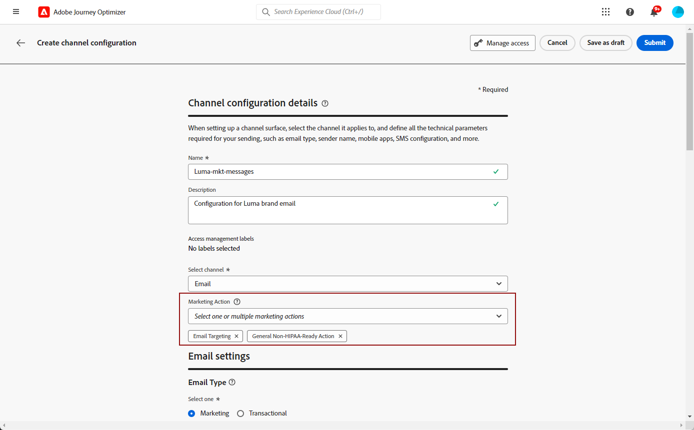

# 设置渠道表面 {#set-up-channel-surfaces}

>[!CONTEXTUALHELP]
>id="ajo_admin_channel_surfaces"
>title="渠道表面"
>abstract="渠道表面是由系统管理员定义的配置。它包含用于发送消息的所有技术参数，如标头参数、子域、移动应用程序等。"

>[!CONTEXTUALHELP]
>id="ajo_admin_marketing_action"
>title="营销活动"
>abstract="TBC"

>[!CONTEXTUALHELP]
>id="ajo_admin_app_id"
>title="应用程序 ID"
>abstract="TBC"

>[!CONTEXTUALHELP]
>id="ajo_admin_location"
>title="页面上的位置"
>abstract="TBC"

>[!CONTEXTUALHELP]
>id="ajo_admin_page_rule"
>title="页面匹配规则"
>abstract="TBC"

>[!CONTEXTUALHELP]
>id="ajo_admin_default_url"
>title="默认 URL"
>abstract="TBC"

>[!CONTEXTUALHELP]
>id="ajo_admin_surface_uri"
>title="URI 表面"
>abstract="TBC"

通过[!DNL Journey Optimizer]，您可以设置渠道界面（即消息预设），以定义消息所需的所有技术参数：电子邮件类型、发件人电子邮件和姓名、移动应用程序、短信配置等。

>[!CAUTION]
>
> * 要创建、编辑和删除渠道界面，您必须具有[管理消息预设](../administration/high-low-permissions.md#administration-permissions)权限。
>
> * 在创建渠道表面之前，您必须执行[电子邮件配置](../email/get-started-email-config.md)、[推送配置](../push/push-configuration.md)、[短信配置](../sms/sms-configuration.md)和[直邮配置](../direct-mail/direct-mail-configuration.md)步骤。

配置渠道平面后，您将能够在从历程或营销策划创建消息时选择它们。

<!--
➡️ [Learn how to create and use email surfaces in this video](#video-presets)
-->

## 创建渠道表面 {#create-channel-surface}

>[!CONTEXTUALHELP]
>id="ajo_admin_message_presets_header"
>title="渠道表面设置"
>abstract="设置渠道表面时，选择它适用的渠道，并定义在您发送电子邮件时需要的所有技术参数，例如电子邮件类型、发件人姓名、移动应用程序、短信配置等。"

>[!CONTEXTUALHELP]
>id="ajo_admin_message_presets"
>title="渠道表面设置"
>abstract="为了能够从历程或营销活动创建诸如发送电子邮件等操作，您必须首先创建一个渠道表面，用于定义消息所需的全部技术设置。您必须具有“管理消息预设”权限才能创建、编辑和删除渠道表面。"

>[!CONTEXTUALHELP]
>id="ajo_surface_marketing_action"
>title="选择营销操作"
>abstract="在界面中选择营销操作，以便将同意策略与消息相关联。"

要创建渠道表面，请执行以下步骤：

1. 访问&#x200B;**[!UICONTROL 渠道]** > **[!UICONTROL 品牌]** > **[!UICONTROL 渠道界面]**&#x200B;菜单，然后单击&#x200B;**[!UICONTROL 创建渠道界面]**。

   

1. 输入表面的名称和描述（可选），然后选择要配置的渠道。

   

   >[!NOTE]
   >
   > 名称必须以字母(A-Z)开头。 它只能包含字母数字字符。 您还可以使用下划线`_`、点`.`和连字符`-`字符。

1. 要将自定义或核心数据使用标签分配给表面，您可以选择&#x200B;**[!UICONTROL 管理访问权限]**。 [了解有关对象级访问控制(OLAC)的更多信息](../administration/object-based-access.md)。

1. 如果您选择了&#x200B;**[!UICONTROL 电子邮件]**&#x200B;渠道，请按照[此部分](../email/email-settings.md)中的说明配置设置。

   

1. 对于&#x200B;**[!UICONTROL 推送通知]**&#x200B;渠道，请至少选择一个平台 — **iOS**&#x200B;和/或&#x200B;**Android** — 以及要用于每个平台的移动设备应用程序。

   

   >[!NOTE]
   >
   >有关如何配置环境以发送推送通知的详细信息，请参阅[此部分](../push/push-gs.md)。

1. 对于&#x200B;**[!UICONTROL 短信]**&#x200B;渠道，请按照[此部分](../sms/sms-configuration.md)中的详细说明定义您的设置。

   

   >[!NOTE]
   >
   >有关如何配置环境以发送短信消息的更多信息，请参阅[此章节](../sms/sms-configuration.md)。

1. 选择&#x200B;**[!UICONTROL 营销操作]**&#x200B;以将同意策略关联到使用此表面的消息。 所有与该营销操作相关的同意政策均可利用，以尊重客户的偏好。 [了解详情](../action/consent.md#surface-marketing-actions)

   >[!NOTE]
   >
   >同意策略当前仅适用于已购买&#x200B;**Healthcare Shield**&#x200B;和&#x200B;**Privacy and Security Shield**&#x200B;附加产品的组织。

   

   >[!NOTE]
   >
   >您只能选择一个营销操作。

1. 配置所有参数后，单击&#x200B;**[!UICONTROL 提交]**&#x200B;以确认。 也可以将渠道曲面另存为草稿，并稍后恢复其配置。

   

   >[!NOTE]
   >
   >当所选IP池处于[版本](ip-pools.md#edit-ip-pool)（**[!UICONTROL 正在处理]**&#x200B;状态）下且从未与所选子域关联时，您无法继续创建电子邮件表面。 [了解详情](#subdomains-and-ip-pools)
   >
   >将表面另存为草稿，等待IP池的状态为&#x200B;**[!UICONTROL 成功]**&#x200B;再继续表面创建。

1. 创建渠道表面后，它将显示在状态为&#x200B;**[!UICONTROL 正在处理]**&#x200B;的列表中。

   在此步骤中，将执行若干检查以验证是否已正确配置它。<!--The processing time is around **48h-72h**, and can take up to **7-10 business days**.-->

   >[!NOTE]
   > 为子域创建电子邮件界面时，处理时间会有所不同，详见如下：
   >
   > * 对于&#x200B;**新子域**，创建第一个渠道表面的过程可能需要&#x200B;**10分钟到10天**。
   > * 对于&#x200B;**非生产沙盒**，或者如果所选子域已在另一个批准的渠道表面中&#x200B;**使用**，则流程最多只需&#x200B;**3小时**。

   这些检查包括由Adobe团队执行的配置和技术测试：

   * SPF验证
   * DKIM验证
   * MX记录验证
   * 检查IP列入阻止列表
   * Helo主机检查
   * IP池验证
   * A/PTR记录， t/m/res子域验证
   * FBL注册（此检查仅在首次为给定子域创建电子邮件表面时执行）

   >[!NOTE]
   >
   >如果检查不成功，请在[本节](#monitor-channel-surfaces)中进一步了解可能的失败原因。

1. 检查成功后，渠道表面将获得&#x200B;**[!UICONTROL 活动]**&#x200B;状态。 它随时可用于投放消息。

   

## 监测渠道表面 {#monitor-channel-surfaces}

您的所有渠道表面都显示在&#x200B;**[!UICONTROL 渠道]** > **[!UICONTROL 渠道表面]**&#x200B;菜单中。 筛选器可帮助您浏览列表（渠道、用户、状态）。

创建渠道表面后，可以具有以下状态：

* **[!UICONTROL 草稿]**：渠道表面已另存为草稿，尚未提交。 打开它以恢复配置。
* **[!UICONTROL 正在处理]**：已提交渠道表面，并且正在执行多个验证步骤。
* **[!UICONTROL 活动]**：已验证通道表面，可以选择它来创建消息。
* **[!UICONTROL 失败]**：在通道表面验证期间，一个或多个检查失败。
* **[!UICONTROL 已停用]**：渠道表面已停用。 不能用来创建新消息。

如果渠道表面创建失败，下面将介绍每个可能失败原因的详细信息。

如果出现这些错误之一，请联系[Adobe客户关怀](https://helpx.adobe.com/cn/enterprise/admin-guide.html/enterprise/using/support-for-experience-cloud.ug.html){target="_blank"}以获取帮助。

* **SPF验证失败**： SPF （发件人策略框架）是一种电子邮件身份验证协议，它允许指定可从给定子域发送电子邮件的授权IP。 SPF验证失败意味着SPF记录中的IP地址与用于向邮箱提供商发送电子邮件的IP地址不匹配。

* **DKIM验证失败**： DKIM (DomainKeys Identified Mail)允许收件人服务器验证所接收的邮件是否由关联域的真实发件人发送，以及原始邮件的内容是否在其发送过程中未发生更改。 DKIM验证失败意味着接收邮件服务器无法验证消息内容的真实性及其与发送域的关联：

* **MX记录验证失败**： MX (Mail eXchange)记录验证失败表示未正确配置负责代表给定子域接收入站电子邮件的邮件服务器。

* **可投放性配置失败**：可投放性配置失败可能是由以下原因造成的：
   * 分配的IP的列入阻止列表
   * `helo`名称无效
   * 从非在相应表面的IP池中指定的IP发送的电子邮件
   * 无法将电子邮件投放到主要ISP的收件箱

## 编辑渠道表面 {#edit-channel-surface}

要编辑渠道表面，请执行以下步骤。

>[!NOTE]
>
>您无法编辑&#x200B;**[!UICONTROL 推送通知设置]**。 如果仅为推送通知渠道配置渠道表面，则无法编辑该表面。

1. 从列表中，单击渠道表面名称以将其打开。

   

1. 根据需要编辑其属性。

   >[!NOTE]
   >
   >如果渠道表面具有&#x200B;**[!UICONTROL 活动]**&#x200B;状态，则&#x200B;**[!UICONTROL 名称]**、**[!UICONTROL 选择渠道]**&#x200B;和&#x200B;**[!UICONTROL 子域]**&#x200B;字段将灰显且无法编辑。

1. 单击&#x200B;**[!UICONTROL 提交]**&#x200B;以确认更改。

   >[!NOTE]
   >
   >也可以将渠道曲面另存为草稿，并稍后恢复更新。

提交更改后，渠道表面将经历与[创建渠道表面](#create-channel-surface)时执行的验证周期类似的验证周期。 编辑处理时间最长可能需要&#x200B;**3小时**。

>[!NOTE]
>
>如果只编辑&#x200B;**[!UICONTROL 描述]**、**[!UICONTROL 电子邮件类型]**&#x200B;和/或&#x200B;**[!UICONTROL 电子邮件重试参数]**&#x200B;字段，则更新是即时进行的。

### 更新详细信息 {#update-details}

对于具有&#x200B;**[!UICONTROL 活动]**&#x200B;状态的渠道表面，您可以检查更新的详细信息。 为实现此操作，请执行以下步骤：

单击活动表面名称旁边显示的&#x200B;**[!UICONTROL 最近更新]**&#x200B;图标。

<!--You can also access the update details from an active channel surface while update is in progress.-->

在&#x200B;**[!UICONTROL 最近更新]**&#x200B;屏幕上，您可以查看更新状态和所请求更改列表等信息。

<!---->

### 更新状态 {#update-statuses}

渠道表面更新可以具有以下状态：

* **[!UICONTROL 正在处理]**：已提交渠道表面更新，且正在执行多个验证步骤。
* **[!UICONTROL 成功]**：已验证更新的渠道表面，可以选择该表面来创建消息。
* **[!UICONTROL 失败]**：在渠道表面更新验证期间一个或多个检查失败。

每种状态详见下文。

#### 正在处理 {#surface-processing}

将执行多次可投放性检查，以验证表面是否已正确更新。

>[!NOTE]
>
>如果只编辑&#x200B;**[!UICONTROL 描述]**、**[!UICONTROL 电子邮件类型]**&#x200B;和/或&#x200B;**[!UICONTROL 电子邮件重试参数]**&#x200B;字段，则更新是即时进行的。

处理时间最长可能需要&#x200B;**3小时**。 在[此部分](#create-channel-surface)中了解验证周期内执行的检查的详细信息。

如果编辑已处于活动状态的曲面：

* 验证过程正在进行时，其状态保持为&#x200B;**[!UICONTROL 活动]**。

* **[!UICONTROL 最近更新]**&#x200B;图标显示在渠道表面列表中的表面名称旁边。

* 在验证过程中，使用此表面配置的消息仍在使用旧版本的表面。

>[!NOTE]
>
>在更新过程中，您无法修改渠道表面。 您仍然可以单击其名称，但所有字段均呈灰显状态。 在更新成功之前，不会反映更改。

#### 成功 {#success}

一旦验证过程成功，使用此表面的所有消息中将自动使用表面的新版本。 但是，您可能必须等待：
* 几分钟后才会被单一消息占用，
* 直到在批处理消息中使曲面生效的下一个批处理。

#### 失败 {#failed}

如果验证过程失败，仍将使用旧版本的曲面。

在[本节](#monitor-channel-surfaces)中了解更多可能的失败原因。

更新失败时，表面将再次变为可编辑。 您可以单击其名称并更新需要修复的设置。

## 取消激活渠道表面 {#deactivate-a-surface}

若要使&#x200B;**[!UICONTROL 活动]**&#x200B;渠道表面不可用于创建新消息，您可以停用它。 但是，当前使用此表面的历程消息不会受到影响，并将继续工作。

>[!NOTE]
>
>处理更新时，无法取消激活渠道表面。 您必须等待更新成功或失败。 了解有关[编辑渠道表面](#edit-channel-surface)和[更新状态](#update-statuses)的更多信息。

1. 访问渠道表面列表。

1. 对于您选择的活动表面，单击&#x200B;**[!UICONTROL 更多操作]**&#x200B;按钮。

1. 选择&#x200B;**[!UICONTROL 停用]**。

   

>[!NOTE]
>
>无法删除已停用的渠道表面，以避免使用这些表面发送消息的历程中出现任何问题。

无法直接编辑已停用的渠道表面。 但是，您可以复制副本并编辑副本，以创建新版本以用于创建新消息。 您也可以再次激活它，并等待更新成功以进行编辑。

<!--
## How-to video{#video-presets}

Learn how to create channel surfaces, how to use them and how to delegate a subdomain and create an IP pool.

>[!VIDEO](https://video.tv.adobe.com/v/334343?quality=12)
-->
