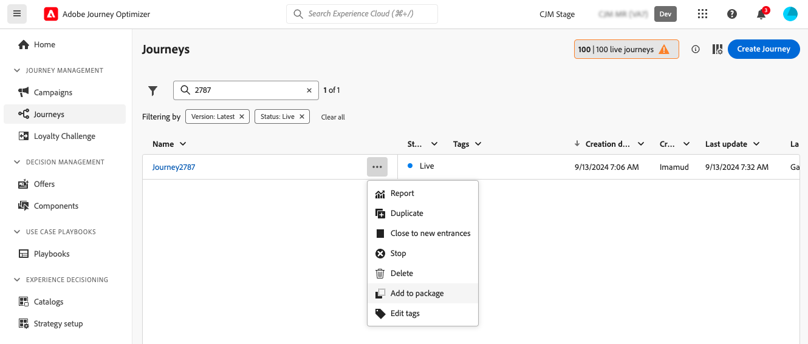
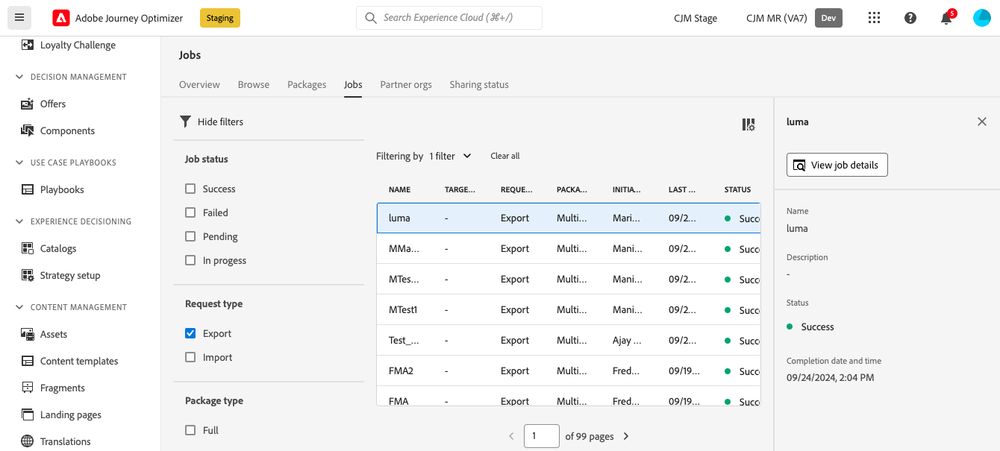
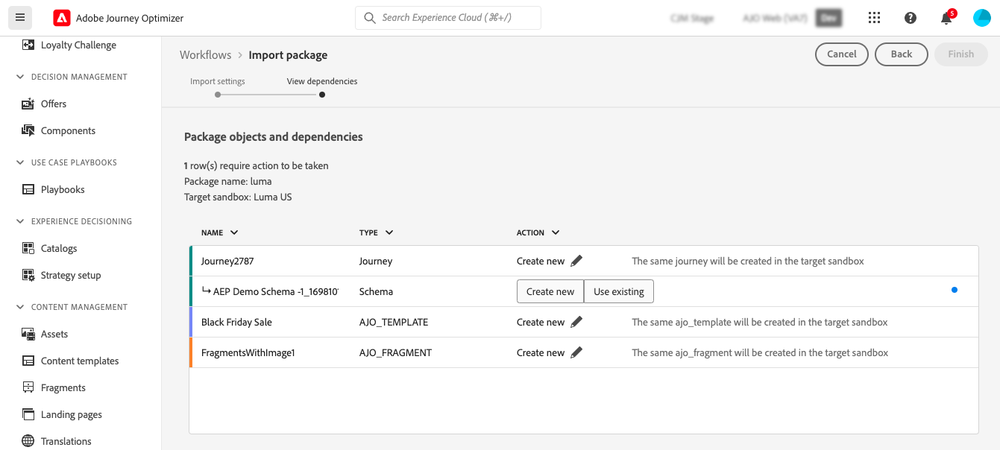
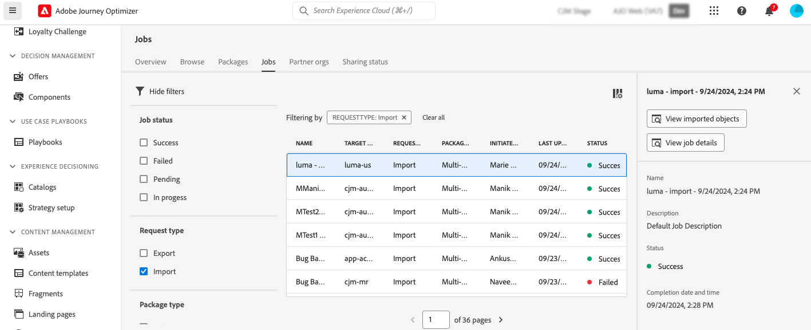

# 将对象导出到另一个沙盒 {#copy-to-sandbox}

您可以使用资源包导出和导入功能，跨多个沙盒复制对象，如历程、营销策划、自定义操作、内容模板或片段。 包可以包含单个对象或多个对象。 包中包含的任何对象必须来自同一沙盒。

本页介绍Journey Optimizer上下文中的沙盒工具用例。 有关该功能本身的更多信息，请参阅Adobe Experience Platform [沙盒工具指南](https://experienceleague.adobe.com/docs/experience-platform/sandbox/ui/sandbox-tooling.html#abobe-journey-optimizer-objects){target="_blank"}。

>[!NOTE]
>
>此功能需要&#x200B;**沙盒管理**&#x200B;功能的以下权限：管理沙盒（或查看沙盒）和管理包。 [了解详情](../administration/ootb-permissions.md)

复制过程通过源沙盒和目标沙盒之间的资源包导出和导入来执行。 以下是将历程从一个沙盒复制到另一个沙盒的常规步骤：

1. [在源沙盒中添加要作为包导出的对象](#export)
1. [发布包](#publish)
1. [在目标沙盒中导入包](#import)

>[!NOTE]
>
>要将决策管理对象迁移到Decisioning，请使用专用的[决策迁移API](../experience-decisioning/decisioning-migration-api.md)，该API提供了自动的依赖项解析和专门为决策实体迁移而设计的回滚功能。

## 导出的对象和最佳实践 {#objects}

Journey Optimizer允许将历程、营销活动（操作、API触发和编排）、自定义操作、内容模板、片段和其他对象导出到另一个沙盒。 以下部分提供了每种对象类型的信息和最佳实践。

### 一般最佳实践 {#global}

* 复制对象时，任何依赖项（如嵌套片段、历程受众或操作）都将在父对象中正确更新，从而确保目标沙盒中的正确映射。

* 如果导出的对象包含用户档案个性化，请确保目标沙盒中存在相应的架构，以避免任何个性化问题。

* 当前不支持登陆页面在沙盒之间迁移。 当您将历程复制到另一个沙盒时，在您的历程或电子邮件内容中对登陆页面的任何引用仍将指向原始（源）沙盒登陆页面ID。 迁移后，您必须手动更新历程和电子邮件内容中的所有登陆页面引用，以使用目标（目标）沙盒中的正确登陆页面ID。 请参阅[创建和发布登陆页面](../landing-pages/create-lp.md)。

+++ 历程

* **复制的依赖项** — 在导出历程时，除了历程本身，Journey Optimizer还复制历程依赖的大部分对象：受众、自定义操作、架构、事件和操作。 有关复制对象的更多详细信息，请参阅Adobe Experience Platform [沙盒工具指南](https://experienceleague.adobe.com/docs/experience-platform/sandbox/ui/sandbox-tooling.html#abobe-journey-optimizer-objects){target="_blank"}。

* **建议手动验证** — 我们不保证将所有链接的元素复制到目标沙盒。 我们强烈建议您执行彻底检查，例如在发布历程之前。 这允许您识别任何潜在的缺失对象。

* **草稿模式和唯一性** — 目标沙盒中复制的对象是唯一的，不存在覆盖现有元素的风险。 历程和历程中的任何消息都会以草稿模式引入。 这允许您在目标沙盒上发布之前执行彻底验证。

* **元数据** — 复制过程仅复制有关历程的元数据和该历程中的对象。 在此过程中不会复制任何用户档案或数据集数据。

* **自定义操作**

   * 导出自定义操作时，会复制URL配置和有效负载参数。 但是，出于安全原因，身份验证参数不会复制，而是将替换为“在此处插入密码”。 常量请求标头和查询参数值也将被替换为“INSERT SECRET HERE”。

     这包括特殊用途的自定义操作([!DNL Adobe Campaign Standard]、[!DNL Campaign Classic]、[!DNL Marketo Engage])。

   * 将历程复制到另一个沙盒时，如果您在导入过程中为自定义操作选择“使用现有”，则您选择的现有自定义操作必须与源自定义操作相同（即，相同的配置、参数等）。 否则，新历程副本将具有无法在画布中解决的错误。

* **数据源、字段组和事件** — 在复制使用事件、数据源或字段组的历程时，导入过程会自动检查目标沙盒中是否已经存在具有相同名称和类型的组件。 例如，统一事件将由目标沙盒中具有相同名称的统一事件替换。 这同样适用于业务事件、自定义数据源，以及历程中使用的基于API和基于架构的字段组。 如果源沙盒中的单一事件与业务事件目标沙盒具有相同的名称，则不会复制或创建该事件 — 这同样适用于所有其他组件。

+++

+++ 操作和API触发的营销活动

您可以使用包导出和导入功能在沙盒之间复制&#x200B;**操作**&#x200B;营销活动、**API触发**&#x200B;营销活动。

这些类型的营销活动会与所有与用户档案、受众、架构、内联消息和依赖对象相关的项目一起复制。

但是，不会复制以下项目：

* 多语言变体和语言设置，
* 业务规则，
* 标记，
* 数据使用标签和执行(DULE)标签。

在复制&#x200B;**操作**&#x200B;或&#x200B;**API触发**&#x200B;营销活动时，请确保在目标沙盒中验证下面列出的对象，以避免配置错误：

* **渠道配置**：渠道配置与营销活动一起复制。 在复制营销活动后，必须在目标沙盒中手动选择渠道配置。
* **试验变体和设置**：试验变体和设置包含在活动复制过程中。 导入后，在目标沙盒中验证这些设置。
* **统一决策**：支持导出和导入决策策略和决策项。 确保在目标沙盒中正确映射与决策相关的依赖项。

+++

+++编排的营销活动

您可以使用资源包导出和导入功能在沙盒之间复制编排的营销活动。 编排的营销活动与其他对象遵循相同的整体模式，但包中包含的内容以及您必须在目标沙盒中准备的内容与操作或API触发的营销活动不同。

要导出编排的营销活动，请[将其添加到源沙盒中的沙盒包](#add-objects-as-a-package-export)（无论其状态如何），[发布包](#publish)，然后[将包](#import)导入目标沙盒。

>[!IMPORTANT]
>
>导入后，立即[在目标沙盒中复制编排的营销活动](../campaigns/manage-campaigns.md#duplicate-a-campaign)，并将该副本用于配置、测试和执行。 如果您改为运行或发布导入的副本，则营销活动报告可能不会显示反馈和跟踪数据。 此限制将在未来版本中删除。

在导入到生产环境之前，请牢记以下行为和限制：

* **草稿副本** — 导入的编排营销活动始终在目标沙盒中的草稿中创建，无论源编排营销活动的状态如何。

* **每次导入时的新对象** — 再次导入包将创建一个新的协调活动。 它不会覆盖或更新您之前导入的营销活动。

* **不支持重新导出同一包** — 在导出后再次发布同一包会导致导入营销活动中的活动进入错误状态。 如果发生这种情况，您必须删除受影响的活动并手动重新创建它们。 此限制将在未来版本中解决。

* **并非所有依赖项都自动复制** — 仅将编排的活动添加到包中本身不包括完整的依赖项链。 除非您明确解决渠道配置、关系存储架构、数据集和业务规则，否则不包括这些配置（有关详细信息，请参阅下一个项目符号）。

  在[包导入](#import)期间，Journey Optimizer列出要在目标沙盒中解析的对象。 以下规则适用于最常见的对象：

   * **营销活动** — 始终选择&#x200B;**新建**。
   * **受众** — 对于Adobe Experience Platform受众，您可以选择&#x200B;**新建**&#x200B;或&#x200B;**使用现有**。 对于编排的活动受众，您必须选择&#x200B;**使用现有**&#x200B;并映射到目标沙盒中的相应受众。
   * **合并策略** — 选择&#x200B;**使用现有**&#x200B;并映射到相应的合并策略，或使用目标沙盒中的默认策略。

  导入后，在编排的营销活动中使用警报来查找剩余的间隔（例如，目标沙盒中尚不存在的用户档案或定向资源可能会使活动具有空目标，直至您修复它）。

* **必须单独添加或对齐的内容** — 编排的活动导出不包含以下内容：

   * **渠道配置** — 它们未随包一起导出或导入。 要使电子邮件和其他渠道活动无需手动修复即可运行，目标沙盒必须已具有名称与源完全匹配（区分大小写）并使用相同渠道的渠道配置。 否则，您将在导入后看到活动警报。 打开每个受影响的活动，然后选择或创建正确的渠道配置。

   * **关系存储架构和数据集** — 如果您的营销活动依赖于给定的数据模型、计划架构和数据集导出/导入顺序，则当您需要依赖关系时，它们就会存在（导出数据集通常提取相关的架构需求，仅导出架构并不包含其数据集）。 请注意，导入的数据集不会自动为编排的营销活动启用 — 导入后，您必须在目标沙盒中手动启用它们。

   * **业务规则和类似的策略对象** — 它们未包含在编排的活动导出中。 如果您的活动依赖于它们，请确认它们存在于目标沙盒中或在那里重新创建它们。

   * **配置文件目标维度** — 导出中不包含配置文件目标维度。 如果目标沙盒中不存在它，则在手动配置它之前，导入的编排活动中的相应活动将为空。

+++

+++ 决策

* 在复制决策对象之前，以下对象必须存在于目标沙盒中：

   * 在决策对象间使用的配置文件属性，
   * 自定义选件属性的字段组，
   * 用于跨规则、排名或上限的上下文属性的数据流架构。

* 当前不支持使用AI模型排名公式的沙盒复制。

* 复制营销活动时，不会自动复制决策项目（优惠项目）。 确保使用“添加到包”选项单独复制它们。

* 如果决策策略具有选择策略，则必须单独添加决策项。 如果它有手动/后备决策项目，则会自动将它们添加为直接依赖项。

* 在复制决策实体时，请确保在&#x200B;**之前复制决策项**&#x200B;任何其他对象。 例如，如果您先复制一个收藏集，而新沙盒中没有选件，则该新收藏集将保留为空。

* 在复制具有依赖关系的实体（例如，架构、区段）时，单击实体的“新建”以取消选择该实体，并对依赖对象显示“使用现有”选项。 其他依赖关系可能需要在层次结构中更向下重复此步骤。

  示例：在导入营销活动时，要在规则中重用数据流架构，请针对DECISIONING_STRATEGY单击“新建”，然后在DECISIONING_RULES上再次单击，以显示数据流架构的“使用现有”选项。

* 对于依赖于数据流上下文架构的实体，请确保预先创建数据流并为该数据流选择现有架构。

* 如果在导入时直接单击“完成”，则将重新创建所有从属关系。

+++

+++ 内容模板

* 在导出内容模板时，所有嵌套片段也将随该模板一起复制。

* 导出内容模板有时会导致片段重复。 例如，如果两个模板共享同一片段并在不同的包中复制，则两个模板都需要在目标沙盒中重用同一片段。 为避免重复，请在导入过程中选择“使用现有”选项。 [了解如何导入包](#import)

* 为进一步避免重复，建议导出单个包中的内容模板。 这可确保系统高效地管理重复数据删除。

+++

+++ 片段

* 片段可以具有多种状态，例如实时、草稿和实时草稿正在进行。 导出片段时，其最新的草稿状态会被复制到目标沙盒中。

* 导出片段时，所有嵌套片段也将随该片段一起复制。

+++

+++ 历程片段

* 沙盒工具支持[历程片段](../building-journeys/journey-fragments.md) （可重用的历程节点集）。 导出历程片段时，其最新的草稿状态会被复制到目标沙盒。

+++

## 将对象添加为包 {#export}

要将对象复制到另一个沙盒，您首先需要将它们作为包添加到源沙盒中。 执行以下步骤：

1. 导航到存储了要复制的第一个对象的清单，如历程列表。 单击&#x200B;**更多操作**&#x200B;图标（对象名称旁边的三个圆点），然后单击&#x200B;**添加到包**。

   

1. 在&#x200B;**添加到包**&#x200B;窗口中，选择是将对象添加到现有包还是创建新包：

   

   * **现有包**：从下拉菜单中选择该包。
   * **创建新包**：键入包名称。 您还可以添加描述。

1. 重复这些步骤以添加要随包导出的所有对象。

## 发布要导出的资源包 {#publish}

准备好导出包后，请按照以下步骤发布包：

1. 导航到&#x200B;**[!UICONTROL 管理]** > **[!UICONTROL 沙盒]**&#x200B;菜单，选择&#x200B;**包**&#x200B;选项卡。

1. 打开要导出的包，选择要导出的对象，然后单击&#x200B;**发布**。

   在本例中，我们要导出历程、内容模板和片段。

   

1. 从&#x200B;**[!UICONTROL 作业]**&#x200B;选项卡跟踪包发布的状态。 有关作业的更多详细信息，请从列表中选择该作业，然后单击&#x200B;**[!UICONTROL 查看导入详细信息]**&#x200B;按钮。

   

## 在目标沙盒中导入包 {#import}

发布包后，您需要将其导入目标沙盒中。 执行以下步骤：

1. 导航到&#x200B;**[!UICONTROL 沙盒]**&#x200B;菜单并选择&#x200B;**[!UICONTROL 浏览]**&#x200B;选项卡。

1. 搜索要在其中导入包的沙盒，然后单击其名称旁边的+图标。

   

   >[!NOTE]
   >
   >只有您组织内的沙盒可用。

1. 在&#x200B;**目标沙盒**&#x200B;字段中，检查是否选择了正确的目标沙盒，并从&#x200B;**[!UICONTROL 包名称]**&#x200B;下拉列表中选择要导入的包。 单击&#x200B;**下一步**。

   

1. 查看软件包对象和依赖关系。 这是已添加到资源包中的对象列表，以及依赖于受众、架构、事件或操作的其他对象历程。

   对于每个对象，您可以选择创建新对象或使用目标沙盒中的现有对象。 例如，这可让您避免在使用通用片段导入内容模板时可能会发生的片段重复。

   

1. 单击右上角的&#x200B;**完成**&#x200B;按钮开始将包复制到目标沙盒。 复制过程因对象的复杂性和需要复制的对象数量而异。

1. 单击导入作业以查看复制结果：

   * 单击&#x200B;**查看导入的对象**&#x200B;按钮以显示每个已复制的对象。
   * 单击&#x200B;**查看导入详细信息**&#x200B;按钮以检查每个对象的导入结果。

   

1. 访问目标沙盒并对所有复制的对象执行彻底检查。
