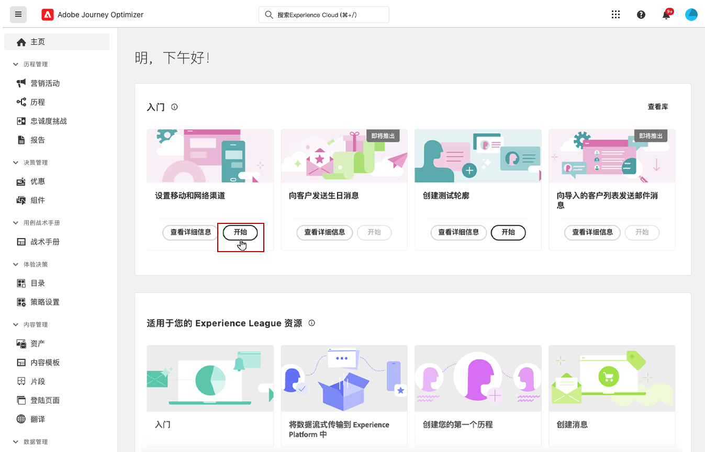
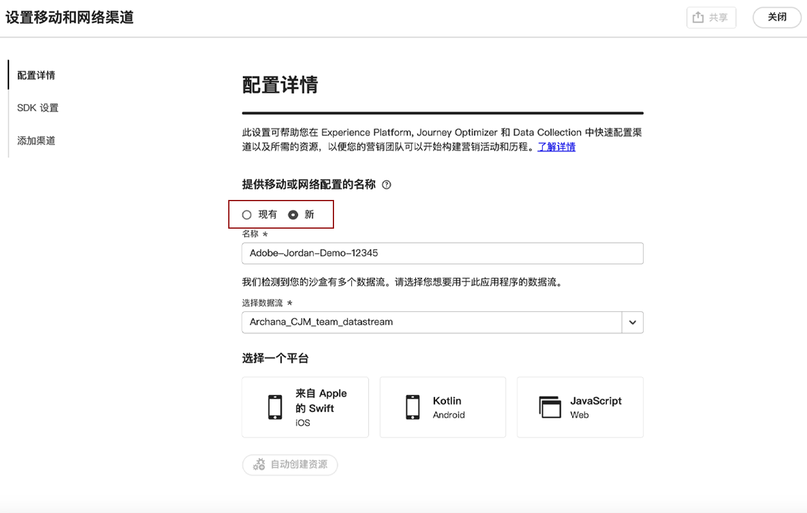
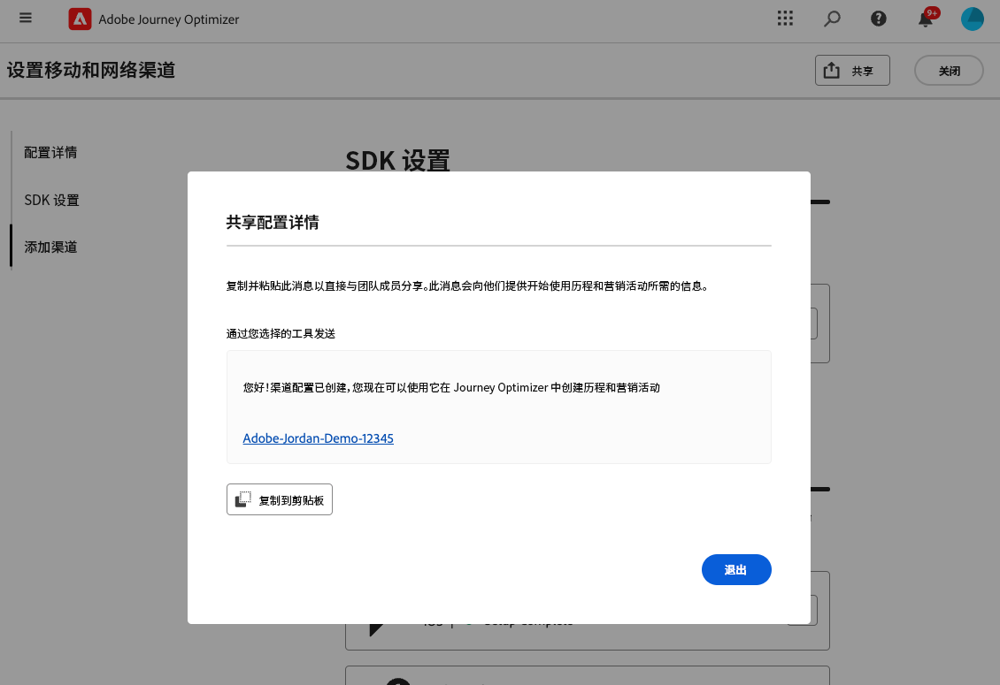
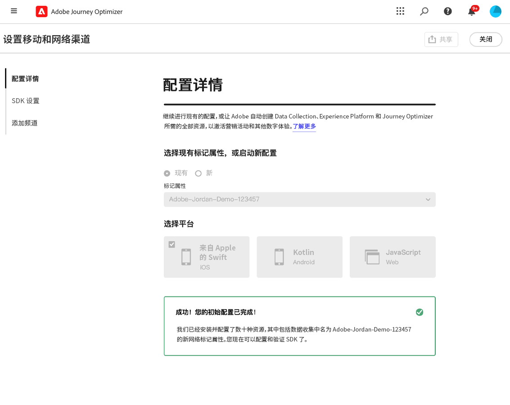
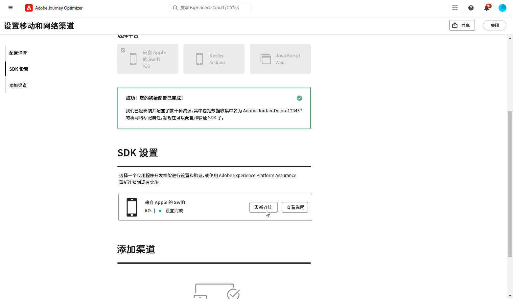
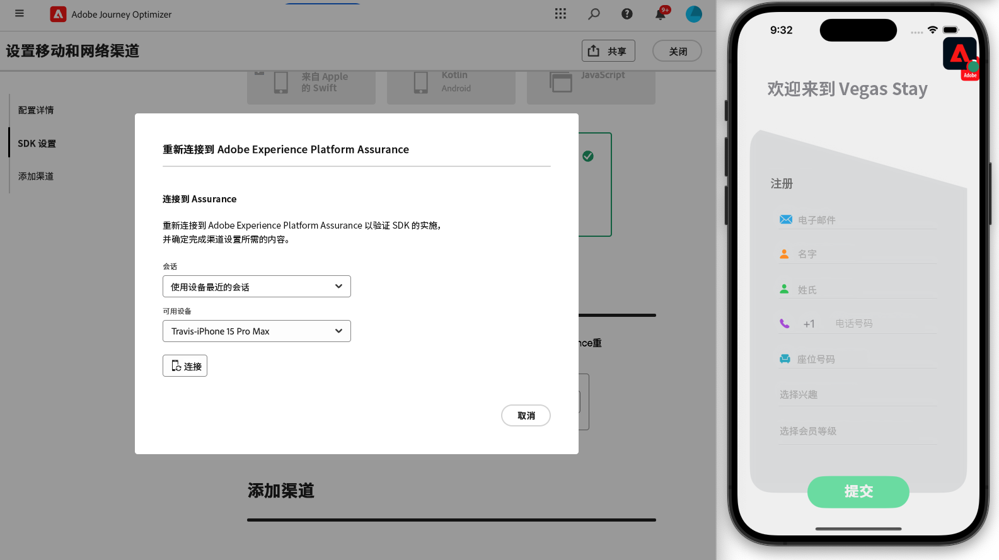

# 创建一个渠道设置 {#set-mobile-ios}

>[!CONTEXTUALHELP]
>id="ajo_mobile_web_setup_javascript_code"
>title="JavaScript 代码"
>abstract="头部标记包含在您的网页主要内容之前加载的基本元数据和资源。将代码放在此部分可确保其正确初始化并尽早执行，从而使您的网页能够高效加载和运行。通过在头部添加代码，您可以帮助提高网站的结构、性能和整体用户体验。"

>[!CONTEXTUALHELP]
>id="ajo_mobile_web_setup_push_token"
>title="检索设备令牌"
>abstract="为了确保设备的推送令牌与您的 Adobe Experience Platform 轮廓正确同步，您需要将以下代码合并到您的应用程序中。这种集成对于保持最新的通信能力和确保无缝的用户体验至关重要。"

>[!CONTEXTUALHELP]
>id="ajo_mobile_web_setup_push_xcode"
>title="通过 Xcode 启动应用程序"
>abstract="要获取您的推送令牌，首先，使用 Xcode 启动您的应用程序。应用程序启动后，重新启动它以确保验证过程完成。然后，Adobe 将提供您的推送令牌作为验证结果的一部分。此令牌对于启用推送通知至关重要，并且将在设置成功验证后显示。"

>[!CONTEXTUALHELP]
>id="ajo_mobile_web_push_certificate_fcm"
>title="提供推送证书"
>abstract="拖放您的 .json 专用密钥文件。该文件包含您的应用程序与服务器之间的安全集成和通信所需的身份验证信息。"

>[!CONTEXTUALHELP]
>id="ajo_mobile_web_setup_push_certificate"
>title="提供推送证书"
>abstract=".p8 密钥文件包含一个私钥，用于通过 Apple 的服务器验证您的应用程序，以实现安全推送通知。您可以从开发者帐户中的“证书、标识符和轮廓”页面获取此密钥。"

>[!CONTEXTUALHELP]
>id="ajo_mobile_web_setup_push_key_id"
>title="密钥 ID"
>abstract="密钥 ID 是在创建 p8 身份验证密钥期间分配的 10 个字符的字符串，可以在开发者帐户的“证书、标识符和轮廓”页面的&#x200B;**密钥**&#x200B;选项卡下找到。"

>[!CONTEXTUALHELP]
>id="ajo_mobile_web_setup_push_team_id"
>title="团队 ID"
>abstract="团队 ID 是用于识别您的团队的字符串值，位于您的开发者帐户中的&#x200B;**会员资格**&#x200B;选项卡下。"

这种设置简化了营销渠道的快速配置，使所有基本资源都在 Experience Platform、Journey Optimizer 和数据收集应用程序中随时可用。这允许您的营销团队快速开始创建营销活动和历程。

1. 在 Journey Optimizer 主页上，从&#x200B;**[!UICONTROL 设置移动渠道和 Web 渠道]**&#x200B;卡中单击&#x200B;**[!UICONTROL 开始]**。

   

1. 创建&#x200B;**[!UICONTROL 新]**&#x200B;配置。

   如果已有配置，则可以选择选择一个配置，或创建新配置。

   

1. 输入新配置的&#x200B;**[!UICONTROL 名称]**，然后选择或创建您的&#x200B;**[!UICONTROL 数据流]**。此&#x200B;**[!UICONTROL 名称]**&#x200B;将用于每个自动创建的资源。

1. 如果组织有多个数据流，请从现有选项中选择一个。如果您没有数据流，则将自动为您创建一个数据流。

1. 选择平台，然后单击&#x200B;**[!UICONTROL 自动创建资源]**。

1. 为了简化设置过程，会自动创建必要的资源来帮助您开始。这包括创建新的&#x200B;**[!UICONTROL 移动标记属性]**&#x200B;和安装扩展。

[了解有关自动生成资源的更多信息](set-mobile-config.md#auto-create-resources)

1. 资源生成完成后，按照用户界面中的说明设置并验证 SDK 和渠道。

1. 完成配置后，与负责创建历程和营销活动的团队成员共享自动生成的&#x200B;**[!UICONTROL 渠道配置]**。

   {zoomable="yes"}

1. 您现在可以在“营销活动”或“历程”界面中引用&#x200B;**[!UICONTROL 渠道配置]**，以便在为受众设置和执行定向历程与营销活动的工作之间实无缝衔接。

## 修改移动渠道现有配置 {#reconnect}

创建配置后，您可以随时轻松重新访问以添加其他渠道或根据需求进一步调整

1. 在 Journey Optimizer 主页上，从&#x200B;**[!UICONTROL 设置移动渠道和 Web 渠道]**&#x200B;卡中单击&#x200B;**[!UICONTROL 开始]**。

   

1. 选择&#x200B;**[!UICONTROL 现有]**，然后从下拉列表中选择现有的&#x200B;**[!UICONTROL 标记属性]**。

   

1. 访问现有配置时，您需要重新连接 Adobe Assurance。在 SDK 设置菜单中，单击&#x200B;**[!UICONTROL 重新连接]**。

   

1. 在&#x200B;**[!UICONTROL 可用设备]**&#x200B;下拉列表中选择设备，然后单击&#x200B;**[!UICONTROL 连接]**。

   {zoomable="yes"}

1. 您现在可以根据需要更新配置。
