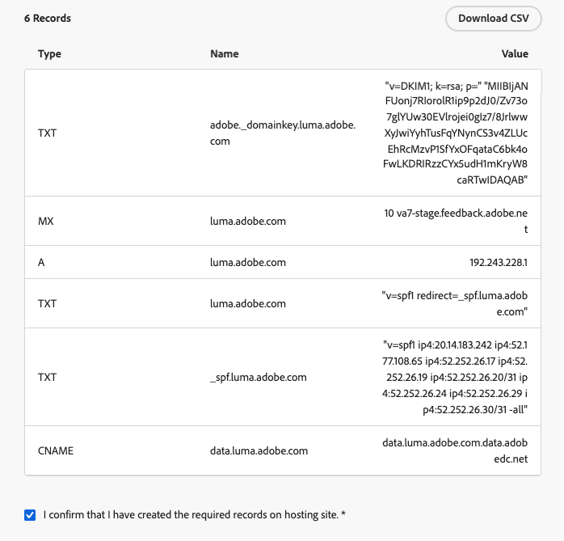
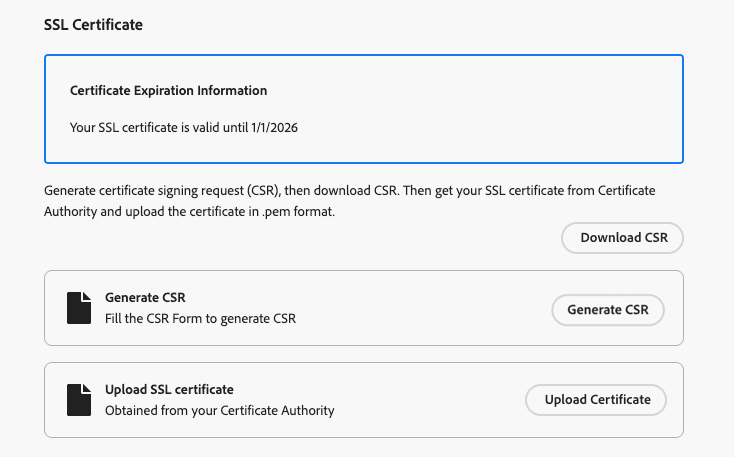

# 设置自定义子域 {#delegate-custom-subdomain}

作为[完全委派](about-subdomain-delegation.md#full-subdomain-delegation)和[CNAME设置](about-subdomain-delegation.md#cname-subdomain-delegation)方法的替代方法，**自定义委派**&#x200B;方法允许您在Journey Optimizer ans中获取子域的所有权，以便对生成的证书拥有完全控制权。

在此过程中，Adobe需要确保您的DNS相应地配置为投放、渲染和跟踪消息。 这就是为什么您需要通过验证域所有权和报告电子邮件地址来[上载从证书颁发机构获得的SSL证书](#upload-ssl-certificate)并完成[反馈循环步骤](#feedback-loop-steps)。

要设置自定义子域，请执行以下步骤。

1. 访问&#x200B;**[!UICONTROL 管理]** > **[!UICONTROL 渠道]** > **[!UICONTROL 电子邮件设置]** > **[!UICONTROL 子域]**&#x200B;菜单。

1. 单击&#x200B;**[!UICONTROL 设置子域]**。

1. 从&#x200B;**[!UICONTROL 设置方法]**&#x200B;部分中，选择&#x200B;**[!UICONTROL 自定义委派]**。

   {width=90%}

1. 指定要委派的子域的名称。

   >[!CAUTION]
   >
   >无法使用相同的发送域从[!DNL Adobe Journey Optimizer]和其他产品（如[!DNL Adobe Campaign]或[!DNL Adobe Marketo Engage]）发送消息。

## 创建 DNS 记录 {#create-dns-records}

>[!CONTEXTUALHELP]
>id="ajo_admin_subdomain_custom_dns"
>title="生成匹配的 DNS 记录"
>abstract="要将自定义子域委派给 Adobe，您需要将 Journey Optimizer 界面中显示的名称服务器信息，复制粘贴到您的域托管解决方案中，以生成匹配的 DNS 记录。"

1. 此时将显示要放入您的 DNS 服务器中的记录列表。逐个复制这些记录，或通过下载CSV文件复制。

1. 导航到您的域托管解决方案，以生成匹配的DNS记录。

1. 确保所有DNS记录都已生成到您的域托管解决方案中。

1. 如果一切配置正确，请选中“我确认……”框。

   {width="75%"}

## 上传 SSL 证书 {#upload-ssl-certificate}

>[!CONTEXTUALHELP]
>id="ajo_admin_subdomain_custom-ssl"
>title="生成证书签名请求"
>abstract="在设置新的自定义子域时，您需要生成证书签名请求（CSR），填写相关信息并将其提交给证书颁发机构（CA），以获取 SSL 证书。获取证书后，需将其上传至 Journey Optimizer。"

>[!CONTEXTUALHELP]
>id="ajo_admin_subdomain_key_length"
>title="xxx"
>abstract=""

1. 在&#x200B;**[!UICONTROL SSL证书]**&#x200B;部分中，单击&#x200B;**[!UICONTROL 生成CSR]**。

   {width="85%"}

   >[!NOTE]
   >
   >将显示SSL证书到期日期。 到达日期后，您需要上传新证书。

1. 填写显示的表单并生成证书签名请求(CSR)。

   {width="70%"}

   >[!NOTE]
   >
   >密钥长度只能为2048位或4096位。 提交子域后，无法对其进行更改。

1. 单击&#x200B;**[!UICONTROL 下载CSR]**&#x200B;并将表单保存到本地计算机。 将其发送到证书颁发机构以获取SSL证书。

1. 检索完毕后，单击&#x200B;**[!UICONTROL 上传SSL证书]**&#x200B;并将证书以.pem格式上传到[!DNL Journey Optimizer]。

## 完成反馈回路步骤 {#feedback-loop-steps}

>[!CONTEXTUALHELP]
>id="ajo_admin_subdomain_feedback-loop"
>title="完成反馈回路步骤"
>abstract="前往 Yahoo! 发件人中心（Sender Hub），填写表单以验证域名所有权。输入下方列出的 FBL 报告电子邮件地址，并使用收到的一次性密码（OTP）在 Yahoo! 上完成所有权验证。发件人中心。"

1. 转到[Yahoo！ 发件人中心](https://senders.yahooinc.com/)网站并填写验证您的域所有权所需的表单。

1. 要验证域所有权，请Yahoo！ 发件人中心将要求您提供电子邮件地址。 输入列在&#x200B;**[!UICONTROL 值]**&#x200B;下的FBL报告电子邮件地址。 这是Adobe拥有的电子邮件地址。

1. 当Yahoo！ 发件人中心生成一次性密码(OTP)，该密码将发送到此Adobe地址。

1. 联系将为您提供此OTP的Adobe可投放性团队。<!--Specify how to reach out + any information that customer should share in the request to deliverability team to get access to the right OTP-->

   >[!CAUTION]
   >
   >OTP仅在24小时内有效，因此请确保在OTP生成后立即联系Adobe。<!--TBC?-->
   >
   >OTP请求只能在工作日发出。 周末不支持。<!--Add times + timezone-->

1. 输入Yahoo！ 发件人中心。

1. 确保您已完成所有反馈循环步骤。

1. 如果一切配置正确，请选中“我已完成……”框。

   {width="85%"}

1. 单击&#x200B;**[!UICONTROL 继续]**&#x200B;并等待，直到Adobe验证在您的托管解决方案上生成的记录没有错误。 此过程最多可能需要2分钟。

   >[!NOTE]
   >
   >任何丢失的记录（即尚未在您的托管解决方案上创建的记录）都将被列出。

   Adobe生成一个SSL CDN URL验证记录。 将此验证记录复制到您的托管平台。 如果您已在托管解决方案上正确创建此记录，请选中“I confirm...”框。

1. 单击&#x200B;**[!UICONTROL 提交]**&#x200B;以使Adobe执行所需的检查。 [了解详情](#submit-subdomain)

## 疑难解答检查列表 {#check-list}

如果在尝试提交自定义子域时出错，请执行以下列出的故障诊断操作。

* 检查所有DNS记录是否已使用DNS查找工具正确传播。

* 在上传之前，请验证您的证书是否符合所有技术要求。

* 确保您的证书以正确格式上传。

