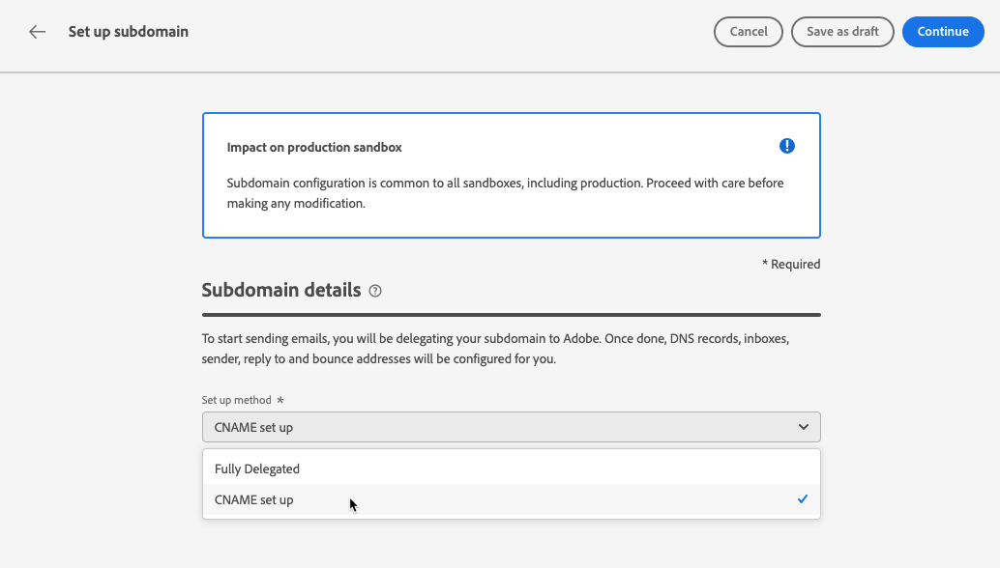

# 委派子域 {#delegate-subdomain}

>[!CONTEXTUALHELP]
>id="ajo_admin_subdomainname"
>title="关于子域委派"
>abstract="Journey Optimizer允许您将子域完全委派给Adobe。 Adobe将能够通过控制和维护DNS的所有方面，以托管服务的形式来传递消息。"

域名委派是允许域名所有者的方法(技术上为：DNS区域)，以委派其分区(技术上：其下的DNS区域（可称为子区域）到其他实体。 基本上，作为客户，如果您正在处理“example.com”区域，则可以将子区域“marketing.example.com”委派给Adobe。

通过委派子域以与一起使用 [!DNL Journey Optimizer]，客户可以依赖Adobe来维护满足其电子邮件营销发送域行业标准可交付性要求所需的DNS基础架构，同时继续维护和控制其内部电子邮件域的DNS。

>[!NOTE]
>
>默认情况下， [!DNL Journey Optimizer] 许可合同允许您最多委派10个子域。 如果要提高此限制，请联系您的Adobe联系人。

## 完全子域委派 {#full-subdomain-delegation}

[!DNL Journey Optimizer] 允许您完全委派子域，以便直接从产品界面Adobe。 这样，Adobe就能够通过控制和维护发送、渲染和跟踪电子邮件促销活动所需的DNS的所有方面，将消息作为托管服务进行传送。

要将新子域完全委派到Adobe，请执行以下步骤：

1. 访问 **[!UICONTROL Administration]** > **[!UICONTROL Channels]** > **[!UICONTROL Subdomains]** 菜单，然后单击 **[!UICONTROL Set up subdomain]**.

   

1. 选择 **[!UICONTROL Fully delegated]** 从 **[!UICONTROL Set up method]** 中。

   

1. 指定要委派的子域的名称。

   

   >[!CAUTION]
   >
   >不允许将无效的子域委派到Adobe。 确保输入您的组织拥有的有效子域，如marketing.yourcompany.com。
   >
   >请注意，当前不支持多级子域，如email.marketing.yourcompany.com。

1. 此时将显示要放入您的 DNS 服务器中的记录列表。逐个复制这些记录，或者下载 CSV 文件，然后导航到您的域托管解决方案以生成匹配的 DNS 记录。

1. 确保所有DNS记录都已生成到您的域托管解决方案中。 如果一切配置正确，请选中“I confirm...”框，然后单击 **[!UICONTROL Submit]**.

   

   >[!NOTE]
   >
   >您稍后可以使用 **[!UICONTROL Save as draft]** 按钮。 然后，您将能够从子域列表中打开子域委派，以恢复子域委派。

1. 提交完整子域委派后，该子域将显示在列表中，其中 **[!UICONTROL Processing]** 状态。 有关子域状态的更多信息，请参阅 [此部分](access-subdomains.md).

   

   在能够使用该子域发送消息之前，您必须等到Adobe执行所需的检查，该检查可能最多需要3小时。 在 [此部分](#subdomain-validation).

   >[!NOTE]
   >
   >任何缺失的记录（即尚未在您的托管解决方案上创建的记录）都将列出。

1. 检查成功后，子域将获取 **[!UICONTROL Success]** 状态。 它已准备好用于投放消息。

   >[!NOTE]
   >
   >子域将标记为 **[!UICONTROL Failed]** 如果您未能在托管解决方案上创建验证记录。

   <!-- later on, users will be notified in Pulse -->

将子域委派到中的Adobe后 [!DNL Journey Optimizer]，则会自动创建一个PTR记录并与此子域关联。 [了解详情](ptr-records.md)

>[!CAUTION]
>
>中当前不支持并行执行子域 [!DNL Journey Optimizer]. 如果您尝试在另一个域具有 **[!UICONTROL Processing]** 状态时，您将收到一条错误消息。

## CNAME 子域委派 {#cname-subdomain-delegation}

如果您具有特定于域的限制策略，并且您希望Adobe仅对DNS进行部分控制，则可以选择在您的一方执行所有与DNS相关的活动。

CNAME 子域委派允许您创建子域，并使用 CNAME 指向特定于 Adobe 的记录。使用此配置，您和 Adobe 共同负责维护 DNS，以设置用于发送、渲染和跟踪电子邮件的环境。

>[!CAUTION]
>
>如果您所在组织的策略对完全子域委派方法有限制，则建议使用此方法。这种方法要求您自行维护和管理DNS记录。 Adobe将无法协助更改、维护或管理通过CNAME方法配置的子域的DNS。

要使用CNAME委派子域，请执行以下步骤：

1. 访问 **[!UICONTROL Administration]** > **[!UICONTROL Channels]** > **[!UICONTROL Subdomains]** 菜单，然后单击 **[!UICONTROL Set up subdomain]**.

1. 选择 **[!UICONTROL CNAME set up]** 方法。

   

1. 指定要委派的子域的名称。

   >[!CAUTION]
   >
   >不允许将无效的子域委派到Adobe。 确保输入您的组织拥有的有效子域，如marketing.yourcompany.com。
   >
   >请注意，当前不支持多级子域，如email.marketing.yourcompany.com。

1. 此时将显示要放入您的 DNS 服务器中的记录列表。逐个复制这些记录，或者下载 CSV 文件，然后导航到您的域托管解决方案以生成匹配的 DNS 记录。

1. 确保所有DNS记录都已生成到您的域托管解决方案中。 如果一切配置正确，请选中“I confirm...”复选框。

   

   >[!NOTE]
   >
   >您稍后可以使用 **[!UICONTROL Save as draft]** 按钮。 然后，您将能够在此阶段通过从子域列表中打开子域委派来恢复子域委派。

1. 等待Adobe验证这些记录是否在您的托管解决方案上生成且没有错误。 此过程最多可能需要2分钟。

   >[!NOTE]
   >
   >任何缺失的记录（即尚未在您的托管解决方案上创建的记录）都将列出。

1. Adobe生成SSL CDN URL验证记录。 将此验证记录复制到您的托管平台。 如果您在托管解决方案上正确创建了此记录，请选中“I confirm...”框，然后单击 **[!UICONTROL Submit]**.

   

   >[!NOTE]
   >
   >您还可以在以后使用 **[!UICONTROL Save as draft]** 按钮。 然后，您将能够从子域列表中打开子域委派，以恢复子域委派。

1. 提交CNAME子域委派后，该子域将显示在列表中，并且 **[!UICONTROL Processing]** 状态。 有关子域状态的更多信息，请参阅 [此部分](access-subdomains.md).

   在能够使用该子域发送消息之前，您必须等到Adobe执行所需的检查（通常需要2到3小时）。 在 [此部分](#subdomain-validation).

1. 检查成功后<!--i.e Adobe validates the record you created and installs it-->，子域获取 **[!UICONTROL Success]** 状态。 它已准备好用于投放消息。

   >[!NOTE]
   >
   >子域将标记为 **[!UICONTROL Failed]** 如果您未能在托管解决方案上创建验证记录。

验证记录并安装证书后，Adobe会自动为CNAME子域创建PTR记录。 [了解详情](ptr-records.md)

>[!CAUTION]
>
>中当前不支持并行执行子域 [!DNL Journey Optimizer]. 如果您尝试在另一个域具有 **[!UICONTROL Processing]** 状态时，您将收到一条错误消息。

## 子域验证 {#subdomain-validation}

在验证子域之前，将执行以下检查和操作，并可用于发送消息。

>[!NOTE]
>
>这些步骤由Adobe执行，最长可能需要3小时。

1. **预验证**:Adobe检查子域是否已委派给AdobeDNS（NS记录、SOA记录、区域设置、所有权记录）。 如果预验证步骤失败，则返回错误以及相应的原因，否则Adobe将继续执行下一步。

1. **为域配置DNS**:

   * **MX记录**:Mail eXchange记录 — 用于处理发送到子域的入站电子邮件的邮件服务器记录。
   * **SPF记录**:发件人策略框架记录 — 列出可从子域发送电子邮件的邮件服务器的IP。
   * **DKIM记录**:DomainKeys Identified Mail标准记录 — 使用公钥 — 私钥加密来验证消息以避免欺骗。
   * **A**:默认IP映射。
   * **CNAME**:规范名称或CNAME记录是一种DNS记录类型，可将别名映射到真或规范域名。

1. **创建跟踪和镜像URL**:如果域是email.example.com，则tracking/mirror域将为data.email.example.com。 它通过安装SSL证书来保护。

1. **配置CDN CloudFront**:如果CDN尚未设置，则Adobe会为导入配置CDN。

1. **创建CDN域**:如果域是email.example.com，则CDN域将为cdn.email.example.com。

1. **创建并附加CDN SSL证书**:Adobe为CDN域创建CDN证书，并将证书附加到CDN域。

1. **创建转发DNS**:如果这是您委派的第一个子域，则Adobe将创建转发DNS，创建PTR记录所需的DNS — 每个IP一个。

1. **创建PTR记录**:ISP需要PTR记录（也称为反向DNS记录），以便它们不会将电子邮件标记为垃圾邮件。 Gmail还建议为每个IP设置PTR记录。 Adobe仅在您首次委派子域时创建PTR记录，每个IP一个，所有指向该子域的IP。 例如，如果IP为 *192.1.2.1* 而子域为 *email.example.com*，则PTR记录将为： *192.1.2.1 PTR r1.email.example.com*. 之后，您可以更新PTR记录以指向新的委派域。 [了解有关PTR记录的更多信息](ptr-records.md)
