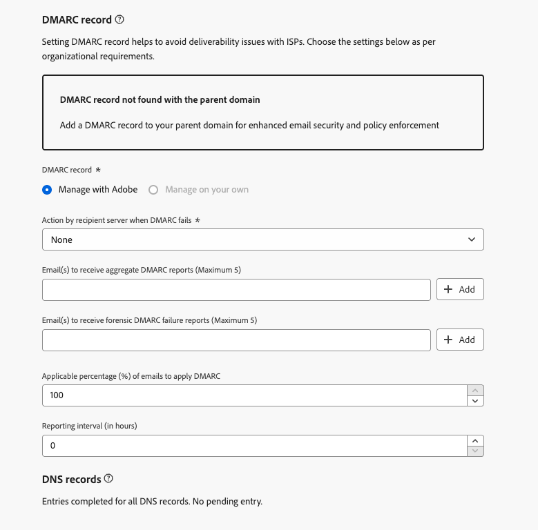

# DMARC 记录 {#dmarc-record}

>[!CONTEXTUALHELP]
>id="ajo_admin_dmarc_record"
>title="设置 DMARC 记录"
>abstract="DMARC 是一种电子邮件身份验证方法，它使域所有者可保护其域免遭未经授权的使用，并避免邮箱提供商出现送达问题。 作为执行行业最佳实践的举措之一，Google 和 Yahoo!都会要求您用于向它们发送电子邮件的任何域都必须有 DMARC 记录。"

## 什么是DMARC？ {#what-is-dmarc}

基于域的消息身份验证、报告和符合性 (DMARC) 是一种电子邮件身份验证方法，允许域所有者保护其域免遭未经授权使用。通过向电子邮件提供商和Internet服务提供商(ISP)提供明确的策略，它有助于防止恶意行为者发送声称来自您的域的电子邮件。 实施 DMARC 可降低合法电子邮件被标记为垃圾邮件或拒绝的风险，并改进电子邮件可传递性。

DMARC还提供了对身份验证失败的消息的报告，以及对未通过DMARC验证的电子邮件的处理控制。 根据实施的[DMARC策略](#dmarc-policies)，可以监视、隔离或拒绝这些电子邮件。 利用这些功能，可采取措施来缓解和解决潜在错误。

为了帮助您在获得对身份验证失败的邮件的控制时防止出现可投放性问题，[!DNL Journey Optimizer]现在直接在其管理界面中支持DMARC技术。 [了解详情](#implement-dmarc)

### DMARC的工作原理 {#how-dmarc-works}

SPF和DKIM均用于将电子邮件与域相关联，并共同验证电子邮件。 DMARC更进一步，通过匹配DKIM和SPF检查的域，帮助防止欺骗。

>[!NOTE]
>
>在Journey Optimizer中，为您配置了SPF和DKIM。

要传递DMARC，必须传递SPF或DKIM：

* SPF （Sender Policy Framework，发件人策略框架）可通过检查发送服务器的IP地址（根据域的授权IP地址列表），帮助验证电子邮件是否来自授权来源。
* DKIM (DomainKeys Identified Mail)为电子邮件添加数字签名，允许收件人验证邮件的完整性和真实性。

如果这两种身份验证或其中一种都失败，则DMARC将失败，并根据您选择的DMARC策略发送电子邮件。

<!--DMARC requires alignment between the 'From" and 'Return-Path' address.-->

### DMARC策略 {#dmarc-policies}

如果电子邮件通过DMARC身份验证，您可以决定对该邮件应用哪个操作。 DMARC有三个政策选项：

* 监视(p=none)：指示邮箱提供商/ISP对邮件执行正常操作。
* 隔离（p=隔离）：指示邮箱提供商/ISP传送不会将DMARC传递到收件人的垃圾邮件或垃圾邮件文件夹的邮件。
* 拒绝(p=reject)：指示邮箱提供商/ISP阻止未通过DMARC的邮件，从而导致反弹。

>[!NOTE]
>
>在[本节](#set-up-dmarc)中了解如何使用[!DNL Journey Optimizer]设置DMARC策略。

## DMARC要求更新 {#dmarc-update}

作为执行行业最佳实践的举措之一，Google 和 Yahoo!要求您拥有用于向其发送电子邮件的任何域的&#x200B;**DMARC记录**。 这一新要求自 **2024 年 2 月 1 日**&#x200B;起生效。

>[!CAUTION]
>
>若未能遵守 Gmail 和 Yahoo! 的新要求，可能导致电子邮件被标记为垃圾邮件或被阻止。

因此，Adobe强烈建议您执行以下操作：

* 确保为&#x200B;**您已在[!DNL Journey Optimizer]中委派**&#x200B;到Adobe的所有子域设置&#x200B;**DMARC记录**。 [了解如何操作](#check-subdomains-for-dmarc)

* 当&#x200B;**将任何新子域**&#x200B;委派给Adobe时，您可以&#x200B;**在[!DNL Journey Optimizer]管理界面**&#x200B;中直接&#x200B;**设置DMARC**。 [了解如何操作](#implement-dmarc)

## 在[!DNL Journey Optimizer]中实施DMARC {#implement-dmarc}

[!DNL Journey Optimizer]管理界面允许您为已委派或正在委派给Adobe的所有子域设置DMARC记录。 详细步骤如下所述。

### 检查DMARC的现有子域 {#check-subdomains-for-dmarc}

要确保为您在[!DNL Journey Optimizer]中委派的所有子域设置了DMARC记录，请执行以下步骤。

1. 访问&#x200B;**[!UICONTROL 管理]** > **[!UICONTROL 渠道]** > **[!UICONTROL 子域]**&#x200B;菜单，然后单击&#x200B;**[!UICONTROL 设置子域]**。

1. 对于每个委派的子域，请检查&#x200B;**[!UICONTROL DMARC记录]**&#x200B;列。 如果没有找到给定子域的记录，则会显示警报。

   

   >[!CAUTION]
   >
   >为了符合Gmail和Yahoo！的新要求，并避免顶级ISP出现可投放性问题，建议为所有委派的子域设置DMARC记录。 [了解详情](dmarc-record-update.md)

1. 选择不关联DMARC记录的子域，并根据您组织的需求填写&#x200B;**[!UICONTROL DMARC记录]**&#x200B;部分。 [此部分](#implement-dmarc)中详细介绍了填充DMARC记录字段的步骤。

1. 请考虑以下两个选项：

   * 如果您正在编辑使用[CNAME](delegate-subdomain.md#cname-subdomain-delegation)设置的子域，则必须将DMARC的DNS记录复制到您的托管解决方案中，以生成匹配的DNS记录。

     

     确保DNS记录已生成到您的域托管解决方案中，并选中“我确认……”框。

   * 如果您正在编辑已完全委派给Adobe的子域，只需填写[此部分](#implement-dmarc)中详述的&#x200B;**[!UICONTROL DMARC记录]**&#x200B;字段。 无需执行其他操作。

     

1. 保存更改。

### 为新子域设置DMARC {#set-up-dmarc}

将新子域委派给[!DNL Journey Optimizer]中的Adobe时，将为您的域在DNS中创建DMARC记录。 按照以下步骤实施DMARC。

>[!CAUTION]
>
>为了符合Gmail和Yahoo！的新要求，并避免顶级ISP出现可投放性问题，建议为所有委派的子域设置DMARC记录。 [了解详情](dmarc-record-update.md)

<!--If you fail to comply with the new requirement from Gmail and Yahoo! to have DMARC record for all sending domains, your emails are expected to land into the spam folder or to get blocked.-->

1. 设置新子域。 [了解如何操作](delegate-subdomain.md)

1. 转到&#x200B;**[!UICONTROL DMARC记录]**&#x200B;部分。

   如果子域具有现有的DMARC记录，并且它由[!DNL Journey Optimizer]获取，则您可以使用界面中高亮显示的相同值，也可以根据需要更改这些值。

   

   >[!NOTE]
   >
   >如果不添加任何值，将使用预填充的默认值。

1. 定义在DMARC失败时收件人服务器将执行的操作。 根据要应用的[DMARC策略](#dmarc-policies)，选择以下三个选项之一：

   * **[!UICONTROL 无]** （默认值）：告知接收者不对未通过DMARC身份验证的邮件执行任何操作，但仍会向发件人发送电子邮件报告。
   * **[!UICONTROL 隔离]**：通知接收电子邮件服务器隔离未通过DMARC身份验证的电子邮件 — 这通常意味着将这些邮件放入收件人的垃圾邮件或垃圾邮件文件夹中。
   * **[!UICONTROL 拒绝]**：告知接收者完全拒绝（退回）验证失败的域的任何电子邮件。 启用此策略后，只有经域验证为100%经过身份验证的电子邮件才有机会放置收件箱。

   >[!NOTE]
   >
   >作为最佳实践，建议您通过将DMARC策略从&#x200B;**None**&#x200B;提升到&#x200B;**Quarantine**，再提升到&#x200B;**Reject**，以慢慢推出DMARC实施，因为您了解DMARC的潜在影响。

1. （可选）添加您选择的一个或多个电子邮件地址，以指示[身份验证失败](#how-dmarc-works)的电子邮件上的&#x200B;**DMARC报告**&#x200B;应该位于组织内的哪个位置。 您最多可以为每个报表添加五个地址。

   >[!NOTE]
   >
   >确保您的控制中有一个正版收件箱(不是Adobe)，您可以在其中接收这些报告。

   ISP生成了两种不同的报告，发件人可以通过其DMARC策略中的RUA/RUF标记接收这些报告：

   * **汇总报表** (RUA)：它们不包含任何可能对GDPR敏感的PII（个人身份信息）。
   * **取证失败报告** (RUF)：它们包含对GDPR敏感的电子邮件地址。 在使用之前，请在内部检查如何处理需要符合GDPR的信息。

   >[!NOTE]
   >
   >这些技术性很强的报告概述了尝试欺骗的电子邮件。 最好通过第三方工具来消化这些术语。

1. 为DMARC选择&#x200B;**适用的电子邮件百分比**。

   此百分比取决于您对电子邮件基础架构的信心以及对误报（标记为欺诈的合法电子邮件）的容忍度。 组织通常从DMARC策略设置为&#x200B;**无**&#x200B;开始，逐渐增加DMARC策略百分比，并密切监视对合法电子邮件投放的影响。

   >[!NOTE]
   >
   >随着您对电子邮件身份验证实践的信心，请与您的电子邮件管理员和IT团队合作，逐步提高此百分比。

   作为最佳实践，请力争实现高DMARC合规率（最好接近100%），以便在最大限度地提高安全性的同时最大限度地降低误报风险。

1. 选择24到168小时之间的&#x200B;**报告间隔**。 它允许域所有者定期接收有关电子邮件身份验证结果的更新，并采取必要措施提高电子邮件安全性。

   <!--The DMARC reporting interval is specified in the DMARC policy published in the DNS (Domain Name System) records for a domain. The reporting interval can be set to daily, weekly, or another specified frequency, depending on the domain owner's preferences.

    The default value (24 hours) is generally the email providers' expectation.-->

<!--

Setting up a DMARC record involves adding a DNS TXT record to your domain's DNS settings. This record specifies your DMARC policy, such as whether to quarantine or reject messages that fail authentication. Implementing DMARC is a proactive step towards enhancing email security and protecting both your organization and your recipients from email-based threats.

DMARC helps prevent malicious actors from sending emails that appear to come from your domain. By setting up DMARC, you can specify how email providers should handle messages that fail authentication checks, reducing the likelihood that phishing emails will reach recipients.

DMARC helps improve email deliverability by providing a clear policy for email providers to follow when encountering messages claiming to be from your domain. This can reduce the chances of legitimate emails being marked as spam or rejected.

DMARC helps protect against email spoofing, phishing, and other fraudulent activities.

It allows you to decide how a mailbox provider should handle emails that fail SPF and DKIM checks, providing a way to authenticate the sender's domain and prevent unauthorized use of the domain for malicious purposes.

## What are the benefits of DMARC? {#dmarc-benefits}

The key benefits or DMARC are as folllows:

* DMARC allows email receivers to easily identify the authentication of emails, which could potentially improve delivery.

* It offers reporting on which messages fail SPF and/or DKIM, enabling senders to gain visibility.

* This increased visibility allows for steps to be taken to mitigate further errors. It gives senders a degree of control over what happens with mail that does not pass either of these authentication methods.

-->
