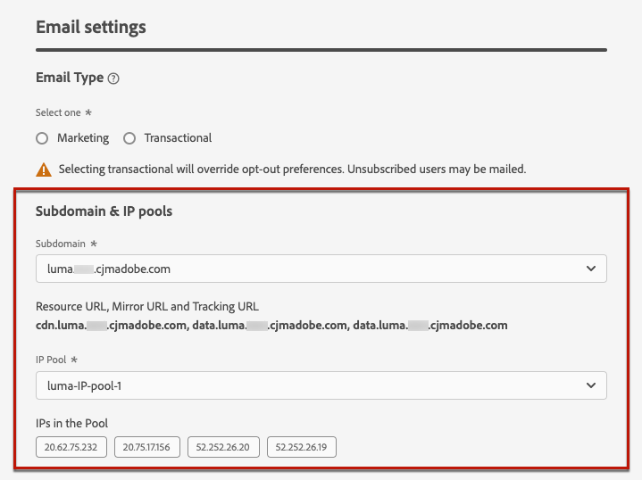
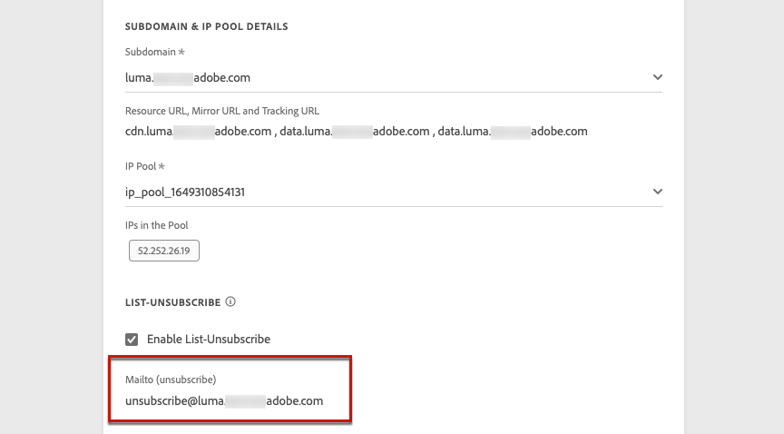
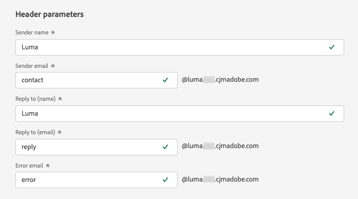

# 配置电子邮件设置 {#email-settings}

在消息预设配置的专用部分中定义电子邮件设置。 了解如何在 [此部分](message-presets.md).

## 电子邮件类型 {#email-type}

>[!CONTEXTUALHELP]
>id="ajo_admin_presets_emailtype"
>title="定义电子邮件类别"
>abstract="选择使用此预设时将发送的消息类型：促销消息的营销（需要用户同意）或非商业消息的事务型消息，也可以在特定环境中发送给未订阅的用户档案。"

在 **电子邮件类型** ，选择要随预设一起发送的消息类型： **营销** 或 **事务型**.

* 选择 **营销** 对于促销消息：这些消息需要用户同意。

* 选择 **事务型** 例如，对于订单确认、密码重置通知或投放信息等非商业性消息。

>[!CAUTION]
>
>**事务型** 消息可发送给从营销通信中取消订阅的用户档案。 这些消息只能在特定上下文中发送。

When [创建消息](../messages/get-started-content.md#create-new-message)，则必须选择与您为消息选择的类别匹配的有效消息预设。

## 子域和IP池 {#subdomains-and-ip-pools}

在 **子域和IP池详细信息** 部分，您必须：

1. 选择要用于发送电子邮件的子域。 [了解详情](about-subdomain-delegation.md)

1. 选择要与预设关联的IP池。 [了解详情](ip-pools.md)

当选定的IP池位于下时，无法继续创建预设 [版本](ip-pools.md#edit-ip-pool) (**[!UICONTROL Processing]** 状态)且从未与选定的子域关联。 否则，仍将使用IP池/子域关联的最旧版本。 如果出现这种情况，请将预设另存为草稿，然后在IP池具有 **[!UICONTROL Success]** 状态。

>[!NOTE]
>
>对于非生产环境，Adobe不会创建现成的测试子域，也不会授予对共享发送IP池的访问权限。 您需要 [委派您自己的子域](delegate-subdomain.md) 并使用分配给贵组织的池中的IP。

## 列表取消订阅 {#list-unsubscribe}

On [选择子域](#subdomains-and-ip-pools) 在列表中， **[!UICONTROL Enable List-Unsubscribe]** 选项。

默认启用此选项。

如果保持启用状态，则取消订阅链接将自动包含在电子邮件标题中，例如：

如果禁用此选项，则电子邮件标题中不会显示取消订阅链接。

取消订阅链接包含两个元素：

* 安 **取消订阅电子邮件地址**，所有取消订阅请求都将发送到该服务器。

   在 [!DNL Journey Optimizer]，则取消订阅电子邮件地址为默认地址 **[!UICONTROL Mailto (unsubscribe)]** 消息预设中显示的地址(基于 [选定子域](#subdomains-and-ip-pools).

   

* 的 **取消订阅URL**，取消订阅后，用户将被重定向到的登陆页面的URL。

   如果您添加 [一键式选择退出链接](../messages/consent.md#one-click-opt-out) 对于使用此预设创建的消息，取消订阅URL将是为一键单击选择退出链接定义的URL。

   

   >[!NOTE]
   >
   >如果您没有在消息内容中添加一键单击选择退出链接，则不会向用户显示登陆页面。

在 [此部分](../messages/consent.md#unsubscribe-header).

<!--Select the **[!UICONTROL Custom List-Unsubscribe]** option to enter your own Unsubscribe URL and/or your own Unsubscribe email address.(to add later)-->

## 标头参数{#email-header}

在 **[!UICONTROL HEADER PARAMETERS]** 部分，输入与使用该预设发送的消息类型关联的发件人名称和电子邮件地址。

>[!CAUTION]
>
>电子邮件地址必须使用当前选定的 [委派子域](about-subdomain-delegation.md).

* **[!UICONTROL Sender name]**:发件人的名称，如您的品牌名称。

* **[!UICONTROL Sender email]**:要用于通信的电子邮件地址。 例如，如果委派的子域为 *marketing.luma.com*，您可以使用 *contact@marketing.luma.com*.

* **[!UICONTROL Reply to (name)]**:收件人单击 **回复** 按钮。

* **[!UICONTROL Reply to (email)]**:收件人单击 **回复** 按钮。 您必须使用在委派子域上定义的地址(例如， *reply@marketing.luma.com*)，否则将删除电子邮件。

* **[!UICONTROL Error email]**:收到ISP在收到几天邮件后（异步退回）生成的所有错误，均位于此地址。

>[!NOTE]
>
>地址必须以字母(A-Z)开头，且只能包含字母数字字符。 还可以使用下划线 `_`，点`.` 和连字符 `-` 字符。

## 电子邮件重试参数 {#email-retry}

>[!CONTEXTUALHELP]
>id="ajo_admin_presets_retryperiod"
>title="调整重试时间段"
>abstract="当电子邮件由于临时软退件错误而失败时，将执行3.5天（84小时）的重试。 您可以调整此默认的重试时间段，以更好地满足您的需求。"
>additional-url="https://experienceleague.adobe.com/docs/journey-optimizer/using/configuration/configuration-message/email-configuration/monitor-reputation/retries.html" text="关于重试"

您可以配置 **电子邮件重试参数**.

默认情况下， [重试时段](retries.md#retry-duration) 设置为84小时，但您可以根据自己的需求调整此设置。

您必须在以下范围内输入整数值（以小时或分钟为单位）：

* 对于营销电子邮件，最短重试期限为6小时。
* 对于事务型电子邮件，最短重试期限为10分钟。
* 对于这两种电子邮件类型，最大重试时间段为84小时（或5040分钟）。

了解有关重试的更多信息(位于 [此部分](retries.md).

## URL跟踪 {#url-tracking}

>[!CONTEXTUALHELP]
>id="ajo_admin_preset_utm"
>title="URL跟踪参数"
>abstract="使用此部分可自动将跟踪参数附加到电子邮件内容中存在的促销活动URL。"

您可以使用 **[!UICONTROL URL Tracking Parameters]** 来衡量您跨渠道营销工作的有效性。 此功能属于可选功能。

此部分中定义的参数将附加到电子邮件内容中包含的URL的末尾。 然后，您可以在Web分析工具(如Adobe Analytics或Google Analytics)中捕获这些参数，并创建各种性能报表。

例如，在创建消息预设时，会自动填充三个URL跟踪参数。 您可以编辑这些参数，并使用 **[!UICONTROL Add new parameter]** 按钮。

要配置URL跟踪参数，您可以直接在 **[!UICONTROL Name]** 和 **[!UICONTROL Value]** 字段，或通过导航到以下对象从预定义值列表中进行选择：

* 历程属性： **源ID**, **源名称**, **源版本ID**
* 消息属性： **操作ID**, **操作名称**
* Offer decisioning属性： **选件ID**, **选件名称**

>[!CAUTION]
>
>请勿选择文件夹：确保浏览到必要的文件夹并选择要用作跟踪参数值的配置文件属性。

以下是与Adobe Analytics和Google Analytics兼容的URL的示例。

* Adobe Analytics兼容URL:www.YourLandingURL.com?cid=email_AJO_{{context.system.source.id}}_图像_{{context.system.source.name}}

* Google Analytics兼容URL:www.YourLandingURL.com?utm_medium=email&amp;utm_source=AJO&amp;utm_campaign={{context.system.source.id}}&amp;utm_content=image

>[!NOTE]
>
>您可以组合键入文本值和选择预定义值。 每个 **[!UICONTROL Value]** 字段最多可包含255个字符。
