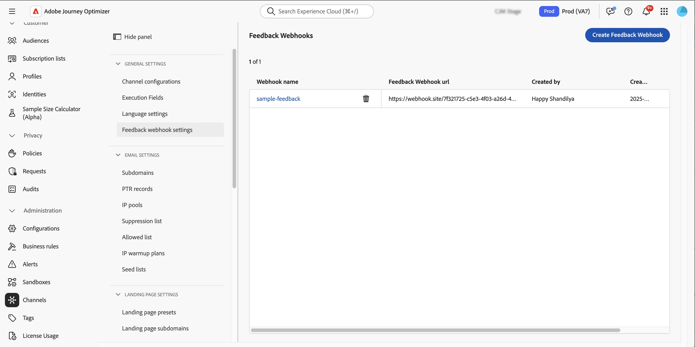

# 为API触发的营销活动创建反馈Webhook {#webhooks}

利用反馈Webhook，可接收通过事务性API触发的营销活动发送的消息的实时状态更新。 通过配置webhook，您可以自动将投放结果直接接收至您的系统，从而实现监控、日志记录和自动处理。

您可以从&#x200B;**[!UICONTROL 管理]** / **[!UICONTROL 渠道]** / **[!UICONTROL 反馈webhook设置]**&#x200B;菜单管理webhook配置。



>[!NOTE]
>每个&#x200B;**组织+沙盒**&#x200B;组合只允许一个Webhook配置。

## 创建反馈webhook

要创建webhook，请执行以下步骤：

1. 导航到&#x200B;**[!UICONTROL 管理]** / **[!UICONTROL 渠道]** / **[!UICONTROL 反馈webhook设置]**。

1. 单击&#x200B;**创建反馈Webhook**。

1. 在&#x200B;**[!UICONTROL 基本配置]**&#x200B;部分中，提供以下详细信息：

   

   * **Webhook名称** — 输入描述性名称以标识webhook。
   * **渠道** — 选择此webhook应接收其反馈（电子邮件和/或短信）的渠道。
   * **Webhook URL** — 提供必须向其传递反馈事件的HTTPS终结点。

1. 在&#x200B;**[!UICONTROL 身份验证]**&#x200B;部分中，选择身份验证方法：

   

   * **无身份验证** — 未添加身份验证标头。
   * **JWT身份验证** — 如果您的端点需要JWT身份验证，请提供所需的详细信息。

1. 在&#x200B;**[!UICONTROL 标头参数]**&#x200B;部分中，配置要随每个webhook请求发送的其他自定义标头。

   

1. 单击&#x200B;**[!UICONTROL 提交]**&#x200B;以保存配置。

>[!NOTE]
>
>您可以随时编辑webhook。 为此，请从清单中打开它，然后单击&#x200B;**[!UICONTROL 编辑]**&#x200B;按钮。

## Webhook有效载荷结构

消息执行后，**[!DNL Journey Optimizer]**&#x200B;将以下有效负载发送到配置的终结点。

```
{
  "requestId": "8NoByJneShCdCGRnrGS1t1m3CdA73dhR",
  "imsOrg": "myImsOrg",
  "sandbox": {
    "id": "068abf40-575e-11ea-8512-9b1bfdb82603",
    "name": "prod"
  },
  "channel": "email",
  "eventType": "message.feedback",
  "messageExecution": {
    "messageExecutionID": "HUMA-26362805",
    "messageType": "transactional",
    "campaignID": "16f24a15-7e21-477c-848a-d5695ca7f137",
    "campaignVersionID": "2ca10c10-56dd-4505-87cd-fa5da84e7a5d"
  },
  "messageDeliveryFeedback": {
    "feedbackStatus": {
      "value": "bounce"
    },
    "offers": null,
    "messageExclusion": null,
    "messageFailure": {
      "category": "sync",
      "type": "Ignored",
      "code": "25",
      "reason": "Admin Failure"
    },
    "retryCount": 0
  },
  "identityMap": {
    "email": [
      {
        "id": "john.doe@luma.com",
        "primary": true
      }
    ]
  }
}
```

webhook可以捕获以下事件：

* 已发送
* 已送达
* 跳出（请参阅以上示例）
* 错误

每个传入请求还包括一个发送回webhook的唯一请求ID。

## 后续步骤 {#next}

创建反馈webhook后，您可以在配置&#x200B;**事务型API触发的营销活动**&#x200B;受众时启用它。 在本节中了解详情：[启用Webhook](../campaigns/api-triggered-campaign-audience.md#webhook)
