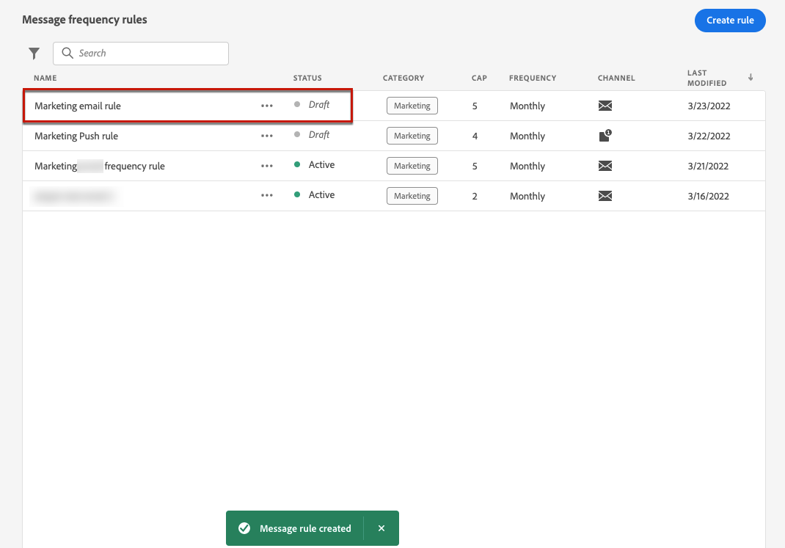

# 消息频度规则 {#frequency-rules}

[!DNL Journey Optimizer] 允许您通过设置跨渠道规则来控制用户接收消息或进入历程的频率，该规则将自动从消息和操作中排除发送过量请求的用户档案。

例如，您不希望您的品牌每月向其客户发送超过3条营销消息。

为此，您可以使用频度规则来限制在每月日历期间根据一个或多个渠道发送的消息数量。

>[!NOTE]
>
>消息频度规则与选择退出管理不同，选择退出管理允许用户取消订阅以接收来自品牌的通信。 [了解详情](../privacy/opt-out.md#opt-out-management)

➡️ [在视频中发现此功能](#video)

## 访问规则 {#access-rules}

规则可从 **[!UICONTROL 管理]** > **[!UICONTROL 规则]** 菜单。 将列出所有规则，并按修改日期排序。

使用过滤器图标可对类别、状态和/或渠道进行过滤。 您还可以在消息标签上搜索。

### 权限{#permissions-frequency-rules}

要访问、创建、编辑或删除消息频度规则，您必须具有 **[!UICONTROL 管理频度规则]** 权限。

具有 **[!UICONTROL 查看频度规则]** 权限可以查看规则，但不能修改或删除规则。

了解有关 [此部分](../administration/high-low-permissions.md).

## 创建规则 {#create-new-rule}

要创建新规则，请执行以下步骤。

1. 访问 **[!UICONTROL 消息频度规则]** 列表，然后单击 **[!UICONTROL 创建规则]**.

   

1. 定义规则名称。

   

1. 选择消息规则类别。

   >[!NOTE]
   >
   >当前仅 **[!UICONTROL 营销]** 类别。

1. 设置规则的上限，即每月可发送到单个用户配置文件的消息数上限。

   

   >[!NOTE]
   >
   >频度上限基于月度日历周期。 它会在每月初重置。

1. 选择要用于此规则的渠道： **[!UICONTROL 电子邮件]** 或 **[!UICONTROL 推送通知]**.

   

   >[!NOTE]
   >
   >您必须至少选择一个渠道才能创建规则。

1. 如果要将上限作为总计数应用于所有选定渠道，请选择多个渠道。

   例如，将上限设置为15，然后选择电子邮件和推送渠道。 如果用户档案已收到10封营销电子邮件和5条营销推送通知，则此用户档案将从任何营销电子邮件或推送通知的下一次投放中排除。

1. 单击 **[!UICONTROL 另存为草稿]** 以确认创建规则。 您的消息将添加到规则列表，并且 **[!UICONTROL 草稿]** 状态。

   

## 激活规则 {#activate-rule}

创建消息频度规则后，该规则的 **[!UICONTROL 草稿]** 状态和尚未影响任何消息。 要启用它，请单击规则旁边的省略号，然后选择 **[!UICONTROL 激活]**.

激活规则将影响规则应用于其下次执行的任何消息。 了解如何 [将频度规则应用于消息](#apply-frequency-rule).

>[!NOTE]
>
>规则最多可能需要10分钟才能完全激活。 您无需修改消息或重新发布历程，规则即可生效。

要停用消息频度规则，请单击规则旁边的省略号，然后选择 **[!UICONTROL 停用]**.

规则的状态将更改为 **[!UICONTROL 不活动]** 并且该规则将不适用于将来的消息执行。 当前正在执行的任何消息都不会受到影响。

>[!NOTE]
>
>取消激活规则不会影响或重置单个用户档案的任何计数。

## 将频度规则应用于消息 {#apply-frequency-rule}

要将频度规则应用于消息，请执行以下步骤。

1. [创建消息](../messages/get-started-content.md#create-new-message) ，方法是选择您为规则定义的渠道之一。

1. 选择为 [创建的规则](#create-new-rule).

   

   >[!NOTE]
   >
   >当前仅 **[!UICONTROL 营销]** 类别可用于消息频度规则。

   <!--
   1. You can click the **[!UICONTROL Frequency rule]** link to view the frequency rules that will apply for the selected category and channel(s). A new tab will open to display the matching message frequency rules.-->

1. 与所选类别和渠道匹配的所有频率规则都将自动应用于此消息。

   >[!NOTE]
   >
   >消息 <!--that do not have any selected category or messages -->其中，选定类别为 **[!UICONTROL 事务型]** 将不会根据频度规则进行评估。

   <!--Clicking the link out button next to the category selector will jump you over to the rules inventory screen to see which rules will be applied to the message.-->

1. 您可以在 [全局报告](../reports/global-report.md)和 [实时报表](../reports/live-report.md)，其中频度规则将列为用户被排除在投放之外的可能原因。

>[!NOTE]
>
>多个规则可以应用于同一渠道，但达到下限后，下次投放中将排除用户档案。

## 示例：合并多个规则 {#frequency-rule-example}

您可以组合多个消息频率规则，如以下示例中所述。

1. [创建规则](#create-new-rule) 调用 *整体营销上限*:

   * 选择电子邮件和推送渠道。
   * 将上限设置为12。

   

1. 要进一步限制用户发送的基于营销的推送通知数量，请再创建一个名为 *推送营销上限*:

   * 选择推送渠道。
   * 将上限设置为4。

   

1. 保存并 [激活](#activate-rule) 规则。

1. 创建电子邮件并选择 **[!UICONTROL 营销]** 类别。 [了解详情](../messages/get-started-content.md#create-new-message)

1. 创建推送通知并选择 **[!UICONTROL 营销]** 类别。 [了解详情](../messages/get-started-content.md#create-new-message)

在此方案中，单个用户档案：
* 每月最多可接收12条营销消息；
* 但在收到4个推送通知后，将从营销推送通知中排除。

>[!NOTE]
>
>测试频度规则时，建议使用新创建的 [测试用户档案](../segment/creating-test-profiles.md)，因为达到用户档案的频度上限后，在下个月之前将无法重置计数器。 取消激活规则将允许有上限的用户档案接收消息，但不会删除或删除任何计数器增量。

## 操作方法视频 {#video}

了解如何创建、激活、测试和报告频率规则。

>[!VIDEO](https://video.tv.adobe.com/v/344451?quality=12)
